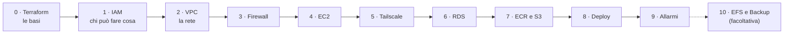

# Corso: Infrastruttura AWS con Terraform

Un corso in italiano per chi parte **da zero**: come costruire con Terraform un'infrastruttura AWS completa, un pezzo alla volta.

Alla fine del corso avrai costruito, con un unico progetto Terraform:

- una **rete privata** (VPC) distribuita su due data center;
- i **firewall** che decidono cosa può passare;
- un **server** (EC2) gestito senza SSH;
- un **accesso remoto** sicuro da casa (VPN Tailscale, con MFA);
- un **database PostgreSQL** in alta affidabilità (RDS Multi-AZ);
- un **archivio** per gli artefatti di rilascio (S3);
- il **deploy** completo, dal codice al server.

Non serve conoscere né Terraform né AWS: ogni concetto è spiegato la prima volta che compare, ogni blocco di codice è commentato riga per riga.



---

## Come è organizzato

Ogni lezione ha due materiali:

| Materiale | Cartella | A cosa serve |
|---|---|---|
| **Slide** (PowerPoint) | [`slide/`](slide/) | Per presentare la lezione in aula. Ogni slide ha le **note del relatore** con la spiegazione da dire a voce |
| **Dispensa** (Markdown) | [`dispense/`](dispense/) | Il **materiale di studio**: spiega tutto in dettaglio, con il codice completo, l'esercizio passo passo e i risultati attesi |

Il modo consigliato: si segue la lezione con le slide, poi si studia la dispensa e si fa l'esercizio.

Ogni dispensa ha sempre la stessa struttura: **obiettivo → concetti con un'analogia → codice Terraform spiegato → esercizio con domande di verifica → riepilogo**.

---

## Indice delle lezioni

| # | Lezione | Dispensa | Slide | Stato |
|---|---|---|---|---|
| 0 | **Terraform: le basi**: cos'è, come si scrive, come si usa, lo state | [dispensa-0-terraform.md](dispense/dispensa-0-terraform.md) | [slide-0-terraform.pptx](slide/slide-0-terraform.pptx) | ✅ Pronta |
| 1 | **IAM: chi può fare cosa**: identità, policy, role, privilegi minimi | [dispensa-1-iam.md](dispense/dispensa-1-iam.md) | [slide-1-iam.pptx](slide/slide-1-iam.pptx) | ✅ Pronta |
| 2 | **VPC: la rete privata**: indirizzi, subnet, route table, NAT | [dispensa-2-vpc.md](dispense/dispensa-2-vpc.md) | [slide-2-vpc.pptx](slide/slide-2-vpc.pptx) | ✅ Pronta |
| 3 | **Firewall**: Security Group e NACL, porte, stateful e stateless | [dispensa-3-firewall.md](dispense/dispensa-3-firewall.md) | [slide-3-firewall.pptx](slide/slide-3-firewall.pptx) | ✅ Pronta |
| 4 | **EC2: il server**: AMI, user_data, role e instance profile, SSM senza SSH | [dispensa-4-ec2.md](dispense/dispensa-4-ec2.md) | [slide-4-ec2.pptx](slide/slide-4-ec2.pptx) | ✅ Pronta |
| 5 | **Accesso remoto: Tailscale**: subnet router, login con passkey o GitHub + Google Authenticator, permessi per gruppo | [dispensa-5-tailscale.md](dispense/dispensa-5-tailscale.md) | [slide-5-tailscale.pptx](slide/slide-5-tailscale.pptx) | ✅ Pronta |
| 6 | **RDS PostgreSQL in alta affidabilità**: Multi-AZ e failover, backup e PITR, KMS, password in Secrets Manager, protezione dalla cancellazione | [dispensa-6-rds.md](dispense/dispensa-6-rds.md) | [slide-6-rds.pptx](slide/slide-6-rds.pptx) | ✅ Pronta |
| 7 | **Immagini e artefatti**: container e immagini, ECR con tag immutabili, bucket S3 chiuso a chiave, Gateway Endpoint | [dispensa-7-ecr-s3.md](dispense/dispensa-7-ecr-s3.md) | [slide-7-ecr-s3.pptx](slide/slide-7-ecr-s3.pptx) | ✅ Pronta |
| 8 | **Deploy end-to-end**: GitHub Actions senza chiavi (OIDC), server che si ricrea da solo (ASG), nome stabile, rotazione della password, rollback | [dispensa-8-deploy.md](dispense/dispensa-8-deploy.md) | [slide-8-deploy.pptx](slide/slide-8-deploy.pptx) | ✅ Pronta |
| 9 | **Allarmi e auto-riparazione**: CloudWatch e SNS, notifiche dell'ASG, liveness e readiness, watchdog, dead man's switch | [dispensa-9-allarmi.md](dispense/dispensa-9-allarmi.md) | [slide-9-allarmi.pptx](slide/slide-9-allarmi.pptx) | ✅ Pronta |
| 10 | **Facoltativa – File condivisi e backup**: EFS con access point e policy, AWS Backup con piano e ripristino | [dispensa-10-efs-backup.md](dispense/dispensa-10-efs-backup.md) | [slide-10-efs-backup.pptx](slide/slide-10-efs-backup.pptx) | ✅ Pronta |
| A | **Appendice**: IAM avanzato e audit | – | – | In preparazione |

---

## Prima di iniziare

Ti servono:

- un **account AWS**;
- **Terraform** 1.10 o successivo (`terraform version`);
- **AWS CLI** versione 2 (`aws --version`);
- un editor di testo (es. VS Code) e un terminale.

La regione del corso è **Milano (`eu-south-1`)**, che sugli account nuovi va attivata una volta dalla console. Il login si fa con **IAM Identity Center (SSO)** e credenziali temporanee: mai chiavi fisse. La procedura completa, passo per passo, è nella sezione "Prima di iniziare" e nella sezione 6 della [dispensa 0](dispense/dispensa-0-terraform.md).

> **Attenzione ai costi.** Alcune risorse del corso (per esempio il NAT Gateway, i server e il database) si pagano a ore anche quando non si usano. Ogni esercizio si chiude con `terraform destroy`: prendi l'abitudine fin dalla prima lezione e imposta un budget con avviso nella console AWS.

---

## Il progetto Terraform

Tutte le lezioni costruiscono **un unico progetto**, nella stessa cartella: ogni lezione aggiunge i suoi file accanto a quelli delle precedenti.

```
infra/
├── providers.tf       # lezione 0: AWS, regione Milano
├── variables.tf       # le variabili, arricchite lezione dopo lezione
├── terraform.tfvars   # i valori scelti
├── main.tf            # lezione 0: il primo bucket
├── backend.tf         # lezione 0: lo state in un bucket S3
├── iam.tf             # lezione 1
├── vpc.tf             # lezione 2
├── security.tf        # lezione 3
├── ec2.tf             # lezione 4
├── tailscale.tf       # lezione 5
├── rds.tf             # lezione 6
├── secrets.tf         # lezione 6: il server legge la password del database
├── ecr.tf             # lezione 7: le immagini dei container
├── s3.tf              # lezione 7: i file di deploy
├── github-oidc.tf     # lezione 8: GitHub entra in AWS senza chiavi
├── deploy.tf          # lezione 8: lo stampo e l'Auto Scaling group
├── user_data.sh.tpl   # lezione 8: lo script di avvio del server
├── deploy/docker-compose.yml
├── monitoring.tf      # lezione 9: allarmi, notifiche, watchdog
├── storage.tf         # lezione 10 (facoltativa): EFS
├── backup.tf          # lezione 10 (facoltativa): AWS Backup
└── outputs.tf         # cosa stampare alla fine
```

Parametri tecnici usati in tutto il corso:

| Cosa | Valore |
|---|---|
| Terraform | `>= 1.10` |
| Provider | `hashicorp/aws ~> 6.0`, `hashicorp/random ~> 3.6`, `tailscale/tailscale` (dalla lezione 5) |
| Regione | `eu-south-1` (Milano) |
| State | bucket S3 con `use_lockfile = true` (senza DynamoDB) |
| Autenticazione | SSO (IAM Identity Center), profilo CLI `corso` |
| Rete | VPC `10.20.0.0/16`, subnet `/24` su due Availability Zone |

---

## Autore

[cereZ23](https://github.com/cereZ23)
