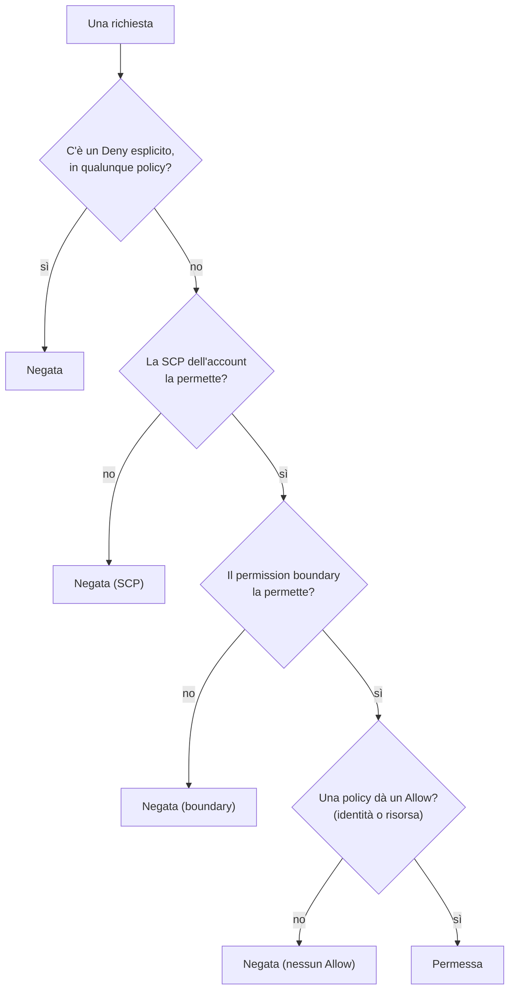
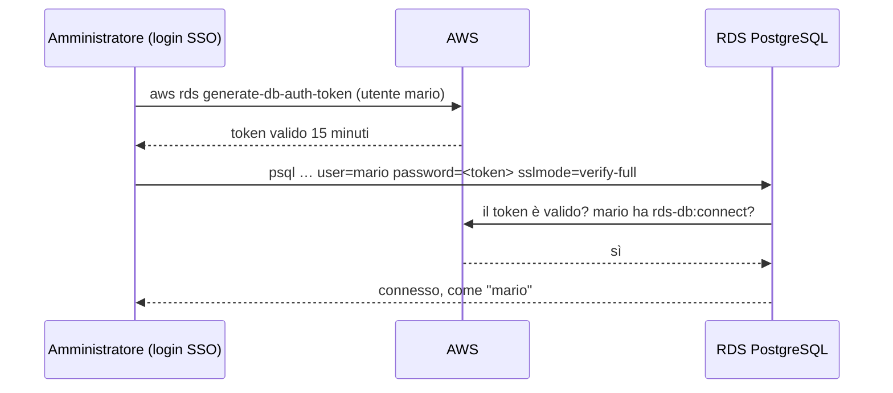

# Appendice A – IAM avanzato e audit

*Corso: Infrastruttura AWS con Terraform*

## Obiettivo

Le dispense ti hanno dato tutto quello che serve per costruire e far funzionare l'infrastruttura. Questa appendice raccoglie gli argomenti a cui le dispense **rimandano**: servono quando il progetto cresce, quando lavorano più persone o più account, o quando qualcosa viene negato e bisogna capire **perché**, o **chi** ha fatto cosa.

Alla fine di questa appendice:

- conosci le **condition key** più utili e sai scrivere una policy "solo se…";
- sai cosa sono i **permission boundary** e le **SCP**, i "tetti" che limitano anche un amministratore;
- sai come funziona l'accesso **tra account diversi**;
- sai creare una **chiave KMS tua** e usarla per SNS (dispensa 10) e per RDS (dispensa 6);
- sai far entrare le persone nel database con **IAM** invece che con una password;
- sai **incrociare i log** per rispondere a "chi è entrato nel database martedì alle 15?".

---

## Prima di iniziare

- Si lavora nella cartella `infra/` di sempre, con il progetto completo fino alla dispensa 10. Questa appendice aggiunge `kms.tf` e modifica `monitoring.tf` e `rds.tf`. CloudTrail e la diagnosi degli AccessDenied hanno una lezione tutta loro: la dispensa 12.
- Rinnova il login: `aws sso login --profile corso`, `export AWS_PROFILE=corso`, `export TAILSCALE_API_KEY=…`.
- Le sezioni sono **indipendenti**: puoi leggerle e provarle una alla volta.
- **Costi:** una chiave KMS tua ha un piccolo costo al mese. A fine esercizio si cancella tutto.

---

## 1. Le condition key: "solo se…"

Nella dispensa 1 hai visto il blocco `condition` con `s3:prefix`. Una **condition key** è una domanda che IAM si fa sulla richiesta: "da quale regione?", "ha fatto login con MFA?", "è cifrata?". Ce ne sono di due tipi: quelle **globali**, che iniziano con `aws:` e valgono per tutti i servizi, e quelle **del servizio**, che iniziano con il suo prefisso (`s3:`, `ec2:`, `rds:`…).

Le più utili:

| Condition key | Domanda | Dove l'abbiamo vista o dove serve |
|---|---|---|
| `aws:MultiFactorAuthPresent` | ha fatto login con MFA? | operazioni delicate solo con MFA |
| `aws:RequestedRegion` | in quale regione? | vietare le regioni che non usi (sezione 2) |
| `aws:SourceIp` | da quale indirizzo pubblico? | solo dall'ufficio (attenzione: non funziona per le richieste che passano dai servizi AWS) |
| `aws:SecureTransport` | è cifrata (HTTPS)? | bucket policy (dispensa 7), file system policy (dispensa 11) |
| `aws:SourceVpce` | arriva da questo VPC endpoint? | un bucket raggiungibile solo dall'interno del VPC (dispensa 7) |
| `aws:PrincipalTag/…`, `aws:ResourceTag/…` | che etichetta ha chi chiede? e la risorsa? | permessi decisi dalle etichette (sotto) |

Un esempio: "chiunque, in questo account, non può fare niente fuori da Milano", con due eccezioni per i servizi **globali** (IAM e il centro di supporto non stanno in una regione):

```hcl
data "aws_iam_policy_document" "solo_milano" {
  statement {
    effect        = "Deny"
    not_actions   = ["iam:*", "sts:*", "support:*"]
    resources     = ["*"]
    condition {
      test     = "StringNotEquals"
      variable = "aws:RequestedRegion"
      values   = ["eu-south-1"]
    }
  }
}
```

`not_actions` vuol dire "tutte le azioni **tranne** queste": il Deny colpisce tutto ciò che non è IAM, STS o supporto, se la regione non è Milano.

**Permessi decisi dalle etichette** (in inglese *ABAC*, *Attribute-Based Access Control*). Invece di elencare le risorse una per una, si scrive una regola come "puoi fermare i server **che hanno la tua stessa etichetta** `team`": `aws:ResourceTag/team` deve essere uguale a `${aws:PrincipalTag/team}`. Con molti team e molte risorse, una policy sola basta per tutti.

---

## 2. I "tetti": permission boundary e SCP

Nella dispensa 1 hai visto che una richiesta passa se c'è un `Allow` e nessun `Deny`. Esistono però altri due livelli che **non danno mai permessi**: possono solo **togliere**. Funzionano come un **tetto**: sotto il tetto valgono le policy normali; sopra, niente, nemmeno per un amministratore.

> **Analogia.** In un'azienda, la tua mansione dice cosa puoi fare (le policy). Ma il **regolamento della sede** (la SCP) vale per tutti quelli che ci lavorano, e il **limite di spesa della tua carta aziendale** (il permission boundary) vale per te, qualunque mansione ti diano.

| | **Permission boundary** | **SCP** (*Service Control Policy*) |
|---|---|---|
| Si attacca a | un utente o un role | un intero **account** (o un gruppo di account) |
| Chi la gestisce | chi gestisce IAM nell'account | l'account **principale** di AWS Organizations |
| Serve a | delegare senza perdere il controllo | regole che nessuno, nell'account, può aggirare |
| Esempio | "chi crea role può creare solo role con questo boundary" | "in questo account nessuno può spegnere CloudTrail", "solo Milano" |



**Il permission boundary in pratica.** Vuoi che uno sviluppatore possa creare role per i suoi server, senza poter creare un role amministratore (che sarebbe un modo per diventarlo lui stesso). Gli dai il permesso di creare role **solo se** il role nuovo ha attaccato un certo boundary:

```hcl
statement {
  actions   = ["iam:CreateRole", "iam:PutRolePermissionsBoundary"]
  resources = ["*"]
  condition {
    test     = "StringEquals"
    variable = "iam:PermissionsBoundary"
    values   = [aws_iam_policy.tetto_sviluppatori.arn]
  }
}
```

Qualunque permesso venga poi dato a quel role, non potrà mai superare il tetto. In Terraform, un role con boundary si scrive aggiungendo `permissions_boundary = aws_iam_policy.tetto_sviluppatori.arn` alla risorsa `aws_iam_role`.

**Le SCP** richiedono **AWS Organizations**, cioè un insieme di account gestiti da un account principale. Si scrivono con `aws_organizations_policy` e si attaccano con `aws_organizations_policy_attachment`, ma solo dall'account principale. Due regole che quasi ogni organizzazione mette: "solo le regioni che usiamo" (la policy della sezione 1) e "nessuno può fermare o cancellare CloudTrail" (`cloudtrail:StopLogging`, `cloudtrail:DeleteTrail`). Nel corso, con un account solo, non le usiamo.

Esiste un terzo livello, la **session policy**: una policy passata nel momento in cui si assume un role, che restringe quella sessione. La usano alcuni strumenti; per te basta sapere che esiste.

---

## 3. Account diversi

Nella dispensa 1 hai visto che, **nello stesso account**, basta un `Allow` in uno dei due posti (la policy di chi chiede **o** quella della risorsa). **Tra account diversi** servono **tutti e due**: l'account A deve dire "il mio role può chiedere", e l'account B deve dire "accetto richieste da quel role".

> **Analogia.** Per entrare in un'altra azienda ti servono due cose: il tuo capo che ti manda, e l'altra azienda che ti aspetta. Una sola non basta.

Il modo più comune è **assumere un role** nell'altro account:

| Account | Cosa scrive |
|---|---|
| B (quello a cui si accede) | un role con trust policy: `principals { type = "AWS", identifiers = ["arn:aws:iam::<A>:role/deploy"] }` |
| A (quello da cui si parte) | una policy sul role `deploy` che permette `sts:AssumeRole` sul role di B |

Due casi che incontrerai: copiare uno snapshot di RDS in un altro account (serve anche una chiave KMS tua, sezione 4) e gli account separati per prova e produzione, con un account centrale da cui si entra in tutti.

---

## 4. Una chiave KMS tua (*customer managed*)

Nel corso abbiamo sempre usato le chiavi **gestite da AWS** (`aws/rds`, `aws/ecr`…): comode, ma non puoi decidere tu chi le usa. Una chiave **tua** serve quando:

- vuoi decidere con una **key policy** chi può cifrare e decifrare;
- devi **condividere** uno snapshot di RDS con un altro account (con `aws/rds` non si può);
- un servizio deve usare la chiave per conto suo: è il caso di **SNS cifrato** con gli allarmi di CloudWatch (dispensa 10);
- vuoi vedere in CloudTrail **ogni uso** della chiave.

**La key policy** è la resource-based policy della chiave (dispensa 1). Ha una particolarità: se non dice niente, **nemmeno l'amministratore** può usare la chiave. Per questo il primo statement è sempre lo stesso, "l'account (il suo `root`) può tutto": non vuol dire che l'utente root la usi, ma che da lì in poi decidono **le policy IAM dell'account**, come per ogni altra risorsa. Poi si aggiungono i servizi che devono usarla.

Per SNS cifrato servono due servizi in più:

- **CloudWatch** (`cloudwatch.amazonaws.com`), che pubblica gli allarmi;
- l'**Auto Scaling**, che pubblica le notifiche (dispensa 10) con il suo *service-linked role* `AWSServiceRoleForAutoScaling`, un role che AWS crea da solo nell'account la prima volta che usi un ASG.

Entrambi hanno bisogno di `kms:Decrypt` e `kms:GenerateDataKey*` sulla chiave. Se usi GuardDuty (dispensa 12), che manda i finding al topic tramite EventBridge, aggiungi allo stesso statement di CloudWatch anche il servizio `events.amazonaws.com`.

**La rotazione** (`enable_key_rotation = true`) fa generare ad AWS un nuovo materiale della chiave ogni anno; i dati cifrati prima restano leggibili, perché KMS tiene le versioni vecchie. Non devi fare niente.

**E per RDS?** La chiave di un database si sceglie **solo alla creazione** (dispensa 6). Per passare da `aws/rds` a una chiave tua su un database esistente: snapshot, **copia** dello snapshot cifrandola con la chiave nuova, ripristino in un database nuovo, poi si sposta l'applicazione. Per un database nuovo basta una riga in `aws_db_instance`: `kms_key_id = aws_kms_key.<nome>.arn`. Attenzione: cambiare `kms_key_id` su un database esistente fa **ricreare** il database (`-/+`, dispensa 0): con la `deletion_protection` della dispensa 6 l'`apply` si ferma, ed è giusto così.

---

## 5. Entrare nel database con IAM, senza password

Nella dispensa 6 c'è un solo utente del database, `dbadmin`, con una password in Secrets Manager. Se gli amministratori sono tre, usano tutti la stessa password: nei log del database risulta sempre "dbadmin", e quando uno se ne va bisogna cambiare la password a tutti.

Con l'**autenticazione IAM** ogni persona ha il **suo** utente nel database, e invece della password usa un **token**: un testo che genera con il suo login AWS (lo stesso SSO del corso), valido **15 minuti**. Nessuna password da custodire, e chi lascia l'azienda perde l'accesso nel momento in cui perde il login AWS.



Servono tre cose:

1. sul database, l'opzione **`iam_database_authentication_enabled = true`** (si accende senza ricreare il database);
2. nel database, un utente con il **ruolo PostgreSQL `rds_iam`**: `CREATE USER mario; GRANT rds_iam TO mario;` (più i permessi sulle tabelle, come per qualunque utente);
3. in IAM, il permesso **`rds-db:connect`** su quell'utente di quel database. L'ARN ha una forma particolare: `arn:aws:rds-db:<regione>:<account>:dbuser:<id-della-risorsa>/<utente>`, dove l'"id della risorsa" è un codice del database che inizia con `db-` (in Terraform: `aws_db_instance.main.resource_id`).

Per gli amministratori del corso, il permission set `AdministratorAccess` (dispensa 0) contiene già `rds-db:connect` (permette tutto). In un'organizzazione vera si dà a ogni gruppo una policy con solo gli utenti del database che gli servono.

L'applicazione può restare con la password di Secrets Manager: per un programma che si collega di continuo, un token da rigenerare ogni 15 minuti è una complicazione. L'autenticazione IAM dà il meglio con le **persone**.

---

## 6. Mettere insieme i log: chi ha fatto cosa

Una domanda da manuale: **"chi si è collegato al database martedì alle 15?"**. Ogni pezzo dell'infrastruttura tiene il suo registro, e nessuno, da solo, risponde:

| Registro | Cosa dice | Dove si legge |
|---|---|---|
| **Log di PostgreSQL** (dispensa 10) | una connessione dall'indirizzo `10.20.10.7`, utente `dbadmin` | CloudWatch Logs, `/aws/rds/instance/corso-aws-db/postgresql` (le connessioni compaiono se il parametro `log_connections` è attivo nel parameter group) |
| **VPC Flow Logs** (dispensa 2) | traffico da `10.20.10.7` a `10.20.20.x:5432` | il bucket dei flow log |
| **Tailscale** | chi ha cambiato la policy e quando (*configuration audit logs*); quale dispositivo ha parlato con quale (*network flow logs*, nei piani a pagamento) | console di Tailscale → **Logs** |
| **CloudTrail** | chi ha letto il segreto con la password del database (`GetSecretValue`), e quando | CloudTrail, o il trail della dispensa 12 |
| **Autenticazione IAM** (sezione 5) | il nome **personale** con cui si è collegato | log di PostgreSQL |

Il percorso, senza autenticazione IAM: PostgreSQL dice "dbadmin, da `10.20.10.7`"; `10.20.10.7` è il **router Tailscale** (dispensa 5), quindi la persona è "qualcuno in VPN"; CloudTrail dice chi ha letto la password poco prima; i log di Tailscale (se il piano li include) dicono quale dispositivo. Con l'**autenticazione IAM** la risposta sta già nel log di PostgreSQL: `mario`. È uno dei motivi migliori per usarla.

Due consigli: tieni gli **orologi** in UTC dappertutto (AWS lo fa già), e conserva i log **abbastanza a lungo** da poter rispondere a una domanda fatta settimane dopo.

---

## 7. Il codice Terraform

### kms.tf

```hcl
# ---------------------------------------------------------------
# Una chiave nostra per il topic degli allarmi
# ---------------------------------------------------------------

data "aws_iam_policy_document" "alerts_key" {
  statement {
    sid       = "AccountGestisceLaChiave"
    actions   = ["kms:*"]
    resources = ["*"]
    principals {
      type        = "AWS"
      identifiers = ["arn:aws:iam::${data.aws_caller_identity.current.account_id}:root"]
    }
  }

  statement {
    sid       = "AllarmiENotifichePubblicano"
    actions   = ["kms:Decrypt", "kms:GenerateDataKey*"]
    resources = ["*"]
    principals {
      type        = "Service"
      identifiers = ["cloudwatch.amazonaws.com"]
    }
  }

  statement {
    sid       = "AutoScalingPubblica"
    actions   = ["kms:Decrypt", "kms:GenerateDataKey*"]
    resources = ["*"]
    principals {
      type        = "AWS"
      identifiers = ["arn:aws:iam::${data.aws_caller_identity.current.account_id}:role/aws-service-role/autoscaling.amazonaws.com/AWSServiceRoleForAutoScaling"]
    }
  }
}

resource "aws_kms_key" "alerts" {
  description         = "${var.project}: topic degli allarmi"
  enable_key_rotation = true
  policy              = data.aws_iam_policy_document.alerts_key.json
}

resource "aws_kms_alias" "alerts" {
  name          = "alias/${var.project}-alerts"
  target_key_id = aws_kms_key.alerts.key_id
}
```

### monitoring.tf (modifica)

Nel topic degli allarmi, una riga in più:

```hcl
resource "aws_sns_topic" "alerts" {
  name              = "${var.project}-alerts"
  kms_master_key_id = aws_kms_alias.alerts.name
}
```

### rds.tf (modifica)

Nel blocco `aws_db_instance.main`, una riga in più:

```hcl
  iam_database_authentication_enabled = true
```

E un output, per costruire l'ARN dell'utente del database:

```hcl
output "db_resource_id" {
  value = aws_db_instance.main.resource_id
}
```

### Cosa fa questo codice, blocco per blocco

**`data.aws_iam_policy_document.alerts_key`** è la key policy: tre statement. Il primo è quello "di base" della sezione 4: l'account (`:root`) può tutto, e da lì decidono le policy IAM. Il secondo dà al servizio CloudWatch i due permessi per pubblicare messaggi cifrati; il terzo li dà al service-linked role dell'Auto Scaling, indicato con il suo ARN (il percorso `aws-service-role/autoscaling.amazonaws.com/` è fisso, lo decide AWS). `resources = ["*"]` in una key policy vuol dire "questa chiave": la policy sta sulla chiave stessa.

**`aws_kms_key.alerts`** crea la chiave, con la rotazione annuale. **`aws_kms_alias.alerts`** le dà un nome leggibile, `alias/corso-aws-alerts`: si può usare al posto dell'ID, e se un giorno cambi chiave basta spostare l'alias.

**Nel topic SNS**, `kms_master_key_id` dice con quale chiave cifrare i messaggi. **Nel database**, `iam_database_authentication_enabled = true` accende l'autenticazione IAM (sezione 5); `resource_id` è il codice `db-…` che serve nell'ARN di `rds-db:connect`.

---

## 8. Esercizio

Obiettivo: cifrare gli allarmi con la tua chiave, ed entrare nel database con il tuo nome.

### Passi

1. **`terraform apply`.** Nel `plan`: la chiave e l'alias; il topic SNS e il database vengono **modificati** (non ricreati).
2. **Gli allarmi cifrati.** Forza un allarme come nella dispensa 10:

   ```bash
   aws cloudwatch set-alarm-state --alarm-name corso-aws-db-cpu-alta \
     --state-value ALARM --state-reason "prova con la chiave nostra"
   ```

   (Atteso: la mail arriva come prima. In console, **KMS → Customer managed keys → corso-aws-alerts**: la chiave c'è, con la rotazione attiva.) Facoltativo: togli dalla key policy lo statement di CloudWatch, `apply`, riprova: la mail **non arriva**, e nella cronologia dell'allarme (**CloudWatch → Alarms → History**) c'è un'azione fallita. Rimetti lo statement.
3. **Il tuo utente nel database.** Collegati al database come `dbadmin` (dispensa 6, da casa o dal server) e crea il tuo utente:

   ```sql
   CREATE USER mario;
   GRANT rds_iam TO mario;
   GRANT CONNECT ON DATABASE app TO mario;
   ```

   Poi, **dal tuo computer**, con Tailscale acceso e il login SSO:

   ```bash
   export PGPASSWORD=$(aws rds generate-db-auth-token \
     --hostname "$(terraform output -raw db_address)" --port 5432 --username mario)
   psql "host=$(terraform output -raw db_address) dbname=app user=mario sslmode=verify-full sslrootcert=global-bundle.pem" \
     -c "select current_user;"
   ```

   (Atteso: `mario`. Nessuna password è mai stata scritta: il token scade tra 15 minuti.)
4. **Pulizia.** Come nella dispensa 9: `db_deletion_protection = false`, `apply`, `destroy`, e cancella lo snapshot finale. La chiave KMS non si cancella subito: AWS la mette in **attesa di cancellazione** per 30 giorni (puoi annullarla in quel periodo); poi sparisce da sola.

### Domande di verifica

1. Scrivi a parole una condizione che vieta di lavorare fuori da Milano. Perché servono le eccezioni per IAM e STS?
2. Un permission boundary può dare un permesso? E una SCP? Cosa fanno, allora?
3. Tra due account diversi, perché serve un Allow da tutte e due le parti?
4. Perché la key policy inizia sempre con lo statement per l'account `root`? Cosa succederebbe senza?
5. Perché per gli **amministratori** conviene l'autenticazione IAM al database, e per l'**applicazione** no?
6. "Chi si è collegato al database martedì alle 15?": quali registri consulti, in che ordine, con e senza autenticazione IAM?

---

## Riepilogo

- Le **condition key** aggiungono un "solo se…": `aws:` per tutti i servizi, il prefisso del servizio per le altre. Con le **etichette** (ABAC) una policy sola vale per molti team.
- **Permission boundary** (su un utente o un role) e **SCP** (su un account) sono **tetti**: non danno permessi, li tolgono, anche a un amministratore.
- **Tra account diversi** serve un Allow da tutte e due le parti; il modo comune è assumere un role nell'altro account.
- Una **chiave KMS tua** serve per decidere chi la usa, per condividere snapshot, per **SNS cifrato** con gli allarmi. La key policy parte sempre dall'account `root`. Per RDS si sceglie alla creazione.
- Con l'**autenticazione IAM** ogni persona entra nel database con il suo nome e un **token di 15 minuti**, senza password.
- "Chi ha fatto cosa" si risponde **incrociando** i registri: PostgreSQL, VPC Flow Logs, Tailscale, CloudTrail. Con l'autenticazione IAM, molto prima.
