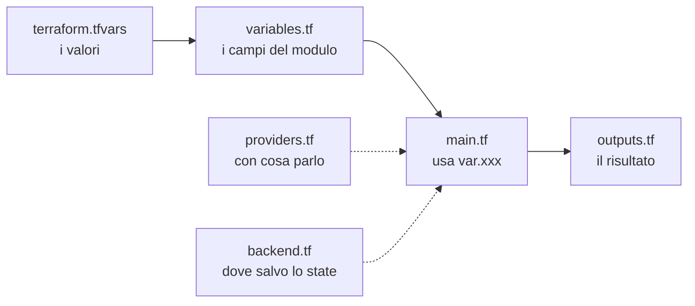
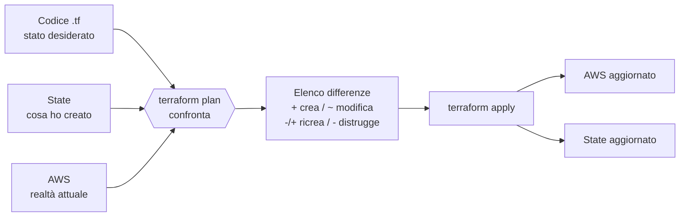

# Dispensa 0 – Terraform in 20 minuti

*Corso: Infrastruttura AWS con Terraform*

## Obiettivo

Alla fine di questa dispensa sai cos'è l'Infrastructure as Code, sai leggere e scrivere un file Terraform semplice, conosci il ciclo `init → plan → apply → destroy` e sai perché lo **state** è la cosa più delicata di tutto il progetto.

---

## 1. Perché non si clicca in console

Creare risorse a mano dalla console AWS funziona la prima volta. Il problema arriva dopo: nessuno ricorda cosa è stato cliccato, non si può rifare identico in un altro ambiente, non c'è revisione delle modifiche, non c'è storia.

**Infrastructure as Code** significa descrivere l'infrastruttura in file di testo che:

- stanno in Git, quindi hanno storia, diff e code review;
- si possono applicare in modo ripetibile (sviluppo, collaudo, produzione identici);
- documentano da soli cosa esiste e perché.

Terraform è **dichiarativo**: non scrivi i passi ("crea questo, poi quest'altro"), scrivi lo **stato desiderato** ("voglio che esista questo"). Terraform confronta ciò che hai scritto con ciò che esiste e calcola da solo cosa creare, modificare o distruggere.

> **Analogia.** Uno script è una ricetta: "rompi le uova, sbatti, cuoci". Terraform è la foto del piatto finito: gli dai la foto e lui capisce cosa manca in cucina.

---

## 2. I mattoni del linguaggio (HCL)

| Blocco | A cosa serve |
|---|---|
| `terraform {}` | Versione di Terraform, provider richiesti, backend dello state |
| `provider` | Il "driver" verso una piattaforma (AWS, Azure, ecc.) |
| `resource` | Una cosa da creare e gestire (un bucket, una VPC, un'istanza) |
| `data` | Una cosa da **leggere** che esiste già, senza gestirla |
| `variable` | Un input parametrico |
| `locals` | Valori calcolati riutilizzabili all'interno del codice |
| `output` | Un valore da mostrare o passare ad altro codice |
| `module` | Un pacchetto riutilizzabile di risorse |

Ogni risorsa ha un **tipo** e un **nome locale**:

```hcl
resource "aws_s3_bucket" "demo" {
#         ^ tipo          ^ nome locale (solo per Terraform)
  bucket = "nome-reale-su-aws"
}
```

Si fa riferimento a una risorsa con `tipo.nome.attributo`, per esempio `aws_s3_bucket.demo.arn`.

### Le dipendenze si capiscono da sole

Quando una risorsa usa un attributo di un'altra, Terraform capisce che deve crearle in ordine. Non serve dirglielo:

```hcl
resource "aws_s3_bucket_versioning" "demo" {
  bucket = aws_s3_bucket.demo.id   # dipendenza implicita: prima il bucket
  versioning_configuration {
    status = "Enabled"
  }
}
```

Da questi riferimenti Terraform costruisce un **grafo** e crea in parallelo tutto quello che non dipende da altro. `depends_on` esiste, ma serve raramente: se lo usi spesso, di solito manca un riferimento.

---

## 3. Struttura di un progetto

### Come Terraform legge i file

Prima regola, che sorprende sempre: **Terraform non esegue i file uno dopo l'altro**. Quando lanci un comando in una cartella, legge **tutti** i file `.tf` di quella cartella e li fonde in un'unica configurazione. Ne derivano tre conseguenze:

- **L'ordine dei file non conta**, e nemmeno l'ordine dei blocchi dentro un file: l'ordine di creazione lo decide il grafo delle dipendenze (sezione 2).
- **I nomi dei file sono una convenzione per gli umani**, non per Terraform. Potresti mettere tutto in un unico `pippo.tf` e funzionerebbe identico. Si divide per ritrovare le cose.
- **Le sottocartelle non vengono lette.** Una sottocartella entra in gioco solo se la richiami esplicitamente come `module`.

La cartella in cui lanci `terraform` si chiama **root module**. Questa è la struttura minima standard:

```
infra/
├── providers.tf       # versioni e configurazione provider
├── backend.tf         # dove sta lo state
├── variables.tf       # DICHIARAZIONE degli input
├── main.tf            # le risorse
├── outputs.tf         # cosa restituisce il progetto
└── terraform.tfvars   # VALORI degli input per questo ambiente
```

### Il flusso in un colpo d'occhio



> **Analogia.** `variables.tf` è un modulo con i campi vuoti ("Nome progetto: ____, Regione: ____"). `terraform.tfvars` è lo stesso modulo compilato. `main.tf` è l'ufficio che lavora sul modulo compilato. `outputs.tf` è la ricevuta che ti danno allo sportello.

Vediamo i file uno per uno: cosa contengono, quando cambiano e gli errori tipici.

---

### providers.tf: con chi parla Terraform

Contiene due cose diverse.

**Il blocco `terraform`** con i requisiti: quale versione di Terraform serve e quali provider scaricare, con che versione.

```hcl
terraform {
  required_version = ">= 1.10"

  required_providers {
    aws = {
      source  = "hashicorp/aws"   # da dove scaricarlo (registry)
      version = "~> 6.0"          # qualsiasi 6.x, non 7.0
    }
    random = {
      source  = "hashicorp/random"
      version = "~> 3.6"
    }
  }
}
```

**I blocchi `provider`** con la configurazione del "driver": regione, tag di default, eventualmente il profilo o il role da assumere.

```hcl
provider "aws" {
  region = var.region

  default_tags {
    tags = {
      Project   = var.project
      ManagedBy = "terraform"
    }
  }
}
```

**Quando cambia:** raramente. Quando si aggiorna la versione di un provider o se ne aggiunge uno nuovo, e ogni volta va rilanciato `terraform init`.

**Da sapere:** puoi avere più configurazioni dello stesso provider con un `alias`, per esempio quando alcune risorse devono stare in un'altra regione:

```hcl
provider "aws" {
  alias  = "virginia"
  region = "us-east-1"
}

# e nella risorsa:  provider = aws.virginia
```

Le versioni esatte scaricate finiscono nel file `.terraform.lock.hcl`, che si genera da solo e **va committato**: garantisce che tutti usino la stessa identica versione del provider.

---

### backend.tf: dove vive lo state

Contiene solo il blocco `backend`, cioè dove salvare lo state (vedi sezione 5).

```hcl
terraform {
  backend "s3" {
    bucket       = "corso-aws-tfstate-123456"
    key          = "corso/terraform.tfstate"
    region       = "eu-south-1"
    encrypt      = true
    use_lockfile = true
  }
}
```

**Perché un file a parte**, se è un blocco `terraform` come quello di `providers.tf`? Perché ha regole diverse e cambiarlo è un'operazione delicata:

- **non accetta variabili**: niente `var.region` qui dentro, i valori vanno scritti o passati con `terraform init -backend-config=file.hcl`;
- **se lo modifichi, lo state va spostato**: serve `terraform init -migrate-state` (sposta lo state nel nuovo posto) o `-reconfigure` (riparte ignorando il vecchio). Sbagliare qui significa che Terraform "dimentica" l'infrastruttura.

Tenerlo isolato rende evidente, in una code review, che qualcuno sta toccando il backend.

**Quando cambia:** quasi mai.

---

### variables.tf: la dichiarazione degli input

Qui si **dichiarano** le variabili: nome, tipo, descrizione, eventuale valore di default e regole di validazione. **Non** si danno i valori per l'ambiente: quello è il compito di `terraform.tfvars`.

```hcl
variable "region" {
  description = "Regione AWS in cui creare le risorse"
  type        = string
  default     = "eu-south-1"   # se nessuno la valorizza, vale questo
}

variable "project" {
  description = "Prefisso per i nomi delle risorse"
  type        = string
  # nessun default: è OBBLIGATORIA

  validation {
    condition     = can(regex("^[a-z0-9-]{3,20}$", var.project))
    error_message = "Solo minuscole, numeri e trattini, da 3 a 20 caratteri."
  }
}

variable "environment" {
  description = "Ambiente"
  type        = string
  validation {
    condition     = contains(["dev", "test", "prod"], var.environment)
    error_message = "Valori ammessi: dev, test, prod."
  }
}

variable "db_password" {
  description = "Password del database"
  type        = string
  sensitive   = true   # non viene stampata nel plan né nell'output
}
```

I punti da capire:

- **Senza `default` la variabile è obbligatoria.** Se nessuno la valorizza, Terraform la chiede a video o si ferma con un errore.
- **`type`** evita errori stupidi. Oltre a `string` esistono `number`, `bool`, `list(string)`, `map(string)` e `object({...})` per strutture più complesse.
- **`validation`** blocca valori sbagliati già al `plan`, prima di toccare AWS.
- **`sensitive = true`** nasconde il valore a video, ma **non** lo cifra nello state: lì resta in chiaro. Per le password vere la strada giusta è non farle passare da Terraform (per esempio con Secrets Manager, come vedremo per RDS).

Nel codice una variabile si usa con `var.nome`, per esempio `var.region`.

**Quando cambia:** quando il progetto ha bisogno di un nuovo parametro.

---

### terraform.tfvars: i valori per questo ambiente

È il modulo compilato: solo assegnazioni, nessuna logica.

```hcl
project     = "corso-aws"
environment = "dev"
region      = "eu-south-1"
```

Terraform carica **automaticamente** solo due tipi di file: `terraform.tfvars` e qualunque file che finisce in `.auto.tfvars`. Tutti gli altri vanno indicati esplicitamente:

```bash
terraform plan -var-file=envs/prod.tfvars
```

**Da dove può arrivare il valore di una variabile**, dalla priorità più bassa alla più alta (l'ultimo vince):

1. il `default` in `variables.tf`;
2. le variabili d'ambiente `TF_VAR_nome` (es. `export TF_VAR_region=eu-west-1`);
3. `terraform.tfvars`;
4. i file `*.auto.tfvars`, in ordine alfabetico;
5. `-var` e `-var-file` sulla riga di comando.

Questo spiega i casi in cui "ho cambiato il tfvars ma non succede niente": probabilmente c'è un `-var` o un `.auto.tfvars` che lo sovrascrive.

**Si committa?** Sì, **se non contiene segreti**: così è documentato con che valori gira ogni ambiente. I segreti non vanno mai nei tfvars: si passano con `TF_VAR_...` dalla pipeline o, meglio, non passano da Terraform affatto.

**Quando cambia:** ogni volta che cambia la configurazione di un ambiente (dimensione di un'istanza, numero di repliche, ecc.).

---

### main.tf: le risorse

Qui sta l'infrastruttura vera: blocchi `resource`, `data` e `locals`.

```hcl
locals {
  # valori calcolati, riutilizzabili: si usano con local.nome
  name_prefix = "${var.project}-${var.environment}"
}

data "aws_caller_identity" "current" {}   # legge l'account in uso

resource "aws_s3_bucket" "demo" {
  bucket = "${local.name_prefix}-demo-${data.aws_caller_identity.current.account_id}"
}
```

Differenza tra `variable` e `locals`: la variabile arriva **da fuori** (chi usa il progetto la può cambiare), il local è **calcolato dentro** (chi usa il progetto non lo tocca). Se un valore si ripete in tre risorse ed è derivato da altri, è un local.

**Quando cresce**, `main.tf` non si tiene come file unico da mille righe: si spezza **per dominio**. Nel progetto del corso arriveremo a questo:

```
infra/
├── providers.tf
├── backend.tf
├── variables.tf
├── locals.tf
├── iam.tf        # role e policy
├── vpc.tf        # rete, subnet, route table
├── security.tf   # security group e NACL
├── vpn.tf        # Client VPN
├── ec2.tf        # istanze
├── rds.tf        # database
├── s3.tf         # bucket artefatti
├── outputs.tf
└── terraform.tfvars
```

Ricorda la prima regola: per Terraform non cambia niente, è sempre un'unica configurazione. Una risorsa in `ec2.tf` può usare liberamente una subnet definita in `vpc.tf`.

**Quando cambia:** continuamente, è il file di lavoro.

---

### outputs.tf: cosa restituisce il progetto

Gli output sono i valori che il progetto espone alla fine di un `apply`.

```hcl
output "bucket_name" {
  description = "Nome del bucket creato"
  value       = aws_s3_bucket.demo.bucket
}

output "db_endpoint" {
  description = "Endpoint del database"
  value       = aws_db_instance.main.endpoint
}

output "db_connection_string" {
  value     = "postgres://app@${aws_db_instance.main.endpoint}/app"
  sensitive = true
}
```

A cosa servono:

- **a te**: dopo l'`apply` vedi subito l'IP, l'endpoint, l'ARN che ti servono, senza cercarli in console;
- **agli script**: `terraform output -raw bucket_name` restituisce il valore pulito da usare in bash o in una pipeline (lo abbiamo fatto nel laboratorio della dispensa 1);
- **ad altri progetti o moduli**: quando il progetto diventa un modulo, gli output sono il modo in cui passa valori al chiamante.

Gli output sensibili vengono nascosti a video, ma come le variabili **sono salvati in chiaro nello state**.

**Quando cambia:** quando serve esporre un nuovo valore.

---

### I file che non scrivi tu

Dopo `terraform init` compaiono:

| File / cartella | Cosa è | In Git? |
|---|---|---|
| `.terraform/` | Provider e moduli scaricati | No |
| `.terraform.lock.hcl` | Versioni esatte dei provider | **Sì** |
| `terraform.tfstate` | Lo state, **solo se il backend è locale** | **Mai** |

---

### E con più ambienti?

Lo stesso codice deve girare in `dev`, `test` e `prod`. L'approccio più semplice e leggibile: **stesso codice, un tfvars e uno state per ambiente**.

```
infra/
├── *.tf
└── envs/
    ├── dev.tfvars
    ├── dev.backend.hcl     # key = "corso/dev/terraform.tfstate"
    ├── prod.tfvars
    └── prod.backend.hcl    # key = "corso/prod/terraform.tfstate"
```

```bash
terraform init -reconfigure -backend-config=envs/prod.backend.hcl
terraform plan -var-file=envs/prod.tfvars
```

La regola che non si discute: **ogni ambiente ha il suo state separato**. Un `destroy` lanciato per sbaglio in dev non deve poter toccare prod.

---

### Riepilogo della sezione

| File | Contiene | Domanda a cui risponde | Cambia |
|---|---|---|---|
| `providers.tf` | Requisiti e configurazione provider | Con cosa parlo? | Raramente |
| `backend.tf` | Posizione dello state | Dove salvo cosa ho creato? | Quasi mai |
| `variables.tf` | Dichiarazione degli input | Cosa si può configurare? | A volte |
| `terraform.tfvars` | Valori degli input | Con che valori gira questo ambiente? | Per ambiente |
| `main.tf` (e `*.tf`) | Risorse, data, locals | Cosa costruisco? | Continuamente |
| `outputs.tf` | Valori esposti | Cosa mi serve sapere alla fine? | A volte |


---

## 4. Il ciclo di lavoro

| Comando | Cosa fa |
|---|---|
| `terraform init` | Scarica i provider, configura il backend. Si rilancia quando cambiano provider o backend |
| `terraform fmt` | Formatta il codice in modo standard |
| `terraform validate` | Controlla la sintassi e la coerenza |
| `terraform plan` | Mostra **cosa farebbe**, senza toccare niente |
| `terraform apply` | Esegue le modifiche (chiede conferma) |
| `terraform destroy` | Distrugge tutto ciò che gestisce |
| `terraform output` | Mostra gli output |
| `terraform state list` | Elenca le risorse che Terraform conosce |

### Cosa succede davvero con plan e apply

Il `plan` mette a confronto tre cose: quello che hai scritto, quello che Terraform ricorda di aver creato (lo state) e quello che esiste davvero su AWS in quel momento.



Il `plan` non tocca niente. L'`apply` esegue le differenze su AWS e poi aggiorna lo state, così la volta successiva Terraform sa cosa esiste.

### Leggere un plan

Il `plan` è il momento più importante: **si legge sempre prima di applicare**.

| Simbolo | Significato |
|---|---|
| `+` | Crea |
| `~` | Modifica sul posto |
| `-/+` | **Distrugge e ricrea** (attenzione: su un database vuol dire perdere i dati) |
| `-` | Distrugge |

In fondo c'è il riepilogo, per esempio `Plan: 2 to add, 0 to change, 0 to destroy.` Se un `-/+` compare dove non te lo aspetti, ti fermi e capisci perché.

**Buona pratica:** in ambienti seri si salva il plan e si applica esattamente quello, così tra la revisione e l'esecuzione non cambia niente:

```bash
terraform plan -out=piano.tfplan
terraform apply piano.tfplan
```

---

## 5. Lo state: il punto più delicato

Terraform tiene un file, `terraform.tfstate`, che collega ogni `resource` del codice alla risorsa reale su AWS (per esempio: `aws_s3_bucket.demo` è il bucket con quel nome e quell'ARN). Senza state, Terraform non sa cosa ha creato.

Cose da sapere:

- **Lo state contiene segreti in chiaro** (password di database, chiavi generate). Non va **mai** messo in Git.
- **Lo state va tenuto remoto**, non sul portatile di qualcuno: se si perde, Terraform "dimentica" l'infrastruttura.
- **Serve un lock**: se due persone lanciano `apply` insieme, lo state si corrompe.
- **Non si modifica a mano.** Per spostare o rimuovere risorse dallo state esistono comandi appositi (`terraform state mv`, `terraform state rm`, blocchi `moved` e `import`).

### backend.tf: state remoto su S3 con lock

```hcl
terraform {
  backend "s3" {
    bucket       = "corso-aws-tfstate-123456"   # bucket dedicato allo state
    key          = "corso/terraform.tfstate"
    region       = "eu-south-1"
    encrypt      = true
    use_lockfile = true   # lock nativo su S3 (Terraform >= 1.10)
  }
}
```

Due note:

- Nel blocco `backend` **non si possono usare variabili**: i valori vanno scritti o passati con `terraform init -backend-config=...`.
- Il bucket dello state è il classico problema dell'uovo e della gallina: non può essere creato dallo stesso codice che lo usa come backend. Si crea una volta a parte (con un piccolo progetto Terraform con state locale, o a mano), con versioning attivo e accesso pubblico bloccato.

In passato il lock si faceva con una tabella DynamoDB: la troverai in molti esempi online, ma oggi con `use_lockfile` non serve più.

### .gitignore

```
.terraform/
*.tfstate
*.tfstate.*
*.tfplan
crash.log
```

Il file `.terraform.lock.hcl` invece **va committato**: fissa le versioni esatte dei provider, così tutti usano le stesse.

### Il drift

Se qualcuno modifica a mano in console una risorsa gestita da Terraform, il `plan` successivo lo scopre e propone di riportarla allo stato scritto nel codice. Regola: **ciò che è gestito da Terraform si modifica solo da Terraform**.

---

## 6. Come si autentica Terraform

Terraform usa le stesse credenziali della CLI di AWS. La strada corretta è l'accesso SSO (IAM Identity Center) con credenziali temporanee:

```bash
aws configure sso          # una volta, crea il profilo
aws sso login --profile corso
export AWS_PROFILE=corso
aws sts get-caller-identity   # verifica: chi sono?
```

Da **non** fare mai:

- access key scritte nel codice o nel `provider`;
- access key permanenti di un utente IAM salvate sul portatile "perché è più comodo";
- usare l'utente root dell'account.

Questo tema si approfondisce nella dispensa 1.

---

## 7. Esercizio

Obiettivo: creare un bucket, modificarlo, forzarne la ricreazione e distruggerlo, leggendo ogni volta il plan.

Per l'esercizio `variables.tf` deve dichiarare solo `region` e `project` (gli esempi `environment` e `db_password` della sezione 3 non servono qui), e `terraform.tfvars` contiene solo `project = "corso-aws"`.

### main.tf

```hcl
resource "random_id" "suffix" {
  byte_length = 4
}

resource "aws_s3_bucket" "demo" {
  # I nomi dei bucket sono globali: il suffisso casuale evita collisioni
  bucket = "${var.project}-demo-${random_id.suffix.hex}"
}

resource "aws_s3_bucket_versioning" "demo" {
  bucket = aws_s3_bucket.demo.id
  versioning_configuration {
    status = "Enabled"
  }
}
```

### outputs.tf

```hcl
output "bucket_name" {
  value = aws_s3_bucket.demo.bucket
}

output "bucket_arn" {
  value = aws_s3_bucket.demo.arn
}
```

### Passi

1. `terraform init`, poi `terraform plan`. Quante risorse crea? Perché tre e non due?
2. `terraform apply`. Controlla in console che il bucket esista e abbia i tag `Project` e `ManagedBy`.
3. Aggiungi al bucket un blocco `tags = { Owner = "il-tuo-nome" }` e lancia `plan`. Che simbolo compare? (Atteso: `~`, modifica sul posto.)
4. Cambia la parola `demo` nel nome del bucket e lancia `plan`. Che simbolo compare adesso e perché? (Atteso: `-/+`: il nome di un bucket non si può cambiare, quindi va ricreato.) Annulla la modifica senza applicarla.
5. Aggiungi a mano un tag al bucket dalla console, poi lancia `plan`: Terraform vede il drift?
6. `terraform state list`: cosa conosce Terraform?
7. `terraform destroy`.

**Domanda di verifica:** cosa succederebbe al punto 7 se nel bucket ci fossero dei file? (Il destroy fallisce: un bucket non vuoto non si cancella. Esiste l'opzione `force_destroy = true`, ma va usata con consapevolezza.)

---

## Riepilogo

- Terraform descrive lo **stato desiderato**, non i passi.
- Le dipendenze nascono dai **riferimenti** tra risorse.
- Il **plan si legge sempre**, e un `-/+` inatteso è un campanello d'allarme.
- Lo **state** è remoto, cifrato, con lock, fuori da Git e mai modificato a mano.
- Le credenziali sono **temporanee** e **mai nel codice**.
