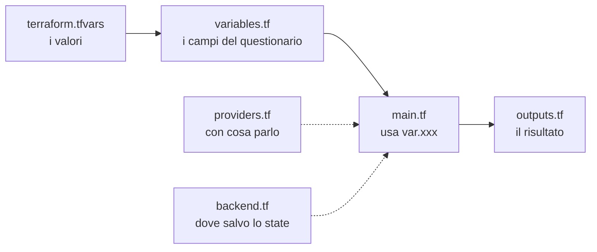
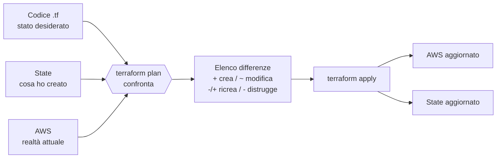
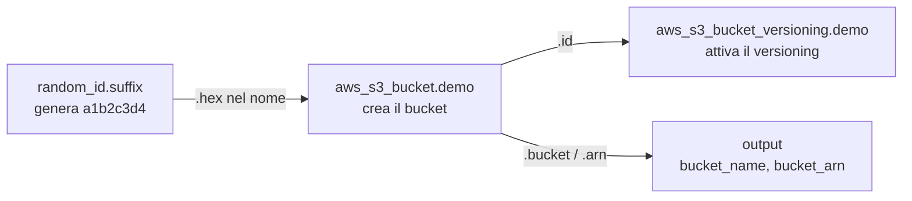

# Dispensa 0 – Terraform in 20 minuti

*Corso: Infrastruttura AWS con Terraform*

## Obiettivo

Alla fine di questa dispensa sai cos'è l'Infrastructure as Code, sai leggere e scrivere un file Terraform semplice, conosci il ciclo `init → plan → apply → destroy` e sai perché lo **state** (il registro di cosa Terraform ha creato, sezione 5) è la cosa più delicata di tutto il progetto.

---

## Prima di iniziare

### Cosa ti serve

| Cosa | Perché | Come verifichi che c'è |
|---|---|---|
| Un **account AWS** | È dove nasceranno le risorse | Riesci a entrare nella console web di AWS |
| **Terraform** 1.10 o successivo | Il programma di questo corso | `terraform version` nel terminale |
| **AWS CLI** versione 2 | Il programma a riga di comando di AWS: Terraform usa le sue credenziali | `aws --version` nel terminale |
| Un **editor di testo** (es. VS Code) | Per scrivere i file `.tf` | – |
| Un **terminale** | Per lanciare i comandi | Su macOS "Terminale", su Windows "PowerShell" |

Terraform e AWS CLI si installano seguendo le istruzioni ufficiali per il tuo sistema operativo (cerca "install terraform" e "install aws cli v2"). Tutti i comandi `terraform` si lanciano **dal terminale, dentro la cartella che contiene i file `.tf`**.

I comandi di esempio sono scritti per macOS e Linux. Su Windows (PowerShell) quasi tutti funzionano uguali; l'eccezione principale è `export NOME=valore`, che diventa `$env:NOME="valore"`.

### Attivare la regione di Milano

Nel corso usiamo la **regione** `eu-south-1`, cioè i data center AWS di Milano. Milano è una regione "opt-in": sugli account nuovi è **spenta** e va attivata una volta. In console: clic sul nome dell'account in alto a destra → **Account** → sezione **AWS Regions** → **Europe (Milan)** → **Enable**. L'attivazione richiede qualche minuto. Finché non è attiva, ogni comando verso Milano fallisce con errori poco chiari.

### Quanto costa

Tutti gli esercizi di questa dispensa costano praticamente zero. Nelle dispense successive alcune risorse si pagano a ore (lo segnaliamo ogni volta). Due abitudini da prendere subito:

- chiudere **sempre** un esercizio con `terraform destroy`;
- impostare un **budget** con avviso via email: console → **Billing and Cost Management** → **Budgets** → **Create budget**, per esempio 10 € al mese.

### Piccolo glossario

Parole che compaiono da subito. Tutte le altre le spieghiamo quando servono.

| Termine | Significato |
|---|---|
| **Console AWS** | Il sito web per gestire AWS a mano, con i clic |
| **Regione** | Una zona geografica con i suoi data center (per noi Milano, `eu-south-1`). Le risorse nascono in una regione precisa: in console, controlla sempre in alto a destra di essere su Milano, altrimenti "non vedi" quello che hai creato |
| **S3 / bucket** | S3 è il servizio AWS per archiviare file. Un **bucket** è un contenitore di file, con un nome unico al mondo |
| **ARN** | L'"indirizzo completo" di una risorsa AWS, unico. Es. `arn:aws:s3:::corso-aws-demo-a1b2c3d4` |
| **Tag** | Etichette `chiave = valore` attaccate a una risorsa, per ritrovarla e per attribuirne i costi |
| **HCL** | HashiCorp Configuration Language: il linguaggio in cui si scrivono i file `.tf` |
| **Git / commit** | Git è lo strumento che conserva la storia dei file di testo; fare un *commit* significa salvarne una versione. Nel corso è consigliato, non obbligatorio |
| **Pipeline / CI** | Un sistema automatico che, a ogni modifica del codice, esegue comandi al posto tuo (test, `terraform plan`…) |

---

## 1. Perché non si clicca in console

Creare risorse a mano dalla console AWS funziona la prima volta. Il problema arriva dopo: nessuno ricorda cosa è stato cliccato, non si può rifare identico in un altro ambiente, non c'è revisione delle modifiche, non c'è storia.

**Infrastructure as Code** significa descrivere l'infrastruttura in file di testo che:

- stanno in Git, quindi hanno storia, diff e code review;
- si possono applicare in modo ripetibile (sviluppo, collaudo, produzione identici);
- documentano da soli cosa esiste e perché.

Terraform è **dichiarativo**: non scrivi i passi ("crea questo, poi quest'altro"), scrivi lo **stato desiderato** ("voglio che esista questo"). Terraform confronta ciò che hai scritto con ciò che esiste e calcola da solo cosa creare, modificare o distruggere.

> **Analogia.** Uno script è una ricetta: "rompi le uova, sbatti, cuoci". Terraform è la foto del piatto finito: gli dai la foto e lui capisce cosa manca in cucina.

---

## 2. I mattoni del linguaggio (HCL)

| Blocco | A cosa serve |
|---|---|
| `terraform {}` | Versione di Terraform, provider richiesti, backend dello state |
| `provider` | Il "driver" verso una piattaforma (AWS, Azure, ecc.) |
| `resource` | Una cosa da creare e gestire (un bucket, una VPC, un'istanza) |
| `data` | Una cosa da **leggere** che esiste già, senza gestirla |
| `variable` | Un input parametrico |
| `locals` | Valori calcolati riutilizzabili all'interno del codice |
| `output` | Un valore da mostrare o passare ad altro codice |
| `module` | Un pacchetto riutilizzabile di risorse |

Ogni risorsa ha un **tipo** e un **nome locale**:

```hcl
resource "aws_s3_bucket" "demo" {
#         ^ tipo          ^ nome locale (solo per Terraform)
  bucket = "nome-reale-su-aws"
}
```

Si fa riferimento a una risorsa con `tipo.nome.attributo`, per esempio `aws_s3_bucket.demo.arn`.

### Le dipendenze si capiscono da sole

Quando una risorsa usa un attributo di un'altra, Terraform capisce che deve crearle in ordine. Non serve dirglielo:

```hcl
resource "aws_s3_bucket_versioning" "demo" {
  bucket = aws_s3_bucket.demo.id   # dipendenza implicita: prima il bucket
  versioning_configuration {
    status = "Enabled"
  }
}
```

Da questi riferimenti Terraform costruisce un **grafo** e crea in parallelo tutto quello che non dipende da altro. `depends_on` esiste, ma serve raramente: se lo usi spesso, di solito manca un riferimento.

### Anatomia di un blocco

Tutto il codice Terraform è fatto di **blocchi**. Prendiamone uno e smontiamolo pezzo per pezzo:

```hcl
resource "aws_s3_bucket" "demo" {   # (1) parola chiave + etichette, poi graffa aperta
  bucket = "corso-aws-demo-1234"    # (2) argomento:  nome = valore

  tags = {                          # (3) argomento il cui valore è una mappa
    Owner = "mario"
  }

  lifecycle {                       # (4) blocco annidato: NIENTE "=" prima della graffa
    prevent_destroy = true
  }
}                                   # fine del blocco
```

1. **Parola chiave ed etichette.** `resource` dice che tipo di blocco è. Le stringhe tra virgolette che seguono sono le etichette: per una risorsa sono il tipo (`aws_s3_bucket`, deciso dal provider) e il nome locale (`demo`, deciso da te).
2. **Argomento.** Una riga `nome = valore` imposta una caratteristica della risorsa. Qui: il nome reale del bucket su AWS.
3. **Argomento con una mappa.** Il valore può essere una struttura: qui una mappa di tag, cioè coppie chiave/valore.
4. **Blocco annidato.** Un blocco dentro un blocco raggruppa impostazioni correlate. Si riconosce perché **non ha l'`=`** prima della graffa. `tags = { ... }` è un argomento, `lifecycle { ... }` è un blocco: la differenza sembra pignola, ma se la sbagli Terraform dà errore.

I commenti si scrivono con `#` (o `//`) fino a fine riga, oppure `/* ... */` su più righe.

### Come faccio a sapere quali argomenti scrivere?

Non si inventano: li definisce il provider. Per ogni tipo di risorsa c'è una pagina nella documentazione del provider AWS (cerca per esempio "terraform aws_s3_bucket"), sempre con due sezioni:

| Sezione della documentazione | Cosa contiene | Esempio per `aws_s3_bucket` |
|---|---|---|
| **Argument Reference** | Cosa **puoi scrivere** tu nel blocco (obbligatori e facoltativi) | `bucket`, `force_destroy`, `tags` |
| **Attribute Reference** | Cosa **puoi leggere** dopo la creazione, perché lo calcola AWS | `id`, `arn`, `region` |

Gli **argomenti** li decidi tu, gli **attributi** li scopri dopo la creazione. Per questo puoi scrivere `aws_s3_bucket.demo.arn` in un'altra risorsa, anche se l'ARN non l'hai mai scritto: Terraform lo conosce dopo aver creato il bucket.

### I tipi di valore

| Tipo | Come si scrive | Come si legge un elemento |
|---|---|---|
| `string` | `"testo"` | – |
| `number` | `3`, `0.5` | – |
| `bool` | `true`, `false` | – |
| `list` | `["a", "b", "c"]` | `lista[0]` restituisce `"a"`: si conta da zero |
| `map` / `object` | `{ nome = "web", porta = 443 }` | `mappa.nome` oppure `mappa["nome"]` |
| `null` | `null` | Significa "come se non avessi scritto l'argomento" |

### Le espressioni: dove il codice diventa dinamico

A destra dell'`=` non ci sono solo valori fissi. Ci sono quattro costrutti che ritroverai in ogni dispensa.

**Riferimenti**, cioè leggere un valore da un'altra parte della configurazione:

| Scrivi | Leggi |
|---|---|
| `var.region` | Il valore della variabile `region` |
| `local.name_prefix` | Un valore calcolato in un blocco `locals` |
| `aws_s3_bucket.demo.arn` | Un attributo di una risorsa gestita da noi |
| `data.aws_caller_identity.current.account_id` | Un attributo di un data source (qualcosa di esistente che leggiamo) |

**Interpolazione**, cioè inserire un valore dentro una stringa con `${ }`:

```hcl
bucket = "${var.project}-demo"   # con project = "corso-aws" diventa "corso-aws-demo"
bucket = var.nome                # se il valore è SOLO il riferimento, niente virgolette né ${ }
```

**Funzioni**, cioè trasformare valori: si scrivono `nome(argomenti)`. Non se ne possono definire di nuove, si usano quelle di Terraform. Alcune che incontrerai:

| Funzione | Esempio | Risultato |
|---|---|---|
| `upper` | `upper("ciao")` | `"CIAO"` |
| `length` | `length(["a", "b"])` | `2` |
| `contains` | `contains(["dev", "prod"], "dev")` | `true` |
| `regex` | `regex("^[a-z]+$", "abc")` | la parte che corrisponde, **errore** se non corrisponde |
| `can` | `can(regex("^[a-z]+$", "ABC"))` | `false`: trasforma un errore in `false`, utile nelle `validation` |

**Condizionale**, cioè scegliere tra due valori:

```hcl
instance_type = var.environment == "prod" ? "m7g.large" : "t4g.micro"
#               condizione                  se vera       se falsa
```

### Provare senza paura: terraform console

`terraform console` apre un prompt dove puoi scrivere espressioni e vedere il risultato, senza creare né modificare niente. È il modo più rapido per capire un pezzo di codice che non ti torna.

Si lancia **dentro la cartella del progetto, dopo `terraform init`** (sezione 4). Le funzioni come `upper(...)` funzionano sempre; `var.qualcosa` funziona solo se quella variabile è dichiarata nei file della cartella (l'esempio sotto presuppone `project` ed `environment`, che vedremo nella sezione 3). Si esce con `exit`.

```
$ terraform console
> upper("corso")
"CORSO"
> "${var.project}-demo"
"corso-aws-demo"
> var.environment == "prod" ? "grande" : "piccola"
"piccola"
> exit
```

Più avanti incontreremo costrutti per creare **più copie della stessa risorsa** (`for_each`) e per trasformare liste e mappe (le espressioni `for`): li vediamo nella dispensa 2, dove servono per la prima volta.

---

## 3. Struttura di un progetto

### Come Terraform legge i file

Prima regola, che sorprende sempre: **Terraform non esegue i file uno dopo l'altro**. Quando lanci un comando in una cartella, legge **tutti** i file `.tf` di quella cartella e li fonde in un'unica configurazione. Ne derivano tre conseguenze:

- **L'ordine dei file non conta**, e nemmeno l'ordine dei blocchi dentro un file: l'ordine di creazione lo decide il grafo delle dipendenze (sezione 2).
- **I nomi dei file sono una convenzione per gli umani**, non per Terraform. Potresti mettere tutto in un unico `pippo.tf` e funzionerebbe identico. Si divide per ritrovare le cose.
- **Le sottocartelle non vengono lette.** Una sottocartella entra in gioco solo se la richiami esplicitamente come `module`.

La cartella in cui lanci `terraform` si chiama **root module**. Questa è la struttura minima standard:

```
infra/
├── providers.tf       # versioni e configurazione provider
├── backend.tf         # dove sta lo state
├── variables.tf       # DICHIARAZIONE degli input
├── main.tf            # le risorse
├── outputs.tf         # cosa restituisce il progetto
└── terraform.tfvars   # VALORI degli input per questo ambiente
```

### Il flusso in un colpo d'occhio



> **Analogia.** `variables.tf` è un questionario con i campi vuoti ("Nome progetto: ____, Regione: ____"). `terraform.tfvars` è lo stesso questionario compilato. `main.tf` è l'ufficio che lavora sul questionario compilato. `outputs.tf` è la ricevuta che ti danno allo sportello.

Vediamo i file uno per uno: cosa contengono, quando cambiano e gli errori tipici.

> **Attenzione: in questa sezione gli esempi servono a mostrare la sintassi, non vanno copiati.** Alcuni citano risorse che costruiremo più avanti (un database, delle istanze). I file esatti da creare per provare sono nell'esercizio, alla sezione 7.

---

### providers.tf: con chi parla Terraform

Contiene due cose diverse.

**Il blocco `terraform`** con i requisiti: quale versione di Terraform serve e quali provider scaricare, con che versione.

```hcl
terraform {
  required_version = ">= 1.10"

  required_providers {
    aws = {
      source  = "hashicorp/aws"   # da dove scaricarlo: il registry
      version = "~> 6.0"          # qualsiasi 6.x, non 7.0
    }
    random = {
      source  = "hashicorp/random"
      version = "~> 3.6"
    }
  }
}
```

Il **registry** (registry.terraform.io) è il "negozio" pubblico da cui `terraform init` scarica i provider: `hashicorp/aws` significa "il provider `aws` pubblicato da HashiCorp". `~> 6.0` si legge "dalla 6.0 in su, ma senza passare alla 7": le versioni nuove della stessa serie sono compatibili, un salto di numero principale può rompere il codice.

**I blocchi `provider`** con la configurazione del "driver": regione, tag di default, eventualmente il profilo o il role da assumere.

```hcl
provider "aws" {
  region = var.region

  default_tags {
    tags = {
      Project   = var.project
      ManagedBy = "terraform"
    }
  }
}
```

**Quando cambia:** raramente. Quando si aggiorna la versione di un provider o se ne aggiunge uno nuovo, e ogni volta va rilanciato `terraform init`.

**Da sapere:** puoi avere più configurazioni dello stesso provider con un `alias`, per esempio quando alcune risorse devono stare in un'altra regione:

```hcl
provider "aws" {
  alias  = "virginia"
  region = "us-east-1"
}

# e nella risorsa:  provider = aws.virginia
```

Le versioni esatte scaricate finiscono nel file `.terraform.lock.hcl`, che si genera da solo e **va committato**: garantisce che tutti usino la stessa identica versione del provider.

---

### backend.tf: dove vive lo state

Contiene solo il blocco `backend`, cioè dove salvare lo state (vedi sezione 5).

```hcl
terraform {
  backend "s3" {
    bucket       = "corso-aws-tfstate-123456789012"   # corso-aws-tfstate-<numero del tuo account>
    key          = "corso/terraform.tfstate"
    region       = "eu-south-1"
    encrypt      = true
    use_lockfile = true
  }
}
```

**Perché un file a parte**, se è un blocco `terraform` come quello di `providers.tf`? Perché ha regole diverse e cambiarlo è un'operazione delicata:

- **non accetta variabili**: niente `var.region` qui dentro, i valori vanno scritti o passati con `terraform init -backend-config=file.hcl`;
- **se lo modifichi, lo state va spostato**: serve `terraform init -migrate-state` (sposta lo state nel nuovo posto) o `-reconfigure` (riparte ignorando il vecchio). Sbagliare qui significa che Terraform "dimentica" l'infrastruttura.

Tenerlo isolato rende evidente, in una code review, che qualcuno sta toccando il backend.

**Quando cambia:** quasi mai.

---

### variables.tf: la dichiarazione degli input

Qui si **dichiarano** le variabili: nome, tipo, descrizione, eventuale valore di default e regole di validazione. **Non** si danno i valori per l'ambiente: quello è il compito di `terraform.tfvars`.

```hcl
variable "region" {
  description = "Regione AWS in cui creare le risorse"
  type        = string
  default     = "eu-south-1"   # se nessuno la valorizza, vale questo
}

variable "project" {
  description = "Prefisso per i nomi delle risorse"
  type        = string
  # nessun default: è OBBLIGATORIA

  validation {
    condition     = can(regex("^[a-z0-9-]{3,20}$", var.project))
    error_message = "Solo minuscole, numeri e trattini, da 3 a 20 caratteri."
  }
}

variable "environment" {
  description = "Ambiente"
  type        = string
  validation {
    condition     = contains(["dev", "test", "prod"], var.environment)
    error_message = "Valori ammessi: dev, test, prod."
  }
}

variable "db_password" {
  description = "Password del database"
  type        = string
  sensitive   = true   # non viene stampata nel plan né nell'output
}
```

I punti da capire:

- **Senza `default` la variabile è obbligatoria.** Se nessuno la valorizza, Terraform la chiede a video o si ferma con un errore.
- **`type`** evita errori stupidi. Oltre a `string` esistono `number`, `bool`, `list(string)`, `map(string)` e `object({...})` per strutture più complesse.
- **`validation`** blocca valori sbagliati già al `plan`, prima di toccare AWS.
- **`sensitive = true`** nasconde il valore a video, ma **non** lo cifra nello state: lì resta in chiaro. Per le password vere la strada giusta è non farle passare da Terraform (per esempio con Secrets Manager, come vedremo per RDS).

Nel codice una variabile si usa con `var.nome`, per esempio `var.region`.

**Quando cambia:** quando il progetto ha bisogno di un nuovo parametro.

---

### terraform.tfvars: i valori per questo ambiente

È il modulo compilato: solo assegnazioni, nessuna logica.

```hcl
project     = "corso-aws"
environment = "dev"
region      = "eu-south-1"
```

Terraform carica **automaticamente** solo due tipi di file: `terraform.tfvars` e qualunque file che finisce in `.auto.tfvars`. Tutti gli altri vanno indicati esplicitamente:

```bash
terraform plan -var-file=envs/prod.tfvars
```

**Da dove può arrivare il valore di una variabile**, dalla priorità più bassa alla più alta (l'ultimo vince):

1. il `default` in `variables.tf`;
2. le variabili d'ambiente `TF_VAR_nome` (es. `export TF_VAR_region=eu-west-1`);
3. `terraform.tfvars`;
4. i file `*.auto.tfvars`, in ordine alfabetico;
5. `-var` e `-var-file` sulla riga di comando.

Questo spiega i casi in cui "ho cambiato il tfvars ma non succede niente": probabilmente c'è un `-var` o un `.auto.tfvars` che lo sovrascrive.

**Si committa?** Sì, **se non contiene segreti**: così è documentato con che valori gira ogni ambiente. I segreti non vanno mai nei tfvars: si passano con `TF_VAR_...` dalla pipeline o, meglio, non passano da Terraform affatto.

**Quando cambia:** ogni volta che cambia la configurazione di un ambiente (dimensione di un'istanza, numero di repliche, ecc.).

---

### main.tf: le risorse

Qui sta l'infrastruttura vera: blocchi `resource`, `data` e `locals`.

```hcl
locals {
  # valori calcolati, riutilizzabili: si usano con local.nome
  name_prefix = "${var.project}-${var.environment}"
}

data "aws_caller_identity" "current" {}   # legge l'account in uso

resource "aws_s3_bucket" "demo" {
  bucket = "${local.name_prefix}-demo-${data.aws_caller_identity.current.account_id}"
}
```

Differenza tra `variable` e `locals`: la variabile arriva **da fuori** (chi usa il progetto la può cambiare), il local è **calcolato dentro** (chi usa il progetto non lo tocca). Se un valore si ripete in tre risorse ed è derivato da altri, è un local.

**Quando cresce**, `main.tf` non si tiene come file unico da mille righe: si spezza **per dominio**. Nel progetto del corso arriveremo a questo:

```
infra/
├── providers.tf
├── backend.tf
├── variables.tf
├── locals.tf
├── iam.tf        # role e policy
├── vpc.tf        # rete, subnet, route table
├── security.tf   # security group e NACL
├── vpn.tf        # Client VPN
├── ec2.tf        # istanze
├── rds.tf        # database
├── s3.tf         # bucket artefatti
├── outputs.tf
└── terraform.tfvars
```

Ricorda la prima regola: per Terraform non cambia niente, è sempre un'unica configurazione. Una risorsa in `ec2.tf` può usare liberamente una subnet definita in `vpc.tf`.

**Quando cambia:** continuamente, è il file di lavoro.

---

### outputs.tf: cosa restituisce il progetto

Gli output sono i valori che il progetto espone alla fine di un `apply`.

```hcl
output "bucket_name" {
  description = "Nome del bucket creato"
  value       = aws_s3_bucket.demo.bucket
}

output "db_endpoint" {
  description = "Endpoint del database"
  value       = aws_db_instance.main.endpoint
}

output "db_connection_string" {
  value     = "postgres://app@${aws_db_instance.main.endpoint}/app"
  sensitive = true
}
```

A cosa servono:

- **a te**: dopo l'`apply` vedi subito l'IP, l'endpoint, l'ARN che ti servono, senza cercarli in console;
- **agli script**: `terraform output -raw bucket_name` restituisce il valore pulito da usare in bash o in una pipeline (lo useremo nel laboratorio della dispensa 1);
- **ad altri progetti o moduli**: quando il progetto diventa un modulo, gli output sono il modo in cui passa valori al chiamante.

Gli output sensibili vengono nascosti a video, ma come le variabili **sono salvati in chiaro nello state**.

**Quando cambia:** quando serve esporre un nuovo valore.

---

### I file che non scrivi tu

Dopo `terraform init` compaiono:

| File / cartella | Cosa è | In Git? |
|---|---|---|
| `.terraform/` | Provider e moduli scaricati | No |
| `.terraform.lock.hcl` | Versioni esatte dei provider | **Sì** |
| `terraform.tfstate` | Lo state, **solo se il backend è locale** | **Mai** |

---

### E con più ambienti?

Lo stesso codice deve girare in `dev`, `test` e `prod`. L'approccio più semplice e leggibile: **stesso codice, un tfvars e uno state per ambiente**.

```
infra/
├── *.tf
└── envs/
    ├── dev.tfvars
    ├── dev.backend.hcl     # key = "corso/dev/terraform.tfstate"
    ├── prod.tfvars
    └── prod.backend.hcl    # key = "corso/prod/terraform.tfstate"
```

```bash
terraform init -reconfigure -backend-config=envs/prod.backend.hcl
terraform plan -var-file=envs/prod.tfvars
```

La regola che non si discute: **ogni ambiente ha il suo state separato**. Un `destroy` lanciato per sbaglio in dev non deve poter toccare prod.

---

### Riepilogo della sezione

| File | Contiene | Domanda a cui risponde | Cambia |
|---|---|---|---|
| `providers.tf` | Requisiti e configurazione provider | Con cosa parlo? | Raramente |
| `backend.tf` | Posizione dello state | Dove salvo cosa ho creato? | Quasi mai |
| `variables.tf` | Dichiarazione degli input | Cosa si può configurare? | A volte |
| `terraform.tfvars` | Valori degli input | Con che valori gira questo ambiente? | Per ambiente |
| `main.tf` (e `*.tf`) | Risorse, data, locals | Cosa costruisco? | Continuamente |
| `outputs.tf` | Valori esposti | Cosa mi serve sapere alla fine? | A volte |


---

## 4. Il ciclo di lavoro

| Comando | Cosa fa |
|---|---|
| `terraform init` | Scarica i provider, configura il backend. Si rilancia quando cambiano provider o backend |
| `terraform fmt` | Formatta il codice in modo standard |
| `terraform validate` | Controlla la sintassi e la coerenza |
| `terraform plan` | Mostra **cosa farebbe**, senza toccare niente |
| `terraform apply` | Esegue le modifiche (chiede conferma) |
| `terraform destroy` | Distrugge tutto ciò che gestisce |
| `terraform output` | Mostra gli output |
| `terraform state list` | Elenca le risorse che Terraform conosce |

Cosa aspettarsi a video:

- `init` scarica i provider (la prima volta impiega qualche secondo) e finisce con **"Terraform has been successfully initialized!"**;
- `apply` e `destroy` mostrano prima il piano e poi chiedono **"Enter a value:"**: scrivi `yes` e premi Invio. Qualunque altra risposta annulla senza fare niente;
- alla fine `apply` scrive **"Apply complete! Resources: N added, …"** e stampa gli output.

### Cosa succede davvero con plan e apply

Il `plan` mette a confronto tre cose: quello che hai scritto, quello che Terraform ricorda di aver creato (lo state) e quello che esiste davvero su AWS in quel momento.



Il `plan` non tocca niente. L'`apply` esegue le differenze su AWS e poi aggiorna lo state, così la volta successiva Terraform sa cosa esiste.

### Leggere un plan

Il `plan` è il momento più importante: **si legge sempre prima di applicare**.

| Simbolo | Significato |
|---|---|
| `+` | Crea |
| `~` | Modifica sul posto |
| `-/+` | **Distrugge e ricrea** (attenzione: su un database vuol dire perdere i dati) |
| `-` | Distrugge |

In fondo c'è il riepilogo, per esempio `Plan: 2 to add, 0 to change, 0 to destroy.` Se un `-/+` compare dove non te lo aspetti, ti fermi e capisci perché.

**Buona pratica:** in ambienti seri si salva il plan e si applica esattamente quello, così tra la revisione e l'esecuzione non cambia niente:

```bash
terraform plan -out=piano.tfplan
terraform apply piano.tfplan
```

---

## 5. Lo state: il punto più delicato

Terraform tiene un file, `terraform.tfstate`, che collega ogni `resource` del codice alla risorsa reale su AWS (per esempio: `aws_s3_bucket.demo` è il bucket con quel nome e quell'ARN). Senza state, Terraform non sa cosa ha creato.

Cose da sapere:

- **Lo state contiene segreti in chiaro** (password di database, chiavi generate). Non va **mai** messo in Git.
- **Lo state va tenuto remoto**, non sul portatile di qualcuno: se si perde, Terraform "dimentica" l'infrastruttura.
- **Serve un lock**, cioè un cartello "occupato": mentre qualcuno lancia `apply`, Terraform blocca lo state e chi arriva dopo deve aspettare. Senza, due `apply` contemporanei possono corrompere lo state.
- **Non si modifica a mano.** Per spostare o rimuovere risorse dallo state esistono comandi appositi (`terraform state mv`, `terraform state rm`, blocchi `moved` e `import`).

### Locale o remoto

Se non c'è nessun `backend.tf`, lo state è **locale**: un file `terraform.tfstate` nella cartella del progetto. Per imparare va bene, e l'esercizio parte così. Per lavorare seriamente lo state va in un bucket S3 (**remoto**) con il `backend.tf` visto nella sezione 3:

- `encrypt = true`: il file dello state viene salvato cifrato;
- `use_lockfile = true`: il lock è un piccolo file creato accanto allo state nel bucket (serve Terraform 1.10 o successivo). In passato si usava una tabella DynamoDB: la troverai in molti esempi online, ma oggi non serve più;
- `key`: il percorso del file dello state dentro il bucket.

Il bucket dello state è il classico problema dell'uovo e della gallina: non può essere creato dallo stesso codice che lo usa come backend, perché quel codice, per partire, ha già bisogno del bucket. Si crea quindi **una volta sola, a parte**, con la CLI; lo facciamo nel passo 7 dell'esercizio. Poi resta lì per tutto il corso.

### .gitignore

```
.terraform/
*.tfstate
*.tfstate.*
*.tfplan
crash.log
```

Il file `.gitignore` va nella stessa cartella dei `.tf` ed elenca i file che Git non deve salvare: qui la cartella dei provider scaricati, lo state e i piani. Se non usi Git puoi ignorarlo.

Il file `.terraform.lock.hcl` invece **va committato**: fissa le versioni esatte dei provider, così tutti usano le stesse.

### Il drift

Se qualcuno modifica a mano in console una risorsa gestita da Terraform, il `plan` successivo lo scopre e propone di riportarla allo stato scritto nel codice. Regola: **ciò che è gestito da Terraform si modifica solo da Terraform**.

---

## 6. Come si autentica Terraform

Terraform non ha un login suo: usa le stesse credenziali della AWS CLI. La strada corretta è **IAM Identity Center** (il servizio AWS per il *single sign-on*, SSO: un solo login, con credenziali temporanee che scadono da sole). Come funziona lo vediamo nella dispensa 1; qui ci serve solo farlo funzionare.

### Configurazione (una volta sola)

In console, con l'utente con cui hai creato l'account:

1. Cerca **IAM Identity Center** e premi **Enable**. Controlla di essere nella regione di Milano.
2. **Users → Add user**: crea il tuo utente di lavoro con la tua email. Riceverai un'email per impostare la password; attiva anche l'MFA (il codice dall'app sul telefono) quando te lo propone.
3. **Permission sets → Create permission set** → *Predefined* → `AdministratorAccess`. Per un laboratorio personale va bene; in azienda i permessi sono più stretti.
4. **AWS accounts** → seleziona il tuo account → **Assign users or groups** → scegli il tuo utente e il permission set `AdministratorAccess`.
5. Nella pagina **Dashboard** copia l'**AWS access portal URL** (qualcosa come `https://d-1234567890.awsapps.com/start`).

Nel terminale:

```bash
aws configure sso
```

Il comando fa alcune domande:

| Domanda | Cosa rispondere |
|---|---|
| `SSO session name` | `corso` |
| `SSO start URL` | l'URL copiato al punto 5 |
| `SSO region` | `eu-south-1` |
| `SSO registration scopes` | Invio (lascia il valore proposto) |

Si apre il browser: accedi con l'utente del punto 2 e autorizza. Tornato al terminale, scegli l'account e il ruolo `AdministratorAccess`, poi:

| Domanda | Cosa rispondere |
|---|---|
| `Default client Region` | `eu-south-1` |
| `CLI default output format` | `json` |
| `Profile name` | `corso` |

Il risultato viene scritto nel file `~/.aws/config` (`~` è la tua cartella utente: `/Users/tuonome` su Mac, `C:\Users\tuonome` su Windows). Il **profilo** `corso` è un nome che raggruppa "quale account, quale ruolo, quale regione".

### Ogni giorno

```bash
aws sso login --profile corso   # apre il browser e rinnova le credenziali (durano alcune ore)
export AWS_PROFILE=corso         # d'ora in poi, in QUESTO terminale, usa il profilo corso
aws sts get-caller-identity      # verifica: chi sono?
```

Su Windows (PowerShell) la seconda riga è `$env:AWS_PROFILE="corso"`. La variabile vale solo per il terminale aperto: se ne apri un altro va ripetuta.

L'ultimo comando deve rispondere con il numero del tuo account e un `Arn` che contiene `AWSReservedSSO_AdministratorAccess`. Se dice che il token è scaduto, rilancia `aws sso login`.

Da **non** fare mai:

- access key scritte nel codice o nel `provider`;
- access key permanenti di un utente IAM salvate sul portatile "perché è più comodo";
- usare l'utente root dell'account.

Chi è autorizzato a fare cosa, e perché, è il tema della dispensa 1.

---

## 7. Esercizio

Obiettivo: creare un bucket, modificarlo, forzarne la ricreazione, spostare lo state su S3 e distruggere tutto, leggendo ogni volta il plan.

### Prepara la cartella

Crea una cartella vuota, per esempio `infra/`, e dentro **esattamente** questi cinque file. Questa cartella è il progetto del corso: le dispense successive aggiungeranno altri file qui, accanto a questi. Gli esempi della sezione 3 non vanno copiati.

```
infra/
├── providers.tf
├── variables.tf
├── terraform.tfvars
├── main.tf
└── outputs.tf
```

Niente `backend.tf` per ora: lo state resta locale e lo spostiamo su S3 al passo 7.

### providers.tf

```hcl
terraform {
  required_version = ">= 1.10"

  required_providers {
    aws = {
      source  = "hashicorp/aws"
      version = "~> 6.0"
    }
    random = {
      source  = "hashicorp/random"
      version = "~> 3.6"
    }
  }
}

provider "aws" {
  region = var.region

  default_tags {
    tags = {
      Project   = var.project
      ManagedBy = "terraform"
    }
  }
}
```

### variables.tf

```hcl
variable "region" {
  description = "Regione AWS in cui creare le risorse"
  type        = string
  default     = "eu-south-1"
}

variable "project" {
  description = "Prefisso per i nomi delle risorse"
  type        = string

  validation {
    condition     = can(regex("^[a-z0-9-]{3,20}$", var.project))
    error_message = "Solo minuscole, numeri e trattini, da 3 a 20 caratteri."
  }
}
```

### terraform.tfvars

```hcl
project = "corso-aws"
```

### main.tf

```hcl
# Un numero casuale di 4 byte. Non crea niente su AWS.
resource "random_id" "suffix" {
  byte_length = 4
}

# Il bucket vero e proprio
resource "aws_s3_bucket" "demo" {
  # I nomi dei bucket sono globali: il suffisso casuale evita collisioni
  bucket = "${var.project}-demo-${random_id.suffix.hex}"

  # Solo per il laboratorio: permette al destroy di cancellare il bucket
  # anche se contiene file (vedi la domanda di verifica)
  force_destroy = true
}

# Il versioning del bucket, gestito come risorsa separata
resource "aws_s3_bucket_versioning" "demo" {
  bucket = aws_s3_bucket.demo.id
  versioning_configuration {
    status = "Enabled"
  }
}
```

### outputs.tf

```hcl
output "bucket_name" {
  value = aws_s3_bucket.demo.bucket
}

output "bucket_arn" {
  value = aws_s3_bucket.demo.arn
}
```

### Cosa fa questo codice, blocco per blocco

**`random_id.suffix`**: un "tira i dadi" per rendere unico il nome del bucket.

*Il problema.* Il nome di un bucket S3 deve essere unico **in tutto il mondo**, tra tutti i clienti AWS, come un indirizzo email. Se tu e un altro studente chiamate entrambi il bucket `corso-aws-demo`, il secondo che lancia `apply` riceve un errore: "nome già preso".

*La soluzione.* Si aggiunge in fondo al nome un pezzo casuale: `corso-aws-demo-a1b2c3d4`. La probabilità che qualcun altro abbia esattamente lo stesso suffisso è praticamente nulla.

*Cosa fa la risorsa.* `random_id` è una risorsa "finta": non crea niente su AWS, esiste solo dentro Terraform (viene dal provider `random`, dichiarato in `providers.tf`). Quando la crei, Terraform tira a sorte un numero:

- `byte_length = 4` significa "un numero grande 4 byte". Non serve capire i byte: basta sapere che, scritto in esadecimale (un modo di scrivere i numeri con le cifre `0-9` più le lettere `a-f`), diventa **8 caratteri**;
- l'attributo `.hex` restituisce proprio quegli 8 caratteri, per esempio `a1b2c3d4`.

*Perché non cambia ogni volta.* Il numero viene estratto **una volta sola**, al primo `apply`, e salvato nello state. Ai `plan` e `apply` successivi Terraform lo rilegge dallo state e usa lo stesso valore. Se cambiasse a ogni esecuzione cambierebbe anche il nome del bucket, e Terraform distruggerebbe e ricreerebbe il bucket ogni volta. Il numero cambia solo se distruggi la risorsa (`terraform destroy`) e la ricrei.

In sequenza:

| Momento | Cosa succede a `random_id.suffix` | Nome del bucket |
|---|---|---|
| Primo `apply` | Estrae `a1b2c3d4` e lo salva nello state | `corso-aws-demo-a1b2c3d4` |
| `apply` successivi | Rilegge `a1b2c3d4` dallo state | invariato |
| `destroy` e nuovo `apply` | Estrae un numero nuovo, per esempio `9f8e7d6c` | `corso-aws-demo-9f8e7d6c` (bucket nuovo) |

**`aws_s3_bucket.demo`** crea il bucket. L'argomento `bucket` è il nome, costruito per interpolazione: `var.project` (dal tfvars: `corso-aws`) + `-demo-` + il suffisso casuale. Il risultato sarà qualcosa come `corso-aws-demo-a1b2c3d4`. Siccome usa `random_id.suffix.hex`, Terraform sa che deve prima generare il numero e poi creare il bucket. `force_destroy = true` dice: "al `destroy`, cancella anche i file che ci sono dentro". Senza, AWS rifiuta di cancellare un bucket non vuoto. In un laboratorio è comodo; su un bucket con dati veri è pericoloso.

**`aws_s3_bucket_versioning.demo`** attiva il versioning sul bucket: ogni volta che un file viene sovrascritto o cancellato, S3 conserva la versione precedente. Nel provider AWS molte impostazioni del bucket (versioning, cifratura, policy, blocco dell'accesso pubblico) sono **risorse separate** che "puntano" al bucket tramite l'argomento `bucket`. Qui `aws_s3_bucket.demo.id` è l'identificativo del bucket appena creato, che per S3 coincide con il nome. `versioning_configuration` è un blocco annidato (niente `=`) con dentro l'unico argomento `status`.

**Gli output** mostrano alla fine dell'`apply` il nome e l'ARN del bucket, due attributi che AWS conosce solo dopo averlo creato.

L'ordine in cui Terraform crea le risorse, ricavato solo dai riferimenti:



E i tag `Project` e `ManagedBy`, che non compaiono in nessuna risorsa? Arrivano dai `default_tags` del blocco `provider "aws"` (sezione 3): il provider li aggiunge da solo a ogni risorsa AWS che li supporta.

### Passi

Prima di cominciare: `aws sso login --profile corso` ed `export AWS_PROFILE=corso` (sezione 6). Poi, nel terminale, entra nella cartella con `cd infra`.

1. **`terraform init`**, poi **`terraform plan`**. Quante risorse crea? Perché tre e non due? (Atteso: `Plan: 3 to add`; la terza è `random_id`.)
2. **`terraform apply`** e conferma con `yes`. Poi controlla in console: cerca **S3**, apri il bucket `corso-aws-demo-…`, scheda **Properties**, sezione **Tags**. Ci sono `Project` e `ManagedBy`?
3. **Modifica sul posto.** In `main.tf`, dentro il blocco `resource "aws_s3_bucket" "demo"`, sotto la riga `bucket = ...`, aggiungi l'argomento:

   ```hcl
   tags = { Owner = "il-tuo-nome" }
   ```

   Lancia `plan`: che simbolo compare? (Atteso: `~`, modifica sul posto.) Poi `apply` per renderla effettiva.
4. **Ricreazione.** Nella riga `bucket = ...` cambia la parola `demo` in `prova` e lancia `plan`. Che simbolo compare adesso e perché? (Atteso: `-/+`: il nome di un bucket non si può cambiare, quindi va distrutto e ricreato.) **Non applicare**: rimetti `demo` e verifica che `plan` dica `No changes`.
5. **Drift.** In console, sempre in **Properties → Tags**, premi **Edit** e aggiungi a mano il tag `Test = manuale`. Poi lancia `plan`. (Atteso: `~` sul bucket, con la proposta di **togliere** il tag `Test`, perché nel codice non c'è.) Lancia `apply` per riallineare.
6. **`terraform state list`**: cosa conosce Terraform? (Atteso: le tre risorse, con i loro indirizzi `tipo.nome`.)
7. **Sposta lo state su S3.** Fin qui lo state era il file `terraform.tfstate` nella cartella. Crea il bucket per lo state, una volta sola, con la CLI:

   ```bash
   ACCOUNT_ID=$(aws sts get-caller-identity --query Account --output text)
   echo $ACCOUNT_ID    # il numero del tuo account, 12 cifre

   aws s3api create-bucket --bucket corso-aws-tfstate-$ACCOUNT_ID \
     --region eu-south-1 --create-bucket-configuration LocationConstraint=eu-south-1
   aws s3api put-bucket-versioning --bucket corso-aws-tfstate-$ACCOUNT_ID \
     --versioning-configuration Status=Enabled
   ```

   `$( )` esegue il comando tra parentesi e ne salva il risultato nella variabile `ACCOUNT_ID`; `\` a fine riga significa "il comando continua sulla riga sotto". Il numero dell'account nel nome rende il bucket unico al mondo. I bucket nuovi nascono già cifrati e con l'accesso pubblico bloccato; il versioning conserva le versioni precedenti dello state, utile se un giorno si rovina.

   Poi crea `backend.tf` con il blocco della sezione 3, scrivendo in `bucket` il nome vero (es. `corso-aws-tfstate-123456789012`), e lancia:

   ```bash
   terraform init -migrate-state
   ```

   Terraform chiede se copiare lo state esistente nel nuovo backend: rispondi `yes`. Da ora lo state vive su S3: controlla in console che nel bucket ci sia `corso/terraform.tfstate`. Il file locale `terraform.tfstate` rimasto nella cartella non serve più e si può cancellare.
8. **`terraform destroy`** e conferma con `yes`. Il bucket `demo` sparisce; il bucket dello state no, perché non è gestito da Terraform: resta per le prossime dispense e costa pochi centesimi l'anno.

**Domanda di verifica:** cosa succederebbe al punto 8 se nel bucket `demo` ci fossero dei file e **non** avessimo scritto `force_destroy = true`? (Il destroy fallisce: AWS non cancella un bucket non vuoto. `force_destroy` scavalca questa protezione, per questo si usa solo nei laboratori.)

---

## Riepilogo

- Terraform descrive lo **stato desiderato**, non i passi.
- Le dipendenze nascono dai **riferimenti** tra risorse.
- Il **plan si legge sempre**, e un `-/+` inatteso è un campanello d'allarme.
- Lo **state** è remoto, cifrato, con lock, fuori da Git e mai modificato a mano.
- Le credenziali sono **temporanee** e **mai nel codice**.
