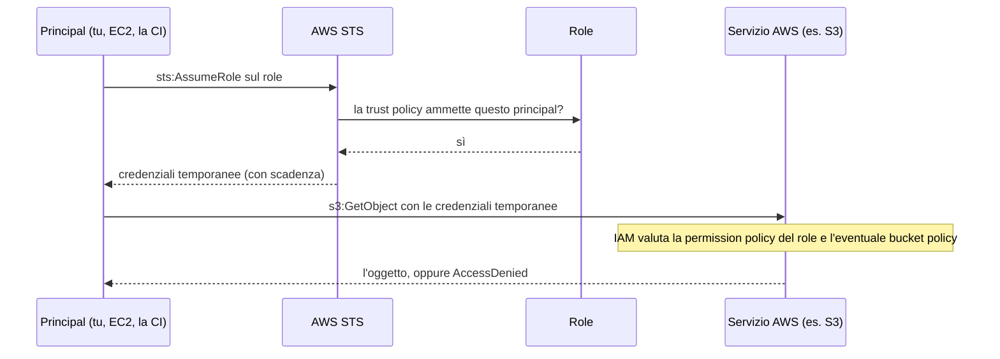
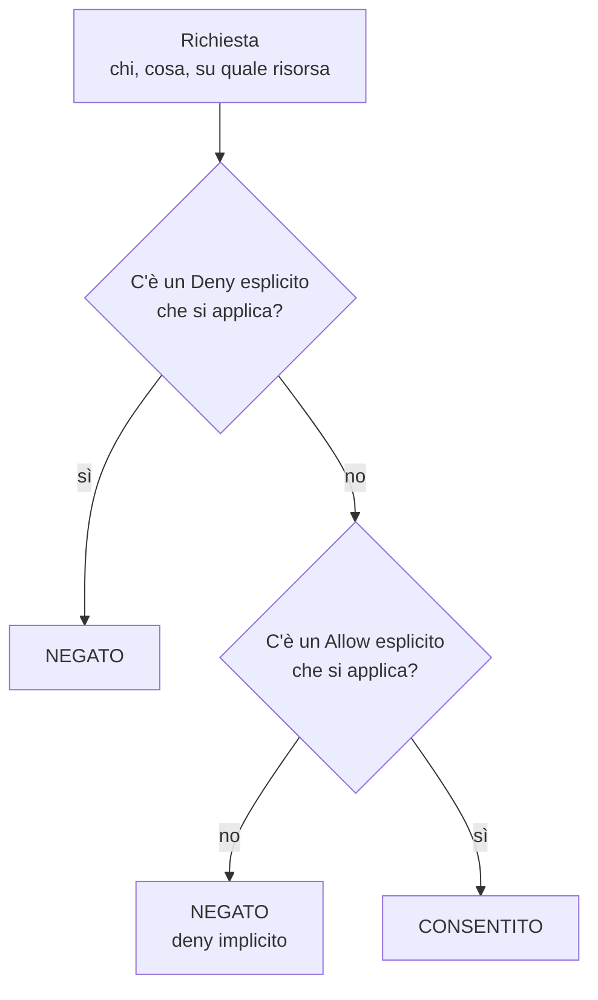
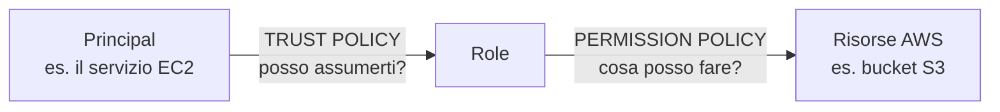
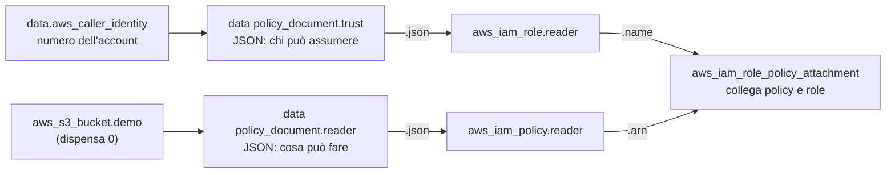

# Dispensa 1 – IAM: chi può fare cosa

*Corso: Infrastruttura AWS con Terraform*

## Obiettivo

Alla fine di questa dispensa sai leggere e scrivere una policy IAM, sai perché una richiesta viene accettata o negata, conosci la differenza tra trust policy e permission policy e sai costruire in Terraform un role con privilegi minimi.

IAM viene prima di reti e server perché **ogni singola chiamata ad AWS passa da IAM**: la console, la CLI, Terraform, un'istanza EC2 che legge da S3. Se IAM non è chiaro, tutto il resto sembra magia.

---

## 1. Il modello mentale

Ogni operazione su AWS, che sia un clic in console, un comando della CLI o un `apply` di Terraform, diventa una **chiamata API**: una richiesta a un servizio AWS con un nome preciso, come `GetObject` ("dammi questo file") di S3 o `RunInstances` ("avvia un server") di EC2. Ogni chiamata si riduce a una domanda:

> **Chi** (principal) vuole fare **cosa** (action) su **quale risorsa** (resource), e **a quali condizioni** (condition)?

Il **principal** è chiunque faccia la richiesta: una persona, un'applicazione, un servizio AWS.

Esempio: *il role dell'applicazione* vuole fare *s3:GetObject* sull'*oggetto releases/app.zip del bucket artefatti*, *dall'interno della rete privata dell'azienda su AWS* (il VPC, dispensa 2).

IAM guarda le policy applicabili e risponde **sì** o **no**. Tutto il resto di questa dispensa è il dettaglio di questa domanda.

IAM è un servizio **globale**, non legato a una regione: un role creato vale in tutte le regioni dell'account.

---

## 2. Le identità

| Identità | Credenziali | Quando si usa |
|---|---|---|
| **Utente root** | Email e password dell'account | Quasi mai. Si protegge con MFA, nessuna access key, e si chiude in cassaforte |
| **Utente IAM** | Password e/o access key **permanenti** | Casi residuali. Le chiavi permanenti sono il rischio numero uno |
| **Gruppo IAM** | Nessuna | Contenitore di utenti per assegnare policy in blocco |
| **Role** | Nessuna propria: si **assume** e produce credenziali **temporanee** | Il modo giusto per quasi tutto: servizi AWS, applicazioni, persone |

Per le **persone**, la strada moderna è **IAM Identity Center** (SSO), quello configurato nella dispensa 0: le persone si autenticano una volta, con **MFA** (il secondo fattore: il codice dall'app sul telefono), e ricevono credenziali temporanee legate a un role. In azienda, di solito, Identity Center si appoggia all'**IdP** (*identity provider*) aziendale, cioè il sistema che gestisce già gli account dei dipendenti (Microsoft Entra ID, Google Workspace, Okta…). Niente utenti IAM singoli da gestire.

Per le **macchine** (un server EC2, una funzione Lambda, la pipeline che rilascia il codice) si usano **role** assunti dal servizio.

Il permission set `AdministratorAccess` che hai assegnato al tuo utente nella dispensa 0 è, dietro le quinte, proprio un role: il suo nome inizia con `AWSReservedSSO_`, ed è quello che vedi in `aws sts get-caller-identity`.

### Come funziona "assumere un role"

1. Un principal chiede al servizio **STS** (*Security Token Service*, il servizio AWS che rilascia credenziali temporanee) di assumere un role (`sts:AssumeRole`).
2. STS controlla la **trust policy** del role: questo principal è autorizzato ad assumerlo?
3. Se sì, STS restituisce credenziali temporanee che scadono dopo un tempo definito (di default un'ora). Sono tre valori: *access key* (come un nome utente), *secret access key* (come una password) e *session token* (il "timbro" che le rende temporanee). La CLI e Terraform le gestiscono da soli: non devi mai copiarle a mano.
4. Con quelle credenziali il principal agisce **come** il role, con i permessi del role.



> **Analogia.** Il role è un badge da visitatore. Non appartiene a nessuno: la reception (STS) lo consegna a chi è sulla lista (trust policy), il badge apre certe porte (permission policy) e a fine giornata smette di funzionare (scadenza).

---

## 3. Anatomia di una policy

Una policy è un documento **JSON**, un formato di testo per dati strutturati molto simile alle mappe di HCL: `{ }` racchiude coppie `"nome": valore` separate da virgole, `[ ]` racchiude liste. Dove un campo ammette una lista, un valore singolo si può scrivere anche senza `[ ]`: `"Action": "s3:GetObject"` equivale a `"Action": ["s3:GetObject"]`.

```json
{
  "Version": "2012-10-17",
  "Statement": [
    {
      "Sid": "LetturaRelease",
      "Effect": "Allow",
      "Action": ["s3:GetObject"],
      "Resource": "arn:aws:s3:::corso-artefatti/releases/*",
      "Condition": {
        "StringEquals": { "aws:SourceVpce": "vpce-0abc123" }
      }
    }
  ]
}
```

Letta in italiano: "consenti di leggere i file che stanno sotto `releases/` nel bucket `corso-artefatti`, ma solo se la richiesta arriva da un certo punto di accesso privato alla rete (`vpce-0abc123`)". I singoli campi:

| Campo | Significato |
|---|---|
| `Version` | Sempre `2012-10-17` (è la versione del linguaggio, non una data da aggiornare) |
| `Sid` | Etichetta descrittiva, facoltativa ma utile |
| `Effect` | `Allow` o `Deny` |
| `Action` | Le API interessate, nel formato `servizio:Azione` |
| `Resource` | Su cosa, identificato dall'**ARN** |
| `Condition` | Vincoli aggiuntivi (rete di provenienza, MFA, tag, regione…) |
| `Principal` | **Chi**: compare solo nelle policy attaccate alle risorse e nelle trust policy |

Nelle azioni si può usare il jolly `*`, che significa "qualunque sequenza di caratteri": `ec2:Describe*` vuol dire "tutte le azioni EC2 il cui nome inizia con Describe", cioè tutte quelle di sola lettura.

### Le condition key

Nel campo `Condition`, `aws:SourceVpce` è una **condition key**: una variabile che AWS riempie da solo con il contesto della richiesta. Qui contiene l'identificativo del *VPC endpoint* da cui arriva la richiesta, cioè una "porta privata" verso S3 che vedremo nella dispensa 7. Le chiavi che iniziano con `aws:` valgono per tutti i servizi (per esempio `aws:SourceIp`, l'indirizzo di provenienza, o `aws:MultiFactorAuthPresent`, "ha usato l'MFA?"); quelle con il prefisso di un servizio, come `s3:prefix`, valgono solo per quel servizio. `StringEquals` è il tipo di confronto: "uguale, carattere per carattere". Esiste anche `StringLike`, che ammette il jolly `*`.

### Gli ARN

L'ARN (Amazon Resource Name) identifica univocamente una risorsa. È fatto di campi separati da `:`:

```
arn : partizione : servizio : regione : account : risorsa
```

- **partizione**: quasi sempre `aws`;
- **servizio**: `s3`, `iam`, `ec2`…;
- **regione** e **account**: dove sta la risorsa. L'account è il numero a 12 cifre del tuo account AWS;
- **risorsa**: il nome della risorsa, a volte preceduto dal tipo (`role/…`).

Alcuni servizi lasciano vuoti dei campi, e si vedono due o tre `:` di fila:

```
arn:aws:s3:::corso-artefatti                 # il bucket: S3 non mette né regione né account (il nome è già unico al mondo)
arn:aws:s3:::corso-artefatti/releases/*      # gli oggetti sotto releases/  (* = qualunque nome)
arn:aws:iam::123456789012:role/app-reader    # un role: IAM è globale, niente regione
```

### Bucket, oggetti e prefissi

In S3 i file si chiamano **oggetti** e ognuno ha una **chiave**, cioè il nome completo: per esempio `releases/app-v1.0.txt`. Le cartelle, in realtà, **non esistono**: `releases/` è solo l'inizio del nome, e si chiama **prefisso**. La console lo mostra come una cartella per comodità.

Da qui il classico errore su S3: **il bucket e i suoi oggetti sono risorse diverse**. `s3:ListBucket` ("elenca il contenuto") si applica al bucket (ARN senza `/`), `s3:GetObject` ("scarica un file") agli oggetti (ARN con `/*`).

---

## 4. I tipi di policy

**Identity-based policy**: attaccata a un'identità (utente, gruppo, role). Dice *cosa può fare questa identità*. Non ha il campo `Principal`, perché il principal è implicito.

- **AWS managed**: scritte da AWS (es. `ReadOnlyAccess`). Comode, ma quasi sempre troppo larghe.
- **Customer managed**: scritte da noi, riutilizzabili su più identità.
- **Inline**: scritte dentro una singola identità, nascono e muoiono con essa.

**Resource-based policy**: attaccata a una risorsa (bucket policy su S3, key policy su KMS, il servizio delle chiavi di cifratura che vedremo nella dispensa 6, trust policy di un role). Dice *chi può fare cosa su questa risorsa*. Ha il campo `Principal`.

**Perché ci sono due posti?** Perché la risorsa può voler porre condizioni sue. Un bucket può dire "accetto richieste solo da questo VPC endpoint" indipendentemente da quanto siano larghi i permessi di chi chiede.

Nello **stesso account**, di solito basta un `Allow` in uno dei due posti. Tra **account diversi** servono entrambi: l'identità deve essere autorizzata a chiedere e la risorsa deve accettare. (Eccezioni importanti: la trust policy di un role e la key policy di KMS devono sempre autorizzare esplicitamente.)

---

## 5. Come IAM decide: la logica di valutazione

In forma semplificata, tre regole:

1. **Si parte da no.** Tutto è negato di default (*deny implicito*).
2. **Serve un `Allow` esplicito** in una policy applicabile per passare a sì.
3. **Un `Deny` esplicito vince sempre**, qualunque cosa dicano gli altri `Allow`.



Nella realtà ci sono altri livelli che possono solo **restringere** (le SCP di AWS Organizations, i permission boundary, le session policy): se uno di questi non consente l'azione, la richiesta è negata anche se la policy dell'identità dice sì. Si vedono nell'appendice.

**Questa logica spiega il 90% degli AccessDenied.** Quando arriva un errore, la domanda è: manca un Allow, o c'è un Deny da qualche parte? In molti servizi il messaggio di errore oggi lo dice direttamente (per esempio indicando che nessuna policy consente l'azione, oppure che c'è un deny esplicito e in quale tipo di policy).

### Perché scrivere Deny espliciti

Se un'azione non è consentita, è già negata: perché scrivere un Deny? Perché il Deny **protegge dal futuro**. Se domani qualcuno attacca al role una policy larga, il Deny continua a valere. È una cintura di sicurezza sulle azioni che non devono succedere mai, come cancellare gli artefatti di rilascio.

---

## 6. Trust policy vs permission policy

Un role ha **due** policy di natura diversa, ed è l'errore più comune quando si scrive IAM in Terraform:

| | Trust policy | Permission policy |
|---|---|---|
| Domanda | **Chi** può assumere il role? | **Cosa** può fare chi lo assume? |
| Tipo | Resource-based (ha `Principal`) | Identity-based |
| Azione tipica | `sts:AssumeRole` | `s3:GetObject`, `ec2:Describe*`… |
| In Terraform | `assume_role_policy` di `aws_iam_role` | `aws_iam_role_policy` o policy attaccata |



Trust policy per un role usato da EC2:

```json
{
  "Version": "2012-10-17",
  "Statement": [{
    "Effect": "Allow",
    "Principal": { "Service": "ec2.amazonaws.com" },
    "Action": "sts:AssumeRole"
  }]
}
```

Tradotto: "il servizio EC2 può assumere questo role". Per collegarlo davvero a un'istanza serve poi un **instance profile**, che vedremo nella dispensa 4.

---

## 7. Least privilege nella pratica

Il principio è semplice: **dare solo i permessi necessari, solo sulle risorse necessarie**. In pratica:

- Mai `"Action": "*"` e mai `"Resource": "*"` se non è inevitabile. Alcune azioni (molte `Describe*`, per esempio) non supportano risorse specifiche e richiedono `*`: è normale, ma deve essere l'eccezione.
- Restringere sui **prefissi**: `releases/*` invece di tutto il bucket.
- Usare le **condition** per legare i permessi al contesto (rete, tag, regione).
- Partire stretti e allargare quando serve, non il contrario.

Strumenti che aiutano:

- **CloudTrail** è il registro delle chiamate API dell'account: per ogni operazione annota chi l'ha fatta, cosa, quando e da dove. È sempre attivo; in console, **CloudTrail → Event history** mostra gli ultimi 90 giorni di operazioni di gestione (creare, modificare, cancellare risorse, assumere role). Le singole letture e scritture di file su S3 sono *data event* e non compaiono lì: per registrarle serve un *trail* dedicato, che vediamo nell'appendice.
- **IAM Access Analyzer** analizza le policy e segnala le risorse accessibili dall'esterno dell'account. Può anche generare una policy a partire dalle azioni effettivamente usate, lette da CloudTrail.
- **Last accessed**: nella console IAM, per ogni role, mostra quali servizi ha davvero usato e quando. Quello che non si usa da mesi si toglie.

---

## 8. IAM in Terraform

### Scrivere le policy: `aws_iam_policy_document`

Una risorsa IAM vuole la policy come **testo JSON**. Si potrebbe scriverlo a mano dentro Terraform con la funzione `jsonencode()`, che trasforma una mappa HCL in JSON. Ma il data source `aws_iam_policy_document` è più leggibile, viene validato da Terraform ed è facile da comporre. È un data source "speciale": non legge niente da AWS, fa solo da traduttore da blocchi HCL a JSON (la corrispondenza campo per campo è nell'esercizio).

```hcl
data "aws_iam_policy_document" "esempio" {
  statement {
    sid       = "LetturaRelease"
    effect    = "Allow"
    actions   = ["s3:GetObject"]
    resources = ["${aws_s3_bucket.demo.arn}/releases/*"]
  }
}

# Si usa con .json
# policy = data.aws_iam_policy_document.esempio.json
```

### Attaccare le policy: attenzione ai nomi simili

| Risorsa | Comportamento |
|---|---|
| `aws_iam_role_policy` | Policy inline dentro il role |
| `aws_iam_policy` + `aws_iam_role_policy_attachment` | Policy gestita, attaccata a un role. **Questa è quella da usare** |
| `aws_iam_policy_attachment` | **Esclusiva**: stacca la policy da tutte le altre identità non elencate. Da evitare, può rompere cose fuori dal progetto |

### Consistenza eventuale

IAM è globale e le modifiche impiegano qualche secondo a propagarsi. Può capitare che un role appena creato non sia ancora assumibile e il primo tentativo fallisca: si riprova dopo pochi secondi. Non è un errore di configurazione.

---

## 9. Esercizio

Obiettivo: creare un role con permessi minimi su un bucket, assumerlo dalla CLI e verificare cosa è consentito, cosa è negato implicitamente e cosa è negato esplicitamente.

### Prima di iniziare

- Si lavora nella **stessa cartella** `infra/` della dispensa 0: aggiungi il file `iam.tf` accanto a `main.tf`. Terraform legge tutti i `.tf` insieme, quindi `iam.tf` può usare il bucket `aws_s3_bucket.demo` definito in `main.tf`.
- La dispensa 0 finiva con un `destroy`: il bucket non esiste più. Nessun problema: l'`apply` di questa dispensa ricrea bucket, file e role tutti insieme.
- Rinnova il login: `aws sso login --profile corso` ed `export AWS_PROFILE=corso`.

### iam.tf

```hcl
data "aws_caller_identity" "current" {}

# Un file di esempio da leggere
resource "aws_s3_object" "release" {
  bucket  = aws_s3_bucket.demo.id
  key     = "releases/app-v1.0.txt"
  content = "versione 1.0"
}

# TRUST: chi può assumere il role.
# "...:root" NON è l'utente root: significa "l'account intero", cioè
# qualunque identità di questo account che abbia a sua volta il permesso
# sts:AssumeRole (il tuo AdministratorAccess ce l'ha).
data "aws_iam_policy_document" "trust" {
  statement {
    effect  = "Allow"
    actions = ["sts:AssumeRole"]
    principals {
      type        = "AWS"
      identifiers = ["arn:aws:iam::${data.aws_caller_identity.current.account_id}:root"]
    }
  }
}

# PERMESSI: cosa può fare chi assume il role.
data "aws_iam_policy_document" "reader" {
  statement {
    sid       = "ElencoSoloRelease"
    actions   = ["s3:ListBucket"]
    resources = [aws_s3_bucket.demo.arn]            # il bucket
    condition {
      test     = "StringLike"
      variable = "s3:prefix"
      values   = ["releases/*"]
    }
  }

  statement {
    sid       = "LetturaRelease"
    actions   = ["s3:GetObject"]
    resources = ["${aws_s3_bucket.demo.arn}/releases/*"]   # gli oggetti
  }

  statement {
    sid       = "MaiCancellare"
    effect    = "Deny"
    actions   = ["s3:DeleteObject", "s3:DeleteObjectVersion"]
    resources = ["${aws_s3_bucket.demo.arn}/*"]
  }
}

resource "aws_iam_role" "reader" {
  name                 = "${var.project}-artifact-reader"
  assume_role_policy   = data.aws_iam_policy_document.trust.json
  max_session_duration = 3600
}

resource "aws_iam_policy" "reader" {
  name   = "${var.project}-read-releases"
  policy = data.aws_iam_policy_document.reader.json
}

resource "aws_iam_role_policy_attachment" "reader" {
  role       = aws_iam_role.reader.name
  policy_arn = aws_iam_policy.reader.arn
}
```

### outputs.tf (aggiunta)

In fondo a `outputs.tf`, sotto gli output della dispensa 0:

```hcl
output "reader_role_arn" {
  value = aws_iam_role.reader.arn
}
```

### Cosa fa questo codice

Il file contiene due tipi di blocchi: i `data` **non creano niente**, servono a leggere informazioni o a costruire documenti; i `resource` creano oggetti veri su AWS. Vediamoli in ordine.

**`data.aws_caller_identity.current`** chiede ad AWS "chi sono?" e restituisce l'account in uso. Il blocco è vuoto perché non ci sono parametri da passare. L'attributo che ci serve è `account_id`, per esempio `123456789012`.

**`aws_s3_object.release`** carica un file nel bucket della dispensa 0: `bucket` dice dove, `key` è la chiave del file (il nome completo, con il prefisso `releases/`), `content` è il testo del file. Ci serve solo per avere qualcosa da leggere nelle prove.

**`data.aws_iam_policy_document.trust`** e **`data.aws_iam_policy_document.reader`** non creano niente su AWS: prendono i blocchi HCL e producono il **testo JSON** della policy, che trovi nell'attributo `.json`. Ogni pezzo HCL corrisponde a un campo JSON della sezione 3:

| HCL (dentro `aws_iam_policy_document`) | JSON della policy |
|---|---|
| blocco `statement { ... }` (uno per regola) | un elemento di `"Statement": [ ... ]` |
| `sid = "..."` | `"Sid"` |
| `effect = "Deny"` (**se omesso vale `"Allow"`**) | `"Effect"` |
| `actions = [...]` | `"Action"` |
| `resources = [...]` | `"Resource"` |
| blocco `principals { type = "AWS", identifiers = [...] }` | `"Principal": { "AWS": [...] }` |
| blocco `condition { test = "StringLike", variable = "s3:prefix", values = ["releases/*"] }` | `"Condition": { "StringLike": { "s3:prefix": ["releases/*"] } }` |

Per esempio, il documento `trust` produce questo JSON:

```json
{
  "Version": "2012-10-17",
  "Statement": [{
    "Effect": "Allow",
    "Action": "sts:AssumeRole",
    "Principal": { "AWS": "arn:aws:iam::123456789012:root" }
  }]
}
```

L'ARN del principal è costruito per interpolazione: `${data.aws_caller_identity.current.account_id}` viene sostituito dal numero dell'account. Così il codice funziona in qualunque account senza modifiche.

Nel documento `reader` i primi due `statement` non hanno `effect`: sono quindi `Allow`. Il terzo ha `effect = "Deny"` esplicito. Il `condition` del primo statement si legge: "consenti `ListBucket` solo se il prefisso richiesto (`s3:prefix`) corrisponde, con confronto `StringLike` (che ammette `*`), a `releases/*`". Nota le due forme di `resources`: `aws_s3_bucket.demo.arn` è l'ARN del **bucket**, `"${aws_s3_bucket.demo.arn}/releases/*"` aggiunge in coda il percorso degli **oggetti**.

**`aws_iam_role.reader`** crea il role:

- `name`: il nome visibile in console, `corso-aws-artifact-reader`;
- `assume_role_policy`: la **trust policy**, cioè il JSON del documento `trust` (`.json`);
- `max_session_duration`: la durata massima, in secondi, delle credenziali temporanee (3600 = un'ora).

Il role, a questo punto, **non può fare niente**: ha solo la lista di chi può assumerlo.

**`aws_iam_policy.reader`** crea una policy gestita con dentro il JSON del documento `reader`. Da sola non vale niente: è un documento in archivio, non ancora assegnato a nessuno.

**`aws_iam_role_policy_attachment.reader`** è il collegamento: dice "attacca questa policy (`policy_arn`) a questo role (`role`)". Solo da qui in poi il role ha i permessi. Nota che il role si indica per **nome** (`.name`) e la policy per **ARN** (`.arn`): è la documentazione della risorsa a stabilirlo.

**`output.reader_role_arn`** stampa l'ARN del role, che serve per configurare la CLI nel passo successivo.

Come si incastrano i pezzi:



Per vedere il JSON che Terraform ha generato, dopo l'`apply` apri `terraform console` e scrivi `data.aws_iam_policy_document.reader.json`.

### Applicare

`terraform plan`, poi `terraform apply` (conferma con `yes`). Alla fine, tra gli output, compare `reader_role_arn`.

### Configurare la CLI per assumere il role

Ora creiamo un secondo profilo della CLI, `lab-reader`, che parte dalle tue credenziali SSO (profilo `corso`) e assume il role appena creato. È il file `~/.aws/config` che ha scritto `aws configure sso` nella dispensa 0 (`/Users/tuonome/.aws/config` su Mac, `C:\Users\tuonome\.aws\config` su Windows). Aprilo con un editor di testo, per esempio `nano ~/.aws/config`, e aggiungi **in fondo**:

```ini
[profile lab-reader]
role_arn       = arn:aws:iam::123456789012:role/corso-aws-artifact-reader
source_profile = corso
region         = eu-south-1
```

Al posto dell'ARN di esempio incolla il tuo, che ottieni con `terraform output -raw reader_role_arn` (dalla cartella del progetto). `source_profile = corso` significa "per chiedere il role usa le credenziali del profilo `corso`".

### Prove

Ogni comando `aws s3` corrisponde a un'azione IAM. È questa l'azione che IAM controlla:

| Comando | Azione IAM | Nella nostra policy |
|---|---|---|
| `aws s3 ls s3://bucket/prefisso/` | `s3:ListBucket` | Allow, solo con prefisso `releases/` |
| `aws s3 cp s3://bucket/file -` (scarica) | `s3:GetObject` | Allow su `releases/*` |
| `aws s3 cp file s3://bucket/file` (carica) | `s3:PutObject` | Non citata: deny implicito |
| `aws s3 rm s3://bucket/file` | `s3:DeleteObject` | Deny esplicito |

Due note di sintassi. `BUCKET=$(terraform output -raw bucket_name)` esegue il comando tra parentesi e salva il risultato nella variabile di shell `BUCKET`: è il nome del bucket, letto dall'output `bucket_name` della dispensa 0. Si lancia dalla cartella del progetto e, se apri un nuovo terminale, va ripetuto. Poi `$BUCKET` viene sostituito dal nome. Il `-` finale di `aws s3 cp` significa "stampa il contenuto a video invece di salvarlo in un file".

```bash
BUCKET=$(terraform output -raw bucket_name)

# 1. Chi sono adesso?
aws sts get-caller-identity --profile lab-reader
#    Atteso: "Arn": "arn:aws:sts::123456789012:assumed-role/corso-aws-artifact-reader/botocore-session-..."

# 2. Lettura del file di release
aws s3 cp s3://$BUCKET/releases/app-v1.0.txt - --profile lab-reader
#    Atteso: versione 1.0

# 3. Elenco di releases/
aws s3 ls s3://$BUCKET/releases/ --profile lab-reader
#    Atteso: una riga con data, dimensione e app-v1.0.txt

# 4. Elenco della radice del bucket
aws s3 ls s3://$BUCKET/ --profile lab-reader
#    Atteso: AccessDenied (il prefisso richiesto è vuoto, non corrisponde a releases/*)

# 5. Scrittura
echo test > test.txt
aws s3 cp test.txt s3://$BUCKET/releases/test.txt --profile lab-reader
#    Atteso: AccessDenied, deny IMPLICITO (nessun Allow per PutObject)

# 6. Cancellazione
aws s3 rm s3://$BUCKET/releases/app-v1.0.txt --profile lab-reader
#    Atteso: AccessDenied, deny ESPLICITO
```

Se la prova 1 fallisce subito dopo l'`apply`, aspetta qualche secondo e riprova: è la consistenza eventuale di IAM (sezione 8).

### Domande di verifica

1. Confronta i messaggi di errore dei punti 5 e 6: cosa cambia? (Suggerimento: cerca in fondo al messaggio *"no identity-based policy allows"*, deny implicito, contro *"explicit deny in an identity-based policy"*, deny esplicito.)
2. Aggiungi temporaneamente al role la policy AWS managed `AmazonS3FullAccess`, usando il tuo profilo amministratore:

   ```bash
   aws iam attach-role-policy --profile corso --role-name corso-aws-artifact-reader \
     --policy-arn arn:aws:iam::aws:policy/AmazonS3FullAccess
   ```

   Ripeti i punti 5 e 6. Cosa succede adesso e perché? (Atteso: la scrittura passa, la cancellazione resta negata: il Deny esplicito vince.) Poi togli la policy con lo stesso comando, scrivendo `detach-role-policy` al posto di `attach-role-policy`. Se la dimentichi attaccata, il `terraform destroy` non riesce a cancellare il role.
3. Perché al punto 4 viene negato l'elenco della radice ma non la lettura del file?
4. Nella trust policy, cosa cambierebbe se nel blocco `principals` mettessi `type = "Service"` e `identifiers = ["ec2.amazonaws.com"]` (il JSON della sezione 6)? Potresti ancora assumere il role dalla CLI?
5. In console apri **CloudTrail → Event history** (regione Milano) e filtra per *Event name* = `AssumeRole`. Trovi le assunzioni del role fatte dalle prove? Chi le ha fatte? (La lettura del file, `GetObject`, qui non la vedi: è un *data event*, sezione 7.)

Alla fine: `terraform destroy`. Il file `releases/test.txt` caricato alla domanda 2 non è gestito da Terraform, ma `force_destroy = true` sul bucket (dispensa 0) fa sì che venga cancellato insieme al bucket.

---

## Riepilogo

- Ogni richiesta è: **chi** fa **cosa** su **quale risorsa** a **quali condizioni**.
- Per persone e macchine si usano **role** con credenziali **temporanee**, non utenti IAM con chiavi permanenti.
- Default **negato**, serve un **Allow**, un **Deny esplicito vince sempre**.
- Un role ha una **trust policy** (chi lo assume) e una **permission policy** (cosa può fare): sono due cose diverse.
- Su S3, **bucket e oggetti sono risorse diverse**.
- Privilegi **minimi**, ristretti per risorsa, prefisso e condizione.
- In Terraform: `aws_iam_policy_document` per scrivere, `aws_iam_role_policy_attachment` per attaccare, **mai** `aws_iam_policy_attachment`.
