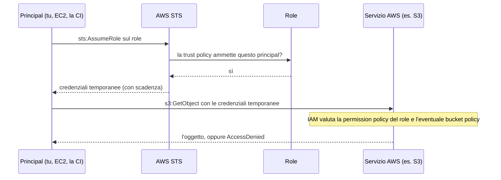
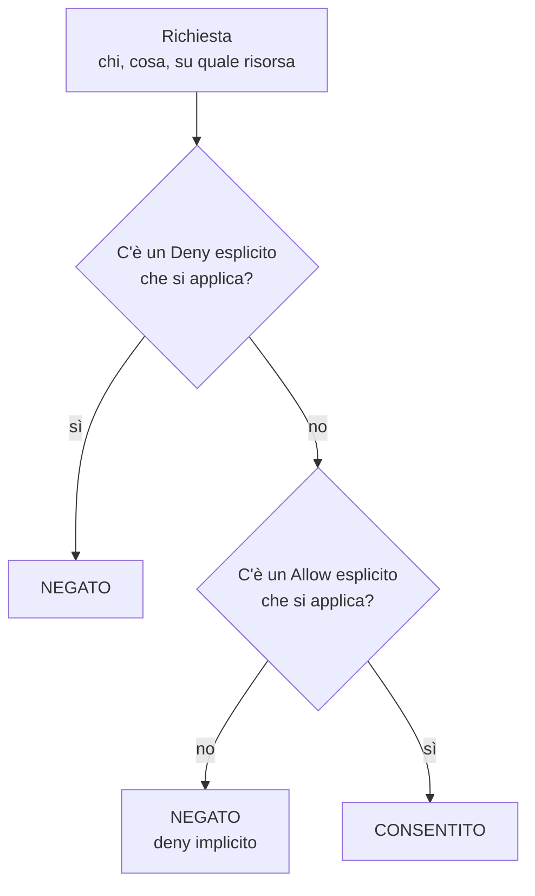
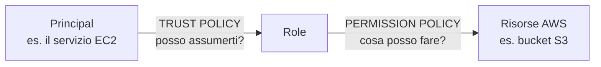

# Dispensa 1 – IAM: chi può fare cosa

*Corso: Infrastruttura AWS con Terraform*

## Obiettivo

Alla fine di questa dispensa sai leggere e scrivere una policy IAM, sai perché una richiesta viene accettata o negata, conosci la differenza tra trust policy e permission policy e sai costruire in Terraform un role con privilegi minimi.

IAM viene prima di reti e server perché **ogni singola chiamata ad AWS passa da IAM**: la console, la CLI, Terraform, un'istanza EC2 che legge da S3. Se IAM non è chiaro, tutto il resto sembra magia.

---

## 1. Il modello mentale

Ogni richiesta ad AWS si riduce a una domanda:

> **Chi** (principal) vuole fare **cosa** (action) su **quale risorsa** (resource), e **a quali condizioni** (condition)?

Esempio: *il role dell'applicazione* vuole fare *s3:GetObject* sull'*oggetto releases/app.zip del bucket artefatti*, *dall'interno del VPC*.

IAM guarda le policy applicabili e risponde **sì** o **no**. Tutto il resto di questa dispensa è il dettaglio di questa domanda.

IAM è un servizio **globale**, non legato a una regione: un role creato vale in tutte le regioni dell'account.

---

## 2. Le identità

| Identità | Credenziali | Quando si usa |
|---|---|---|
| **Utente root** | Email e password dell'account | Quasi mai. Si protegge con MFA, nessuna access key, e si chiude in cassaforte |
| **Utente IAM** | Password e/o access key **permanenti** | Casi residuali. Le chiavi permanenti sono il rischio numero uno |
| **Gruppo IAM** | Nessuna | Contenitore di utenti per assegnare policy in blocco |
| **Role** | Nessuna propria: si **assume** e produce credenziali **temporanee** | Il modo giusto per quasi tutto: servizi AWS, applicazioni, persone |

Per le **persone**, la strada moderna è **IAM Identity Center** (SSO): le persone si autenticano col proprio IdP aziendale, con MFA, e ricevono credenziali temporanee legate a un role. Niente utenti IAM singoli da gestire.

Per le **macchine** (EC2, Lambda, pipeline di CI), si usano **role** assunti dal servizio.

### Come funziona "assumere un role"

1. Un principal chiede al servizio **STS** di assumere un role (`sts:AssumeRole`).
2. STS controlla la **trust policy** del role: questo principal è autorizzato ad assumerlo?
3. Se sì, STS restituisce credenziali temporanee (access key, secret e session token) che scadono dopo un tempo definito (di default un'ora).
4. Con quelle credenziali il principal agisce **come** il role, con i permessi del role.



> **Analogia.** Il role è un badge da visitatore. Non appartiene a nessuno: la reception (STS) lo consegna a chi è sulla lista (trust policy), il badge apre certe porte (permission policy) e a fine giornata smette di funzionare (scadenza).

---

## 3. Anatomia di una policy

Una policy è un documento JSON:

```json
{
  "Version": "2012-10-17",
  "Statement": [
    {
      "Sid": "LetturaRelease",
      "Effect": "Allow",
      "Action": ["s3:GetObject"],
      "Resource": "arn:aws:s3:::corso-artefatti/releases/*",
      "Condition": {
        "StringEquals": { "aws:SourceVpce": "vpce-0abc123" }
      }
    }
  ]
}
```

| Campo | Significato |
|---|---|
| `Version` | Sempre `2012-10-17` (è la versione del linguaggio, non una data da aggiornare) |
| `Sid` | Etichetta descrittiva, facoltativa ma utile |
| `Effect` | `Allow` o `Deny` |
| `Action` | Le API interessate, nel formato `servizio:Azione` |
| `Resource` | Su cosa, identificato dall'**ARN** |
| `Condition` | Vincoli aggiuntivi (rete di provenienza, MFA, tag, regione…) |
| `Principal` | **Chi**: compare solo nelle policy attaccate alle risorse e nelle trust policy |

### Gli ARN

L'ARN (Amazon Resource Name) identifica univocamente una risorsa:

```
arn:aws:s3:::corso-artefatti                 # il bucket
arn:aws:s3:::corso-artefatti/releases/*      # gli oggetti sotto releases/
arn:aws:iam::123456789012:role/app-reader    # un role
```

Attenzione al classico errore su S3: **il bucket e i suoi oggetti sono risorse diverse**. `s3:ListBucket` si applica al bucket (ARN senza `/`), `s3:GetObject` agli oggetti (ARN con `/*`).

---

## 4. I tipi di policy

**Identity-based policy**: attaccata a un'identità (utente, gruppo, role). Dice *cosa può fare questa identità*. Non ha il campo `Principal`, perché il principal è implicito.

- **AWS managed**: scritte da AWS (es. `ReadOnlyAccess`). Comode, ma quasi sempre troppo larghe.
- **Customer managed**: scritte da noi, riutilizzabili su più identità.
- **Inline**: scritte dentro una singola identità, nascono e muoiono con essa.

**Resource-based policy**: attaccata a una risorsa (bucket policy su S3, key policy su KMS, trust policy di un role). Dice *chi può fare cosa su questa risorsa*. Ha il campo `Principal`.

**Perché ci sono due posti?** Perché la risorsa può voler porre condizioni sue. Un bucket può dire "accetto richieste solo da questo VPC endpoint" indipendentemente da quanto siano larghi i permessi di chi chiede.

Nello **stesso account**, di solito basta un `Allow` in uno dei due posti. Tra **account diversi** servono entrambi: l'identità deve essere autorizzata a chiedere e la risorsa deve accettare. (Eccezioni importanti: la trust policy di un role e la key policy di KMS devono sempre autorizzare esplicitamente.)

---

## 5. Come IAM decide: la logica di valutazione

In forma semplificata, tre regole:

1. **Si parte da no.** Tutto è negato di default (*deny implicito*).
2. **Serve un `Allow` esplicito** in una policy applicabile per passare a sì.
3. **Un `Deny` esplicito vince sempre**, qualunque cosa dicano gli altri `Allow`.



Nella realtà ci sono altri livelli che possono solo **restringere** (le SCP di AWS Organizations, i permission boundary, le session policy): se uno di questi non consente l'azione, la richiesta è negata anche se la policy dell'identità dice sì. Si vedono nell'appendice.

**Questa logica spiega il 90% degli AccessDenied.** Quando arriva un errore, la domanda è: manca un Allow, o c'è un Deny da qualche parte? In molti servizi il messaggio di errore oggi lo dice direttamente (per esempio indicando che nessuna policy consente l'azione, oppure che c'è un deny esplicito e in quale tipo di policy).

### Perché scrivere Deny espliciti

Se un'azione non è consentita, è già negata: perché scrivere un Deny? Perché il Deny **protegge dal futuro**. Se domani qualcuno attacca al role una policy larga, il Deny continua a valere. È una cintura di sicurezza sulle azioni che non devono succedere mai, come cancellare gli artefatti di rilascio.

---

## 6. Trust policy vs permission policy

Un role ha **due** policy di natura diversa, ed è l'errore più comune quando si scrive IAM in Terraform:

| | Trust policy | Permission policy |
|---|---|---|
| Domanda | **Chi** può assumere il role? | **Cosa** può fare chi lo assume? |
| Tipo | Resource-based (ha `Principal`) | Identity-based |
| Azione tipica | `sts:AssumeRole` | `s3:GetObject`, `ec2:Describe*`… |
| In Terraform | `assume_role_policy` di `aws_iam_role` | `aws_iam_role_policy` o policy attaccata |



Trust policy per un role usato da EC2:

```json
{
  "Version": "2012-10-17",
  "Statement": [{
    "Effect": "Allow",
    "Principal": { "Service": "ec2.amazonaws.com" },
    "Action": "sts:AssumeRole"
  }]
}
```

Tradotto: "il servizio EC2 può assumere questo role". Per collegarlo davvero a un'istanza serve poi un **instance profile**, che vedremo nella dispensa EC2.

---

## 7. Least privilege nella pratica

Il principio è semplice: **dare solo i permessi necessari, solo sulle risorse necessarie**. In pratica:

- Mai `"Action": "*"` e mai `"Resource": "*"` se non è inevitabile. Alcune azioni (molte `Describe*`, per esempio) non supportano risorse specifiche e richiedono `*`: è normale, ma deve essere l'eccezione.
- Restringere sui **prefissi**: `releases/*` invece di tutto il bucket.
- Usare le **condition** per legare i permessi al contesto (rete, tag, regione).
- Partire stretti e allargare quando serve, non il contrario.

Strumenti che aiutano:

- **IAM Access Analyzer** segnala risorse condivise all'esterno dell'account e può generare una policy a partire dalle azioni effettivamente usate, lette da CloudTrail.
- **Last accessed**: nella console IAM, per ogni role, mostra quali servizi ha davvero usato e quando. Quello che non si usa da mesi si toglie.

---

## 8. IAM in Terraform

### Scrivere le policy: `aws_iam_policy_document`

Si può scrivere il JSON con `jsonencode()`, ma il data source `aws_iam_policy_document` è più leggibile, validato da Terraform e facile da comporre:

```hcl
data "aws_iam_policy_document" "esempio" {
  statement {
    sid       = "LetturaRelease"
    effect    = "Allow"
    actions   = ["s3:GetObject"]
    resources = ["${aws_s3_bucket.demo.arn}/releases/*"]
  }
}

# Si usa con .json
# policy = data.aws_iam_policy_document.esempio.json
```

### Attaccare le policy: attenzione ai nomi simili

| Risorsa | Comportamento |
|---|---|
| `aws_iam_role_policy` | Policy inline dentro il role |
| `aws_iam_policy` + `aws_iam_role_policy_attachment` | Policy gestita, attaccata a un role. **Questa è quella da usare** |
| `aws_iam_policy_attachment` | **Esclusiva**: stacca la policy da tutte le altre identità non elencate. Da evitare, può rompere cose fuori dal progetto |

### Consistenza eventuale

IAM è globale e le modifiche impiegano qualche secondo a propagarsi. Può capitare che un role appena creato non sia ancora assumibile e il primo tentativo fallisca: si riprova dopo pochi secondi. Non è un errore di configurazione.

---

## 9. Esercizio

Obiettivo: creare un role con permessi minimi su un bucket, assumerlo dalla CLI e verificare cosa è consentito, cosa è negato implicitamente e cosa è negato esplicitamente.

Si riparte dal progetto della dispensa 0 (bucket `aws_s3_bucket.demo`).

### iam.tf

```hcl
data "aws_caller_identity" "current" {}

# Un file di esempio da leggere
resource "aws_s3_object" "release" {
  bucket  = aws_s3_bucket.demo.id
  key     = "releases/app-v1.0.txt"
  content = "versione 1.0"
}

# TRUST: chi può assumere il role.
# "...:root" significa: qualunque identità di questo account
# che abbia a sua volta il permesso sts:AssumeRole.
data "aws_iam_policy_document" "trust" {
  statement {
    effect  = "Allow"
    actions = ["sts:AssumeRole"]
    principals {
      type        = "AWS"
      identifiers = ["arn:aws:iam::${data.aws_caller_identity.current.account_id}:root"]
    }
  }
}

# PERMESSI: cosa può fare chi assume il role.
data "aws_iam_policy_document" "reader" {
  statement {
    sid       = "ElencoSoloRelease"
    actions   = ["s3:ListBucket"]
    resources = [aws_s3_bucket.demo.arn]            # il bucket
    condition {
      test     = "StringLike"
      variable = "s3:prefix"
      values   = ["releases/*"]
    }
  }

  statement {
    sid       = "LetturaRelease"
    actions   = ["s3:GetObject"]
    resources = ["${aws_s3_bucket.demo.arn}/releases/*"]   # gli oggetti
  }

  statement {
    sid       = "MaiCancellare"
    effect    = "Deny"
    actions   = ["s3:DeleteObject", "s3:DeleteObjectVersion"]
    resources = ["${aws_s3_bucket.demo.arn}/*"]
  }
}

resource "aws_iam_role" "reader" {
  name                 = "${var.project}-artifact-reader"
  assume_role_policy   = data.aws_iam_policy_document.trust.json
  max_session_duration = 3600
}

resource "aws_iam_policy" "reader" {
  name   = "${var.project}-read-releases"
  policy = data.aws_iam_policy_document.reader.json
}

resource "aws_iam_role_policy_attachment" "reader" {
  role       = aws_iam_role.reader.name
  policy_arn = aws_iam_policy.reader.arn
}

output "reader_role_arn" {
  value = aws_iam_role.reader.arn
}
```

### Configurare la CLI per assumere il role

Dopo `terraform apply`, aggiungi al file `~/.aws/config` un profilo che assume il role partendo dal tuo profilo SSO:

```ini
[profile lab-reader]
role_arn       = <valore di reader_role_arn>
source_profile = corso
```

### Prove

```bash
BUCKET=$(terraform output -raw bucket_name)

# 1. Chi sono adesso?
aws sts get-caller-identity --profile lab-reader
#    Atteso: un ARN "assumed-role/...-artifact-reader/..."

# 2. Lettura del file di release
aws s3 cp s3://$BUCKET/releases/app-v1.0.txt - --profile lab-reader
#    Atteso: "versione 1.0"

# 3. Elenco di releases/
aws s3 ls s3://$BUCKET/releases/ --profile lab-reader
#    Atteso: funziona

# 4. Elenco della radice del bucket
aws s3 ls s3://$BUCKET/ --profile lab-reader
#    Atteso: AccessDenied (la condition limita il prefisso)

# 5. Scrittura
echo test > test.txt
aws s3 cp test.txt s3://$BUCKET/releases/test.txt --profile lab-reader
#    Atteso: AccessDenied, deny IMPLICITO (nessun Allow per PutObject)

# 6. Cancellazione
aws s3 rm s3://$BUCKET/releases/app-v1.0.txt --profile lab-reader
#    Atteso: AccessDenied, deny ESPLICITO
```

### Domande di verifica

1. Confronta i messaggi di errore dei punti 5 e 6: cosa cambia?
2. Aggiungi temporaneamente al role la policy AWS managed `AmazonS3FullAccess` e ripeti i punti 5 e 6. Cosa succede adesso e perché? (Atteso: la scrittura passa, la cancellazione resta negata: il Deny esplicito vince.) Poi togli la policy.
3. Perché al punto 4 viene negato l'elenco della radice ma non la lettura del file?
4. Nella trust policy, cosa cambierebbe se al posto di `...:root` mettessi `Service = "ec2.amazonaws.com"`? Potresti ancora assumere il role dalla CLI?
5. Cerca in CloudTrail (Event history) gli eventi `AssumeRole` e `GetObject` generati dalle prove. Riesci a risalire da chi ha assunto il role a cosa ha fatto?

Alla fine: `terraform destroy`.

---

## Riepilogo

- Ogni richiesta è: **chi** fa **cosa** su **quale risorsa** a **quali condizioni**.
- Per persone e macchine si usano **role** con credenziali **temporanee**, non utenti IAM con chiavi permanenti.
- Default **negato**, serve un **Allow**, un **Deny esplicito vince sempre**.
- Un role ha una **trust policy** (chi lo assume) e una **permission policy** (cosa può fare): sono due cose diverse.
- Su S3, **bucket e oggetti sono risorse diverse**.
- Privilegi **minimi**, ristretti per risorsa, prefisso e condizione.
- In Terraform: `aws_iam_policy_document` per scrivere, `aws_iam_role_policy_attachment` per attaccare, **mai** `aws_iam_policy_attachment`.
