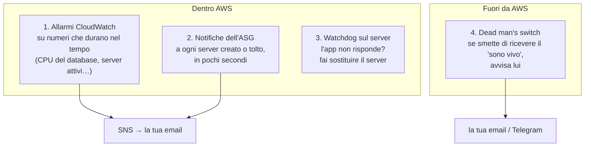
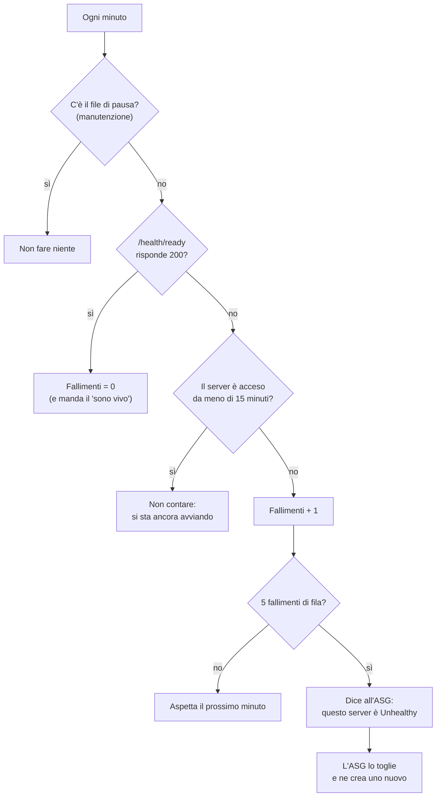

# Dispensa 10 – Allarmi e auto-riparazione

*Corso: Infrastruttura AWS con Terraform*

## Obiettivo

Nella dispensa 9 il server si ricrea da solo se la **macchina** si ferma. Ma restano due buchi: se la macchina è accesa e l'**applicazione** è bloccata, nessuno se ne accorge; e quando qualcosa si rompe (o si ripara da solo), **nessuno lo sa**. Questa dispensa chiude entrambi.

Alla fine di questa dispensa:

- sai cos'è **CloudWatch**: metriche, **allarmi** e log;
- sai mandare gli allarmi per **email** con **SNS**, e ricevere un avviso a ogni server creato o tolto dall'ASG;
- sai cosa tenere d'occhio nel database: CPU, spazio libero, **Performance Insights**, **Enhanced Monitoring**, i **log** di PostgreSQL;
- sai distinguere un controllo di **vita** (*liveness*) da un controllo di **prontezza** (*readiness*);
- sai far sostituire il server quando l'**applicazione** non funziona, con un **watchdog**;
- sai cos'è un **dead man's switch** e perché è l'unico allarme che funziona anche quando è giù tutto.

---

## Prima di iniziare

- Si lavora nella cartella `infra/` di sempre, con tutto quello delle dispense 8 e 9 (`corso-app`, ASG, script di avvio). Questa dispensa aggiunge il file `monitoring.tf` e modifica `rds.tf`, `deploy.tf`, `user_data.sh.tpl` e l'applicazione.
- Serve un indirizzo **email** a cui ricevere gli allarmi.
- Per il dead man's switch (facoltativo) serve un account su un servizio esterno di controllo, per esempio **healthchecks.io** (il piano gratuito basta).
- Rinnova il login: `aws sso login --profile corso`, `export AWS_PROFILE=corso`, `export TAILSCALE_API_KEY=…`.
- **Costi:** gli allarmi e le email hanno un piccolo costo al mese; i log si pagano per quanto se ne scrive e se ne conserva (per questo gli diamo una scadenza); Enhanced Monitoring scrive log ogni minuto. Il livello base di Performance Insights è incluso. A fine esercizio si cancella tutto.

---

## 1. Il problema: rompersi in silenzio

| Cosa si rompe | Chi se ne accorge oggi |
|---|---|
| la macchina si spegne, o l'AZ si ferma | l'ASG, che la sostituisce (dispensa 9). Ma **tu non lo sai** |
| la macchina è accesa, l'applicazione è bloccata (il database non risponde, un errore la tiene appesa) | **nessuno**: per l'ASG va tutto bene |
| il database ha la CPU al massimo da un'ora, o sta finendo lo spazio | **nessuno**, finché non si ferma |
| è giù **tutto**: la regione, l'account, la rete di casa da cui guardi | **nessuno**: anche gli strumenti che dovrebbero avvisarti sono giù |

Le soluzioni sono quattro, a strati:



---

## 2. CloudWatch: metriche, allarmi, log

**CloudWatch** è il servizio AWS di osservazione. Fa tre cose:

| | Cos'è | Esempio |
|---|---|---|
| **Metrica** | un numero che AWS misura di continuo, nel tempo | la CPU del database, minuto per minuto |
| **Allarme** | una regola su una metrica: "se succede questo, per tanto tempo, avvisa" | CPU sopra l'80% per 15 minuti |
| **Log** | righe di testo scritte da un programma, conservate in un **log group** | i messaggi di PostgreSQL |

Molti servizi AWS pubblicano metriche da soli: RDS, EC2, l'ASG (se glielo chiedi). Non devi installare niente.

Un allarme si legge come una frase con quattro parti:

> "Se la **CPU del database** (metrica), in **media** (statistica) su **5 minuti** (periodo), è **sopra 80** (soglia) per **3 periodi di fila** (valutazioni), allora avvisa."

Le **valutazioni** sono il punto più importante: un picco di un minuto è normale, mezz'ora di fila no. Un allarme che suona per ogni picco viene presto ignorato, e un allarme ignorato è peggio di nessun allarme.

Un allarme ha tre stati: **OK**, **ALARM**, e **INSUFFICIENT_DATA** (non ci sono abbastanza dati per decidere). Si può far avvisare sia quando entra in `ALARM` sia quando torna `OK`, così sai anche quando il problema è finito.

---

## 3. SNS: dall'allarme alla tua email

L'allarme non sa mandare email. Pubblica un messaggio su un **topic SNS** (*Simple Notification Service*): una "bacheca" a cui ci si **iscrive**. Chi è iscritto riceve ogni messaggio: un indirizzo email, un numero di telefono, un altro programma.

> **Analogia.** SNS è una **mailing list**: l'allarme scrive alla lista, e la lista inoltra a tutti gli iscritti. Per aggiungere un collega non tocchi gli allarmi: lo iscrivi alla lista.

Una cosa da sapere: quando Terraform iscrive un indirizzo email, AWS manda a quell'indirizzo una mail di **conferma**. Finché non clicchi il link, l'iscrizione resta "in attesa" e non arriva niente. È una protezione contro chi iscrive l'email di altri: Terraform non può confermarla al posto tuo.

---

## 4. Cosa tenere d'occhio

### Il database

| Cosa | Come | Perché |
|---|---|---|
| CPU sopra l'80% per 15 minuti | allarme | il database fatica: query lente, serve una taglia più grande o un indice |
| spazio libero sotto 2 GB | allarme | anche con l'aumento automatico (dispensa 6), arrivare a zero ferma il database |
| **quali query** pesano di più | **Performance Insights** | un grafico che mostra, minuto per minuto, quali query occupano il database. È il primo posto dove guardare quando la CPU sale |
| memoria, processi, disco **del sistema operativo** | **Enhanced Monitoring** | RDS non ha un terminale (dispensa 6): questo è il modo di vedere cosa succede "sotto" PostgreSQL, ogni minuto |
| gli errori e i messaggi di PostgreSQL | **export dei log** in CloudWatch Logs | per leggerli serve la console; esportati, si cercano e si conservano |

Performance Insights (che AWS sta ribattezzando *Database Insights*) ha un livello base incluso, con 7 giorni di storico. Non tutte le taglie di database lo supportano: per questo è una **variabile**, spenta di default. Se vuoi provarlo, mettila a `true` e lancia `apply`: se AWS rifiuta, la tua taglia non lo supporta.

Enhanced Monitoring ha bisogno di un **role**: è RDS stesso (il servizio `monitoring.rds.amazonaws.com`) che scrive le metriche in CloudWatch Logs, e per farlo deve assumere un role con la policy pronta di AWS `AmazonRDSEnhancedMonitoringRole`. È la stessa idea del role del server (dispensa 4), per un servizio diverso.

I **log** esportati finiscono in log group con un nome fisso (`/aws/rds/instance/<nome>/postgresql`). Se non esistono, RDS li crea da solo **senza scadenza**: i log si accumulano e si pagano per sempre. Per questo li creiamo noi con Terraform, prima del database, con una scadenza di **30 giorni**.

### Il server

| Cosa | Come |
|---|---|
| l'ASG ha **zero server** in funzione per 10 minuti di fila | allarme sulla metrica `GroupInServiceInstances` dell'ASG |
| un server è stato **creato**, **tolto**, o non si è riusciti a crearlo | **notifiche dell'ASG**, subito |

Perché due cose diverse? Una sostituzione normale (dispensa 9) dura 5-7 minuti: l'allarme a 10 minuti **non suona**, ed è giusto, perché non c'è niente da fare. Ma così non sapresti nemmeno che è successo. Le **notifiche** ti dicono "il server è stato tolto" e "ne è stato creato uno nuovo" in pochi secondi, ogni volta. L'allarme suona solo se il problema **dura**: per esempio se l'ASG prova a creare un server e fallisce di continuo.

La metrica `GroupInServiceInstances` l'ASG la pubblica solo se glielo chiedi, con `enabled_metrics` (sezione 9).

---

## 5. Vivo non vuol dire pronto: liveness e readiness

Per sapere se l'**applicazione** funziona, le si chiede. Due domande diverse:

| | Domanda | Risposta della nostra app |
|---|---|---|
| **Liveness** (`/health`) | "sei vivo? il programma risponde?" | `200` se il processo risponde, e basta |
| **Readiness** (`/health/ready`) | "sei **pronto** a lavorare? arrivi a tutto ciò che ti serve?" | `200` se riesce a fare una query al database, `503` se no |

> **Analogia.** Liveness è chiedere "sei sveglio?". Readiness è chiedere "sei pronto ad andare al lavoro: vestito, chiavi, auto che parte?". Puoi essere sveglissimo e non poter uscire di casa.

Il controllo di readiness deve essere **veloce** (un timeout di pochi secondi) e **non dire troppo**: risponde `200` o `503`, mai l'indirizzo del database o il testo di un errore, che finirebbero nelle mani di chiunque possa chiamarlo. Gli errori veri si scrivono nei log del server.

---

## 6. Il watchdog: far sostituire il server quando l'app non è pronta

L'ASG controlla solo la macchina (`health_check_type = "EC2"`, dispensa 9). Non c'è un bilanciatore davanti al server che possa controllare l'applicazione al posto suo. Quindi lo fa il server stesso, con un **watchdog** (il "cane da guardia"): uno script che un timer di systemd lancia **ogni minuto**.



I dettagli che contano:

- **15 minuti di tolleranza** dopo l'avvio: al primo avvio il server installa Docker e scarica l'immagine, e l'app non è pronta. Senza tolleranza, il watchdog ucciderebbe ogni server appena nato. La tolleranza vale solo per **contare i fallimenti**: se l'app è già pronta, il controllo va a buon fine anche nei primi 15 minuti.
- **5 fallimenti di fila**, non uno: un singolo errore (un failover del database, dispensa 6) dura un paio di minuti e si risolve da solo. Sostituire il server non servirebbe a niente.
- **Il file di pausa**: prima di una manutenzione che rende l'app "non pronta" apposta (un ripristino del database, per esempio), crei `/etc/app/watchdog-pausa` e il watchdog si ferma. Ricordati di toglierlo dopo.
- Il comando che fa sostituire il server è `aws autoscaling set-instance-health --health-status Unhealthy`. Il server ha il permesso di usarlo **solo sul suo ASG**.

Il watchdog **non è una cura** per i problemi del database: se il database è giù, anche il server nuovo non sarà pronto, e verrà a sua volta sostituito dopo 20 minuti. È fatto per i problemi del **server** (un container bloccato, un disco pieno, una configurazione andata storta), che un server nuovo risolve.

---

## 7. Il dead man's switch: l'allarme che funziona quando è giù tutto

Tutti gli allarmi visti finora vivono **dentro AWS**. Se è giù la regione, o l'account è bloccato, o qualcuno cancella per errore il topic SNS, nessun allarme parte, e tu credi che vada tutto bene.

Il **dead man's switch** ("interruttore dell'uomo morto") rovescia il ragionamento: invece di avvisarti quando qualcosa **si rompe**, un servizio **esterno** si aspetta di ricevere un "sono vivo" ogni minuto, e ti avvisa quando **smette di riceverlo**. Non importa perché: server giù, database giù, regione giù, rete giù. Il silenzio basta.

> **Analogia.** Il nome viene dai treni: il macchinista deve tenere premuto un pedale. Se lo lascia (perché sta male), il treno si ferma da solo. Non serve che qualcuno si accorga del malore: basta che il segnale "ci sono" smetta.

Nel nostro progetto il "sono vivo" lo manda il **watchdog**, solo quando l'app risponde `200` a `/health/ready`: quindi vuol dire "server acceso, app in funzione, database raggiungibile", tutto insieme. Il servizio esterno (per esempio healthchecks.io) ti dà un **indirizzo** da chiamare; lo imposti con un periodo di 1 minuto e una tolleranza di 5. Il "sono vivo" parte appena l'app è pronta, anche su un server appena nato: una sostituzione normale (5-7 minuti di silenzio) non fa scattare l'allarme esterno.

L'indirizzo è un piccolo segreto: chi lo conosce può mandare finti "sono vivo" e nascondere un guasto. Lo teniamo in **Secrets Manager** (dispensa 6), e il server lo legge all'avvio. È facoltativo: se la variabile è vuota, non si crea niente.

---

## 8. Un dettaglio sulla cifratura di SNS

I messaggi di un topic SNS si possono cifrare con KMS. Ma attenzione: con la chiave gestita da AWS (`aws/sns`) gli **allarmi CloudWatch non riescono a pubblicare** sul topic, perché quella chiave non si può modificare per autorizzarli. Serve una chiave **tua** (*customer managed*, dispensa 6), con una key policy che dia il permesso al servizio CloudWatch. Nel corso lasciamo il topic senza cifratura: i messaggi sono avvisi ("CPU alta sul database corso-aws-db"), non dati. La versione con la chiave tua è nell'appendice.

---

## 9. Il codice Terraform

### variables.tf (aggiunte)

```hcl
variable "alert_email" {
  description = "Indirizzo email che riceve gli allarmi"
  type        = string
}

variable "heartbeat_url" {
  description = "Indirizzo del dead man's switch (vuoto = non usato)"
  type        = string
  default     = ""
  sensitive   = true
}

variable "db_performance_insights" {
  description = "Performance Insights sul database (non tutte le taglie lo supportano)"
  type        = bool
  default     = false
}
```

### monitoring.tf

```hcl
# ---------------------------------------------------------------
# La "mailing list" degli allarmi
# ---------------------------------------------------------------

resource "aws_sns_topic" "alerts" {
  name = "${var.project}-alerts"
}

resource "aws_sns_topic_subscription" "email" {
  topic_arn = aws_sns_topic.alerts.arn
  protocol  = "email"
  endpoint  = var.alert_email
}

# ---------------------------------------------------------------
# Allarmi sul database
# ---------------------------------------------------------------

resource "aws_cloudwatch_metric_alarm" "db_cpu" {
  alarm_name          = "${var.project}-db-cpu-alta"
  alarm_description   = "CPU del database sopra l'80% per 15 minuti"
  namespace           = "AWS/RDS"
  metric_name         = "CPUUtilization"
  dimensions          = { DBInstanceIdentifier = aws_db_instance.main.identifier }
  statistic           = "Average"
  period              = 300
  evaluation_periods  = 3
  threshold           = 80
  comparison_operator = "GreaterThanThreshold"
  alarm_actions       = [aws_sns_topic.alerts.arn]
  ok_actions          = [aws_sns_topic.alerts.arn]
}

resource "aws_cloudwatch_metric_alarm" "db_storage" {
  alarm_name          = "${var.project}-db-spazio-basso"
  alarm_description   = "Meno di 2 GB liberi sul database"
  namespace           = "AWS/RDS"
  metric_name         = "FreeStorageSpace"
  dimensions          = { DBInstanceIdentifier = aws_db_instance.main.identifier }
  statistic           = "Minimum"
  period              = 300
  evaluation_periods  = 1
  threshold           = 2 * 1024 * 1024 * 1024 # 2 GB, in byte
  comparison_operator = "LessThanThreshold"
  alarm_actions       = [aws_sns_topic.alerts.arn]
  ok_actions          = [aws_sns_topic.alerts.arn]
}

# ---------------------------------------------------------------
# Allarme e notifiche sul server
# ---------------------------------------------------------------

resource "aws_cloudwatch_metric_alarm" "app_down" {
  alarm_name          = "${var.project}-app-nessun-server"
  alarm_description   = "Nessun server dell'applicazione in funzione per 10 minuti"
  namespace           = "AWS/AutoScaling"
  metric_name         = "GroupInServiceInstances"
  dimensions          = { AutoScalingGroupName = aws_autoscaling_group.app.name }
  statistic           = "Minimum"
  period              = 60
  evaluation_periods  = 10
  threshold           = 1
  comparison_operator = "LessThanThreshold"
  treat_missing_data  = "breaching" # nessun dato = c'è un problema
  alarm_actions       = [aws_sns_topic.alerts.arn]
  ok_actions          = [aws_sns_topic.alerts.arn]
}

resource "aws_autoscaling_notification" "app" {
  group_names = [aws_autoscaling_group.app.name]
  topic_arn   = aws_sns_topic.alerts.arn
  notifications = [
    "autoscaling:EC2_INSTANCE_LAUNCH",
    "autoscaling:EC2_INSTANCE_TERMINATE",
    "autoscaling:EC2_INSTANCE_LAUNCH_ERROR",
    "autoscaling:EC2_INSTANCE_TERMINATE_ERROR",
  ]
}

# ---------------------------------------------------------------
# Database: il role di Enhanced Monitoring e i log group dei log
# ---------------------------------------------------------------

data "aws_iam_policy_document" "rds_monitoring_trust" {
  statement {
    actions = ["sts:AssumeRole"]
    principals {
      type        = "Service"
      identifiers = ["monitoring.rds.amazonaws.com"]
    }
  }
}

resource "aws_iam_role" "rds_monitoring" {
  name               = "${var.project}-rds-monitoring"
  assume_role_policy = data.aws_iam_policy_document.rds_monitoring_trust.json
}

resource "aws_iam_role_policy_attachment" "rds_monitoring" {
  role       = aws_iam_role.rds_monitoring.name
  policy_arn = "arn:aws:iam::aws:policy/service-role/AmazonRDSEnhancedMonitoringRole"
}

resource "aws_cloudwatch_log_group" "db" {
  for_each          = toset(["postgresql", "upgrade"])
  name              = "/aws/rds/instance/${var.project}-db/${each.key}"
  retention_in_days = 30
}

# ---------------------------------------------------------------
# Il watchdog può segnare Unhealthy solo il server del suo ASG
# ---------------------------------------------------------------

data "aws_iam_policy_document" "app_watchdog" {
  statement {
    actions = ["autoscaling:SetInstanceHealth"]
    resources = [
      "arn:aws:autoscaling:${var.region}:${data.aws_caller_identity.current.account_id}:autoScalingGroup:*:autoScalingGroupName/${var.project}-app",
    ]
  }

  statement {
    actions   = ["secretsmanager:GetSecretValue"]
    resources = [aws_secretsmanager_secret.heartbeat.arn]
  }
}

resource "aws_iam_policy" "app_watchdog" {
  name   = "${var.project}-app-watchdog"
  policy = data.aws_iam_policy_document.app_watchdog.json
}

resource "aws_iam_role_policy_attachment" "app_watchdog" {
  role       = aws_iam_role.app.name
  policy_arn = aws_iam_policy.app_watchdog.arn
}

# ---------------------------------------------------------------
# Il dead man's switch (facoltativo): l'indirizzo in Secrets Manager
# ---------------------------------------------------------------

resource "aws_secretsmanager_secret" "heartbeat" {
  name = "${var.project}/heartbeat-url"
}

resource "aws_secretsmanager_secret_version" "heartbeat" {
  secret_id     = aws_secretsmanager_secret.heartbeat.id
  secret_string = var.heartbeat_url != "" ? var.heartbeat_url : "nessuno"
}
```

### rds.tf (aggiunte)

Dentro il blocco `aws_db_instance.main`:

```hcl
  # Osservare il database
  performance_insights_enabled          = var.db_performance_insights
  performance_insights_retention_period = var.db_performance_insights ? 7 : null
  monitoring_interval                   = 60 # Enhanced Monitoring: ogni minuto
  monitoring_role_arn                   = aws_iam_role.rds_monitoring.arn
  enabled_cloudwatch_logs_exports       = ["postgresql", "upgrade"]

  depends_on = [aws_cloudwatch_log_group.db] # prima i log group, con la scadenza
```

### deploy.tf (modifiche)

Nel blocco `aws_autoscaling_group.app`, una riga in più:

```hcl
  enabled_metrics = ["GroupInServiceInstances"] # serve all'allarme app_down
```

Nella mappa di `templatefile` del launch template, un valore in più:

```hcl
    heartbeat_secret_arn = aws_secretsmanager_secret.heartbeat.arn
```

### user_data.sh.tpl (aggiunta in fondo)

```bash
# 6. Il watchdog: ogni minuto controlla /health/ready;
#    dopo 5 fallimenti di fila fa sostituire il server
mkdir -p /var/lib/app-watchdog
touch /var/lib/app-watchdog/avvio

URL=$(aws secretsmanager get-secret-value --secret-id ${heartbeat_secret_arn} \
  --query SecretString --output text)
case "$URL" in
  https://*) echo "$URL" > /etc/app/heartbeat-url; chmod 600 /etc/app/heartbeat-url ;;
esac

cat > /usr/local/bin/app-watchdog <<'SCRIPT'
#!/bin/bash
set -uo pipefail
export AWS_DEFAULT_REGION=${region}
STATO=/var/lib/app-watchdog

[ -f /etc/app/watchdog-pausa ] && exit 0                     # manutenzione

if curl -fs -m 5 -o /dev/null http://127.0.0.1:8080/health/ready; then
  echo 0 > $STATO/fallimenti
  [ -f /etc/app/heartbeat-url ] && curl -fs -m 5 -o /dev/null "$(cat /etc/app/heartbeat-url)"
  exit 0
fi

ETA=$(( $(date +%s) - $(stat -c %Y $STATO/avvio) ))
[ "$ETA" -lt 900 ] && exit 0                     # si sta avviando: non contare

N=$(( $(cat $STATO/fallimenti 2>/dev/null || echo 0) + 1 ))
echo $N > $STATO/fallimenti
echo "app non pronta: fallimento $N di 5"
[ "$N" -lt 5 ] && exit 0

TOKEN=$(curl -fsX PUT http://169.254.169.254/latest/api/token \
  -H "X-aws-ec2-metadata-token-ttl-seconds: 60")
ID=$(curl -fs -H "X-aws-ec2-metadata-token: $TOKEN" \
  http://169.254.169.254/latest/meta-data/instance-id)
echo "5 fallimenti di fila: segno $ID come Unhealthy"
aws autoscaling set-instance-health --instance-id "$ID" --health-status Unhealthy
SCRIPT
chmod 700 /usr/local/bin/app-watchdog

cat > /etc/systemd/system/app-watchdog.service <<'UNIT'
[Unit]
Description=Controlla che l'applicazione sia pronta

[Service]
Type=oneshot
ExecStart=/usr/local/bin/app-watchdog
UNIT

cat > /etc/systemd/system/app-watchdog.timer <<'UNIT'
[Unit]
Description=Ogni minuto: app-watchdog

[Timer]
OnBootSec=1min
OnUnitActiveSec=1min

[Install]
WantedBy=timers.target
UNIT

systemctl daemon-reload
systemctl enable --now app-watchdog.timer
```

### corso-app/app.py (modifica)

Il metodo `do_GET` risponde prima ai due controlli, poi alla pagina:

```python
    def do_GET(self) -> None:
        if self.path == "/health":
            self.rispondi(200, "ok")
            return
        if self.path == "/health/ready":
            try:
                with psycopg.connect(DSN) as conn:
                    conn.execute("SELECT 1")
                self.rispondi(200, "ready")
            except psycopg.Error:
                self.rispondi(503, "not ready")
            return
        try:
            with psycopg.connect(DSN) as conn:
                conn.execute("INSERT INTO visite DEFAULT VALUES")
                visite = conn.execute("SELECT count(*) FROM visite").fetchone()[0]
            self.rispondi(200, f"<h1>Versione {VERSION}</h1><p>Visite: {visite}</p>")
        except psycopg.Error:
            self.rispondi(503, "<h1>Database non raggiungibile</h1>")

    def rispondi(self, codice: int, testo: str) -> None:
        self.send_response(codice)
        self.send_header("Content-Type", "text/html; charset=utf-8")
        self.end_headers()
        self.wfile.write(testo.encode())
```

### Cosa fa questo codice, blocco per blocco

**`aws_sns_topic.alerts`** crea la "mailing list". **`aws_sns_topic_subscription.email`** ci iscrive il tuo indirizzo (`protocol = "email"`): da qui parte la mail di conferma (sezione 3).

**Gli allarmi `aws_cloudwatch_metric_alarm`** sono la frase della sezione 2, scritta a pezzi:

| Argomento | Significato | `db_cpu` |
|---|---|---|
| `namespace`, `metric_name` | quale metrica, di quale servizio | `AWS/RDS`, `CPUUtilization` |
| `dimensions` | di quale risorsa (una mappa) | il nostro database |
| `statistic` | come riassumere i valori di un periodo | `Average`, la media |
| `period` | quanto dura un periodo, in secondi | 300 = 5 minuti |
| `evaluation_periods` | quanti periodi di fila devono superare la soglia | 3 = 15 minuti |
| `threshold`, `comparison_operator` | la soglia e il confronto | sopra 80 |
| `alarm_actions`, `ok_actions` | dove avvisare quando entra in allarme e quando torna OK | il topic SNS |

In `db_storage` la soglia è scritta come un calcolo, `2 * 1024 * 1024 * 1024`: la metrica è in **byte**, e così si legge che sono 2 GB. Lo `statistic` è `Minimum`: conta il momento peggiore del periodo. In `app_down`, `treat_missing_data = "breaching"` dice: se la metrica **non arriva** (per esempio l'ASG non esiste più), consideralo un problema, non "tutto bene".

**`aws_autoscaling_notification.app`** iscrive il topic agli **eventi** dell'ASG: server creato (`LAUNCH`), tolto (`TERMINATE`), e i due errori.

**`aws_iam_role.rds_monitoring`** è il role di Enhanced Monitoring: la trust policy dice "il servizio `monitoring.rds.amazonaws.com` può assumerlo" (come `ec2_trust` per i server, dispensa 4); la policy è quella pronta di AWS. Nota il percorso `service-role/` nell'ARN: alcune policy di AWS stanno in quella "cartella".

**`aws_cloudwatch_log_group.db`** crea i due log group dei log di PostgreSQL, con `for_each` su un insieme di due nomi (`toset`, dispensa 2) e `retention_in_days = 30`: dopo 30 giorni le righe si cancellano da sole. In `rds.tf`, il `depends_on` li fa creare **prima** del database, così RDS trova quelli con la scadenza invece di crearne di suoi senza.

**`data.aws_iam_policy_document.app_watchdog`** dà al server il permesso `SetInstanceHealth` solo sul suo ASG. L'ARN di un ASG contiene un identificativo che AWS sceglie alla creazione: lo sostituiamo con `*` e lasciamo fisso il **nome** dell'ASG. Il secondo statement gli permette di leggere il segreto del dead man's switch, e nessun altro.

**`aws_secretsmanager_secret.heartbeat`** e la sua versione creano **sempre** il segreto, anche se il dead man's switch non lo usi: il valore è l'indirizzo, oppure la parola `nessuno` (un segreto non può essere vuoto). Lo script di avvio usa il valore solo se inizia con `https://`. Così il codice resta uguale in tutti e due i casi. `sensitive = true` sulla variabile dice a Terraform di non mostrarla nel `plan`; il valore finisce comunque nello state, come ogni segreto gestito da Terraform (dispensa 6).

**`db_performance_insights`** è una variabile vero/falso (`bool`), spenta di default. In `rds.tf`, `performance_insights_retention_period` usa il condizionale della dispensa 0: 7 giorni se è accesa, altrimenti `null`, cioè "come se la riga non ci fosse".

**In `deploy.tf`**, `enabled_metrics` chiede all'ASG di pubblicare la metrica dei server in funzione, e lo script riceve l'ARN del segreto del dead man's switch. Lo script lo legge una volta, all'avvio: il comando `case … in https://*)` vuol dire "se il testo inizia con `https://`, scrivilo nel file".

**Lo script `app-watchdog`** è il diagramma della sezione 6. `stat -c %Y` legge l'ora in cui è stato creato il file `avvio`, cioè l'avvio del server: la differenza con l'ora attuale è l'"età" del server in secondi. `curl -f` considera un errore ogni risposta diversa da 2xx, quindi anche il `503` della readiness. Il contatore dei fallimenti sta in un file, perché lo script parte e finisce ogni minuto e non ricorderebbe niente. Quello che lo script scrive con `echo` finisce nel registro di systemd: si legge con `journalctl -u app-watchdog`.

**In `app.py`**, `/health` risponde sempre `ok` se il programma gira; `/health/ready` prova una query minima (`SELECT 1`) e risponde `503` se non riesce, senza dire perché. Il metodo `rispondi` raccoglie le righe che si ripetevano per mandare una risposta.

---

## 10. Esercizio

Obiettivo: ricevere i primi allarmi, poi rompere l'applicazione (non la macchina) e guardare il watchdog sostituire il server da solo.

### Passi

1. **I valori.** In `terraform.tfvars`: `alert_email = "il-tuo@indirizzo"`. Per ora lascia stare `heartbeat_url`.
2. **La nuova versione dell'app.** In `corso-app`, aggiorna `app.py` con i due controlli, commit e push. Quando GitHub ha caricato l'immagine, scrivi il nuovo commit in `image_tag`.
3. **`terraform apply`.** Nel `plan`: il topic e l'iscrizione, i tre allarmi, le notifiche, il role e i log group del database, la policy del watchdog; il database viene **modificato** (non ricreato); lo stampo cambia e il server viene sostituito.
4. **La conferma.** Nella tua casella arriva una mail da *AWS Notifications*: clicca **Confirm subscription**. In console: **SNS → Subscriptions**, lo stato passa da *Pending confirmation* a *Confirmed*. Da questo momento arrivano anche le notifiche dell'ASG: probabilmente ne trovi già una per il server appena sostituito.
5. **I controlli, da casa.** Con Tailscale:

   ```bash
   curl -i http://app.corso.internal:8080/health
   curl -i http://app.corso.internal:8080/health/ready
   ```

   (Atteso: `200 ok` e `200 ready`.)
6. **Un allarme di prova.** Senza aspettare un guasto vero, forza lo stato di un allarme:

   ```bash
   aws cloudwatch set-alarm-state --alarm-name corso-aws-db-cpu-alta \
     --state-value ALARM --state-reason "prova dell'esercizio"
   ```

   (Atteso: entro un minuto, una mail con *ALARM: "corso-aws-db-cpu-alta"*. Poco dopo l'allarme torna `OK` da solo, perché la CPU vera è bassa, e arriva la mail di ritorno.)
7. **Il watchdog in azione.** Entra nel server con SSM. Il server è appena nato, quindi è nei 15 minuti di tolleranza: per non aspettare, "invecchia" il file di avvio. Poi ferma l'applicazione:

   ```bash
   sudo touch -d '20 minutes ago' /var/lib/app-watchdog/avvio
   sudo docker compose --project-directory /etc/app stop app
   sudo journalctl -u app-watchdog -f
   ```

   (Atteso: ogni minuto una riga *app non pronta: fallimento 1 di 5*, poi 2, 3… al quinto *segno i-… come Unhealthy*. La sessione si chiude quando il server viene tolto. Dalla mail: *Terminating EC2 instance*, poi *Launching a new EC2 instance*. Dopo qualche minuto, `curl` da casa funziona di nuovo.)

   Perché `restart: always` (dispensa 9) non ha fatto ripartire il container? Perché lo hai fermato **tu**, a mano: docker compose rispetta la scelta. È proprio il caso di un'app "bloccata" che nessun altro meccanismo avrebbe risolto.
8. **La pausa.** Sul server nuovo, crea `/etc/app/watchdog-pausa` (`sudo touch …`), invecchia il file di avvio e ferma di nuovo l'app come al passo 7. Guarda `journalctl -u app-watchdog` per 6-7 minuti: nessun fallimento contato. Togli il file di pausa (`sudo rm …`) e riavvia l'app: `sudo docker compose --project-directory /etc/app start app`.
9. **Il database.** In console: **RDS → corso-aws-db → Monitoring**: le metriche di CPU e memoria, e i grafici di Enhanced Monitoring (*OS metrics*). Se hai acceso `db_performance_insights`, apri **Performance Insights** (o *Database Insights*): fai qualche `curl` da casa e guarda comparire la query `INSERT INTO visite`. Infine **CloudWatch → Log groups → /aws/rds/instance/corso-aws-db/postgresql**: i messaggi di PostgreSQL, con la scadenza di 30 giorni.
10. **Il dead man's switch** (facoltativo). Su healthchecks.io crea un controllo con periodo **1 minuto** e tolleranza **5 minuti**, e copia il suo indirizzo. In `terraform.tfvars`: `heartbeat_url = "https://hc-ping.com/…"`, poi `terraform apply` (il server viene sostituito per leggere il segreto). Dopo qualche minuto il controllo diventa verde. Ora ferma l'app come al passo 7, **con** il file di pausa (così il watchdog non sostituisce il server): dopo circa 6 minuti healthchecks.io ti manda la mail "down". Nessun allarme di AWS è stato coinvolto. Togli la pausa e riavvia l'app: torna verde.
11. **Pulizia.** Come nella dispensa 9: `db_deletion_protection = false`, `apply`, `destroy`, e cancella lo snapshot finale. Se hai usato healthchecks.io, metti in pausa il controllo, altrimenti ti avviserà che è tutto giù (ed è vero).

### Domande di verifica

1. Perché un allarme valuta **più periodi di fila** invece di suonare al primo valore oltre la soglia?
2. Una sostituzione normale del server non fa suonare l'allarme `app_down`. Come fai, allora, a sapere che è successa?
3. Che differenza c'è tra `/health` e `/health/ready`? Quale dei due usa il watchdog, e perché?
4. Perché il watchdog aspetta 15 minuti dopo l'avvio, e 5 fallimenti di fila?
5. Il database è giù da un'ora. Cosa fa il watchdog, e perché non risolve il problema?
6. Perché il dead man's switch sta **fuori** da AWS? Quale guasto scopre che nessun allarme CloudWatch potrebbe scoprire?
7. Perché creiamo noi i log group di RDS, invece di lasciarli creare a lui?

---

## Riepilogo

- **CloudWatch**: **metriche** (numeri nel tempo), **allarmi** (soglia, periodo, valutazioni di fila) e **log**. Un buon allarme suona per i problemi che **durano**, non per i picchi.
- **SNS** è la mailing list degli allarmi: si iscrive un'email, che va **confermata**.
- Nel database: allarmi su **CPU** e **spazio libero**; **Performance Insights** per le query, **Enhanced Monitoring** per il sistema sotto PostgreSQL (con un role per il servizio), **log esportati** in log group creati da noi, con scadenza.
- Sul server: allarme se non c'è **nessun server per 10 minuti**, e **notifiche dell'ASG** a ogni server creato o tolto.
- **Liveness** (`/health`: sei vivo?) e **readiness** (`/health/ready`: sei pronto, arrivi al database?).
- Il **watchdog** controlla la readiness ogni minuto e, dopo 15 minuti di tolleranza e 5 fallimenti di fila, chiede all'ASG di **sostituire il server**. Si mette in **pausa** per la manutenzione.
- Il **dead man's switch**, fuori da AWS, avvisa quando smette di ricevere il "sono vivo": l'unico allarme che funziona anche quando è giù tutto.
