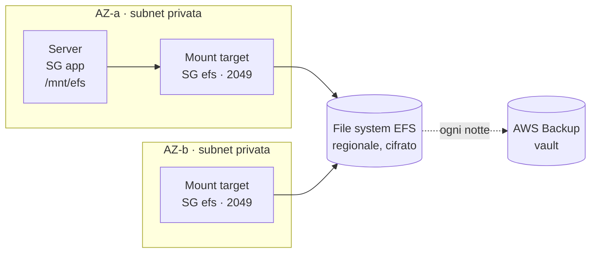

# Dispensa 10 (facoltativa) – File condivisi e backup: EFS e AWS Backup

*Corso: Infrastruttura AWS con Terraform*

## Obiettivo

Dalla dispensa 8 il server è "bestiame": niente di unico deve vivere sul suo disco. I dati stanno nel database, i file di deploy in S3. Ma molte applicazioni scrivono anche dei **file**: immagini caricate dagli utenti, documenti, allegati. Sul disco del server sparirebbero alla prima sostituzione. Questa dispensa, facoltativa, dà ai file un posto che sopravvive al server, e un **backup** gestito in un posto solo.

Alla fine di questa dispensa:

- sai scegliere tra **EBS**, **EFS** e **S3** per i file di un'applicazione;
- sai creare un file system **EFS** su più AZ, cifrato, raggiungibile solo dal server e solo in TLS;
- sai cos'è un **access point** e perché si usa;
- sai **montare** EFS sul server all'avvio e passarlo al container;
- sai fare backup automatici con **AWS Backup** (vault, piano, selezione) e **ripristinare** un file cancellato.

---

## Prima di iniziare

- Serve tutto quello della dispensa 8 (ASG, script di avvio). La dispensa 9 non è necessaria.
- Si lavora nella cartella `infra/`: questa dispensa aggiunge `storage.tf` e `backup.tf` e modifica `user_data.sh.tpl`, `deploy.tf` e `deploy/docker-compose.yml`.
- Rinnova il login: `aws sso login --profile corso`, `export AWS_PROFILE=corso`, `export TAILSCALE_API_KEY=…`.
- **Costi:** EFS si paga per lo spazio occupato (poco, con pochi file; i file non toccati da 30 giorni passano a una classe più economica); i backup si pagano per lo spazio che occupano. A fine esercizio si cancella tutto.

---

## 1. Dove mettere i file: EBS, EFS o S3

| | **EBS** (il disco del server) | **EFS** (una cartella di rete) | **S3** (un magazzino di oggetti) |
|---|---|---|---|
| Come lo vede l'app | una cartella normale | **una cartella normale** | non è una cartella: si usa con le sue API (`PutObject`, `GetObject`) |
| Chi lo può usare | **un** server alla volta, nella sua AZ | **più server**, in **tutte** le AZ | chiunque abbia il permesso |
| Se il server viene sostituito | il disco sparisce con lui (dispensa 8) | **resta** | **resta** |
| Va bene per | il sistema operativo, le immagini Docker | file di un'app che usa cartelle normali | file serviti o scaricati via API, archivi, artefatti (dispensa 7) |

> **Analogia.** EBS è il **cassetto della scrivania**: comodo, ma se cambi scrivania resta lì. EFS è l'**armadio condiviso dell'ufficio**: ci arrivi da qualunque scrivania, anche da un altro piano. S3 è il **magazzino esterno**: ci tieni moltissimo, ma per prendere una cosa compili un modulo.

Se stai scrivendo tu l'applicazione, per i file degli utenti S3 è spesso la scelta migliore. EFS serve quando l'applicazione (o una libreria che usa) vuole una **cartella**, e cambiarla non è possibile o non conviene. È il caso di questa dispensa.

---

## 2. EFS: una cartella di rete su più AZ

**EFS** (*Elastic File System*) è un file system di rete, gestito da AWS. Il server lo "monta" (lo collega a una sua cartella, per esempio `/mnt/efs`) e da lì in poi lo usa come una cartella qualunque. Sotto, i file viaggiano in rete con il protocollo **NFS**, sulla porta **2049**.

Le parole che servono:

| Parola | Cos'è |
|---|---|
| **File system** | il contenitore dei file. È **regionale**: i dati sono copiati su più AZ, e non si perdono se un'AZ si ferma |
| **Mount target** | la "presa" del file system in una subnet: un indirizzo IP a cui i server si collegano. **Uno per AZ**, nelle subnet private, così il server lo trova nella sua AZ, qualunque essa sia |
| **Access point** | un "ingresso" al file system con regole fisse: quale **cartella** si vede come radice e con quale **utente** si scrive (sezione 3) |
| **Montare** | collegare il file system a una cartella del server |

Le protezioni, le stesse idee delle dispense precedenti:

- **rete**: un Security Group `efs` che accetta la 2049 **solo dal SG `app`** (dispensa 3), e una regola in uscita sul SG `app` verso il SG `efs`;
- **cifratura dei dati fermi**: `encrypted = true`, con la chiave di AWS (dispensa 6);
- **cifratura in viaggio**: il server monta con l'opzione `tls`; e una **file system policy** (una resource-based policy, dispensa 1) **rifiuta** ogni connessione non cifrata, come la bucket policy della dispensa 7;
- **chi può montare**: la stessa policy permette di montare e scrivere **solo al role del server**; il server monta con l'opzione `iam`, cioè presentando le credenziali del suo role.



Se il server viene ricreato nell'AZ-b, monta lo stesso file system attraverso il mount target dell'AZ-b, e trova gli stessi file.

---

## 3. L'access point: un ingresso con regole fisse

I file su un file system hanno un **proprietario** (un numero di utente, *uid*, e di gruppo, *gid*) e dei **permessi**, come su ogni Linux. Se il server scrivesse come `root`, e domani un altro programma scrivesse come un altro utente, i permessi diventerebbero presto un groviglio.

Un **access point** fissa le regole all'ingresso:

- **la radice**: chi entra dall'access point vede come "inizio" del file system la cartella `/files`, e non può uscirne;
- **l'utente**: ogni file scritto da lì appartiene all'utente `1000`, gruppo `1000`, chiunque lo scriva dal lato del server (anche `root`);
- **la creazione**: se la cartella `/files` non esiste ancora, la crea, con quel proprietario e quei permessi.

> **Analogia.** Un access point è un **ingresso riservato** dell'armadio condiviso: da lì vedi solo il tuo scaffale, e tutto quello che ci metti porta automaticamente la tua etichetta.

---

## 4. AWS Backup: i backup in un posto solo

Il database ha i suoi backup automatici (dispensa 6). Per EFS, e in generale per tutto ciò che va salvato, AWS offre **AWS Backup**: un servizio che fa i backup di molte risorse diverse (EFS, dischi EBS, database…) con **regole scritte in un posto solo**.

| Parola | Cos'è | Analogia |
|---|---|---|
| **Vault** | il "caveau" in cui si conservano i backup (*recovery point*), cifrati | la cassaforte |
| **Piano** (*backup plan*) | le regole: **quando** fare il backup e **quanto** tenerlo | il calendario |
| **Selezione** | **quali** risorse il piano salva | la lista delle cose da mettere in cassaforte |
| **Role** | i permessi con cui AWS Backup legge le risorse e ripristina | il badge dell'addetto |

Il nostro piano: un backup **ogni notte** alle 2 (ora UTC), tenuto **35 giorni**. Nella selezione mettiamo il file system EFS. Si potrebbe aggiungere anche il database, per tenere i suoi backup più a lungo dei 35 giorni massimi di RDS o copiarli in un'altra regione: basta aggiungere il suo ARN alla selezione.

Un backup che non si è mai provato a ripristinare **non è un backup**, è una speranza. Per questo l'esercizio finisce con un ripristino.

Due cose da sapere:

- EFS ha anche un interruttore semplice, `aws_efs_backup_policy`, che lo affida a un piano di AWS Backup già pronto. È comodo, ma non decidi tu orari e durata: qui scriviamo il nostro piano;
- un vault si può **bloccare** (*Vault Lock*): nessuno, nemmeno l'amministratore, può cancellare i backup prima della scadenza. È la difesa contro chi, entrato nell'account, vuole distruggere anche i backup. Non lo usiamo in laboratorio, perché poi non si potrebbe pulire.

---

## 5. Il codice Terraform

### storage.tf

```hcl
# ---------------------------------------------------------------
# Il firewall: la 2049 (NFS) solo dal server dell'applicazione
# ---------------------------------------------------------------

resource "aws_security_group" "efs" {
  name        = "${var.project}-efs"
  description = "File system EFS"
  vpc_id      = aws_vpc.main.id
}

resource "aws_vpc_security_group_ingress_rule" "efs_from_app" {
  security_group_id            = aws_security_group.efs.id
  description                  = "NFS dal server dell'applicazione"
  ip_protocol                  = "tcp"
  from_port                    = 2049
  to_port                      = 2049
  referenced_security_group_id = aws_security_group.app.id
}

resource "aws_vpc_security_group_egress_rule" "app_to_efs" {
  security_group_id            = aws_security_group.app.id
  description                  = "NFS verso EFS"
  ip_protocol                  = "tcp"
  from_port                    = 2049
  to_port                      = 2049
  referenced_security_group_id = aws_security_group.efs.id
}

# ---------------------------------------------------------------
# Il file system, una presa per AZ, l'ingresso per l'app
# ---------------------------------------------------------------

resource "aws_efs_file_system" "files" {
  creation_token  = "${var.project}-files"
  encrypted       = true
  throughput_mode = "elastic"

  lifecycle_policy {
    transition_to_ia = "AFTER_30_DAYS" # i file non toccati costano meno
  }

  tags = { Name = "${var.project}-files" }
}

resource "aws_efs_mount_target" "files" {
  for_each        = aws_subnet.private
  file_system_id  = aws_efs_file_system.files.id
  subnet_id       = each.value.id
  security_groups = [aws_security_group.efs.id]
}

resource "aws_efs_access_point" "app" {
  file_system_id = aws_efs_file_system.files.id

  posix_user {
    uid = 1000
    gid = 1000
  }

  root_directory {
    path = "/files"
    creation_info {
      owner_uid   = 1000
      owner_gid   = 1000
      permissions = "755"
    }
  }
}

# ---------------------------------------------------------------
# La file system policy: solo TLS, e solo il role del server
# ---------------------------------------------------------------

data "aws_iam_policy_document" "efs" {
  statement {
    sid       = "SoloTLS"
    effect    = "Deny"
    actions   = ["*"]
    resources = [aws_efs_file_system.files.arn]
    principals {
      type        = "*"
      identifiers = ["*"]
    }
    condition {
      test     = "Bool"
      variable = "aws:SecureTransport"
      values   = ["false"]
    }
  }

  statement {
    sid       = "SoloIlServer"
    actions   = ["elasticfilesystem:ClientMount", "elasticfilesystem:ClientWrite"]
    resources = [aws_efs_file_system.files.arn]
    principals {
      type        = "AWS"
      identifiers = [aws_iam_role.app.arn]
    }
  }
}

resource "aws_efs_file_system_policy" "files" {
  file_system_id = aws_efs_file_system.files.id
  policy         = data.aws_iam_policy_document.efs.json
}
```

### backup.tf

```hcl
# ---------------------------------------------------------------
# Il caveau, il role di AWS Backup, il piano e la selezione
# ---------------------------------------------------------------

resource "aws_backup_vault" "main" {
  name          = "${var.project}-backup"
  force_destroy = true # solo laboratorio: il destroy cancella anche i backup
}

data "aws_iam_policy_document" "backup_trust" {
  statement {
    actions = ["sts:AssumeRole"]
    principals {
      type        = "Service"
      identifiers = ["backup.amazonaws.com"]
    }
  }
}

resource "aws_iam_role" "backup" {
  name               = "${var.project}-backup"
  assume_role_policy = data.aws_iam_policy_document.backup_trust.json
}

resource "aws_iam_role_policy_attachment" "backup" {
  for_each = toset([
    "arn:aws:iam::aws:policy/service-role/AWSBackupServiceRolePolicyForBackup",
    "arn:aws:iam::aws:policy/service-role/AWSBackupServiceRolePolicyForRestores",
  ])
  role       = aws_iam_role.backup.name
  policy_arn = each.value
}

resource "aws_backup_plan" "main" {
  name = "${var.project}-ogni-notte"

  rule {
    rule_name         = "ogni-notte"
    target_vault_name = aws_backup_vault.main.name
    schedule          = "cron(0 2 * * ? *)" # ogni giorno alle 02:00 UTC

    lifecycle {
      delete_after = 35 # giorni
    }
  }
}

resource "aws_backup_selection" "files" {
  name         = "file-system"
  plan_id      = aws_backup_plan.main.id
  iam_role_arn = aws_iam_role.backup.arn
  resources    = [aws_efs_file_system.files.arn]
}
```

### user_data.sh.tpl (aggiunta, prima del passo 4)

```bash
# 3b. Il file system condiviso, montato in /mnt/efs
dnf install -y amazon-efs-utils
mkdir -p /mnt/efs
LINEA="${efs_id}:/ /mnt/efs efs _netdev,tls,iam,accesspoint=${efs_ap_id} 0 0"
echo "$LINEA" >> /etc/fstab
mount /mnt/efs
```

### deploy.tf (modifiche)

Nella mappa di `templatefile`, due valori in più:

```hcl
    efs_id    = aws_efs_file_system.files.id
    efs_ap_id = aws_efs_access_point.app.id
```

E nel blocco `aws_autoscaling_group.app`, perché il server non nasca prima che le prese siano pronte:

```hcl
  depends_on = [aws_efs_mount_target.files]
```

### deploy/docker-compose.yml (aggiunta)

Nella lista `volumes` del servizio `app`:

```yaml
      - /mnt/efs:/app/files
```

### outputs.tf (aggiunte)

```hcl
output "efs_id" {
  value = aws_efs_file_system.files.id
}

output "backup_role_arn" {
  value = aws_iam_role.backup.arn
}
```

### Cosa fa questo codice, blocco per blocco

**Il Security Group `efs` e le due regole** sono lo schema della dispensa 3: in ingresso, la 2049 solo da chi ha il SG `app`; e sul SG `app` una regola **in uscita** verso il SG `efs`, perché dalla dispensa 3 il server esce solo dove glielo diciamo (443 e il database).

**`aws_efs_file_system.files`** crea il file system. `creation_token` è un nome unico che evita di crearne due uguali per sbaglio. `encrypted = true` lo cifra con la chiave di AWS. `throughput_mode = "elastic"` vuol dire "la velocità si adatta da sola a quanto lo usi", la scelta più semplice. Il blocco `lifecycle_policy` (da non confondere con il `lifecycle` di Terraform) sposta i file non letti da 30 giorni nella classe **IA** (*Infrequent Access*), più economica; tornano normali alla prima lettura.

**`aws_efs_mount_target.files`** crea una presa per ogni subnet privata, con `for_each` sulla mappa `aws_subnet.private` della dispensa 2: `each.value.id` è l'ID di ogni subnet. Ogni presa indossa il SG `efs`.

**`aws_efs_access_point.app`** è l'ingresso della sezione 3: `posix_user` fissa l'utente con cui si scrive, `root_directory` la cartella che diventa la radice, e `creation_info` dice con quale proprietario e permessi crearla se manca. `"755"` vuol dire: il proprietario legge e scrive, gli altri leggono.

**`data.aws_iam_policy_document.efs`** è la file system policy, con due regole. La prima è la sorella della bucket policy della dispensa 7: **Deny** a chiunque, se `aws:SecureTransport` è `false`. La seconda è un **Allow** al solo role del server, per due azioni: `ClientMount` (montare, leggere) e `ClientWrite` (scrivere). Siccome la policy esiste, chi non è nominato **non** può montare. **`aws_efs_file_system_policy`** la attacca al file system.

**`aws_backup_vault.main`** crea il caveau. `force_destroy = true`, come per il bucket e il repository della dispensa 7, permette al `destroy` di cancellarlo anche se contiene backup: solo in laboratorio.

**`aws_iam_role.backup`** è il role con cui lavora AWS Backup: la trust policy lo concede al servizio `backup.amazonaws.com`, e le due policy pronte di AWS danno i permessi per fare i backup e per ripristinarli. Con `for_each` su un insieme di due ARN creiamo i due attachment con un solo blocco.

**`aws_backup_plan.main`** è il piano. `schedule` è un'**espressione cron**, il modo classico di scrivere un orario ricorrente: `cron(minuti ore giorno-del-mese mese giorno-della-settimana anno)`. `cron(0 2 * * ? *)` vuol dire "al minuto 0 delle ore 2, ogni giorno" (`*` = qualunque; `?` = "non specificato", obbligatorio in uno dei due campi dei giorni). `delete_after = 35`: ogni backup si cancella da solo dopo 35 giorni.

**`aws_backup_selection.files`** collega il piano alle risorse da salvare (`resources`, una lista di ARN) e al role con cui farlo.

**L'aggiunta allo script di avvio** installa `amazon-efs-utils`, il pacchetto di AWS che sa montare EFS con TLS e IAM, e scrive una riga in `/etc/fstab`, il file che elenca cosa montare all'avvio. La riga si legge: "il file system `fs-…`, dalla sua radice (`:/`), in `/mnt/efs`, di tipo `efs`, con queste opzioni". `_netdev` vuol dire "aspetta che la rete sia pronta"; `tls` cifra il traffico; `iam` presenta le credenziali del role; `accesspoint=fsap-…` entra dall'access point. `mount /mnt/efs` lo monta subito. Il server, ricreato, rifà tutto da solo.

**In `deploy.tf`**, `depends_on` fa creare l'ASG **dopo** le prese: senza, Terraform potrebbe creare il server mentre i mount target non sono ancora pronti, e il `mount` fallirebbe. **Nel compose**, la riga in `volumes` rende `/mnt/efs` visibile nel container come `/app/files`.

---

## 6. Esercizio

Obiettivo: verificare che i file sopravvivono al server, fare un backup e ripristinare un file cancellato.

### Passi

1. **`terraform apply`.** Nel `plan`: il SG `efs` e due regole, il file system, due mount target, l'access point, la policy, il vault, il role con due attachment, il piano, la selezione; lo stampo cambia e il server viene sostituito.
2. **Il file system sul server.** Entra nel nuovo server con SSM:

   ```bash
   df -h /mnt/efs
   echo "scritto il $(date)" | sudo tee /mnt/efs/prova.txt
   ls -ln /mnt/efs
   ```

   (Atteso: `/mnt/efs` è un file system grande "8.0E", cioè praticamente senza limite; il file appartiene a `1000 1000` anche se l'hai scritto con `sudo`: è l'access point.) Controlla anche dal container: `sudo docker compose --project-directory /etc/app exec app ls /app/files`.
3. **Il file sopravvive al server.** Termina il server dalla console (come nella dispensa 8). Quando l'ASG ne ha creato un altro, entra e lancia `cat /mnt/efs/prova.txt`. (Atteso: il file c'è, anche se magari il server è nato nell'altra AZ.)
4. **Senza TLS e senza role non si entra.** Sul server, prova a montare il file system "a mano", come un normale disco di rete NFS, **senza** l'aiuto di `amazon-efs-utils`: quindi senza TLS e senza presentare il role. L'ID del file system lo trovi con `grep efs /etc/fstab` (inizia con `fs-`):

   ```bash
   sudo mkdir -p /mnt/prova
   sudo mount -t nfs4 -o nfsvers=4.1 <fs-…>.efs.eu-south-1.amazonaws.com:/ /mnt/prova
   ```

   (Atteso: rifiutato, *access denied*. La file system policy rifiuta il traffico non cifrato, e comunque lascia entrare solo il role del server. Con `amazon-efs-utils` non si potrebbe nemmeno provare: le opzioni `iam` e `accesspoint` funzionano solo insieme a `tls`.)

5. **Un backup subito**, senza aspettare la notte. Dal tuo computer:

   ```bash
   aws backup start-backup-job --backup-vault-name corso-aws-backup \
     --resource-arn "$(aws efs describe-file-systems --file-system-id "$(terraform output -raw efs_id)" \
       --query 'FileSystems[0].FileSystemArn' --output text)" \
     --iam-role-arn "$(terraform output -raw backup_role_arn)"
   ```

   In console, **AWS Backup → Jobs**: lo stato passa da *Running* a *Completed* in qualche minuto.
6. **Cancella il file.** Sul server: `sudo rm /mnt/efs/prova.txt`.
7. **Ripristinalo.** In console: **AWS Backup → Vaults → corso-aws-backup**, apri il *recovery point* appena creato → **Restore**. Scegli **Item-level restore**, percorso `/files/prova.txt`, e ripristino nello **stesso** file system. AWS Backup rimette il file in una cartella nuova, alla radice del file system, chiamata `aws-backup-restore_…`. Quella cartella sta **fuori** dalla radice dell'access point, quindi da `/mnt/efs` non si vede: per prenderla, monta per un attimo l'intero file system (con TLS) e copia il file al suo posto:

   ```bash
   sudo mkdir -p /mnt/efs-tutto
   sudo mount -t efs -o tls,iam <fs-…>:/ /mnt/efs-tutto
   ls /mnt/efs-tutto
   sudo cp /mnt/efs-tutto/aws-backup-restore_*/files/prova.txt /mnt/efs/
   sudo umount /mnt/efs-tutto
   cat /mnt/efs/prova.txt
   ```

   (Atteso: il file è tornato, con il testo originale.)
8. **Pulizia.** Come nella dispensa 8: `db_deletion_protection = false`, `apply`, `destroy`, cancella lo snapshot finale del database. Il vault, grazie a `force_destroy`, viene cancellato con i suoi backup.

### Domande di verifica

1. Perché i file caricati dagli utenti non possono stare sul disco del server, dalla dispensa 8 in poi? Quando sceglieresti EFS e quando S3?
2. Perché un mount target per ogni AZ?
3. Cosa fa un access point? Cosa succederebbe senza, se due programmi scrivessero con utenti diversi?
4. Il file system ha due protezioni contro chi non dovrebbe montarlo. Quali? E contro chi lo monta senza TLS?
5. Cosa vuol dire `cron(0 2 * * ? *)`? Come scriveresti "ogni domenica alle 3"?
6. Perché si dice che un backup mai ripristinato "non è un backup"?

---

## Riepilogo

- I file di un'app non possono stare sul disco di un server "bestiame". **EFS** è una cartella di rete, regionale, condivisa tra server e AZ; **S3** è la scelta quando l'app usa le API invece delle cartelle.
- EFS: un **file system** cifrato, un **mount target** per AZ nelle subnet private, un **SG** che apre la 2049 solo al server, e una **file system policy** che rifiuta il traffico non cifrato e lascia montare solo il role del server.
- L'**access point** fissa la cartella radice e l'utente con cui si scrive.
- Il server monta EFS all'avvio (`/etc/fstab`, opzioni `tls`, `iam`, `accesspoint`) e lo passa al container.
- **AWS Backup**: un **vault** (il caveau), un **piano** (ogni notte, 35 giorni), una **selezione** (cosa salvare), un **role**. Un backup va **provato**: l'esercizio ripristina un file cancellato.
