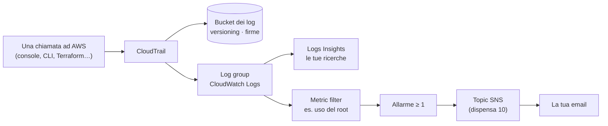
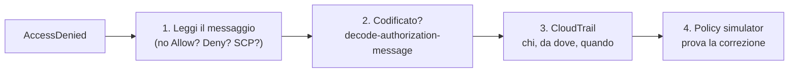

# Dispensa 12 – CloudTrail: chi ha fatto cosa

*Corso: Infrastruttura AWS con Terraform*

## Obiettivo

"Chi ha cancellato quel bucket?", "chi ha aperto la porta 22 nel Security Group?", "perché mi dà AccessDenied?". Sono le domande più frequenti nel lavoro di tutti i giorni su AWS, e la risposta sta sempre nello stesso posto: **CloudTrail**, il registro di tutto quello che succede nell'account. In questa dispensa impariamo a leggerlo, a conservarlo come si deve, e a farci avvisare quando registra qualcosa di pericoloso. È anche la base della dispensa 13: GuardDuty legge proprio questo registro.

Alla fine di questa dispensa:

- sai cosa registra CloudTrail: **eventi di gestione**, **data event** e **Insights**;
- sai **leggere un evento** e risalire alla **persona** che ha agito, anche dietro un role;
- sai cercare nell'**Event history**, dalla console e dalla CLI;
- sai creare un **trail** fatto bene: tutte le regioni, bucket protetto, **firme** verificabili;
- sai **cercare** negli eventi con CloudWatch Logs Insights;
- sai farti avvisare per email degli eventi pericolosi: uso del root, login senza MFA, modifiche a IAM e ai Security Group, CloudTrail toccato;
- sai **diagnosticare un AccessDenied** in quattro passi.

---

## Prima di iniziare

- Si lavora nella cartella `infra/` di sempre, con il progetto fino alla dispensa 10: serve il topic SNS degli allarmi (dispensa 10). Questa dispensa aggiunge il file `cloudtrail.tf`.
- Rinnova il login: `aws sso login --profile corso`, `export AWS_PROFILE=corso`, `export TAILSCALE_API_KEY=…`.
- **Costi:** l'Event history e la **prima copia** degli eventi di gestione in un trail sono incluse; i **data event** si pagano per numero di eventi; i log occupano spazio in S3 e in CloudWatch Logs; ogni allarme ha un piccolo costo al mese. A fine esercizio si cancella tutto.

---

## 1. Cosa registra CloudTrail

Ogni volta che qualcuno, o qualcosa, chiede qualcosa ad AWS (dalla console, dalla CLI, da Terraform, da un server con il suo role), la richiesta passa da un'**API**. CloudTrail scrive una riga per ogni chiamata: un **evento**.

> **Analogia.** CloudTrail è il **registro delle visite** alla reception, scritto da un notaio: chi è entrato, a che ora, da quale porta, cosa ha chiesto, e se gli è stato detto di sì o di no. Non si può strappare una pagina senza che si veda.

Gli eventi sono di tre tipi:

| Tipo | Cosa | Esempi | Registrato… |
|---|---|---|---|
| **Eventi di gestione** | creare, modificare, cancellare, leggere la **configurazione** delle risorse | `CreateBucket`, `AuthorizeSecurityGroupIngress`, `AssumeRole`, `ConsoleLogin` | **sempre**, gratis, 90 giorni nell'Event history |
| **Data event** | le operazioni **sui dati** dentro le risorse | `GetObject`, `PutObject` su S3; `GetSecretValue`… | solo se li chiedi, in un **trail**; si pagano per numero |
| **Insights** | **anomalie**: un'API chiamata molto più spesso del solito, o con molti più errori | 300 `DeleteObject` in un minuto, quando di solito sono 2 | solo se li accendi; si pagano a parte |

CloudTrail è **regionale** come quasi tutto in AWS, con un'eccezione: gli eventi dei servizi **globali** (IAM, il login in console) compaiono nella regione `us-east-1`. È uno dei motivi per cui un trail si fa **per tutte le regioni** (sezione 3).

---

## 2. Come si legge un evento

Un evento è un documento JSON. Ecco quello, accorciato, che CloudTrail scrive quando qualcuno aggiunge una regola a un Security Group dalla console:

```json
{
  "eventTime": "2026-10-09T14:32:07Z",
  "eventSource": "ec2.amazonaws.com",
  "eventName": "AuthorizeSecurityGroupIngress",
  "awsRegion": "eu-south-1",
  "sourceIPAddress": "93.40.12.7",
  "userAgent": "AWS Internal",
  "userIdentity": {
    "type": "AssumedRole",
    "arn": "arn:aws:sts::123456789012:assumed-role/AWSReservedSSO_AdministratorAccess_1a2b3c/mario.rossi",
    "sessionContext": {
      "sessionIssuer": { "type": "Role", "userName": "AWSReservedSSO_AdministratorAccess_1a2b3c" }
    }
  },
  "requestParameters": {
    "groupId": "sg-0abc123",
    "ipPermissions": { "items": [ { "fromPort": 22, "toPort": 22, "ipRanges": { "items": [ { "cidrIp": "0.0.0.0/0" } ] } } ] }
  },
  "errorCode": null
}
```

I campi che contano:

| Campo | Risponde a | Nell'esempio |
|---|---|---|
| `eventTime` | **quando** (sempre in UTC) | 14:32 UTC, cioè 16:32 in Italia d'estate |
| `eventSource`, `eventName` | **quale servizio** e **cosa** | EC2: aggiungere una regola in ingresso a un SG |
| `awsRegion` | **dove** | Milano |
| `sourceIPAddress` | **da quale indirizzo** | un indirizzo di casa o dell'ufficio |
| `userIdentity` | **chi** | (sotto) |
| `requestParameters` | **con quali dettagli** | la porta **22**, aperta a **tutto internet** (`0.0.0.0/0`) |
| `errorCode` | **è andata bene?** | `null`: sì. Se negata: `AccessDenied` (sezione 6) |

**Chi è stato, davvero?** Con il login SSO del corso (dispensa 0) nessuno usa un utente IAM: si **assume un role** (dispensa 1). Per questo `userIdentity.type` è `AssumedRole`, e l'ARN ha tre parti:

```
assumed-role / AWSReservedSSO_AdministratorAccess_1a2b3c / mario.rossi
               └── il role (il permission set dell'SSO) ──┘ └ la sessione: la persona ┘
```

L'ultimo pezzo, il **nome della sessione**, è il nome di login della persona. Per un server, al posto della persona c'è l'**ID del server** (`i-0abc…`): così si distingue "l'ha fatto Mario dalla console" da "l'ha fatto il server con il suo role".

---

## 3. L'Event history e il trail

**L'Event history** c'è sempre, senza fare niente: gli eventi di gestione degli ultimi **90 giorni**, una regione alla volta. Si consulta in console (**CloudTrail → Event history**, con i filtri per *Event name*, *User name*, *Resource name*) o dalla CLI:

```bash
aws cloudtrail lookup-events \
  --lookup-attributes AttributeKey=EventName,AttributeValue=AuthorizeSecurityGroupIngress \
  --max-results 5 --query 'Events[].{quando:EventTime,chi:Username}'
```

Basta per le domande di tutti i giorni. Per un'infrastruttura vera, però, serve un **trail**: una registrazione che scrive tutto in un bucket S3, per tutto il tempo che vuoi, e che può includere anche i **data event**.

| | Event history | Trail |
|---|---|---|
| Quanto tempo | 90 giorni | quanto vuoi (decide il bucket) |
| Eventi di gestione | sì | sì |
| Data event (letture e scritture di file in S3, accessi a segreti…) | no | sì, se li scegli |
| Regioni | una alla volta | **tutte**, in un posto solo |
| Si può cancellare per sbaglio? | no | i file sì, se il bucket non è protetto |
| Integrità | – | **firme** dei log (sezione 4) |

Il nostro trail:

- registra **tutte le regioni**, anche quelle che non usi: è proprio lì che un intruso proverebbe a creare risorse senza farsi notare;
- registra i **data event** del solo bucket degli artefatti (dispensa 7), quello da cui il server prende i file di deploy: i data event si pagano, quindi si scelgono **solo dove contano**;
- scrive in un bucket dedicato, **privato** e con il **versioning**, così un file cancellato resta come versione precedente;
- manda gli stessi eventi anche a **CloudWatch Logs**, per cercarli e per gli allarmi (sezione 5).

Il bucket dei log ha bisogno di una **bucket policy** che permetta al servizio CloudTrail di scriverci: senza, il trail non si crea. La policy controlla anche **quale** trail scrive (`aws:SourceArn`), così un trail di un altro account non può usare il nostro bucket.

Per una protezione ancora più forte esiste **S3 Object Lock**: i file non si possono cancellare né modificare, nemmeno dall'amministratore, fino a una data. Si accende solo alla **creazione** del bucket, e in laboratorio renderebbe impossibile la pulizia: lo citiamo, non lo usiamo. Anche gli **Insights** (sezione 1) si accendono sul trail, con un blocco `insight_selector`: utili in produzione, si pagano a parte.

---

## 4. Le firme: nessuno ha toccato i log?

Un registro serve solo se ci si può fidare. Se un intruso entra nell'account, la prima cosa che prova è **cancellare o modificare** le righe che lo riguardano.

Con `enable_log_file_validation = true` CloudTrail scrive **ogni ora** un file in più, il **digest**: l'elenco dei file di log dell'ora con la loro **impronta** (un codice che cambia se cambia anche un solo carattere, come `filemd5` della dispensa 9), **firmato** da AWS. Chiunque può verificare che i log siano integri:

```bash
aws cloudtrail validate-logs --trail-arn "$(terraform output -raw trail_arn)" \
  --start-time 2026-10-09T08:00:00Z
```

Il risultato dice quanti file sono **validi**, e quali sono stati **modificati** o **cancellati**. Il primo digest arriva circa un'ora dopo l'accensione del trail.

---

## 5. Cercare negli eventi e farsi avvisare

### Cercare: CloudWatch Logs Insights

Il trail manda gli eventi anche a un **log group** di CloudWatch Logs (dispensa 10). Lì si possono interrogare con **Logs Insights**, un piccolo linguaggio di ricerca: si scrive la domanda, si sceglie il periodo, e in pochi secondi arrivano le righe. In console: **CloudWatch → Logs Insights**, log group `/corso-aws/cloudtrail`:

```
fields @timestamp, eventName, userIdentity.arn, sourceIPAddress
| filter eventSource = "ec2.amazonaws.com" and eventName like /SecurityGroup/
| sort @timestamp desc
| limit 20
```

Si legge: "mostrami ora, evento, chi e da dove, per gli eventi di EC2 che riguardano i Security Group, dal più recente, i primi 20". Per ricerche su anni di log nel bucket esistono strumenti più grandi (**Athena**, che interroga i file in S3 con l'SQL, e **CloudTrail Lake**): il principio è lo stesso.

### Farsi avvisare: filtri e allarmi

Alcuni eventi non vanno cercati: vanno **segnalati subito**. Un **metric filter** di CloudWatch Logs guarda ogni riga che arriva e, quando corrisponde a un filtro, fa salire una **metrica**; su quella metrica mettiamo un **allarme** con l'email della dispensa 10.



Gli eventi che sorvegliamo sono i classici dell'elenco **CIS**, le buone pratiche di sicurezza per AWS (lo stesso che chiede di svuotare il Security Group di default, dispensa 3):

| Evento | Perché preoccupa |
|---|---|
| **uso del root** | il root non si usa mai (dispensa 0): se succede, o è un'emergenza vera o è un intruso |
| **login in console senza MFA** | qualcuno è entrato con la sola password. Riguarda gli **utenti IAM** con password: i login SSO del corso fanno l'MFA nell'Identity Center, e non vanno contati |
| **modifiche alle policy IAM** | chi cambia i permessi può darsene di nuovi |
| **modifiche ai Security Group** | una porta aperta a internet in un attimo, come nell'esempio della sezione 2 |
| **CloudTrail toccato** (fermato, cancellato, cambiato) | chi spegne il registro di solito ha qualcosa da nascondere |

Una conseguenza da sapere: anche **i tuoi** `terraform apply` che toccano IAM o i Security Group fanno scattare gli allarmi. È voluto: in produzione le modifiche passano da pochi canali conosciuti, e un avviso che arriva **senza** che nessuno abbia lanciato un `apply` è proprio quello che si vuole vedere.

---

## 6. Capire un AccessDenied

Prima o poi un comando risponde *AccessDenied* (o *UnauthorizedOperation*, o *is not authorized to perform*). Il metodo, in quattro passi:

**1. Leggi tutto il messaggio.** Spesso dice già il motivo:

| Il messaggio contiene… | Vuol dire |
|---|---|
| `because no identity-based policy allows the s3:ListBucket action` | manca un `Allow` per quell'azione |
| `with an explicit deny in a resource-based policy` | un `Deny` della risorsa (per esempio la bucket policy "solo HTTPS") |
| `with an explicit deny in a service control policy` | una SCP (appendice A) |
| `because no permissions boundary allows` | un permission boundary (appendice A) |

**2. Se il messaggio è codificato** (EC2 risponde con un lungo testo incomprensibile, *Encoded authorization failure message*), si decodifica, da un utente che ne ha il permesso:

```bash
aws sts decode-authorization-message --encoded-message "<il testo>" \
  --query DecodedMessage --output text | python3 -m json.tool
```

Il risultato dice quale azione, su quale risorsa, e quale policy ha deciso.

**3. Cercalo in CloudTrail.** In console: **CloudTrail → Event history**, filtro *Event name* (per esempio `ListSecrets`). L'evento negato ha `errorCode: AccessDenied`, e mostra **chi** (`userIdentity`: quale role, quale sessione), **da dove** (`sourceIPAddress`) e **quando**. Event history conserva gli **eventi di gestione** degli ultimi 90 giorni (creare, cambiare, cancellare risorse e leggerne la configurazione); non conserva i **data event**, cioè le letture e scritture dei file in S3: per quelli serve il trail (sezione 3).

**4. Simula.** In console: **IAM → Policy simulator**. Scegli il role, l'azione e la risorsa: il simulatore dice "allowed" o "denied" e quale policy decide. È il modo di provare una modifica **prima** di farla.



---

---

## 7. Il codice Terraform

### cloudtrail.tf

```hcl
# ---------------------------------------------------------------
# Il bucket dei log di CloudTrail
# ---------------------------------------------------------------

resource "aws_s3_bucket" "audit" {
  bucket        = "${var.project}-audit-${data.aws_caller_identity.current.account_id}"
  force_destroy = true # solo laboratorio
}

resource "aws_s3_bucket_versioning" "audit" {
  bucket = aws_s3_bucket.audit.id
  versioning_configuration {
    status = "Enabled" # un log cancellato resta come versione precedente
  }
}

resource "aws_s3_bucket_public_access_block" "audit" {
  bucket                  = aws_s3_bucket.audit.id
  block_public_acls       = true
  ignore_public_acls      = true
  block_public_policy     = true
  restrict_public_buckets = true
}

locals {
  trail_name = "${var.project}-trail"
  trail_arn  = "arn:aws:cloudtrail:${var.region}:${data.aws_caller_identity.current.account_id}:trail/${local.trail_name}"
}

data "aws_iam_policy_document" "audit_bucket" {
  statement {
    sid       = "CloudTrailControllaIlBucket"
    actions   = ["s3:GetBucketAcl"]
    resources = [aws_s3_bucket.audit.arn]
    principals {
      type        = "Service"
      identifiers = ["cloudtrail.amazonaws.com"]
    }
    condition {
      test     = "StringEquals"
      variable = "aws:SourceArn"
      values   = [local.trail_arn]
    }
  }

  statement {
    sid       = "CloudTrailScriveILog"
    actions   = ["s3:PutObject"]
    resources = ["${aws_s3_bucket.audit.arn}/AWSLogs/${data.aws_caller_identity.current.account_id}/*"]
    principals {
      type        = "Service"
      identifiers = ["cloudtrail.amazonaws.com"]
    }
    condition {
      test     = "StringEquals"
      variable = "s3:x-amz-acl"
      values   = ["bucket-owner-full-control"]
    }
    condition {
      test     = "StringEquals"
      variable = "aws:SourceArn"
      values   = [local.trail_arn]
    }
  }
}

resource "aws_s3_bucket_policy" "audit" {
  bucket     = aws_s3_bucket.audit.id
  policy     = data.aws_iam_policy_document.audit_bucket.json
  depends_on = [aws_s3_bucket_public_access_block.audit]
}

# ---------------------------------------------------------------
# Il trail: tutte le regioni, firme dei log, data event sul bucket
# degli artefatti
# ---------------------------------------------------------------

resource "aws_cloudtrail" "main" {
  name                          = local.trail_name
  s3_bucket_name                = aws_s3_bucket.audit.id
  is_multi_region_trail         = true
  include_global_service_events = true
  enable_log_file_validation    = true

  event_selector {
    read_write_type           = "All"
    include_management_events = true

    data_resource {
      type   = "AWS::S3::Object"
      values = ["${aws_s3_bucket.artifacts.arn}/"]
    }
  }

  # gli stessi eventi anche in CloudWatch Logs (sezione 5)
  cloud_watch_logs_group_arn = "${aws_cloudwatch_log_group.trail.arn}:*"
  cloud_watch_logs_role_arn  = aws_iam_role.trail_logs.arn

  depends_on = [aws_s3_bucket_policy.audit, aws_iam_role_policy_attachment.trail_logs]
}

# ---------------------------------------------------------------
# CloudWatch Logs: il log group e il role con cui CloudTrail ci scrive
# ---------------------------------------------------------------

resource "aws_cloudwatch_log_group" "trail" {
  name              = "/${var.project}/cloudtrail"
  retention_in_days = 90
}

data "aws_iam_policy_document" "trail_logs_trust" {
  statement {
    actions = ["sts:AssumeRole"]
    principals {
      type        = "Service"
      identifiers = ["cloudtrail.amazonaws.com"]
    }
  }
}

resource "aws_iam_role" "trail_logs" {
  name               = "${var.project}-cloudtrail-logs"
  assume_role_policy = data.aws_iam_policy_document.trail_logs_trust.json
}

data "aws_iam_policy_document" "trail_logs" {
  statement {
    actions   = ["logs:CreateLogStream", "logs:PutLogEvents"]
    resources = ["${aws_cloudwatch_log_group.trail.arn}:*"]
  }
}

resource "aws_iam_policy" "trail_logs" {
  name   = "${var.project}-cloudtrail-logs"
  policy = data.aws_iam_policy_document.trail_logs.json
}

resource "aws_iam_role_policy_attachment" "trail_logs" {
  role       = aws_iam_role.trail_logs.name
  policy_arn = aws_iam_policy.trail_logs.arn
}

# ---------------------------------------------------------------
# Gli eventi da sorvegliare: un filtro e un allarme per ciascuno
# ---------------------------------------------------------------

locals {
  eventi_sorvegliati = {
    "uso-del-root"             = "{ $.userIdentity.type = \"Root\" && $.userIdentity.invokedBy NOT EXISTS && $.eventType != \"AwsServiceEvent\" }"
    "login-senza-mfa"          = "{ ($.eventName = \"ConsoleLogin\") && ($.userIdentity.type = \"IAMUser\") && ($.additionalEventData.MFAUsed != \"Yes\") && ($.responseElements.ConsoleLogin = \"Success\") }"
    "modifiche-iam"            = "{ ($.eventSource = \"iam.amazonaws.com\") && (($.eventName = \"PutRolePolicy\") || ($.eventName = \"AttachRolePolicy\") || ($.eventName = \"DetachRolePolicy\") || ($.eventName = \"DeleteRolePolicy\") || ($.eventName = \"CreatePolicyVersion\")) }"
    "modifiche-security-group" = "{ ($.eventName = \"AuthorizeSecurityGroupIngress\") || ($.eventName = \"AuthorizeSecurityGroupEgress\") || ($.eventName = \"RevokeSecurityGroupIngress\") || ($.eventName = \"RevokeSecurityGroupEgress\") || ($.eventName = \"DeleteSecurityGroup\") }"
    "cloudtrail-toccato"       = "{ ($.eventName = \"StopLogging\") || ($.eventName = \"DeleteTrail\") || ($.eventName = \"UpdateTrail\") }"
  }
}

resource "aws_cloudwatch_log_metric_filter" "eventi" {
  for_each       = local.eventi_sorvegliati
  name           = each.key
  log_group_name = aws_cloudwatch_log_group.trail.name
  pattern        = each.value

  metric_transformation {
    name      = each.key
    namespace = "CorsoAWS/CloudTrail"
    value     = "1"
  }
}

resource "aws_cloudwatch_metric_alarm" "eventi" {
  for_each            = local.eventi_sorvegliati
  alarm_name          = "${var.project}-cloudtrail-${each.key}"
  namespace           = "CorsoAWS/CloudTrail"
  metric_name         = each.key
  statistic           = "Sum"
  period              = 300
  evaluation_periods  = 1
  threshold           = 1
  comparison_operator = "GreaterThanOrEqualToThreshold"
  treat_missing_data  = "notBreaching"
  alarm_actions       = [aws_sns_topic.alerts.arn]
}

output "trail_arn" {
  value = aws_cloudtrail.main.arn
}
```


### Cosa fa questo codice, blocco per blocco

**Il bucket `audit`** è un bucket come quello della dispensa 7, con il Block Public Access e il **versioning**: un file di log cancellato o sovrascritto resta come versione precedente. Il suo nome contiene il numero dell'account, come sempre.

**I `locals` `trail_name` e `trail_arn`** costruiscono **in anticipo** il nome e l'ARN del trail. Perché non usare `aws_cloudtrail.main.arn`? Perché il trail dipende dalla bucket policy (non si crea senza), e la bucket policy dipenderebbe dal trail: un **ciclo** che Terraform non sa risolvere. Scrivendo l'ARN a mano, con le stesse regole con cui AWS lo costruisce, il ciclo sparisce.

**La bucket policy `audit_bucket`** ha due statement per il servizio `cloudtrail.amazonaws.com`: leggere le impostazioni del bucket (`GetBucketAcl`, CloudTrail lo controlla prima di scrivere) e scrivere i file (`PutObject`) solo sotto `AWSLogs/<account>/`. La condizione `s3:x-amz-acl = bucket-owner-full-control` vuol dire "i file scritti appartengono al proprietario del bucket"; `aws:SourceArn` vuol dire "solo il **nostro** trail".

**`aws_cloudtrail.main`** è il trail. `is_multi_region_trail = true`: registra **tutte** le regioni, anche quelle che non usi (è proprio lì che un intruso proverebbe a creare risorse). `include_global_service_events`: anche IAM e gli altri servizi globali. `enable_log_file_validation`: il file di firme orario (sezione 4). Il blocco `event_selector` sceglie cosa registrare: tutti gli eventi di gestione, e i **data event** (`AWS::S3::Object`) del solo bucket degli artefatti. Il `/` finale nell'ARN vuol dire "tutti i file del bucket".

**Il log group `trail`** riceve gli stessi eventi, per le ricerche e per gli allarmi (sezione 5), e li tiene 90 giorni: per più tempo c'è il bucket. **`aws_iam_role.trail_logs`** è il role con cui il servizio CloudTrail scrive nel log group: la trust policy lo concede a `cloudtrail.amazonaws.com`, la policy permette solo di creare i flussi (`CreateLogStream`) e scriverci (`PutLogEvents`) in quel log group. Nel trail, `cloud_watch_logs_group_arn` vuole l'ARN del log group con `:*` in fondo, cioè "tutti i suoi flussi".

**`local.eventi_sorvegliati`** è una mappa: nome dell'evento sorvegliato → **filtro**. I filtri sono scritti nel linguaggio dei *metric filter* di CloudWatch: `$.` indica un campo dell'evento (sezione 2), `&&` vuol dire "e", `||` vuol dire "oppure", `NOT EXISTS` "il campo non c'è". Le virgolette interne sono scritte `\"`, perché il filtro sta dentro una stringa di Terraform. Il primo, per esempio, si legge: "l'identità è il **root**, **e** non è un servizio AWS ad agire per lui, **e** non è un evento interno di AWS".

**`aws_cloudwatch_log_metric_filter.eventi`** crea, con `for_each` sulla mappa, un filtro per ogni evento: ogni volta che una riga del log corrisponde, la **metrica** con lo stesso nome (nel gruppo di metriche `CorsoAWS/CloudTrail`) aumenta di 1. **`aws_cloudwatch_metric_alarm.eventi`** crea un allarme per ogni metrica: se in 5 minuti la somma è **almeno 1**, avvisa il topic degli allarmi della dispensa 10. `treat_missing_data = "notBreaching"`: nessun dato vuol dire nessun evento, cioè va tutto bene. Qui non c'è `ok_actions`: basta un avviso quando succede.

---

## 8. Esercizio

Obiettivo: fare una modifica a mano e ritrovarla, ricevere l'allarme, cercare negli eventi, diagnosticare un AccessDenied e verificare le firme dei log.

### Passi

1. **`terraform apply`.** Nel `plan`: il bucket `audit` con versioning, Block Public Access e policy; il trail; il log group con il suo role; cinque filtri e cinque allarmi. Dopo qualche minuto, in console: **CloudTrail → Trails → corso-aws-trail**: *Logging: On*, *Log file validation: Enabled*, *CloudWatch Logs* configurato.
2. **Una modifica a mano.** In console: **EC2 → Security Groups → corso-aws-app → Inbound rules → Edit**, aggiungi una regola TCP 8081 dalla sorgente `10.20.0.0/16`, salva. (Atteso: entro 5-10 minuti, una mail per l'allarme `corso-aws-cloudtrail-modifiche-security-group`.)
3. **Chi è stato?** In console: **CloudTrail → Event history**, filtro *Event name* = `AuthorizeSecurityGroupIngress`. Apri l'evento: in `userIdentity.arn` trovi il tuo nome di login (l'ultimo pezzo), in `sourceIPAddress` il tuo indirizzo, in `requestParameters` la porta 8081. Prova anche il comando `lookup-events` della sezione 3.
4. **Terraform non la vede.** Lancia `terraform plan`. (Atteso: nessuna modifica proposta. Le regole dei Security Group sono risorse separate, dispensa 3: Terraform gestisce le sue, e una regola aggiunta a mano non la conosce. È proprio per questo che l'allarme è prezioso.) Togli la regola dalla console: arriva un'altra mail, per la `RevokeSecurityGroupIngress`.
5. **Cerca con Logs Insights.** Lancia la ricerca della sezione 5 sull'ultima ora: trovi le due modifiche, con il tuo nome. Poi cambia il filtro in `filter errorCode = "AccessDenied"`: ci sono richieste negate?
6. **Un AccessDenied da trovare.** Entra nel server dell'applicazione con SSM (dispensa 9) e chiedi l'elenco dei segreti, che il suo role non può fare:

   ```bash
   aws secretsmanager list-secrets
   ```

   (Atteso: *AccessDeniedException … is not authorized to perform: secretsmanager:ListSecrets … because no identity-based policy allows*.) Dopo qualche minuto, in **Event history** filtra *Event name* = `ListSecrets`: `errorCode`, il role `corso-aws-app-server`, e l'ID del server come nome della sessione.
7. **Un messaggio codificato.** Sempre dal server, prova a fermare un server (anche il router: tanto non hai il permesso):

   ```bash
   aws ec2 stop-instances --instance-ids <l-id-del-router>
   ```

   (Atteso: *UnauthorizedOperation* con un *Encoded authorization failure message*.) Copia il testo codificato e decodificalo **dal tuo computer** (il server non ha il permesso di farlo), con il comando della sezione 6.
8. **Il simulatore.** In console: **IAM → Policy simulator** → role `corso-aws-app-server` → servizio S3, azione `ListBucket`, risorsa il bucket degli artefatti → **Run simulation**. (Atteso: *denied*: il server legge i file, non li elenca, dispensa 7.) Prova `GetObject` su `…/deploy/docker-compose.yml`: *allowed*.
9. **Le firme** (dopo almeno un'ora). Lancia `validate-logs` (sezione 4) con un `--start-time` di un'ora prima dell'`apply`. (Atteso: tutti i file di log e di digest **validi**.)
10. **Pulizia.** Come nella dispensa 9: `db_deletion_protection = false`, `apply`, `destroy`, e cancella lo snapshot finale. Il `destroy` cancella anche il trail e il bucket dei log (grazie a `force_destroy`): in un account vero, il trail **non si cancella mai**.

### Domande di verifica

1. Che differenza c'è tra un evento di gestione e un data event? Dai un esempio di ciascuno.
2. In un evento, dove trovi la **persona** che ha agito, se è entrata con l'SSO? E se è stato un server?
3. Perché il trail registra **tutte le regioni**, anche quelle che non usi?
4. A cosa servono le **firme** dei log? Contro quale mossa di un intruso proteggono?
5. Nel passo 4, perché `terraform plan` non vede la regola aggiunta a mano? Cosa te la fa scoprire, allora?
6. Perché anche i tuoi `terraform apply` fanno scattare gli allarmi su IAM e Security Group, e perché va bene così?
7. Ti arriva un AccessDenied. Quali sono i quattro passi per capirlo?

---

## Riepilogo

- **CloudTrail** registra ogni chiamata ad AWS: **eventi di gestione** (sempre), **data event** (solo dove li chiedi), **Insights** (anomalie, a parte).
- Un evento risponde a **quando**, **cosa**, **dove**, **da dove**, **chi** e **com'è andata**. Dietro l'SSO, la persona è il **nome della sessione** nell'ARN del role assunto; per un server, il suo ID.
- L'**Event history** tiene 90 giorni di eventi di gestione; un **trail** tiene tutto, in **tutte le regioni**, in un bucket con **versioning**, e lo firma ogni ora: `validate-logs` dimostra che nessuno ha toccato i log.
- In **CloudWatch Logs** gli eventi si cercano con **Logs Insights** e diventano **allarmi** con i metric filter: uso del root, login senza MFA, modifiche a IAM e Security Group, CloudTrail toccato.
- Un **AccessDenied** si capisce in quattro passi: leggi il messaggio, decodificalo, trovalo in CloudTrail, prova la correzione nel Policy simulator.
- È la base della dispensa 13: **GuardDuty** legge questo registro e ci cerca gli attacchi.
