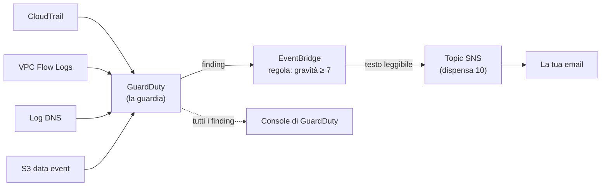
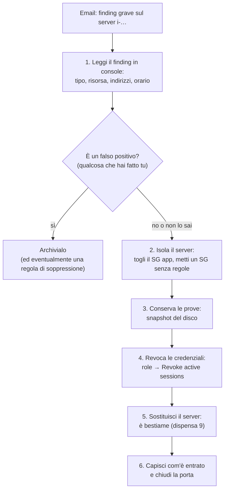

# Dispensa 12 – GuardDuty: accorgersi degli attacchi

*Corso: Infrastruttura AWS con Terraform*

## Obiettivo

Nella dispensa 10 abbiamo imparato ad accorgerci dei **guasti**: la CPU alta, il server che non risponde. Ma un'infrastruttura può anche essere **attaccata**: qualcuno ruba le credenziali del server e le usa da casa sua, un programma nascosto usa il server per minare criptovalute, qualcuno prova a spegnere i registri. Niente di tutto questo fa salire la CPU in modo evidente o fermare l'applicazione. Serve qualcuno che **sorvegli**.

Alla fine di questa dispensa:

- sai cos'è **GuardDuty** e cosa sorveglia, senza installare niente;
- sai leggere un **finding**: il tipo, la gravità, la risorsa coinvolta;
- sai attivare GuardDuty con Terraform, con le protezioni aggiuntive che servono al nostro progetto;
- sai ricevere per **email** solo i finding **gravi**, con **EventBridge** e il topic SNS della dispensa 10;
- sai provare tutto con finding **di esempio** e con un finding **vero**, provocato apposta;
- sai cosa fare quando arriva un allarme: un piccolo **piano di risposta**.

---

## Prima di iniziare

- Si lavora nella cartella `infra/` di sempre, con il progetto fino alla dispensa 10: servono il server (dispensa 9) e il topic SNS degli allarmi (dispensa 10). Questa dispensa aggiunge il file `guardduty.tf` e modifica `monitoring.tf`.
- Rinnova il login: `aws sso login --profile corso`, `export AWS_PROFILE=corso`, `export TAILSCALE_API_KEY=…`.
- **Costi:** GuardDuty ha **30 giorni di prova gratuita** per ogni account e regione; dopo si paga in base alla quantità di eventi e di traffico analizzati (in un progetto piccolo come il nostro, poco). La protezione dal malware si paga per ogni disco analizzato. A fine esercizio si cancella tutto.

---

## 1. Il problema: gli attacchi non fanno rumore

| Cosa succede | Gli allarmi della dispensa 10 se ne accorgono? |
|---|---|
| le credenziali del role del server vengono rubate e usate da un altro computer | **no**: per AWS sono richieste valide |
| un programma nascosto sul server comunica con un server di comando degli attaccanti | **no** |
| il server viene usato per minare criptovalute, a basso regime | forse, se la CPU sale abbastanza e abbastanza a lungo |
| qualcuno usa l'utente **root** dell'account (dispensa 0: mai) | **no** |
| qualcuno spegne CloudTrail per non lasciare tracce (appendice) | **no** |
| da internet qualcuno prova le porte di un server alla ricerca di quelle aperte | **no** |

Gli allarmi della dispensa 10 guardano **come sta** l'infrastruttura. Per gli attacchi bisogna guardare **cosa fa**, e riconoscere i comportamenti sospetti. È il lavoro di GuardDuty.

---

## 2. Cos'è GuardDuty

**GuardDuty** è il servizio AWS di **rilevamento delle minacce**. Si accende con un interruttore, e da quel momento analizza di continuo i **registri** dell'account, cercando comportamenti sospetti con regole scritte da AWS, elenchi aggiornati di indirizzi e domini malevoli, e il confronto con il comportamento "normale" del tuo account.

> **Analogia.** CloudTrail e i Flow Logs sono le **telecamere** dell'edificio: registrano tutto, ma nessuno guarda le registrazioni. GuardDuty è la **guardia giurata** che guarda le telecamere giorno e notte, conosce le facce dei ladri noti, e quando vede qualcosa di strano scrive un **rapporto**.

La cosa più comoda: **non devi installare niente** e nemmeno attivare i registri. GuardDuty legge da solo, con una sua copia separata, le fonti di base:

| Fonte | Cosa ci vede | La conosciamo dalla… |
|---|---|---|
| **eventi di gestione di CloudTrail** | chi chiama quali API, da dove | appendice A |
| **VPC Flow Logs** | quali indirizzi parlano con quali | dispensa 2 |
| **log DNS** del VPC | quali nomi di dominio chiedono i server | dispensa 2 (il DNS del VPC) |

E ci sono le **protezioni aggiuntive**, da accendere una per una, per vedere più a fondo:

| Protezione | Cosa aggiunge | Nel corso |
|---|---|---|
| **S3 Protection** | le letture e scritture dei file in S3 (data event) | **sì**: il bucket degli artefatti è delicato (dispensa 7) |
| **Malware Protection for EC2** | quando un finding fa sospettare un server, **analizza il suo disco** alla ricerca di malware | **sì** |
| **Runtime Monitoring** | un agente sul server che osserva i processi e i file | no: richiede un agente e un endpoint dedicato; utile in produzione |
| **RDS Protection** | accessi sospetti al database (tentativi di login anomali) | da provare: vale per alcuni motori e versioni |
| altre (EKS, Lambda, S3 Malware) | servizi che il corso non usa | no |

Due cose da sapere:

- GuardDuty è **regionale**: va acceso in **ogni regione** in cui lavori. Gli attaccanti amano le regioni che non usi, proprio perché non le guardi: in un'organizzazione vera si accende ovunque (e una SCP dell'appendice A vieta le regioni inutili).
- GuardDuty **non blocca** niente: **rileva e avvisa**. Bloccare è compito dei firewall, di IAM, e tuo quando ricevi l'avviso (sezione 6).

---

## 3. I finding: il rapporto della guardia

Ogni sospetto diventa un **finding**: un rapporto con il tipo di minaccia, la risorsa coinvolta (un server, un role, un bucket…), i dettagli (indirizzi, orari, domini) e una **gravità**.

Il **tipo** ha una forma fissa, che si legge da sinistra a destra:

```
UnauthorizedAccess:IAMUser/InstanceCredentialExfiltration.OutsideAWS
└── cosa ──────────┘└ chi ──┘└── il comportamento ─────────┘└ dettaglio ┘
```

Alcuni finding che riguardano proprio il nostro progetto:

| Finding | Cosa vuol dire | Collegamento al corso |
|---|---|---|
| `UnauthorizedAccess:IAMUser/InstanceCredentialExfiltration.OutsideAWS` | le credenziali del role di un server vengono usate **fuori da AWS** | il furto che l'hop limit di IMDS rende più difficile (dispensa 9) |
| `Backdoor:EC2/C&CActivity.B!DNS` | un server chiede il nome di un **server di comando** di attaccanti | un programma nascosto sul server |
| `CryptoCurrency:EC2/BitcoinTool.B!DNS` | un server parla con domini legati al **mining** | il server lavora per qualcun altro |
| `Policy:IAMUser/RootCredentialUsage` | qualcuno ha usato l'utente **root** | dispensa 0: il root non si usa mai |
| `Stealth:IAMUser/CloudTrailLoggingDisabled` | qualcuno ha **spento** un trail | appendice A |
| `Recon:EC2/PortProbeUnprotectedPort` | da internet qualcuno prova una porta **aperta** di un server | con i nostri Security Group (dispensa 3) non dovrebbe succedere |

La **gravità** è un numero da 1 a 10, raggruppato in livelli:

| Gravità | Livello | Cosa fare |
|---|---|---|
| 9,0 – 10 | **Critica** | subito: è quasi certamente un attacco in corso, spesso una sequenza di più passi |
| 7,0 – 8,9 | **Alta** | subito: una risorsa è probabilmente compromessa |
| 4,0 – 6,9 | **Media** | in giornata: comportamento sospetto da capire |
| 1,0 – 3,9 | **Bassa** | quando c'è tempo: tentativi falliti, rumore di fondo |

Non tutti i finding sono attacchi: a volte è un **falso positivo** (un tuo strumento che fa una cosa insolita). Si possono **archiviare** a mano, o con una **regola di soppressione** che li archivia automaticamente. Le regole di soppressione vanno usate con prudenza: ognuna è una cosa che la guardia smette di guardare.

---

## 4. Dall'allarme alla tua email: EventBridge

GuardDuty mostra i finding nella sua console, ma nessuno passa la giornata a guardarla. Vogliamo un'**email** per quelli gravi, come per gli allarmi della dispensa 10.

GuardDuty pubblica ogni finding come **evento** su **EventBridge**, il "centralino degli eventi" di AWS: un servizio che riceve gli eventi dei servizi AWS e, in base a **regole**, li inoltra a una destinazione. La nostra regola dice: "gli eventi di GuardDuty di tipo finding, con gravità **7 o più**, mandali al topic SNS degli allarmi".



Due dettagli:

- L'evento di GuardDuty è un lungo documento JSON. Un **input transformer** prende solo i campi che ci interessano (tipo, gravità, descrizione, regione) e li mette in una frase leggibile: è quello che arriva per email.
- Il topic SNS deve **permettere** a EventBridge di pubblicare: serve una **topic policy** (una resource-based policy, dispensa 1). Attenzione: scrivere una topic policy **sostituisce** quella che AWS mette di default, che permetteva agli allarmi e alle notifiche dell'account di pubblicare. Quindi la nostra policy deve contenere **tutte e due** le cose: lo stesso account, come prima, ed EventBridge, solo per la nostra regola.

Se hai cifrato il topic con la chiave dell'appendice A, anche la **key policy** deve lasciar usare la chiave a EventBridge (`events.amazonaws.com`), come fa già per CloudWatch.

---

## 5. Il codice Terraform

### guardduty.tf

```hcl
# ---------------------------------------------------------------
# La guardia: GuardDuty in questa regione
# ---------------------------------------------------------------

resource "aws_guardduty_detector" "main" {
  enable                       = true
  finding_publishing_frequency = "FIFTEEN_MINUTES"
}

# Le protezioni aggiuntive che servono al nostro progetto
resource "aws_guardduty_detector_feature" "s3" {
  detector_id = aws_guardduty_detector.main.id
  name        = "S3_DATA_EVENTS"
  status      = "ENABLED"
}

resource "aws_guardduty_detector_feature" "malware" {
  detector_id = aws_guardduty_detector.main.id
  name        = "EBS_MALWARE_PROTECTION"
  status      = "ENABLED"
}

# ---------------------------------------------------------------
# I finding gravi (7 o più) diventano un'email
# ---------------------------------------------------------------

resource "aws_cloudwatch_event_rule" "guardduty" {
  name        = "${var.project}-guardduty-gravi"
  description = "Finding di GuardDuty con gravità 7 o più"

  event_pattern = jsonencode({
    source        = ["aws.guardduty"]
    "detail-type" = ["GuardDuty Finding"]
    detail = {
      severity = [{ numeric = [">=", 7] }]
    }
  })
}

resource "aws_cloudwatch_event_target" "guardduty_email" {
  rule = aws_cloudwatch_event_rule.guardduty.name
  arn  = aws_sns_topic.alerts.arn

  input_transformer {
    input_paths = {
      tipo        = "$.detail.type"
      gravita     = "$.detail.severity"
      descrizione = "$.detail.description"
      regione     = "$.region"
    }
    input_template = "\"GuardDuty, gravità <gravita> in <regione>: <tipo>. <descrizione>\""
  }
}

output "guardduty_detector_id" {
  value = aws_guardduty_detector.main.id
}
```

### monitoring.tf (aggiunta)

La topic policy del topic degli allarmi:

```hcl
data "aws_iam_policy_document" "alerts_topic" {
  # Come la policy di default: chi è nello stesso account può pubblicare
  statement {
    sid       = "StessoAccount"
    actions   = ["SNS:Publish"]
    resources = [aws_sns_topic.alerts.arn]
    principals {
      type        = "AWS"
      identifiers = ["*"]
    }
    condition {
      test     = "StringEquals"
      variable = "AWS:SourceOwner"
      values   = [data.aws_caller_identity.current.account_id]
    }
  }

  # Gli allarmi di CloudWatch
  statement {
    sid       = "AllarmiCloudWatch"
    actions   = ["SNS:Publish"]
    resources = [aws_sns_topic.alerts.arn]
    principals {
      type        = "Service"
      identifiers = ["cloudwatch.amazonaws.com"]
    }
  }

  # EventBridge, solo per la nostra regola di GuardDuty
  statement {
    sid       = "EventBridgeGuardDuty"
    actions   = ["SNS:Publish"]
    resources = [aws_sns_topic.alerts.arn]
    principals {
      type        = "Service"
      identifiers = ["events.amazonaws.com"]
    }
    condition {
      test     = "ArnEquals"
      variable = "aws:SourceArn"
      values   = [aws_cloudwatch_event_rule.guardduty.arn]
    }
  }
}

resource "aws_sns_topic_policy" "alerts" {
  arn    = aws_sns_topic.alerts.arn
  policy = data.aws_iam_policy_document.alerts_topic.json
}
```

### Cosa fa questo codice, blocco per blocco

**`aws_guardduty_detector.main`** accende GuardDuty in questa regione: il *detector* è la "guardia" di una regione, una sola per account e regione. `finding_publishing_frequency` dice ogni quanto GuardDuty manda a EventBridge gli **aggiornamenti** dei finding già noti (ogni 15 minuti, il valore più rapido); i finding **nuovi** li manda subito. Se un detector esiste già nell'account (acceso a mano dalla console), l'`apply` dà errore: in quel caso lo si importa (`terraform import aws_guardduty_detector.main <id>`) o lo si spegne prima.

**`aws_guardduty_detector_feature`** accende una protezione aggiuntiva (sezione 2). `name` è il nome della protezione: `S3_DATA_EVENTS` (S3 Protection) ed `EBS_MALWARE_PROTECTION` (Malware Protection for EC2). Ogni protezione è una risorsa separata, così si accendono e spengono una per una.

**`aws_cloudwatch_event_rule.guardduty`** è la regola di EventBridge (il nome della risorsa dice "cloudwatch" per ragioni storiche: EventBridge una volta si chiamava *CloudWatch Events*). L'`event_pattern` è un documento JSON, scritto con `jsonencode` (dispensa 1), che dice quali eventi prendere: quelli che vengono da GuardDuty (`source`), di tipo finding (`detail-type`), e con `detail.severity` **numerica maggiore o uguale a 7** (`numeric = [">=", 7]`). La chiave `"detail-type"` è tra virgolette perché contiene un trattino.

**`aws_cloudwatch_event_target.guardduty_email`** dice dove mandare gli eventi scelti: il topic SNS degli allarmi (dispensa 10). Il blocco **`input_transformer`** ha due parti. `input_paths` dà un nome ad alcuni campi dell'evento: `$.detail.type` vuol dire "il campo `type` dentro `detail`" (il `$` è l'evento intero). `input_template` è la frase da mandare, con i nomi tra `< >` sostituiti dai valori. Le virgolette `\"` all'inizio e alla fine fanno della frase un testo JSON valido, come EventBridge pretende.

**`data.aws_iam_policy_document.alerts_topic`** è la topic policy, con tre statement. Il primo rifà la policy di default: chiunque (`"*"`) può pubblicare, **purché** la richiesta venga dal nostro account (`AWS:SourceOwner`); è quello che usano gli allarmi e le notifiche dell'ASG. Il secondo lo dice esplicitamente per CloudWatch. Il terzo dà il permesso a EventBridge, ma **solo** per la nostra regola (`aws:SourceArn`): un'altra regola, magari creata da qualcun altro, non potrebbe usare il nostro topic. **`aws_sns_topic_policy`** attacca la policy al topic.

---

## 6. Quando arriva l'allarme: un piccolo piano di risposta

Un finding grave alle 3 di notte non è il momento di inventare. Un piano scritto prima, anche breve, fa la differenza. Per i finding sul nostro **server**:



Qualche dettaglio:

- **Isolare** prima di spegnere: un server spento perde le tracce in memoria, uno isolato smette solo di parlare. Un Security Group **senza regole** (né in ingresso né in uscita) lo taglia fuori. Con un server in un ASG, prima lo si **toglie dal gruppo** (*detach*), altrimenti l'ASG lo sostituisce mentre lo stai guardando.
- **Revocare le sessioni** del role: in console, **IAM → Roles → corso-aws-app-server → Revoke active sessions**. AWS aggiunge al role una policy che nega tutto alle credenziali emesse **prima** di quel momento: quelle rubate smettono di funzionare, e il server nuovo ne riceve di fresche.
- **Sostituire**, non riparare: il server è bestiame. Un server compromesso non si "pulisce": se ne crea uno nuovo dallo stampo, e la causa si cerca sulla copia del disco.
- Se il finding riguarda **un utente o una persona** (per esempio l'uso del root, o di un login SSO da un paese strano): cambia la password e l'MFA di quell'identità, e guarda in CloudTrail cosa ha fatto (appendice A, sezione 4).

---

## 7. Oltre il corso

- **Più account:** con AWS Organizations si nomina un account "amministratore delegato" di GuardDuty, che vede i finding di **tutti** gli account e li accende automaticamente su quelli nuovi.
- **Security Hub** raccoglie i finding di GuardDuty e di altri servizi in un posto solo, e controlla le **buone pratiche** con elenchi standard come il CIS (lo stesso che chiede di svuotare il Security Group di default, dispensa 3).
- **Liste di indirizzi:** si possono dare a GuardDuty una lista di indirizzi **fidati** (da non segnalare) e una di indirizzi **malevoli** noti a te (da segnalare sempre).

---

## 8. Esercizio

Obiettivo: accendere GuardDuty, ricevere per email un finding di esempio e un finding vero, e leggerli.

### Passi

1. **`terraform apply`.** Nel `plan`: il detector, le due protezioni, la regola e il target di EventBridge, la topic policy. In console: **GuardDuty → Summary** (regione Milano): GuardDuty è attivo; in **Protection plans** S3 Protection e Malware Protection for EC2 risultano accesi.
2. **Un finding di esempio.** GuardDuty sa generare finding **finti**, marcati `[SAMPLE]`, proprio per provare la catena degli avvisi:

   ```bash
   aws guardduty create-sample-findings \
     --detector-id "$(terraform output -raw guardduty_detector_id)" \
     --finding-types 'Backdoor:EC2/C&CActivity.B!DNS'
   ```

   (Atteso: entro qualche minuto, una mail dal topic degli allarmi: *GuardDuty, gravità 8 in eu-south-1: Backdoor:EC2/C&CActivity.B!DNS. …*. In console, **Findings**: il finding con il prefisso `[SAMPLE]`.)
3. **Un finding vero.** AWS mette a disposizione un dominio **di prova** che GuardDuty tratta come un server di comando di attaccanti. Entra nel server dell'applicazione con SSM (dispensa 9) e chiedi il suo indirizzo:

   ```bash
   dig guarddutyc2activityb.com
   ```

   Il dominio non fa niente di pericoloso: il punto è che il server ha **chiesto** quel nome al DNS del VPC, che GuardDuty legge. (Atteso: entro 15-30 minuti un finding `Backdoor:EC2/C&CActivity.B!DNS` **senza** `[SAMPLE]`, sul **tuo** server, e la sua mail.)
4. **Leggi il finding vero.** In console aprilo: **Resource** (l'ID del server, il suo role, le sue etichette), **Action** (il dominio richiesto), l'orario. Riconosci il server? Nella sezione della malware protection, GuardDuty potrebbe aver avviato un'**analisi del disco**: la vedi in **Malware scans**.
5. **Il piano di risposta, a secco.** Senza farlo davvero, scrivi per questo finding i passi della sezione 6 con i nomi veri: quale server, quale ASG, quale role. Poi, visto che sai che è un falso allarme provocato da te, **archivialo** (**Actions → Archive**).
6. **Il filtro dei finding di esempio** (facoltativo). In console, **Findings → Suppression rules → Create**: criterio *Sample* = `true`. Genera di nuovo un finding di esempio (passo 2): finisce subito negli archiviati, e la mail? (Atteso: il finding finisce subito negli archiviati, e la mail **non** arriva: i finding soppressi non vengono mandati a EventBridge. È per questo che una regola di soppressione si scrive con prudenza: quello che sopprime, non lo vedrai più. Alla fine cancella la regola.)
7. **Pulizia.** Come nella dispensa 9: `db_deletion_protection = false`, `apply`, `destroy`, e cancella lo snapshot finale. Il `destroy` spegne GuardDuty e cancella i suoi finding. Se avevi già un GuardDuty acceso prima del corso e lo hai importato, toglilo dallo state prima del `destroy` (`terraform state rm aws_guardduty_detector.main`), così resta acceso.

### Domande di verifica

1. Perché gli allarmi della dispensa 10 non bastano per accorgersi di un attacco? Fai due esempi.
2. GuardDuty ha bisogno che tu attivi i VPC Flow Logs o un trail di CloudTrail per funzionare? Cosa legge?
3. Leggi il tipo `UnauthorizedAccess:IAMUser/InstanceCredentialExfiltration.OutsideAWS`: cosa è successo? Quale protezione del corso rende più difficile che succeda?
4. Perché GuardDuty va acceso anche nelle regioni che non usi?
5. Perché la topic policy deve contenere anche lo statement "stesso account", se a noi serve solo EventBridge?
6. Arriva un finding grave sul server. Perché si **isola** prima di spegnerlo, e perché poi lo si **sostituisce** invece di ripararlo?

---

## Riepilogo

- Gli allarmi della dispensa 10 vedono i **guasti**; **GuardDuty** vede gli **attacchi**: credenziali rubate, server di comando, mining, uso del root, registri spenti.
- Si accende con un interruttore e legge da solo **CloudTrail**, **VPC Flow Logs** e **DNS**; le protezioni aggiuntive (S3, malware sui dischi, runtime, RDS) si accendono una per una. È **regionale** e **non blocca**: rileva e avvisa.
- Ogni sospetto è un **finding**, con un **tipo** che si legge da sinistra a destra e una **gravità** da 1 a 10.
- **EventBridge** inoltra i finding gravi (≥ 7) al topic SNS, con un **input transformer** che li rende leggibili. La **topic policy** deve permettere sia lo stesso account sia EventBridge.
- Si prova con i finding **di esempio** (`[SAMPLE]`) e con un finding **vero** chiedendo il dominio di prova dal server.
- Il piano di risposta: **leggi**, **isola**, **conserva le prove**, **revoca le sessioni**, **sostituisci** (il server è bestiame), **capisci** e chiudi la porta.
