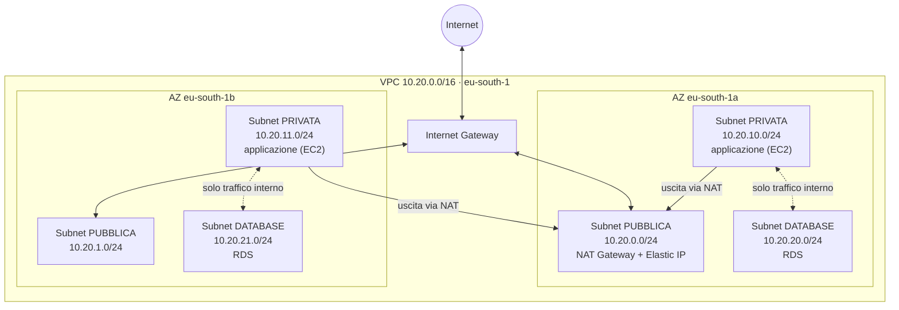
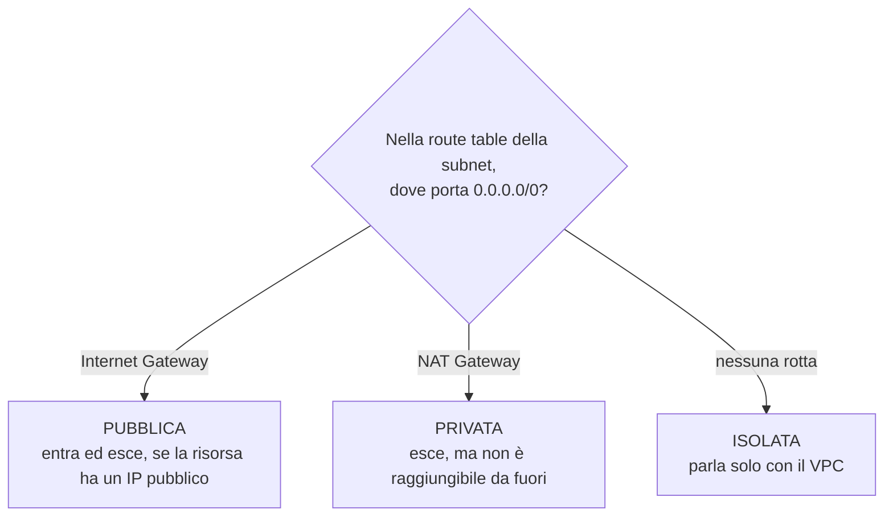
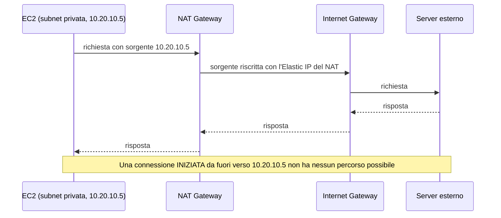
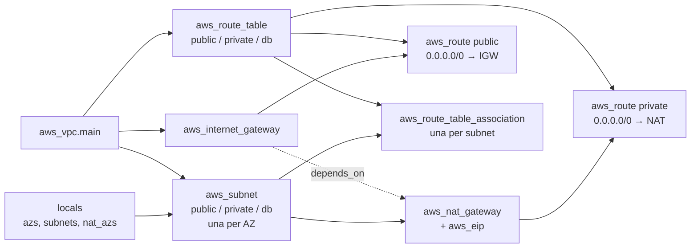

# Dispensa 2 – VPC: la rete privata

*Corso: Infrastruttura AWS con Terraform*

## Obiettivo

Alla fine di questa dispensa sai pianificare gli indirizzi di una rete AWS, sai cosa rende una subnet "pubblica" o "privata", conosci il ruolo di Internet Gateway e NAT Gateway e sai costruire in Terraform un VPC a tre livelli distribuito su due Availability Zone.

Tutto quello che viene dopo (firewall, VPN, server, database) vive **dentro** questa rete. Se il VPC è progettato male, il resto si costruisce su fondamenta storte.

---

## 1. Cos'è un VPC

Un **VPC** (Virtual Private Cloud) è una rete privata e isolata dentro AWS, tutta tua. Nessun altro cliente AWS la vede, e niente entra o esce se non lo decidi tu.

> **Analogia.** Il VPC è un edificio. Le **subnet** sono i piani. La **route table** è la segnaletica di ogni piano, che dice dove porta ogni corridoio. L'**Internet Gateway** è il portone sulla strada. Il **NAT Gateway** è un'uscita di servizio: si può uscire a fare commissioni, ma nessuno può entrare da lì.

Ecco dove arriveremo alla fine di questa dispensa. Ogni pezzo viene spiegato nelle sezioni seguenti.



Tre livelli, ciascuno duplicato su due AZ: le subnet pubbliche parlano con internet, le private escono solo tramite il NAT, le database non escono affatto. Nella versione da laboratorio c'è un solo NAT (nella AZ-a); in produzione ce n'è uno per AZ.

Caratteristiche da ricordare:

- Un VPC vive in **una regione** (per noi `eu-south-1`, Milano), ma si estende su tutte le sue Availability Zone.
- Ogni account ha un **VPC di default** in ogni regione, creato da AWS con subnet pubbliche ovunque. È comodo per le prove, ma **non si usa per niente di serio**: è pensato per far funzionare le cose subito, non per essere sicuro.

---

## 2. Gli indirizzi: CIDR

### La notazione

Un blocco di indirizzi si scrive in notazione **CIDR**: un indirizzo seguito da `/n`, dove `n` dice quanti bit sono fissi. Più il numero è piccolo, più il blocco è grande.

| CIDR | Indirizzi | Uso tipico |
|---|---|---|
| `/16` | 65.536 | L'intero VPC |
| `/20` | 4.096 | Una subnet grande |
| `/24` | 256 | Una subnet normale |
| `/28` | 16 | La subnet più piccola ammessa |

Esempio: `10.20.0.0/16` significa "tutti gli indirizzi da `10.20.0.0` a `10.20.255.255`".

### Gli indirizzi che AWS si tiene

In **ogni subnet** AWS riserva 5 indirizzi: i primi quattro e l'ultimo. In una `10.20.1.0/24`:

| Indirizzo | Riservato per |
|---|---|
| `10.20.1.0` | Indirizzo di rete |
| `10.20.1.1` | Router del VPC |
| `10.20.1.2` | DNS di AWS |
| `10.20.1.3` | Uso futuro di AWS |
| `10.20.1.255` | Broadcast (non supportato, ma riservato) |

Una `/24` ha quindi **251** indirizzi utilizzabili, non 256.

### Pianificare prima di scrivere codice

Il CIDR di un VPC non si cambia a cuor leggero: cambiarlo in Terraform significa **distruggere e ricreare tutta la rete** e tutto quello che ci sta sopra. Si pianifica una volta, bene. Le regole:

- Usare gli intervalli privati (RFC 1918): `10.0.0.0/8`, `172.16.0.0/12`, `192.168.0.0/16`.
- **Non sovrapporsi** a nessuna rete con cui un giorno si dovrà comunicare: altri VPC, la rete aziendale on-premise, e il **CIDR dei client VPN** (dispensa 4).
- **Evitare le reti di casa**: `192.168.0.0/24` e `192.168.1.0/24` sono i default di quasi tutti i router domestici. Se il VPC le usa, chi si collega in VPN da casa avrà conflitti di routing.
- Lasciare spazio per crescere: meglio subnet `/24` in un VPC `/16` che riempire tutto subito.

### Il piano del corso

| Blocco | CIDR | Note |
|---|---|---|
| VPC | `10.20.0.0/16` | |
| Pubblica AZ-a | `10.20.0.0/24` | NAT, eventuali load balancer |
| Pubblica AZ-b | `10.20.1.0/24` | |
| Privata AZ-a | `10.20.10.0/24` | Applicazione (EC2) |
| Privata AZ-b | `10.20.11.0/24` | |
| Database AZ-a | `10.20.20.0/24` | RDS |
| Database AZ-b | `10.20.21.0/24` | |
| Client VPN | `10.100.0.0/22` | **Fuori** dal VPC, per scelta (dispensa 4) |

La numerazione a decine (0, 10, 20) non è obbligatoria, ma rende i livelli riconoscibili a colpo d'occhio: un indirizzo `10.20.2x.x` è sicuramente un database.

---

## 3. Availability Zone

Una **Availability Zone** (AZ) è uno o più data center fisicamente separati dagli altri della stessa regione, con alimentazione e rete indipendenti. Milano ne ha tre: `eu-south-1a`, `eu-south-1b` e `eu-south-1c`.

Il punto chiave: **ogni subnet vive in una sola AZ**. Se un'AZ ha un problema, tutte le sue subnet (e ciò che contengono) sono a rischio. Per questo ogni livello dell'architettura si **duplica su almeno due AZ**. È anche un requisito concreto: RDS Multi-AZ (dispensa 6) pretende subnet database in almeno due AZ.

Una curiosità utile: i nomi `eu-south-1a`, `1b` ecc. sono mappati in modo diverso da account ad account (la tua "1a" può essere la "1b" di un altro). L'identificativo fisico stabile è l'**AZ ID** (per esempio `eus1-az1`). Conta quando si coordinano più account.

---

## 4. Subnet e route table: cosa rende pubblica una subnet

Questo è il concetto che sblocca tutto il resto:

> **Una subnet non è pubblica o privata per un'impostazione. Lo è per la sua route table.**

Ogni subnet è associata a una **route table**, cioè un elenco di regole "per questa destinazione, vai di qua". Ogni route table contiene sempre una rotta **local** per il CIDR del VPC: è quella che permette a tutte le subnet di parlarsi tra loro, e non si può togliere.

Poi, a seconda delle altre rotte:

| Tipo di subnet | Rotta `0.0.0.0/0` (tutto il resto) verso | Effetto |
|---|---|---|
| **Pubblica** | Internet Gateway | Esce e, con un IP pubblico, può essere raggiunta da internet |
| **Privata** | NAT Gateway | Esce verso internet, ma **non** è raggiungibile da fuori |
| **Isolata** | Nessuna | Parla solo con il resto del VPC |

La stessa regola, come albero di decisione:



Nel nostro progetto: pubbliche per il NAT, private per l'applicazione, isolate per il database. Il database non ha alcun bisogno di uscire su internet, quindi non gli diamo la possibilità di farlo.

Una subnet senza associazione esplicita finisce sulla **main route table** del VPC. È una trappola classica: se qualcuno aggiunge una rotta verso internet alla main route table, tutte le subnet "dimenticate" diventano pubbliche. Regola del corso: **ogni subnet ha un'associazione esplicita**.

### IP pubblico: la seconda condizione

Per essere raggiungibile da internet, una risorsa in una subnet pubblica deve anche avere un **IP pubblico** (assegnato automaticamente o un Elastic IP). L'opzione `map_public_ip_on_launch` della subnet dà un IP pubblico a ogni istanza avviata lì. Noi la lasciamo **disattivata** anche sulle subnet pubbliche: lì ci va solo il NAT, che usa un suo Elastic IP. Nessuna istanza deve ritrovarsi esposta per sbaglio.

C'è poi una terza condizione: anche con rotta e IP pubblico, il traffico deve essere ammesso dai **firewall** del VPC. Sono l'argomento della dispensa 3. In questa dispensa ci occupiamo solo di **dove** il traffico può andare; nella prossima, di **cosa** può passare.

---

## 5. Internet Gateway e NAT Gateway

### Internet Gateway (IGW)

È il collegamento tra il VPC e internet. Ce n'è **uno per VPC**, è gestito da AWS, ridondato e **gratuito**. Da solo non fa niente: serve una rotta che lo usi.

### NAT Gateway

Permette alle risorse delle subnet private di **iniziare** connessioni verso internet (aggiornamenti di sistema, download di pacchetti, chiamate ad API esterne) senza poter essere contattate da fuori. Tutto il traffico in uscita appare come proveniente dall'**Elastic IP** del NAT: utile quando un fornitore esterno chiede di mettere in whitelist i tuoi indirizzi.

Il percorso di una connessione, e perché dall'esterno non si entra:



Da sapere:

- Il NAT Gateway **sta in una subnet pubblica**, perché lui stesso esce tramite l'Internet Gateway.
- Vive in **una sola AZ**. Se quella AZ ha un problema, le subnet private che lo usano perdono l'uscita verso internet.
- **Costa**: si paga a ore, anche quando è fermo, più il traffico che lo attraversa. Nei laboratori va distrutto a fine giornata.

Da qui la scelta di progetto:

| Opzione | Resilienza | Costo | Quando |
|---|---|---|---|
| **Un NAT per AZ**, ogni subnet privata usa quello della sua AZ | Alta | Più alto | Produzione |
| **Un solo NAT**, condiviso da tutte le subnet private | Se cade la sua AZ, nessuno esce | Più basso | Laboratorio, sviluppo |

Nel codice la rendiamo una variabile, così lo stesso progetto serve a entrambi.

Nella dispensa su S3 vedremo anche i **VPC endpoint**, che permettono di raggiungere servizi AWS come S3 senza passare dal NAT: più sicuri e, per S3, gratuiti.

---

## 6. Un'impostazione da non dimenticare: il DNS

Due opzioni del VPC, `enable_dns_support` e `enable_dns_hostnames`, vanno **entrambe attive**. Senza, non funzionano la risoluzione degli endpoint di RDS, i VPC endpoint e SSM Session Manager. È un errore che si scopre tardi, con sintomi che sembrano tutt'altro.

Il VPC nasce anche con un **Security Group** e una **NACL** di default. Non li tocchiamo qui: sono firewall, e li vediamo nella dispensa 3, dove si spiega anche perché il Security Group di default va svuotato.

---

## 7. VPC Flow Logs (facoltativo, ma consigliato)

I **Flow Logs** registrano i metadati di ogni connessione: sorgente, destinazione, porte, protocollo, byte e se è stata accettata o rifiutata. Non il contenuto, solo "chi ha parlato con chi".

Servono per il troubleshooting ("perché questa connessione non passa?") e sono una fonte fondamentale per la sicurezza: rilevazione di scansioni, esfiltrazioni, movimenti laterali. Si possono inviare a CloudWatch Logs o a S3; S3 è più economico per la conservazione.

Una nota pratica: quando si abilitano i Flow Logs verso un bucket S3, AWS aggiunge da solo una bucket policy per poterci scrivere. Se in futuro la bucket policy di quel bucket sarà gestita da Terraform, va scritta includendo quei permessi, altrimenti i due si sovrascrivono a vicenda. Per questo si usa un bucket dedicato ai log.

---

## 8. Il codice Terraform

Invece di scrivere a mano sei subnet, sei associazioni e le relative rotte, calcoliamo tutto a partire dal CIDR del VPC e dall'elenco delle AZ. È il momento di mettere in pratica variabili, locals e `for_each`.

> Nei progetti reali si usa spesso il modulo della community `terraform-aws-modules/vpc/aws`, che fa tutto questo e altro. Qui scriviamo le risorse a mano, perché l'obiettivo è capire ogni pezzo. Chi ha capito questa dispensa sa leggere e configurare quel modulo.

Prima del codice servono tre strumenti nuovi del linguaggio: `for_each`, le espressioni `for` e `cidrsubnet`.

### Più copie della stessa risorsa: for_each

Le due subnet pubbliche sono identiche tranne AZ e CIDR. Scriverle due volte funziona, ma con tre livelli e tre AZ diventano nove blocchi quasi uguali, e ogni modifica va ripetuta nove volte. `for_each` dice a Terraform: "crea **una copia di questa risorsa per ogni elemento** di questa mappa".

```hcl
resource "aws_subnet" "esempio" {
  for_each = {                          # la mappa da cui generare le copie
    "eu-south-1a" = "10.20.0.0/24"
    "eu-south-1b" = "10.20.1.0/24"
  }

  vpc_id            = aws_vpc.main.id
  availability_zone = each.key          # la chiave dell'elemento corrente
  cidr_block        = each.value        # il valore dell'elemento corrente
}
```

Dentro il blocco, `each.key` ed `each.value` valgono di volta in volta la chiave e il valore dell'elemento corrente. Il risultato sono **due** subnet, che Terraform chiama così:

| Indirizzo in Terraform | `each.key` | `each.value` |
|---|---|---|
| `aws_subnet.esempio["eu-south-1a"]` | `"eu-south-1a"` | `"10.20.0.0/24"` |
| `aws_subnet.esempio["eu-south-1b"]` | `"eu-south-1b"` | `"10.20.1.0/24"` |

Sono i nomi che vedrai nel `plan` e in `terraform state list`. Da qui derivano tre regole pratiche:

- **Una copia si legge con la chiave tra parentesi quadre**: `aws_subnet.esempio["eu-south-1a"].id`.
- **Senza parentesi quadre ottieni tutte le copie**, come mappa: `aws_subnet.esempio` è `{ "eu-south-1a" = <subnet>, "eu-south-1b" = <subnet> }`. E una mappa si può dare in pasto al `for_each` di un'altra risorsa: così si crea, per esempio, un'associazione per ogni subnet.
- **`for_each` accetta una mappa o un set di stringhe**, non una lista. Una lista si converte con `toset(lista)`: in un set chiave e valore coincidono, quindi `each.key == each.value`.

Esiste anche `count = 3`, che crea copie numerate `[0]`, `[1]`, `[2]`. È più semplice, ma se togli l'elemento `[0]` tutti gli altri scalano di posizione e Terraform li distrugge e ricrea. Con `for_each` ogni copia ha un nome stabile (la AZ), quindi aggiungere o togliere una AZ tocca **solo** quella.

### Trasformare liste e mappe: le espressioni for

Un'espressione `for` costruisce una lista o una mappa a partire da un'altra, come una formula applicata a ogni elemento:

```hcl
[for az in ["eu-south-1a", "eu-south-1b"] : upper(az)]
# -> ["EU-SOUTH-1A", "EU-SOUTH-1B"]            parentesi quadre = produce una LISTA

{for az in ["eu-south-1a", "eu-south-1b"] : az => "subnet-${az}"}
# -> { "eu-south-1a" = "subnet-eu-south-1a", ... }   graffe e "=>" = produce una MAPPA

[for i, az in ["eu-south-1a", "eu-south-1b"] : "${i}-${az}"]
# -> ["0-eu-south-1a", "1-eu-south-1b"]        con due variabili, su una lista: posizione e valore
```

Su una mappa le due variabili sono chiave e valore: `{for k, v in mappa : k => v.id}`.

### La funzione cidrsubnet

```hcl
cidrsubnet(prefisso, bit_aggiuntivi, numero)
```

Prende un blocco, lo divide aggiungendo bit e restituisce il blocco numero `n`. Da una `/16` aggiungendo 8 bit si ottengono delle `/24`:

```hcl
cidrsubnet("10.20.0.0/16", 8, 0)    # 10.20.0.0/24
cidrsubnet("10.20.0.0/16", 8, 1)    # 10.20.1.0/24
cidrsubnet("10.20.0.0/16", 8, 10)   # 10.20.10.0/24
cidrsubnet("10.20.0.0/16", 8, 21)   # 10.20.21.0/24
```

Si può provare dal vivo con `terraform console`, che valuta le espressioni senza toccare niente.

### variables.tf (aggiunte)

```hcl
variable "vpc_cidr" {
  description = "CIDR del VPC"
  type        = string
  default     = "10.20.0.0/16"

  validation {
    condition     = can(cidrhost(var.vpc_cidr, 0))
    error_message = "Deve essere un CIDR valido, es. 10.20.0.0/16."
  }
}

variable "az_count" {
  description = "Numero di Availability Zone da usare"
  type        = number
  default     = 2

  validation {
    condition     = var.az_count >= 2 && var.az_count <= 3
    error_message = "Servono almeno 2 AZ (alta affidabilità), al massimo 3 (Milano)."
  }
}

variable "single_nat_gateway" {
  description = "true = un solo NAT (lab, economico); false = un NAT per AZ (produzione)"
  type        = bool
  default     = true
}
```

Le tre variabili sono i soli "comandi" della rete: tutto il resto si calcola da loro. Le due `validation` bloccano valori sbagliati già al `plan`:

- per `vpc_cidr`, `cidrhost(var.vpc_cidr, 0)` prova a calcolare il primo indirizzo del blocco. Se il testo non è un CIDR valido la funzione va in errore, e `can()` trasforma quell'errore in `false`, quindi validazione fallita;
- per `az_count`, `&&` significa "e": il numero deve essere almeno 2 **e** al massimo 3.

### vpc.tf

```hcl
# ---------------------------------------------------------------
# Calcolo di AZ e subnet
# ---------------------------------------------------------------

data "aws_availability_zones" "available" {
  state = "available"
}

locals {
  azs = slice(data.aws_availability_zones.available.names, 0, var.az_count)

  # Una mappa per AZ con i tre CIDR:
  # { "eu-south-1a" = { public = "10.20.0.0/24", private = "10.20.10.0/24", db = "10.20.20.0/24" }, ... }
  subnets = {
    for i, az in local.azs : az => {
      public  = cidrsubnet(var.vpc_cidr, 8, i)
      private = cidrsubnet(var.vpc_cidr, 8, 10 + i)
      db      = cidrsubnet(var.vpc_cidr, 8, 20 + i)
    }
  }

  # In quali AZ mettere un NAT
  nat_azs = var.single_nat_gateway ? [local.azs[0]] : local.azs
}

# ---------------------------------------------------------------
# VPC e Internet Gateway
# ---------------------------------------------------------------

resource "aws_vpc" "main" {
  cidr_block           = var.vpc_cidr
  enable_dns_support   = true
  enable_dns_hostnames = true

  tags = { Name = "${var.project}-vpc" }
}

resource "aws_internet_gateway" "main" {
  vpc_id = aws_vpc.main.id
  tags   = { Name = "${var.project}-igw" }
}

# ---------------------------------------------------------------
# Subnet: un for_each per livello, una subnet per AZ
# ---------------------------------------------------------------

resource "aws_subnet" "public" {
  for_each = local.subnets

  vpc_id                  = aws_vpc.main.id
  availability_zone       = each.key
  cidr_block              = each.value.public
  map_public_ip_on_launch = false   # anche qui: nessun IP pubblico automatico

  tags = { Name = "${var.project}-public-${each.key}", Tier = "public" }
}

resource "aws_subnet" "private" {
  for_each = local.subnets

  vpc_id            = aws_vpc.main.id
  availability_zone = each.key
  cidr_block        = each.value.private

  tags = { Name = "${var.project}-private-${each.key}", Tier = "private" }
}

resource "aws_subnet" "db" {
  for_each = local.subnets

  vpc_id            = aws_vpc.main.id
  availability_zone = each.key
  cidr_block        = each.value.db

  tags = { Name = "${var.project}-db-${each.key}", Tier = "db" }
}

# ---------------------------------------------------------------
# NAT Gateway (uno solo o uno per AZ)
# ---------------------------------------------------------------

resource "aws_eip" "nat" {
  for_each = toset(local.nat_azs)
  domain   = "vpc"
  tags     = { Name = "${var.project}-nat-${each.key}" }
}

resource "aws_nat_gateway" "main" {
  for_each = toset(local.nat_azs)

  allocation_id = aws_eip.nat[each.key].id
  subnet_id     = aws_subnet.public[each.key].id   # il NAT sta nella subnet PUBBLICA

  tags = { Name = "${var.project}-nat-${each.key}" }

  # Uno dei rari casi in cui depends_on serve davvero:
  # il NAT non riferisce l'IGW, ma senza IGW non può funzionare.
  depends_on = [aws_internet_gateway.main]
}

# ---------------------------------------------------------------
# Route table PUBBLICA: tutto il resto -> Internet Gateway
# ---------------------------------------------------------------

resource "aws_route_table" "public" {
  vpc_id = aws_vpc.main.id
  tags   = { Name = "${var.project}-rt-public" }
}

resource "aws_route" "public_internet" {
  route_table_id         = aws_route_table.public.id
  destination_cidr_block = "0.0.0.0/0"
  gateway_id             = aws_internet_gateway.main.id
}

resource "aws_route_table_association" "public" {
  for_each       = aws_subnet.public
  subnet_id      = each.value.id
  route_table_id = aws_route_table.public.id
}

# ---------------------------------------------------------------
# Route table PRIVATE: una per AZ, tutto il resto -> NAT
# ---------------------------------------------------------------

resource "aws_route_table" "private" {
  for_each = local.subnets
  vpc_id   = aws_vpc.main.id
  tags     = { Name = "${var.project}-rt-private-${each.key}" }
}

resource "aws_route" "private_nat" {
  for_each = local.subnets

  route_table_id         = aws_route_table.private[each.key].id
  destination_cidr_block = "0.0.0.0/0"
  # NAT unico: tutti usano quello della prima AZ.
  # NAT per AZ: ognuno usa quello della propria AZ.
  nat_gateway_id = var.single_nat_gateway ? aws_nat_gateway.main[local.azs[0]].id : aws_nat_gateway.main[each.key].id
}

resource "aws_route_table_association" "private" {
  for_each       = aws_subnet.private
  subnet_id      = each.value.id
  route_table_id = aws_route_table.private[each.key].id
}

# ---------------------------------------------------------------
# Route table DATABASE: solo la rotta local, nessuna uscita
# ---------------------------------------------------------------

resource "aws_route_table" "db" {
  vpc_id = aws_vpc.main.id
  tags   = { Name = "${var.project}-rt-db" }
}

resource "aws_route_table_association" "db" {
  for_each       = aws_subnet.db
  subnet_id      = each.value.id
  route_table_id = aws_route_table.db.id
}
```

### Leggere vpc.tf passo per passo

Il file sembra lungo, ma segue sempre lo stesso schema. Lo seguiamo con i valori del laboratorio: `az_count = 2`, `single_nat_gateway = true`.

**1. Quali AZ usare.** `data.aws_availability_zones.available` chiede ad AWS le AZ attive nella regione: `names` vale `["eu-south-1a", "eu-south-1b", "eu-south-1c"]`. `slice(lista, 0, var.az_count)` prende gli elementi dalla posizione 0 fino alla 2 **esclusa**, quindi `local.azs = ["eu-south-1a", "eu-south-1b"]`.

**2. I CIDR per ogni AZ.** `local.subnets` è un'espressione `for` che scorre `local.azs` con posizione `i` e nome `az`, e per ognuna produce una mappa con i tre CIDR:

| `i` | `az` | `public` = `cidrsubnet(…, 8, i)` | `private` = `…, 10 + i` | `db` = `…, 20 + i` |
|---|---|---|---|---|
| 0 | `eu-south-1a` | `10.20.0.0/24` | `10.20.10.0/24` | `10.20.20.0/24` |
| 1 | `eu-south-1b` | `10.20.1.0/24` | `10.20.11.0/24` | `10.20.21.0/24` |

Le graffe e `az => { ... }` la rendono una **mappa** con chiave la AZ: è proprio la forma che serve a `for_each`.

**3. Dove mettere i NAT.** `local.nat_azs` usa il condizionale: se `single_nat_gateway` è vero prende solo la prima AZ (`[local.azs[0]]`, cioè `["eu-south-1a"]`), altrimenti tutte.

**4. VPC e Internet Gateway.** `aws_vpc.main` crea la rete con il CIDR della variabile e il DNS attivo (sezione 6). `aws_internet_gateway.main` crea il portone verso internet e lo aggancia al VPC con `vpc_id = aws_vpc.main.id`. Da qui in poi quasi ogni risorsa ha un `vpc_id` o un riferimento simile: è così che Terraform sa che il VPC va creato per primo.

**5. Le subnet.** I tre blocchi `aws_subnet` hanno `for_each = local.subnets`, quindi ciascuno crea una subnet per AZ. `each.key` è la AZ (va in `availability_zone` e nel nome); `each.value` è la mappa dei tre CIDR, da cui ogni livello prende il suo campo: `each.value.public`, `each.value.private`, `each.value.db`. Risultato: `aws_subnet.public["eu-south-1a"]`, `aws_subnet.public["eu-south-1b"]` e lo stesso per `private` e `db`.

**6. NAT ed Elastic IP.** `aws_eip.nat` e `aws_nat_gateway.main` usano `for_each = toset(local.nat_azs)`: un set con la sola `"eu-south-1a"`, quindi una copia sola. Nel NAT, `aws_eip.nat[each.key].id` sceglie l'Elastic IP **della stessa AZ** e `aws_subnet.public[each.key].id` la subnet pubblica di quella AZ. `domain = "vpc"` indica che l'Elastic IP è per l'uso in un VPC. Il `depends_on` è spiegato nel commento: nessun argomento del NAT cita l'Internet Gateway, ma senza IGW il NAT non ha una via d'uscita, quindi l'ordine va imposto a mano.

**7. Route table e rotte sono risorse separate.** `aws_route_table` crea la tabella vuota (con solo la rotta `local`, che AWS mette da sé). `aws_route` aggiunge una riga: destinazione `0.0.0.0/0` ("qualunque indirizzo non locale") verso `gateway_id` (l'IGW) oppure `nat_gateway_id` (il NAT).

**8. Le associazioni.** `aws_route_table_association` collega una subnet a una route table. Il suo `for_each` è **la mappa delle subnet** stessa (`aws_subnet.public`): per ogni AZ, `each.value` è l'intera subnet, quindi `each.value.id` è il suo ID. Così le associazioni seguono sempre le subnet: aggiungi una AZ e compare anche la sua associazione.

**9. La rotta privata sceglie il NAT.** In `aws_route.private_nat` il condizionale decide: con NAT unico tutte le rotte puntano a `aws_nat_gateway.main["eu-south-1a"]` (la prima AZ); con un NAT per AZ ognuna punta a `aws_nat_gateway.main[each.key]`, quello della propria AZ.

**10. Il database.** Una sola route table senza `aws_route`: contiene solo la rotta `local`, quindi le subnet database parlano con il VPC e con nient'altro.

Riassunto di chi dipende da chi:



Perché **una route table privata per AZ** anche quando il NAT è uno solo? Perché così passare da `single_nat_gateway = true` a `false` cambia solo la destinazione delle rotte, senza ristrutturare niente. Il codice è pronto per la produzione anche quando gira in modalità economica.

### flowlogs.tf (facoltativo)

```hcl
resource "aws_s3_bucket" "flow_logs" {
  bucket        = "${var.project}-flowlogs-${data.aws_caller_identity.current.account_id}"
  force_destroy = true   # solo per il laboratorio
}

resource "aws_s3_bucket_public_access_block" "flow_logs" {
  bucket                  = aws_s3_bucket.flow_logs.id
  block_public_acls       = true
  block_public_policy     = true
  ignore_public_acls      = true
  restrict_public_buckets = true
}

resource "aws_flow_log" "main" {
  vpc_id               = aws_vpc.main.id
  traffic_type         = "ALL"   # ACCEPT, REJECT o ALL
  log_destination_type = "s3"
  log_destination      = aws_s3_bucket.flow_logs.arn
}
```

Il data source `aws_caller_identity` è quello già definito nella dispensa 1: essendo tutto un'unica configurazione, non va ridichiarato.

### outputs.tf (aggiunte)

```hcl
output "vpc_id" {
  value = aws_vpc.main.id
}

output "public_subnet_ids" {
  value = { for az, s in aws_subnet.public : az => s.id }
}

output "private_subnet_ids" {
  value = { for az, s in aws_subnet.private : az => s.id }
}

output "db_subnet_ids" {
  value = { for az, s in aws_subnet.db : az => s.id }
}

output "nat_public_ips" {
  description = "IP con cui le subnet private escono su internet (per whitelist)"
  value       = [for e in aws_eip.nat : e.public_ip]
}
```

Gli output usano le espressioni `for` per trasformare le mappe di risorse in qualcosa di leggibile. `{ for az, s in aws_subnet.public : az => s.id }` scorre le subnet pubbliche e tiene, per ogni AZ, solo l'ID: `{ "eu-south-1a" = "subnet-0abc…", "eu-south-1b" = "subnet-0def…" }`. L'ultimo produce una **lista** (parentesi quadre) con gli IP pubblici di tutti gli Elastic IP. Questi ID serviranno alle dispense successive per mettere server e database nelle subnet giuste.

---

## 9. Esercizio

Obiettivo: creare il VPC a tre livelli, verificare che le route table facciano quello che dicono, e osservare come reagisce il plan a modifiche di diverso peso.

### Passi

1. **Prima di tutto, `terraform console`.** Prova `cidrsubnet("10.20.0.0/16", 8, 20)` e `local.subnets`. Corrispondono alla tabella della sezione 2?
2. **`terraform plan`.** Conta le risorse per tipo: quante subnet, quante route table, quante associazioni, quanti NAT? Spiega ogni numero a partire da `az_count = 2` e `single_nat_gateway = true`.
3. **`terraform apply`.** Il NAT Gateway richiede qualche minuto: è normale.
4. **Controlla le route table dalla CLI:**

   ```bash
   aws ec2 describe-route-tables \
     --filters Name=vpc-id,Values=$(terraform output -raw vpc_id) \
     --query 'RouteTables[].{Nome: Tags[?Key==`Name`].Value | [0], Rotte: Routes[].[DestinationCidrBlock, GatewayId || NatGatewayId]}' \
     --output json
   ```

   Per ciascuna route table rispondi: dove porta `0.0.0.0/0`? Quale non ha affatto quella rotta? Cosa significa la rotta con destinazione `10.20.0.0/16` e gateway `local`?
5. **Passa a un NAT per AZ.** Metti `single_nat_gateway = false` e lancia solo `plan`. Cosa viene creato, cosa viene modificato sul posto (`~`)? Qualcosa viene distrutto?
6. **Aggiungi una AZ.** Metti `az_count = 3` e lancia solo `plan`. Cosa compare? Le subnet esistenti vengono toccate?
7. **Cambia il CIDR.** Metti `vpc_cidr = "10.30.0.0/16"` e lancia solo `plan`. Leggi il riepilogo. Perché è la modifica più pericolosa delle tre? Poi annulla.
8. **Facoltativo:** se hai attivato i Flow Logs, dopo una decina di minuti controlla il bucket: arrivano file? (Con poco traffico nel VPC saranno pochi.)
9. **`terraform destroy`.** Il NAT Gateway si paga a ore anche da fermo: non lasciarlo acceso.

### Domande di verifica

1. Una subnet ha la rotta `0.0.0.0/0` verso l'Internet Gateway ma l'istanza al suo interno non ha un IP pubblico. È raggiungibile da internet? Può uscire su internet?
2. Perché il NAT Gateway sta in una subnet pubblica e non in una privata?
3. Con `single_nat_gateway = true`, cosa succede alle istanze della AZ-b se la AZ-a ha un guasto? E al database?
4. Un collega crea una subnet a mano dalla console e non la associa a nessuna route table. Dove finisce? È un problema?
5. Chi si collega in VPN da casa ha la rete `192.168.1.0/24`. Perché il piano indirizzi del corso non la usa da nessuna parte?

---

## Riepilogo

- Il VPC è la tua rete isolata in una regione; il VPC di default non si usa per niente di serio.
- Il CIDR **si pianifica prima**: niente sovrapposizioni con altre reti, VPN e reti di casa. Cambiarlo dopo significa ricreare tutto.
- Ogni subnet vive in **una sola AZ**: ogni livello si duplica su almeno due.
- **La route table decide se una subnet è pubblica, privata o isolata**, non un'impostazione della subnet.
- **Internet Gateway**: entrata e uscita, gratuito. **NAT Gateway**: solo uscita, sta in subnet pubblica, vive in una AZ e costa.
- DNS del VPC **sempre attivo** e ogni subnet con associazione **esplicita** alla sua route table.
- In Terraform: `cidrsubnet()` e `for_each` generano la rete a partire da pochi parametri.
