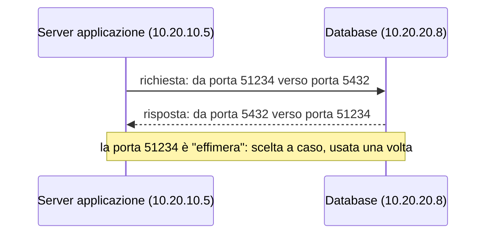
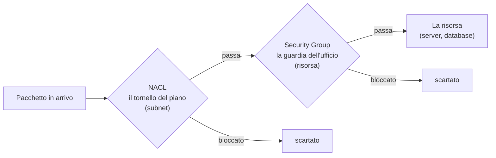
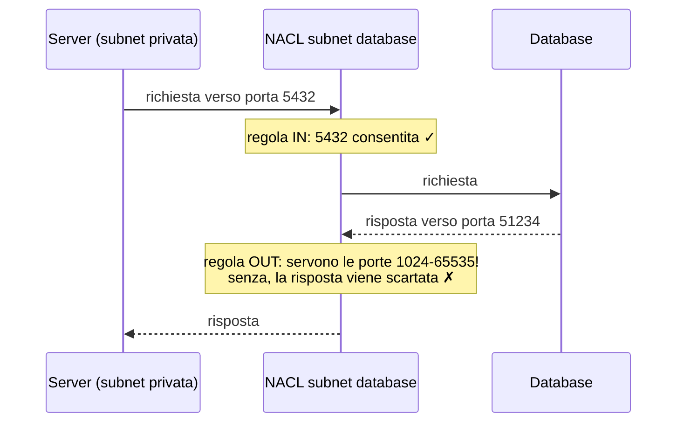
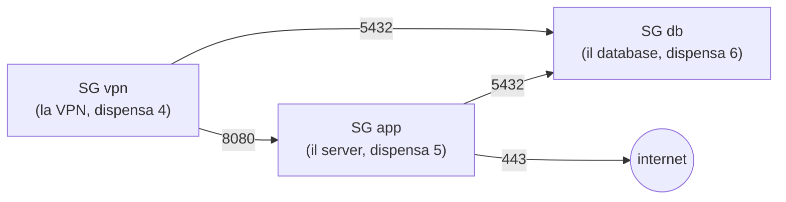

# Dispensa 3 – Firewall: Security Group e NACL

*Corso: Infrastruttura AWS con Terraform*

## Obiettivo

Nella dispensa 2 abbiamo deciso **dove** il traffico può andare: le route table. Qui decidiamo **cosa** può passare: i firewall.

Alla fine di questa dispensa:

- sai cos'è una porta e come si svolge una connessione;
- conosci i due firewall di AWS, i **Security Group** e le **NACL**, e la differenza tra loro;
- sai scrivere in Terraform regole che dicono "il database accetta connessioni solo dal server dell'applicazione e dagli amministratori in VPN";
- sai perché il Security Group di default va svuotato;
- hai verificato le regole con uno strumento di AWS, rompendole e riparandole.

---

## Prima di iniziare

- Si lavora nella **stessa cartella** `infra/` delle dispense precedenti: questa dispensa aggiunge il file `security.tf` (e, per l'esercizio, un file di laboratorio da cancellare alla fine).
- Serve la rete della dispensa 2: `aws_vpc.main`, le subnet `aws_subnet.private` e `aws_subnet.db`, e i `locals` `azs` e `subnets`. Se avevi chiuso con `destroy`, l'`apply` di questa dispensa ricrea anche quella.
- Rinnova il login: `aws sso login --profile corso` ed `export AWS_PROFILE=corso`.
- **Costi:** questa dispensa non aggiunge risorse a pagamento, ma la rete della dispensa 2 include il NAT Gateway, che si paga a ore. Chiudi con `terraform destroy`.

---

## 1. Il problema

Riprendiamo l'architettura della dispensa 2. Nelle prossime dispense avremo:

- un **server dell'applicazione** (EC2, dispensa 5) nelle subnet private;
- un **database PostgreSQL** (RDS, dispensa 6) nelle subnet database;
- gli **amministratori** e gli **sviluppatori**, collegati da casa con la **VPN** (dispensa 4).

Le route table permettono già a tutte le subnet di parlarsi (la rotta `local`). Ma non vogliamo che **chiunque** dentro la rete possa raggiungere il database. Vogliamo queste regole:

| Chi | Verso | Ammesso? |
|---|---|---|
| Il server dell'applicazione | il database, porta 5432 | **sì** |
| Un amministratore in VPN | il database, porta 5432 | **sì** |
| Un utente in VPN | l'applicazione, porta 8080 | **sì** |
| Il server dell'applicazione | internet, porta 443 (aggiornamenti, servizi AWS) | **sì** |
| Qualunque altra cosa | il database | **no** |
| Internet | qualunque cosa | **no** |

Un **firewall** è proprio questo: un insieme di regole che dicono quale traffico può passare e quale no. AWS ne ha due, che lavorano insieme.

---

## 2. Prima un passo indietro: porte e connessioni

### La porta: lo sportello del servizio

Un indirizzo IP identifica un **computer** (dispensa 2). Ma su un computer possono girare tanti servizi: un sito web, un database, un accesso remoto. La **porta** è il numero che indica **a quale servizio** è diretta una connessione, come lo sportello di un ufficio.

| Porta | Servizio |
|---|---|
| 443 | siti web cifrati (HTTPS), e quasi tutti i servizi AWS |
| 5432 | il database PostgreSQL |
| 22 | SSH, l'accesso remoto a un server (noi **non** lo useremo: dispensa 5) |
| 8080 | la nostra applicazione (una scelta del corso) |

Il **protocollo** è il tipo di traffico. Quasi tutto quello che ci interessa usa **TCP**, il protocollo delle connessioni "con conferma di ricezione".

### Come si svolge una connessione

Quando il server dell'applicazione si collega al database, succede questo:

1. Il server sceglie una **porta a caso** per sé, per esempio 51234: è la porta da cui parte la richiesta. Queste porte "usa e getta" si chiamano **porte effimere** e vanno, a seconda del sistema, da 1024 a 65535.
2. Invia la richiesta al database, **verso la porta 5432**.
3. Il database risponde, **verso la porta 51234** del server.



Tieni a mente questo dettaglio: **la risposta va verso una porta casuale**, non verso la 5432. È il motivo per cui uno dei due firewall è più difficile da configurare dell'altro.

---

## 3. I due firewall di AWS

> **Analogia.** Il VPC è l'edificio della dispensa 2. La **NACL** è il tornello all'ingresso di ogni **piano** (subnet): controlla chiunque entri o esca dal piano, con una lista di regole uguale per tutti. Il **Security Group** è la guardia davanti alla porta di ogni **ufficio** (risorsa): conosce le persone e si ricorda chi ha fatto entrare.



Un pacchetto, per arrivare a una risorsa, deve superare **entrambi**. Le differenze:

| | Security Group | NACL |
|---|---|---|
| **Dove sta** | sulla singola risorsa (server, database…) | sulla subnet, vale per tutto ciò che contiene |
| **Si ricorda le connessioni?** | **sì** (*stateful*): se la richiesta è entrata, la risposta esce da sola | **no** (*stateless*): ogni pacchetto è controllato da capo, anche le risposte |
| **Che regole ammette** | solo "consenti" (*allow*) | "consenti" e "vieta" (*allow* e *deny*) |
| **In che ordine** | tutte insieme: basta che una consenta | in ordine di numero: vince la prima che corrisponde |
| **Chi può indicare come sorgente** | un CIDR **oppure un altro Security Group** | solo un CIDR (blocco di indirizzi) |
| **Uso tipico** | la protezione principale, precisa | una seconda barriera, grossolana, e i blocchi d'emergenza |

---

## 4. Stateful e stateless: perché conta

Riprendiamo la connessione dal server al database: richiesta verso la porta **5432**, risposta verso la porta effimera **51234**.

**Con il Security Group** (stateful) basta una regola: "in ingresso, consenti la porta 5432 dal server". Quando la richiesta entra, il Security Group se la annota; la risposta è riconosciuta come parte della stessa conversazione e passa da sola, senza bisogno di altre regole.

**Con la NACL** (stateless) non basta. La NACL non si ricorda niente: la risposta è un pacchetto nuovo, che esce dalla subnet del database verso la porta 51234. Se nessuna regola in uscita consente le porte da 1024 a 65535, la risposta viene scartata, e la connessione non funziona, anche se la richiesta era passata.



È l'errore più comune con le NACL: si apre la porta del servizio e ci si dimentica delle **porte effimere** per le risposte. Lo proveremo nel laboratorio.

---

## 5. Security Group in dettaglio

Un Security Group è un elenco di regole, divise in due gruppi:

- **in ingresso** (*ingress*): cosa può arrivare alla risorsa;
- **in uscita** (*egress*): cosa la risorsa può chiamare.

Ogni regola dice: **protocollo**, **porte** e **da chi** (in ingresso) o **verso chi** (in uscita). Tutto quello che non è consentito è vietato.

### La sorgente può essere un altro Security Group

Questa è la caratteristica più utile. Invece di scrivere "accetta la porta 5432 dall'indirizzo 10.20.10.5", si scrive:

> "accetta la porta 5432 da **qualunque risorsa che abbia il Security Group `app`**".

Perché è meglio:

- gli indirizzi dei server **cambiano** (un server ricreato prende un altro IP), il Security Group no;
- se domani i server dell'applicazione diventano tre, non devi toccare il database: basta che abbiano il Security Group `app`;
- la regola si legge come si pensa: "il database accetta connessioni dall'applicazione".

### Il nostro piano: tre Security Group

| Security Group | Lo indossa | In ingresso | In uscita |
|---|---|---|---|
| `app` | il server dell'applicazione (dispensa 5) | porta 8080 dal SG `vpn` | porta 443 verso internet; porta 5432 verso il SG `db` |
| `db` | il database (dispensa 6) | porta 5432 dal SG `app` e dal SG `vpn` | niente |
| `vpn` | la VPN (dispensa 4) | niente | tutto, ma solo verso la nostra rete |



Nota: il SG `vpn` vale per **tutti** quelli collegati in VPN. Distinguere gli amministratori (che possono raggiungere il database) dagli sviluppatori (che non possono) lo fa la VPN stessa, con le sue regole per gruppo: lo vediamo nella dispensa 4.

Un dettaglio di Terraform da sapere: quando AWS crea un Security Group, gli mette da solo una regola "in uscita, consenti tutto". **Terraform la toglie**, così in uscita vale solo quello che scrivi tu. Per questo il SG `db`, senza regole in uscita, non può chiamare nessuno: un database non ne ha bisogno.

---

## 6. NACL in dettaglio

Una NACL è un elenco di regole **numerate**, separate tra ingresso e uscita. Per ogni pacchetto AWS le legge **in ordine di numero** e applica la **prima** che corrisponde, ignorando le altre. In fondo c'è sempre una regola invisibile, `*`, che **vieta tutto**.

| Numero | Tipo | Protocollo | Porte | Sorgente | Azione |
|---|---|---|---|---|---|
| 50 | ingresso | TCP | 5432 | `10.20.10.5/32` | **DENY** |
| 100 | ingresso | TCP | 5432 | `10.20.10.0/24` | ALLOW |
| `*` | ingresso | tutto | tutte | tutto | DENY |

Con questa NACL, il server `10.20.10.5` è bloccato dalla regola 50, anche se la regola 100 consentirebbe tutta la sua subnet: la 50 viene letta prima. Per questo si lasciano dei "buchi" tra i numeri (50, 100, 200…): per poter inserire una regola in mezzo, più tardi.

Le NACL servono soprattutto a due cose:

- una **seconda barriera** attorno alle subnet più delicate, nel caso un Security Group venga configurato male;
- i **blocchi d'emergenza**: se un indirizzo sta attaccando, una regola DENY sulla NACL lo ferma per tutta la subnet. I Security Group, che non hanno DENY, non possono farlo.

### Il nostro piano: una NACL per le subnet database

Le subnet pubbliche e private le lasciamo con la NACL di default (vedi sezione 7): la protezione precisa la fanno i Security Group. Le **subnet database**, le più delicate, hanno una NACL tutta loro:

| Numero | Tipo | Cosa | Perché |
|---|---|---|---|
| 100, 101 | ingresso | TCP 5432 da ciascuna subnet privata | le richieste al database |
| 200, 201 | ingresso | tutto da ciascuna subnet database | il traffico tra i due data center del database (dispensa 6) |
| 100, 101 | uscita | TCP 1024-65535 verso ciascuna subnet privata | **le risposte**, verso le porte effimere |
| 200, 201 | uscita | tutto verso ciascuna subnet database | come sopra |

E gli amministratori in VPN? Nella dispensa 4 la VPN verrà collegata alle **subnet private**: il suo traffico arriva al database con un indirizzo di quelle subnet, quindi queste regole valgono anche per lei.

---

## 7. Le regole "di default" da conoscere

Quando la dispensa 2 ha creato il VPC, AWS ha creato da solo anche un **Security Group di default** e una **NACL di default**.

### Il Security Group di default: va svuotato

Il Security Group di default consente tutto il traffico **tra le risorse che lo usano** e tutto in uscita. E viene assegnato **in automatico** a qualunque risorsa creata senza indicare un Security Group. Basta una dimenticanza per ritrovarsi una risorsa più aperta del previsto.

La regola dei benchmark di sicurezza (per esempio il **CIS**, un elenco di controlli usato nelle verifiche di sicurezza) è chiara: il Security Group di default **non deve avere nessuna regola**. Così, se qualcosa ci finisce dentro per errore, resta isolato invece che aperto. In Terraform si fa con `aws_default_security_group` senza regole (sezione 8).

### La NACL di default: la lasciamo, sapendo com'è

La NACL di default **consente tutto**, in ingresso e in uscita. Ogni subnet non associata a un'altra NACL usa questa. Nel corso la lasciamo così per le subnet pubbliche e private: la protezione la fanno i Security Group, e una NACL in più su quelle subnet porterebbe solo il rischio di dimenticare le porte effimere. Le subnet database, invece, passano alla loro NACL (sezione 6).

---

## 8. Il codice Terraform

### security.tf

```hcl
# ---------------------------------------------------------------
# Security Group: le guardie davanti a ogni risorsa
# ---------------------------------------------------------------

resource "aws_security_group" "app" {
  name        = "${var.project}-app"
  description = "Server dell'applicazione"
  vpc_id      = aws_vpc.main.id
}

resource "aws_security_group" "db" {
  name        = "${var.project}-db"
  description = "Database PostgreSQL"
  vpc_id      = aws_vpc.main.id
}

resource "aws_security_group" "vpn" {
  name        = "${var.project}-vpn"
  description = "Client VPN"
  vpc_id      = aws_vpc.main.id
}

# ---------------------------------------------------------------
# Regole del SG app
# ---------------------------------------------------------------

resource "aws_vpc_security_group_ingress_rule" "app_from_vpn" {
  security_group_id            = aws_security_group.app.id
  description                  = "Applicazione dalla VPN"
  ip_protocol                  = "tcp"
  from_port                    = 8080
  to_port                      = 8080
  referenced_security_group_id = aws_security_group.vpn.id
}

resource "aws_vpc_security_group_egress_rule" "app_https" {
  security_group_id = aws_security_group.app.id
  description       = "HTTPS verso internet e i servizi AWS"
  ip_protocol       = "tcp"
  from_port         = 443
  to_port           = 443
  cidr_ipv4         = "0.0.0.0/0"
}

resource "aws_vpc_security_group_egress_rule" "app_to_db" {
  security_group_id            = aws_security_group.app.id
  description                  = "PostgreSQL verso il database"
  ip_protocol                  = "tcp"
  from_port                    = 5432
  to_port                      = 5432
  referenced_security_group_id = aws_security_group.db.id
}

# ---------------------------------------------------------------
# Regole del SG db: solo in ingresso
# ---------------------------------------------------------------

resource "aws_vpc_security_group_ingress_rule" "db_from_app" {
  security_group_id            = aws_security_group.db.id
  description                  = "PostgreSQL dall'applicazione"
  ip_protocol                  = "tcp"
  from_port                    = 5432
  to_port                      = 5432
  referenced_security_group_id = aws_security_group.app.id
}

resource "aws_vpc_security_group_ingress_rule" "db_from_vpn" {
  security_group_id            = aws_security_group.db.id
  description                  = "PostgreSQL dagli amministratori in VPN"
  ip_protocol                  = "tcp"
  from_port                    = 5432
  to_port                      = 5432
  referenced_security_group_id = aws_security_group.vpn.id
}

# ---------------------------------------------------------------
# Regole del SG vpn: in uscita solo verso la nostra rete
# ---------------------------------------------------------------

resource "aws_vpc_security_group_egress_rule" "vpn_to_vpc" {
  security_group_id = aws_security_group.vpn.id
  description       = "Tutto, ma solo verso il VPC"
  ip_protocol       = "-1"
  cidr_ipv4         = var.vpc_cidr
}

# ---------------------------------------------------------------
# Il Security Group di default: senza nessuna regola
# ---------------------------------------------------------------

resource "aws_default_security_group" "default" {
  vpc_id = aws_vpc.main.id
}

# ---------------------------------------------------------------
# NACL delle subnet database
# ---------------------------------------------------------------

locals {
  private_cidrs = [for az in local.azs : local.subnets[az].private]
  db_cidrs      = [for az in local.azs : local.subnets[az].db]
}

resource "aws_network_acl" "db" {
  vpc_id     = aws_vpc.main.id
  subnet_ids = [for s in aws_subnet.db : s.id]
  tags       = { Name = "${var.project}-nacl-db" }
}

# Ingresso: PostgreSQL da ogni subnet privata (regole 100, 101, …)
resource "aws_network_acl_rule" "db_in_postgres" {
  for_each = { for i, cidr in local.private_cidrs : cidr => 100 + i }

  network_acl_id = aws_network_acl.db.id
  rule_number    = each.value
  egress         = false
  protocol       = "tcp"
  rule_action    = "allow"
  cidr_block     = each.key
  from_port      = 5432
  to_port        = 5432
}

# Uscita: le risposte, verso le porte effimere delle subnet private
resource "aws_network_acl_rule" "db_out_ephemeral" {
  for_each = { for i, cidr in local.private_cidrs : cidr => 100 + i }

  network_acl_id = aws_network_acl.db.id
  rule_number    = each.value
  egress         = true
  protocol       = "tcp"
  rule_action    = "allow"
  cidr_block     = each.key
  from_port      = 1024
  to_port        = 65535
}

# Tutto il traffico tra le subnet database (regole 200, 201, …)
resource "aws_network_acl_rule" "db_in_db" {
  for_each = { for i, cidr in local.db_cidrs : cidr => 200 + i }

  network_acl_id = aws_network_acl.db.id
  rule_number    = each.value
  egress         = false
  protocol       = "-1"
  rule_action    = "allow"
  cidr_block     = each.key
}

resource "aws_network_acl_rule" "db_out_db" {
  for_each = { for i, cidr in local.db_cidrs : cidr => 200 + i }

  network_acl_id = aws_network_acl.db.id
  rule_number    = each.value
  egress         = true
  protocol       = "-1"
  rule_action    = "allow"
  cidr_block     = each.key
}
```

### outputs.tf (aggiunte)

```hcl
output "sg_app_id" {
  value = aws_security_group.app.id
}

output "sg_db_id" {
  value = aws_security_group.db.id
}

output "sg_vpn_id" {
  value = aws_security_group.vpn.id
}
```

Le dispense 4, 5 e 6 useranno questi tre Security Group per la VPN, il server e il database.

### Cosa fa questo codice, blocco per blocco

**I tre `aws_security_group`** creano le tre "guardie", ancora **senza regole**. Ogni Security Group appartiene a una rete: `vpc_id = aws_vpc.main.id` dice quale. `name` è il nome visibile in console, costruito con l'interpolazione della dispensa 0 (`corso-aws-app`, `corso-aws-db`, `corso-aws-vpn`).

**Le regole sono risorse separate.** Nel provider AWS ogni regola di un Security Group è una risorsa a sé:

- `aws_vpc_security_group_ingress_rule` per le regole in ingresso;
- `aws_vpc_security_group_egress_rule` per quelle in uscita.

Esiste anche un modo più vecchio, con blocchi `ingress { }` ed `egress { }` scritti dentro `aws_security_group`: lo troverai in molti esempi online, ma le risorse separate sono più chiare (una regola, un blocco con il suo nome) e sono quelle che la documentazione oggi consiglia. Non mescolare i due modi sullo stesso Security Group: si sovrascrivono a vicenda.

Gli argomenti di ogni regola:

| Argomento | Significato | Esempio |
|---|---|---|
| `security_group_id` | a quale Security Group appartiene la regola | `aws_security_group.db.id` |
| `ip_protocol` | il protocollo: `"tcp"`, oppure `"-1"` per "tutti" | `"tcp"` |
| `from_port`, `to_port` | l'intervallo di porte; per una porta sola, lo stesso numero | `5432`, `5432` |
| `referenced_security_group_id` | **da chi** (o verso chi): un altro Security Group | `aws_security_group.app.id` |
| `cidr_ipv4` | in alternativa: un blocco di indirizzi | `"0.0.0.0/0"` |
| `description` | una frase per gli umani, visibile in console | `"PostgreSQL dall'applicazione"` |

Leggiamone una: `db_from_app` si legge "**nel SG `db`**, **in ingresso**, consenti **TCP** sulla porta **5432** **da** chi ha il **SG `app`**". È esattamente la riga della tabella della sezione 5.

`vpn_to_vpc` usa `ip_protocol = "-1"`: tutti i protocolli e tutte le porte, per cui `from_port` e `to_port` non si scrivono. La destinazione è `var.vpc_cidr`, cioè `10.20.0.0/16`: chi è in VPN può raggiungere la nostra rete, ma non uscire su internet passando da lì.

**`aws_default_security_group`** è una risorsa speciale: non crea un Security Group nuovo, ma **prende in gestione** quello di default che AWS ha già creato con il VPC. Siccome nel blocco non c'è nessuna regola, Terraform **toglie tutte quelle esistenti**. Una volta in gestione a Terraform, se qualcuno ci aggiunge una regola a mano, il `plan` successivo la mostra e propone di toglierla (è il *drift* della dispensa 0).

**I `locals` `private_cidrs` e `db_cidrs`** sono due liste calcolate dalla mappa `local.subnets` della dispensa 2, con un'espressione `for`: per ogni AZ, prendi il CIDR della subnet privata (o database). Con due AZ: `["10.20.10.0/24", "10.20.11.0/24"]` e `["10.20.20.0/24", "10.20.21.0/24"]`.

**`aws_network_acl.db`** crea la NACL e la collega alle subnet database con `subnet_ids`. Il valore è un'espressione `for` sulla mappa delle subnet database: la lista dei loro ID. Da questo momento quelle subnet lasciano la NACL di default.

**Le `aws_network_acl_rule`** sono le regole della NACL, anche loro risorse separate. Il `for_each` usa un'espressione `for` che costruisce una mappa **CIDR → numero di regola**:

```hcl
{ for i, cidr in local.private_cidrs : cidr => 100 + i }
# risultato: { "10.20.10.0/24" = 100, "10.20.11.0/24" = 101 }
```

Così ogni subnet privata ha la sua regola, con un numero diverso: `each.key` è il CIDR, `each.value` il numero. Gli altri argomenti:

| Argomento | Significato |
|---|---|
| `egress` | `false` = regola in ingresso, `true` = in uscita |
| `protocol` | `"tcp"`, oppure `"-1"` per tutti |
| `rule_action` | `"allow"` o `"deny"` |
| `cidr_block` | da dove (in ingresso) o verso dove (in uscita) |
| `from_port`, `to_port` | l'intervallo di porte |

Nota la coppia `db_in_postgres` e `db_out_ephemeral`: la prima fa entrare le richieste sulla 5432, la seconda fa uscire **le risposte** verso le porte 1024-65535. È la sezione 4 tradotta in codice.

---

## 9. Esercizio: rompi e ripara

Obiettivo: verificare che le regole fanno quello che dicono, poi romperle di proposito e vedere cosa succede.

Per ora non abbiamo né server né database: arriveranno nelle dispense 5 e 6. Per fare le prove usiamo due cose:

- delle **interfacce di rete** (*network interface*, ENI): sono le "prese di rete" a cui di solito si attaccano server e database. Le creiamo da sole, senza niente attaccato, e ognuna con il suo Security Group: per le regole di rete si comportano come il server o il database veri. Non costano niente;
- il **Reachability Analyzer** di AWS: uno strumento che, date una sorgente e una destinazione, legge route table, NACL e Security Group e risponde "**raggiungibile**" o "**non raggiungibile, e per colpa di questa regola**". Senza mandare traffico vero. Ogni analisi ha un piccolo costo: ne faremo poche.

### lab-firewall.tf (da cancellare alla fine)

```hcl
# Un Security Group "qualunque", che non è né app né vpn
resource "aws_security_group" "test_other" {
  name   = "${var.project}-test-other"
  vpc_id = aws_vpc.main.id
}

resource "aws_vpc_security_group_egress_rule" "test_other_all" {
  security_group_id = aws_security_group.test_other.id
  ip_protocol       = "-1"
  cidr_ipv4         = var.vpc_cidr
}

# Finto server dell'applicazione: subnet privata, SG app
resource "aws_network_interface" "test_app" {
  subnet_id       = aws_subnet.private[local.azs[0]].id
  security_groups = [aws_security_group.app.id]
  tags            = { Name = "${var.project}-test-app" }
}

# Finto "altro" server: stessa subnet, ma SG qualunque
resource "aws_network_interface" "test_other" {
  subnet_id       = aws_subnet.private[local.azs[0]].id
  security_groups = [aws_security_group.test_other.id]
  tags            = { Name = "${var.project}-test-other" }
}

# Finto database: subnet database, SG db
resource "aws_network_interface" "test_db" {
  subnet_id       = aws_subnet.db[local.azs[0]].id
  security_groups = [aws_security_group.db.id]
  tags            = { Name = "${var.project}-test-db" }
}

output "test_app_ip" {
  value = aws_network_interface.test_app.private_ip
}
```

`aws_network_interface` crea una "presa di rete" in una subnet (`subnet_id`) con i Security Group indicati (`security_groups`, una lista). `aws_subnet.private[local.azs[0]]` è la subnet privata della prima AZ: `local.azs[0]` vale `"eu-south-1a"`. L'output `test_app_ip` stampa l'indirizzo che AWS ha assegnato al finto server: ci servirà al passo 4.

### Come si lancia un'analisi

In console: cerca **VPC** → nel menu a sinistra **Reachability Analyzer** → **Create and analyze path**. Compila:

| Campo | Valore |
|---|---|
| Source type | Network Interfaces |
| Source | l'interfaccia `corso-aws-test-app` (o `test-other`) |
| Destination type | Network Interfaces |
| Destination | l'interfaccia `corso-aws-test-db` |
| Protocol | TCP |
| Destination port | 5432 |

Poi **Create and analyze path**. Dopo qualche decina di secondi lo stato diventa **Reachable** o **Not reachable**; in quel caso, più sotto, AWS indica **quale componente** blocca il traffico (un Security Group, una NACL…). Per rilanciare la stessa analisi dopo una modifica: seleziona il percorso → **Analyze path**.

### Passi

1. **`terraform plan`**, poi **`terraform apply`**. Conta le risorse nuove: tre Security Group, sei regole dei Security Group, il SG di default preso in gestione, una NACL con otto regole (con due AZ), più quelle del laboratorio.
2. **Il percorso giusto.** Analizza `test-app` → `test-db`, TCP 5432. (Atteso: **Reachable**. Passa la NACL database con la regola 100 e il SG `db` con la regola `db_from_app`.)
3. **Il server sbagliato.** Analizza `test-other` → `test-db`, TCP 5432. (Atteso: **Not reachable**. Stessa subnet di `test-app`, quindi la NACL lo farebbe passare; lo blocca il SG `db`, che accetta solo chi ha il SG `app` o `vpn`.) Domanda: cosa dovresti cambiare perché passi? E perché non è una buona idea?
4. **Blocca un indirizzo con la NACL.** Leggi l'IP del finto server con `terraform output -raw test_app_ip` e aggiungi a `lab-firewall.tf` una regola DENY con un numero più basso della 100:

   ```hcl
   resource "aws_network_acl_rule" "lab_block" {
     network_acl_id = aws_network_acl.db.id
     rule_number    = 50
     egress         = false
     protocol       = "tcp"
     rule_action    = "deny"
     cidr_block     = "${aws_network_interface.test_app.private_ip}/32"
     from_port      = 5432
     to_port        = 5432
   }
   ```

   `/32` vuol dire "esattamente questo indirizzo" (tutti i 32 bit fissi, dispensa 2). Applica e rilancia l'analisi del passo 2. (Atteso: **Not reachable**, colpa della NACL: la regola 50 viene letta prima della 100.) Poi togli il blocco e riapplica: torna **Reachable**.
5. **Togli le porte effimere.** In `security.tf` commenta tutto il blocco `db_out_ephemeral` (metti `#` davanti a ogni riga) e lancia **solo `terraform plan`**. Cosa verrebbe cancellato? Senza applicare, rispondi: la richiesta del server arriverebbe al database? E la risposta tornerebbe al server? (Atteso: la richiesta sì, la risposta no, quindi la connessione non funziona: sezione 4.) Rimuovi i `#`. Lo vedremo succedere davvero, con un server e un database veri, nelle dispense 5 e 6.
6. **Il SG di default.** In console: **VPC → Security groups**, apri quello chiamato `default` del tuo VPC. Ci sono regole in ingresso o in uscita? (Atteso: nessuna.) Aggiungine una a mano, poi lancia `terraform plan`: Terraform se ne accorge e propone di toglierla. Lancia `apply` per rimettere a posto.
7. **Pulizia.** Cancella il file `lab-firewall.tf` e lancia `terraform apply`: le risorse del laboratorio spariscono, `security.tf` resta. Poi, a fine giornata, `terraform destroy` (il NAT della dispensa 2 si paga a ore). In console puoi cancellare anche i percorsi del Reachability Analyzer.

### Domande di verifica

1. Una connessione dal server al database usa la porta 5432 all'andata. Su quale porta torna la risposta? Perché la NACL deve saperlo e il Security Group no?
2. Perché il SG `db` accetta "chi ha il SG `app`" invece di "l'indirizzo del server dell'applicazione"?
3. Un indirizzo esterno sta tempestando di richieste le tue subnet pubbliche. Con quale dei due firewall lo blocchi, e perché non con l'altro?
4. In una NACL hai la regola 100 "ALLOW tutto da `10.20.10.0/24`" e la regola 150 "DENY da `10.20.10.7/32`". Il server `10.20.10.7` passa? Cosa cambieresti?
5. Un collega crea una risorsa e dimentica di indicare il Security Group. Cosa succede, dopo questa dispensa, e cosa sarebbe successo prima?

---

## Riepilogo

- Le route table dicono **dove** si può andare; i firewall dicono **cosa** può passare. Un pacchetto deve superare **NACL e Security Group**.
- Una connessione va verso la porta del servizio (es. 5432) e la risposta torna verso una **porta effimera** casuale (1024-65535).
- **Security Group**: sulla risorsa, **stateful** (le risposte passano da sole), solo **allow**, sorgente anche **un altro Security Group**. È la protezione principale.
- **NACL**: sulla subnet, **stateless** (servono regole anche per le risposte, sulle porte effimere), **allow e deny**, regole lette **in ordine di numero**. Seconda barriera e blocchi d'emergenza.
- Il nostro piano: SG `app`, `db`, `vpn`; il database accetta la 5432 **solo da `app` e da `vpn`**; NACL dedicata alle subnet database.
- Il **Security Group di default va svuotato** (`aws_default_security_group` senza regole); la NACL di default consente tutto e la lasciamo alle subnet pubbliche e private.
