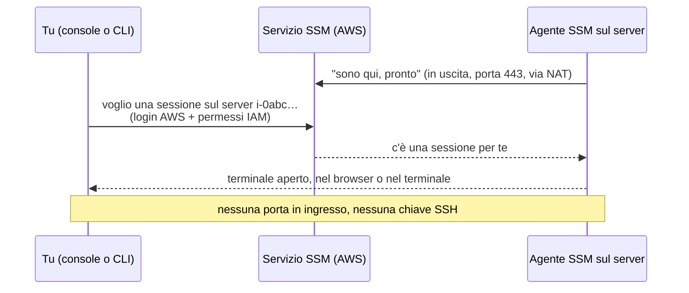

# Dispensa 4 – EC2: il server

*Corso: Infrastruttura AWS con Terraform*

## Obiettivo

Abbiamo la rete (dispensa 2) e i firewall (dispensa 3). Ora mettiamo dentro la prima cosa che "lavora": **il server dell'applicazione**.

Alla fine di questa dispensa:

- sai cos'è un server **EC2** e da cosa nasce: l'**immagine** (AMI) e il **tipo** di macchina;
- sai far installare e avviare l'applicazione al primo avvio, con lo script **`user_data`**;
- sai dare al server un **role** (dispensa 1) tramite l'**instance profile**;
- sai entrare nel server con **SSM Session Manager**, **senza SSH**, senza chiavi e senza porte aperte;
- hai un server nella subnet privata che risponde sulla porta 8080, pronto per la dispensa 5.

---

## Prima di iniziare

- Si lavora nella **stessa cartella** `infra/`: questa dispensa aggiunge il file `ec2.tf` e una variabile.
- Servono la rete della dispensa 2 (`aws_subnet.private`) e il Security Group `app` della dispensa 3 (`aws_security_group.app`).
- Rinnova il login: `aws sso login --profile corso` ed `export AWS_PROFILE=corso`.
- **Costi:** un server EC2 si paga **a ore** finché è acceso, e il suo disco si paga anche quando è spento. A questo si aggiunge il NAT della dispensa 2. Usiamo il server più piccolo che basta e chiudiamo con `terraform destroy`.

---

## 1. Il problema

Ci serve un server su cui far girare l'applicazione. Vogliamo che:

| Requisito | Perché |
|---|---|
| stia nella **subnet privata**, senza indirizzo pubblico | da internet non deve essere raggiungibile (dispensa 2) |
| indossi il **Security Group `app`** | riceve solo la 8080 dalla VPN, esce solo sulla 443 e verso il database (dispensa 3) |
| **installi l'applicazione da solo** al primo avvio | niente configurazioni fatte a mano, ripetibili ogni volta |
| abbia dei **permessi AWS** senza chiavi scritte dentro | deve parlare con i servizi AWS in modo sicuro (dispensa 1) |
| si possa **entrare per manutenzione** senza aprire porte | niente SSH, niente chiavi da custodire |

Vediamo un pezzo alla volta.

---

## 2. Cos'è un server EC2

**EC2** (*Elastic Compute Cloud*) è il servizio AWS dei **server virtuali**: computer che non vedi e non tocchi, ma che si comportano come un computer vero, con processore, memoria, disco e scheda di rete. Ogni server EC2 si chiama **istanza**.

Per crearne uno servono soprattutto due scelte:

| Scelta | Cos'è | Analogia |
|---|---|---|
| **AMI** (*Amazon Machine Image*) | l'**immagine** di partenza: il sistema operativo già installato | il disco di installazione |
| **Tipo di istanza** | **quanta potenza**: processori e memoria | il modello di computer che compri |

### L'AMI: con cosa parte il server

Usiamo **Amazon Linux 2023**, la versione di Linux preparata da AWS. Ha già dentro quello che ci serve, in particolare l'**agente SSM** (sezione 5).

Ogni regione ha AMI con un **ID** diverso, e AWS ne pubblica di nuove ogni poche settimane, con gli aggiornamenti di sicurezza. Invece di scrivere a mano un ID che invecchia, lo chiediamo ad AWS: AWS pubblica l'ID dell'ultima versione in un **parametro** con un nome fisso, e Terraform lo legge con un *data source* (sezione 7).

### Il tipo di istanza: quanta potenza

Il nome di un tipo di istanza si legge così:

```
t4g.micro
│││  └── la taglia: nano, micro, small, medium, large…
││└──── g = processore Graviton (ARM), di AWS: costa meno a parità di prestazioni
│└───── 4 = la generazione
└────── t = la famiglia: "a consumo variabile", per carichi leggeri
```

Per il corso basta un `t4g.micro`. Lo mettiamo in una **variabile**, così in produzione si può scegliere un server più grande cambiando solo il tfvars.

---

## 3. Il primo avvio: `user_data`

Quando un server parte per la prima volta, può eseguire uno **script** che gli passiamo noi: si chiama **`user_data`**. È lo strumento per far installare e avviare l'applicazione da sola, senza entrare a mano.

> **Analogia.** Il `user_data` è il **foglio di istruzioni** lasciato sulla scrivania del nuovo arrivato: il primo giorno lo legge e lo esegue, poi non lo guarda più.

Nel corso l'applicazione è finta: una pagina web che risponde sulla porta **8080**. Il nostro script:

1. crea una cartella con una pagina `index.html`;
2. crea un **servizio** di sistema che pubblica la cartella sulla porta 8080 (con un piccolo server web già incluso in Python);
3. lo avvia e lo fa ripartire da solo a ogni riavvio.

Due regole da sapere:

- lo script gira **una volta sola**, al primo avvio, come amministratore (*root*);
- se cambi lo script, il server già acceso **non** lo rilegge. Per questo diciamo a Terraform di **ricreare** il server quando lo script cambia (sezione 7).

Nella dispensa 8 il `user_data` installerà l'applicazione vera, scaricandola da S3.

---

## 4. I permessi del server: role e instance profile

Il server deve parlare con dei servizi AWS: con SSM per farci entrare (sezione 5) e, più avanti, con S3 e Secrets Manager. Per farlo gli servono dei **permessi**.

La strada sbagliata sarebbe scrivere delle chiavi di accesso dentro il server. La strada giusta l'abbiamo vista nella dispensa 1: un **role**, assunto dal servizio EC2, con credenziali **temporanee** che si rinnovano da sole.

Servono tre pezzi:

| Pezzo | Cosa fa | Dalla dispensa 1 |
|---|---|---|
| **Trust policy** del role | "il **servizio EC2** può assumere questo role" | la lista della reception (domanda 4 della dispensa 1!) |
| **Permission policy** | cosa può fare: qui, farsi gestire da SSM | le porte che il badge apre |
| **Instance profile** | il "porta-badge" che attacca il role al server | — novità |

L'**instance profile** è un piccolo contenitore che serve solo a una cosa: collegare un role a un'istanza EC2. Un server non indossa un role direttamente: indossa un instance profile, che contiene il role.

Come permission policy usiamo `AmazonSSMManagedInstanceCore`: è una policy **già pronta di AWS** (*AWS managed*, dispensa 1), con esattamente i permessi che servono all'agente SSM. È uno dei rari casi in cui una policy pronta va bene così com'è.

---

## 5. Entrare nel server senza SSH: SSM Session Manager

Il modo classico per entrare in un server Linux è **SSH**: si apre la porta 22 e ci si collega con una **chiave privata**. Ha tre problemi:

- bisogna **aprire una porta** in ingresso, e raggiungerla (il server è in una subnet privata!);
- bisogna **custodire le chiavi**, distribuirle, revocarle quando qualcuno se ne va;
- è difficile sapere **chi ha fatto cosa**.

**SSM Session Manager** (SSM = *Systems Manager*) rovescia il problema. Sul server gira un piccolo programma, l'**agente SSM**, già incluso in Amazon Linux. L'agente **chiama lui** il servizio SSM, in uscita sulla porta 443 (passando dal NAT). Quando vuoi entrare, chiedi ad AWS una sessione, e AWS la "aggancia" alla connessione che l'agente ha già aperto.



| | SSH | SSM Session Manager |
|---|---|---|
| Porte in ingresso | la 22, aperta | **nessuna** |
| Chiavi da custodire | una chiave privata per persona | **nessuna**: usa il login AWS (con MFA) |
| Chi può entrare | chi ha la chiave | chi ha il **permesso IAM** |
| Registro di chi entra | da configurare | ogni sessione è registrata da AWS |

Cosa serve perché funzioni, e lo abbiamo già quasi tutto:

1. l'**agente SSM** sul server: c'è già, in Amazon Linux 2023;
2. il **role** con `AmazonSSMManagedInstanceCore` (sezione 4);
3. l'**uscita sulla 443** verso i servizi AWS: il SG `app` ce l'ha (dispensa 3), e la subnet privata esce dal NAT (dispensa 2).

Per i collegamenti di rete veri e propri (aprire l'applicazione sulla 8080 dal tuo browser, collegarsi al database) useremo invece la VPN della dispensa 5.

---

## 6. Due impostazioni di sicurezza in più

**Il disco cifrato.** Il disco del server (un volume **EBS**, *Elastic Block Store*) lo chiediamo **cifrato**: se qualcuno ottenesse una copia del disco, senza la chiave non potrebbe leggerlo. Non costa niente in più e non rallenta.

**IMDSv2.** Ogni server EC2 può fare domande su sé stesso a un indirizzo interno speciale, il **servizio dei metadati** (IMDS): "qual è il mio ID?", "quali sono le credenziali del mio role?". La versione 2 (IMDSv2) richiede un "biglietto" a ogni richiesta e protegge da una famiglia di attacchi che cercano di rubare le credenziali del role. La rendiamo **obbligatoria**.

---

## 7. Il codice Terraform

### variables.tf (aggiunta)

```hcl
variable "instance_type" {
  description = "Tipo del server dell'applicazione"
  type        = string
  default     = "t4g.micro"
}
```

### ec2.tf

```hcl
# ---------------------------------------------------------------
# L'immagine: l'ultima Amazon Linux 2023 per processori ARM
# ---------------------------------------------------------------

data "aws_ssm_parameter" "al2023" {
  name = "/aws/service/ami-amazon-linux-latest/al2023-ami-kernel-default-arm64"
}

# ---------------------------------------------------------------
# I permessi del server: role + instance profile
# ---------------------------------------------------------------

data "aws_iam_policy_document" "ec2_trust" {
  statement {
    actions = ["sts:AssumeRole"]
    principals {
      type        = "Service"
      identifiers = ["ec2.amazonaws.com"]
    }
  }
}

resource "aws_iam_role" "app" {
  name               = "${var.project}-app-server"
  assume_role_policy = data.aws_iam_policy_document.ec2_trust.json
}

resource "aws_iam_role_policy_attachment" "app_ssm" {
  role       = aws_iam_role.app.name
  policy_arn = "arn:aws:iam::aws:policy/AmazonSSMManagedInstanceCore"
}

resource "aws_iam_instance_profile" "app" {
  name = "${var.project}-app-server"
  role = aws_iam_role.app.name
}

# ---------------------------------------------------------------
# Il server dell'applicazione
# ---------------------------------------------------------------

resource "aws_instance" "app" {
  ami                    = data.aws_ssm_parameter.al2023.insecure_value
  instance_type          = var.instance_type
  subnet_id              = aws_subnet.private[local.azs[0]].id
  vpc_security_group_ids = [aws_security_group.app.id]
  iam_instance_profile   = aws_iam_instance_profile.app.name

  associate_public_ip_address = false

  root_block_device {
    volume_type = "gp3"
    volume_size = 8
    encrypted   = true
  }

  metadata_options {
    http_tokens = "required" # IMDSv2 obbligatorio
  }

  user_data_replace_on_change = true
  user_data                   = <<-EOF
    #!/bin/bash
    mkdir -p /opt/app
    echo "<h1>Ciao dal server di ${var.project}</h1>" > /opt/app/index.html

    cat > /etc/systemd/system/app.service <<'UNIT'
    [Unit]
    Description=Applicazione del corso
    After=network-online.target

    [Service]
    ExecStart=/usr/bin/python3 -m http.server 8080 --directory /opt/app
    Restart=always

    [Install]
    WantedBy=multi-user.target
    UNIT

    systemctl daemon-reload
    systemctl enable --now app
  EOF

  tags = { Name = "${var.project}-app" }

  lifecycle {
    ignore_changes = [ami]
  }
}
```

### outputs.tf (aggiunte)

```hcl
output "app_instance_id" {
  value = aws_instance.app.id
}

output "app_private_ip" {
  value = aws_instance.app.private_ip
}
```

### Cosa fa questo codice, blocco per blocco

**`data "aws_ssm_parameter" "al2023"`** legge un **parametro pubblicato da AWS** (nel servizio SSM Parameter Store) che contiene l'ID dell'ultima AMI Amazon Linux 2023 per processori ARM (`arm64`, come i Graviton del `t4g`). Il suo attributo `insecure_value` è l'ID, per esempio `ami-0abc…`: "insecure" vuol dire solo che Terraform lo mostra in chiaro (l'altro attributo, `value`, lo nasconde come se fosse un segreto, ma un ID di AMI non lo è). È un `data`: non crea niente, legge.

**`data "aws_iam_policy_document" "ec2_trust"`** è la **trust policy** (dispensa 1): `principals` di tipo `"Service"` con `ec2.amazonaws.com` vuol dire "il servizio EC2 può assumere questo role". È esattamente la risposta alla domanda 4 della dispensa 1.

**`aws_iam_role.app`** crea il role con quella trust policy. **`aws_iam_role_policy_attachment.app_ssm`** gli attacca la policy pronta di AWS `AmazonSSMManagedInstanceCore`: per le policy AWS managed l'ARN si scrive per intero, e ha `aws` al posto del numero di account (`arn:aws:iam::aws:policy/…`).

**`aws_iam_instance_profile.app`** è il "porta-badge": contiene il role (`role = aws_iam_role.app.name`) e si attacca al server.

**`aws_instance.app`** è il server. Gli argomenti:

| Argomento | Valore | Significato |
|---|---|---|
| `ami` | `data.aws_ssm_parameter.al2023.insecure_value` | l'immagine di partenza |
| `instance_type` | `var.instance_type` | quanta potenza: `t4g.micro` |
| `subnet_id` | la subnet privata della prima AZ | dove sta: `local.azs[0]` vale `"eu-south-1a"` |
| `vpc_security_group_ids` | `[aws_security_group.app.id]` | il SG della dispensa 3 (una lista) |
| `iam_instance_profile` | `aws_iam_instance_profile.app.name` | il porta-badge con il role |
| `associate_public_ip_address` | `false` | nessun indirizzo pubblico |

Nota cosa **manca**: non c'è `key_name`, cioè nessuna chiave SSH. Non ne abbiamo bisogno.

Il blocco **`root_block_device`** descrive il disco: tipo `gp3` (il disco SSD standard di AWS), 8 GB, **cifrato**. Il blocco **`metadata_options`** con `http_tokens = "required"` rende obbligatorio IMDSv2 (sezione 6).

**Il `user_data`** è scritto con un *heredoc*: `<<-EOF` apre un testo su più righe, che finisce alla riga `EOF`. Il trattino in `<<-` permette di indentare il testo senza che gli spazi finiscano nello script. Dentro:

- `${var.project}` è un'interpolazione di **Terraform** (dispensa 0): nello script finisce già sostituita, `corso-aws`;
- `cat > … <<'UNIT' … UNIT` è un secondo heredoc, questa volta di **bash**: scrive il file del servizio. Il file dice: esegui `python3 -m http.server 8080 --directory /opt/app` (un piccolo server web incluso in Python, che pubblica la cartella sulla porta 8080) e riavvialo sempre se si ferma;
- `systemctl enable --now app` attiva il servizio e lo avvia subito.

`user_data_replace_on_change = true` dice a Terraform: se lo script cambia, **ricrea** il server, perché uno script cambiato su un server già acceso non verrebbe rieseguito.

**`lifecycle { ignore_changes = [ami] }`** risolve un problema sottile. Il parametro di AWS cambia ogni volta che esce una nuova AMI. Senza questa riga, al primo `plan` dopo un aggiornamento Terraform vedrebbe un'AMI diversa e proporrebbe di **ricreare il server** (`-/+`, dispensa 0). Con `ignore_changes` Terraform usa l'AMI aggiornata solo quando il server viene creato da zero, e non lo tocca per questo motivo. Aggiornare l'AMI diventa una scelta tua, non una sorpresa.

---

## 8. Esercizio

Obiettivo: creare il server, entrarci con SSM, verificare l'applicazione e i firewall dall'interno.

### Passi

1. **`terraform plan`**: le risorse nuove sono il role, l'attachment, l'instance profile e il server. Quale AMI verrà usata? Nel `plan` cerca la riga `ami` del server: è l'ID letto dal parametro di AWS.
2. **`terraform apply`**. Il server è pronto in un paio di minuti. In console: **EC2 → Instances**. Ha un indirizzo pubblico? (Atteso: no, solo `10.20.10.x`.)
3. **Entra con SSM.** In console: seleziona l'istanza → **Connect** → scheda **Session Manager** → **Connect**. Si apre un terminale nel browser. (Se il pulsante è grigio, aspetta qualche minuto: l'agente si sta registrando.) In alternativa, dalla CLI, dopo aver installato il *Session Manager plugin*:

   ```bash
   aws ssm start-session --target $(terraform output -raw app_instance_id)
   ```

4. **L'applicazione.** Nel terminale del server:

   ```bash
   curl http://localhost:8080
   ```

   (Atteso: `<h1>Ciao dal server di corso-aws</h1>`.) Controlla anche il servizio: `systemctl status app`.
5. **I firewall, dall'interno.** Sempre nel server:

   ```bash
   curl -sI https://aws.amazon.com | head -1      # porta 443 verso internet
   curl -sI --max-time 5 http://example.com        # porta 80 verso internet
   ```

   (Atteso: la prima risponde, `HTTP/2 200`; la seconda **resta in attesa e scade**. Perché? Il SG `app` in uscita consente solo la 443, dispensa 3.)
6. **Chi sono?** Nel server: `aws sts get-caller-identity`. (Atteso: un ARN `assumed-role/corso-aws-app-server/i-0abc…`. Il server usa il role, con credenziali temporanee che nessuno ha scritto da nessuna parte.)
7. **Il `user_data`.** Cambia il testo della pagina nel `user_data` e lancia `terraform plan`. Cosa propone, e perché? (Atteso: `-/+`, il server viene ricreato: `user_data_replace_on_change`.) Applica e verifica di nuovo il passo 4 con una nuova sessione.
8. **Chi è entrato.** In console: **Systems Manager → Session Manager → Session history**. Trovi le tue sessioni?
9. **Pulizia:** `terraform destroy`, oppure lascia tutto acceso se fai subito la dispensa 5, che usa questo server.

### Domande di verifica

1. Cosa sono l'AMI e il tipo di istanza? Cosa vuol dire `t4g.micro`?
2. Quando viene eseguito il `user_data`? Cosa succede se lo modifichi?
3. A cosa serve l'instance profile, se esiste già il role?
4. Perché con SSM non serve aprire nessuna porta in ingresso? Da dove passa la connessione?
5. Cosa succederebbe a SSM se togliessi dal SG `app` la regola in uscita sulla 443?
6. Senza `ignore_changes = [ami]`, cosa vedresti nel `plan` dopo qualche settimana?

---

## Riepilogo

- **EC2** = server virtuali. Un'**istanza** nasce da un'**AMI** (l'immagine, qui Amazon Linux 2023) e da un **tipo** (la potenza, qui `t4g.micro`).
- L'AMI la leggiamo da un **parametro pubblicato da AWS**, con `ignore_changes = [ami]` per non ricreare il server a ogni nuova versione.
- Il **`user_data`** è lo script del primo avvio: installa e avvia l'applicazione. Se cambia, il server va ricreato.
- I permessi arrivano da un **role** assunto da EC2, attaccato al server con l'**instance profile**. Nessuna chiave dentro il server.
- **SSM Session Manager**: si entra nel server senza SSH, senza porte aperte, con il login AWS e un registro di chi è entrato.
- Server nella **subnet privata**, senza IP pubblico, con il **SG `app`**, disco **cifrato** e **IMDSv2** obbligatorio.
