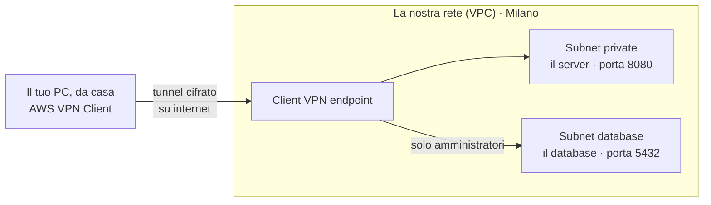
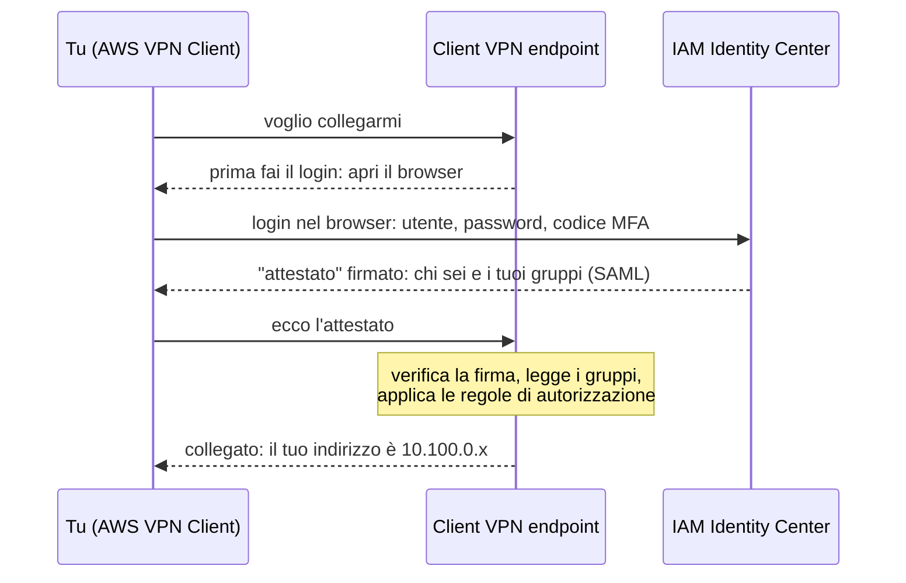
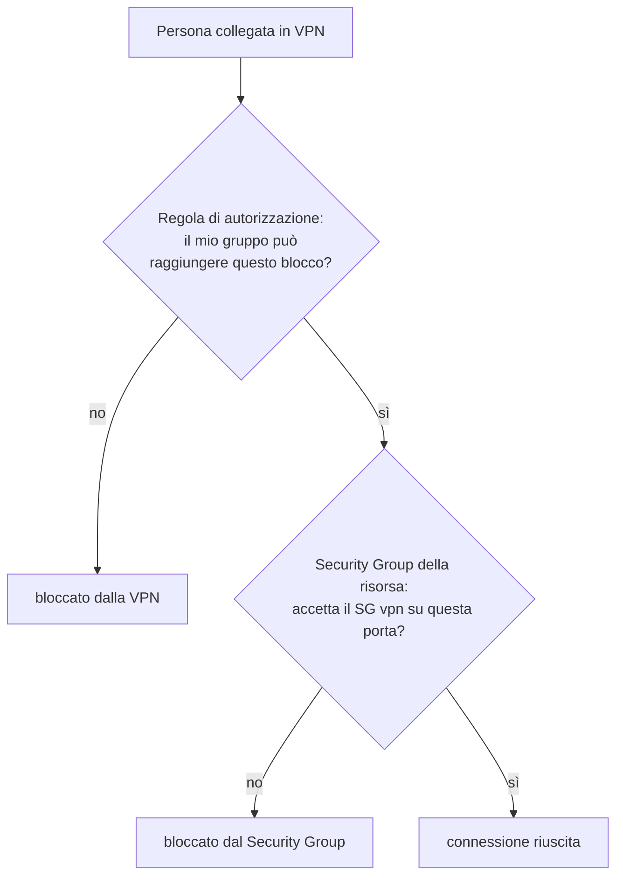

# Dispensa 4 – Accesso remoto: Client VPN con MFA

*Corso: Infrastruttura AWS con Terraform*

## Obiettivo

La nostra rete è privata: il server (dispensa 5) e il database (dispensa 6) non sono raggiungibili da internet, e va benissimo così. Ma gli amministratori e gli sviluppatori, da casa o dall'ufficio, devono poterci lavorare.

Alla fine di questa dispensa:

- sai cos'è una VPN e cosa fa **AWS Client VPN**;
- sai perché serve un **certificato** e cosa contiene;
- conosci i tre modi di riconoscere chi si collega e perché scegliamo il **login aziendale con MFA** (SAML);
- sai dare permessi diversi per **gruppo**: gli amministratori raggiungono anche il database, gli sviluppatori solo l'applicazione;
- sai cosa vuol dire *split tunnel* e quando usare la VPN invece di SSM;
- hai una VPN funzionante, collegata con il tuo login del corso.

---

## Prima di iniziare

- Si lavora nella **stessa cartella** `infra/`: questa dispensa aggiunge il file `vpn.tf`, alcune variabili e un nuovo provider.
- Servono la rete della dispensa 2 e il Security Group `vpn` della dispensa 3 (`aws_security_group.vpn`).
- Serve **IAM Identity Center**, configurato nella dispensa 0: è lì che gestiamo utenti, gruppi e MFA.
- Ti servirà il programma **AWS VPN Client** sul tuo computer (gratuito, per Windows, macOS e Linux: cerca "AWS VPN Client download").
- Rinnova il login: `aws sso login --profile corso` ed `export AWS_PROFILE=corso`.
- **Costi:** la Client VPN si paga **a ore per ogni subnet collegata**, anche se nessuno è connesso, più **a ore per ogni persona connessa**. A questo si aggiunge il NAT della dispensa 2. Alla fine dell'esercizio: `terraform destroy`.

---

## 1. Il problema

Riprendiamo la tabella della dispensa 3:

| Chi | Verso | Ammesso? |
|---|---|---|
| Un amministratore, da casa | il database, porta 5432 | **sì** |
| Uno sviluppatore, da casa | l'applicazione, porta 8080 | **sì** |
| Uno sviluppatore, da casa | il database | **no** |
| Chiunque altro, da internet | qualunque cosa | **no** |

Il problema: chi lavora da casa è **su internet**, e la nostra rete da internet non si raggiunge (dispensa 2: indirizzi privati, nessuna rotta in ingresso). Aprire il database a internet sarebbe la cosa peggiore da fare. Serve un modo per far **entrare nella rete privata** solo le persone giuste, dopo averle riconosciute con certezza.

---

## 2. Cos'è una VPN

Una **VPN** (*Virtual Private Network*, rete privata virtuale) è un collegamento **cifrato** tra il tuo computer e una rete lontana. Una volta collegato, il tuo computer si comporta come se fosse **dentro** quella rete: riceve un indirizzo della rete e può raggiungere le sue risorse.

> **Analogia.** La nostra rete è un edificio senza porte verso la strada (dispensa 2). La VPN è un **tunnel sotterraneo** privato che parte da casa tua e sbuca dentro l'edificio. All'imbocco del tunnel c'è un **controllo documenti**: chi non è riconosciuto non entra. E dentro, il tuo badge apre solo certi piani.

**AWS Client VPN** è il servizio di AWS che fa da "imbocco del tunnel" dal lato della nostra rete. Si chiama *endpoint*: è il punto a cui si collegano i computer delle persone.



Cosa serve per costruirlo, e lo vediamo uno per uno:

1. un **indirizzo** per chi si collega (sezione 3);
2. un **certificato**, la carta d'identità del server VPN (sezione 4);
3. un modo per **riconoscere chi si collega** (sezione 5);
4. le **regole per gruppo**: chi può raggiungere cosa (sezione 6);
5. le **subnet** a cui collegare il tunnel e il **Security Group** (sezione 7).

---

## 3. Gli indirizzi di chi si collega

Ogni computer collegato in VPN riceve un indirizzo IP, preso da un blocco dedicato: il **client CIDR**. Nel corso è `10.100.0.0/22` (1.024 indirizzi; AWS chiede almeno un `/22`).

Perché **fuori** dalla rete `10.20.0.0/16`? Perché il blocco dei client **non deve sovrapporsi** né alla rete AWS né alla rete di casa di chi si collega (dispensa 2, "Pianificare prima di scrivere codice"): altrimenti il computer non saprebbe più dove mandare i pacchetti. `10.100.x.x` non è usato da nessuna delle due.

Un dettaglio utile: quando il traffico di un utente VPN entra nella nostra rete, AWS gli **cambia il mittente** con l'indirizzo dell'endpoint nella subnet a cui è collegato (sezione 7). Per il database, quindi, una connessione dalla VPN sembra arrivare da una **subnet privata**: per questo la NACL della dispensa 3 la lascia passare.

---

## 4. Il certificato: la carta d'identità del server

Quando ti colleghi, il tuo computer deve essere sicuro di parlare con **la nostra** VPN e non con un impostore che si finge lei. Per questo il server VPN presenta un **certificato**: un documento digitale che dice "io sono `vpn.corso-aws.internal`", con la **firma** di un'autorità che lo garantisce.

> **Analogia.** Il certificato è la carta d'identità del server. L'autorità che la firma (*CA*, *Certificate Authority*) è il "comune" che l'ha rilasciata. Il tuo computer si fida della carta perché si fida del comune.

Su internet le CA sono aziende riconosciute da tutti i browser. Per una VPN interna non serve: creiamo **una CA nostra**, che firma il certificato del server. Il file di configurazione che scaricherai per il client conterrà la nostra CA, così il tuo computer saprà di potersi fidare.

Tutto questo lo fa Terraform con il provider **`hashicorp/tls`**, che sa generare chiavi e certificati. Il certificato poi va caricato in **ACM** (*AWS Certificate Manager*), il servizio AWS che custodisce i certificati: la VPN lo prende da lì.

**Da sapere:** le chiavi private generate da Terraform finiscono nello **state**. È uno dei motivi per cui, dalla dispensa 0, lo state sta in un bucket cifrato, fuori da Git e con accesso ristretto.

---

## 5. Riconoscere chi si collega: tre possibilità

Il certificato dimostra chi è il **server**. Ora bisogna dimostrare chi è la **persona**. Client VPN offre tre modi:

| Modo | Come funziona | MFA | Gruppi | Quando |
|---|---|---|---|---|
| **Certificato per persona** (*mutual TLS*) | ogni persona ha un suo certificato installato sul computer | no | no | pochi utenti tecnici, nessun sistema di login aziendale |
| **Active Directory** | utente e password del dominio Windows aziendale | sì, con un server RADIUS in più | sì | aziende con Active Directory |
| **Login aziendale** (*SAML*) | si apre il browser e si fa il login sul sistema aziendale (IdP) | **sì, gestita dall'IdP** | **sì** | **la scelta del corso** |

Scegliamo il **login aziendale** perché:

- l'**MFA** (il codice dal telefono) la chiede già il sistema di login: niente da configurare nella VPN;
- i **gruppi** (amministratori, sviluppatori) arrivano dal sistema di login: si gestiscono in un posto solo;
- quando una persona lascia l'azienda, si disattiva il suo utente e **perde subito anche la VPN**. Con i certificati per persona, invece, bisognerebbe ricordarsi di revocare il suo certificato.

Il nostro sistema di login è **IAM Identity Center**, lo stesso della dispensa 0. **SAML** è il "linguaggio" standard con cui il sistema di login dice alla VPN: "ho controllato io, questa è Maria, ha fatto l'MFA, e appartiene al gruppo amministratori".

Ecco cosa succede quando ti colleghi:



---

## 6. Le regole per gruppo

Una volta riconosciuta la persona, la VPN decide **cosa può raggiungere**. Lo fanno le **regole di autorizzazione** (*authorization rules*): ognuna dice "**questo gruppo** può raggiungere **questo blocco di indirizzi**".

Il nostro piano:

| Blocco | Cosa c'è | Gruppo `vpn-admin` | Gruppo `vpn-dev` |
|---|---|---|---|
| `10.20.0.2/32` | il DNS della rete (la "rubrica", dispensa 2) | **sì** | **sì** |
| `10.20.10.0/24`, `10.20.11.0/24` | subnet private: il server dell'applicazione | **sì** | **sì** |
| `10.20.20.0/24`, `10.20.21.0/24` | subnet database | **sì** | no |

Tre osservazioni:

- **Il DNS** sta a `10.20.0.2` (il secondo indirizzo della rete: dispensa 2, "Gli indirizzi che AWS si tiene"), dentro una subnet pubblica. Senza una regola apposita, chi è in VPN non potrebbe usare i nomi, come quello del database.
- **Ogni blocco ha le sue regole esplicite**, per ciascun gruppo. Potremmo dare agli amministratori tutto `10.20.0.0/16` con una regola sola, ma quando più regole riguardano lo stesso indirizzo Client VPN applica la **più specifica**: la regola `/24` degli sviluppatori "vincerebbe" su quella `/16` degli amministratori, e gli amministratori resterebbero fuori dalle subnet private. Con regole esplicite per blocco il problema non esiste.
- **Le regole di autorizzazione e i Security Group lavorano insieme.** L'autorizzazione dice chi può *provare* a raggiungere un blocco. Poi il Security Group della risorsa (dispensa 3) dice se la connessione è accettata: il SG `db` accetta la 5432 dal SG `vpn`. Servono tutti e due.



---

## 7. Dove si aggancia il tunnel: subnet e Security Group

L'endpoint, da solo, non è dentro la rete. Va **collegato a delle subnet** (*network association*): in ognuna AWS crea una "presa di rete" dell'endpoint, da cui il traffico degli utenti entra nella rete. Lo colleghiamo alle **subnet private**, una per AZ: se un data center ha un problema, la VPN continua a funzionare dall'altro.

Ogni collegamento a una subnet **si paga a ore**, anche se nessuno è connesso: è la voce di costo principale. In laboratorio, finito l'esercizio, si distrugge.

L'endpoint indossa il **Security Group `vpn`** della dispensa 3: in uscita può raggiungere tutta la nostra rete, ma niente fuori. Ed è proprio questo SG che il database e l'applicazione riconoscono nelle loro regole.

---

## 8. Split tunnel: cosa passa dalla VPN

Quando sei collegato, il traffico del tuo computer può seguire due strade:

| | **Split tunnel** (la nostra scelta) | **Full tunnel** |
|---|---|---|
| Cosa passa dalla VPN | **solo** il traffico verso la nostra rete (`10.20.x.x`) | **tutto**, anche YouTube e la posta |
| Il resto di internet | esce direttamente da casa tua | esce da AWS, tramite la nostra rete |
| Vantaggi | veloce, e paghi meno traffico | tutto il traffico è controllabile dall'azienda |
| Cosa serve in più | niente | rotte e regole verso internet, uscita dal NAT |

Per un corso, e per la maggior parte dei casi d'uso tecnici, lo **split tunnel** è la scelta giusta: alla VPN interessa solo il traffico verso la nostra rete. Il nostro SG `vpn`, che in uscita raggiunge solo `10.20.0.0/16`, con un full tunnel non funzionerebbe nemmeno.

---

## 9. VPN o SSM: quando usare cosa

Nella dispensa 5 vedremo **SSM Session Manager**, un servizio AWS per aprire un terminale su un server **senza VPN e senza SSH**: passa dal login AWS e dalla porta 443 in uscita del server. Allora a cosa serve la VPN?

| Devo… | Strumento |
|---|---|
| aprire un terminale sul server, lanciare comandi | **SSM Session Manager** (dispensa 5) |
| collegarmi al database con un programma (psql, DBeaver…) | **VPN** |
| aprire l'applicazione nel browser (porta 8080) | **VPN** |
| lavorare con strumenti che "parlano" in rete con più risorse | **VPN** |

In breve: **SSM per i comandi sul server, VPN per tutto ciò che è un collegamento di rete**.

---

## 10. Il codice Terraform

### providers.tf (aggiunta)

Nel blocco `required_providers`, accanto ad `aws` e `random`:

```hcl
    tls = {
      source  = "hashicorp/tls"
      version = "~> 4.0"
    }
```

Dopo questa modifica va rilanciato `terraform init`: c'è un provider nuovo da scaricare.

### variables.tf (aggiunte)

```hcl
variable "vpn_client_cidr" {
  description = "Indirizzi per chi si collega in VPN (fuori dal VPC)"
  type        = string
  default     = "10.100.0.0/22"
}

variable "vpn_admin_group_id" {
  description = "ID del gruppo vpn-admin in IAM Identity Center"
  type        = string
}

variable "vpn_dev_group_id" {
  description = "ID del gruppo vpn-dev in IAM Identity Center"
  type        = string
}
```

I due ID dei gruppi non hanno un `default`: sono obbligatori e vanno scritti nel `terraform.tfvars` (esercizio, passo 3).

### vpn.tf

```hcl
# ---------------------------------------------------------------
# 1. Il certificato del server, firmato da una CA nostra
# ---------------------------------------------------------------

# La CA: la "autorità" che firma
resource "tls_private_key" "vpn_ca" {
  algorithm = "RSA"
  rsa_bits  = 2048
}

resource "tls_self_signed_cert" "vpn_ca" {
  private_key_pem       = tls_private_key.vpn_ca.private_key_pem
  is_ca_certificate     = true
  validity_period_hours = 87600 # 10 anni
  allowed_uses          = ["cert_signing", "crl_signing"]

  subject {
    common_name = "${var.project}-vpn-ca"
  }
}

# Il server: la sua chiave, la richiesta e il certificato firmato dalla CA
resource "tls_private_key" "vpn_server" {
  algorithm = "RSA"
  rsa_bits  = 2048
}

resource "tls_cert_request" "vpn_server" {
  private_key_pem = tls_private_key.vpn_server.private_key_pem
  dns_names       = ["vpn.${var.project}.internal"]

  subject {
    common_name = "vpn.${var.project}.internal"
  }
}

resource "tls_locally_signed_cert" "vpn_server" {
  cert_request_pem      = tls_cert_request.vpn_server.cert_request_pem
  ca_private_key_pem    = tls_private_key.vpn_ca.private_key_pem
  ca_cert_pem           = tls_self_signed_cert.vpn_ca.cert_pem
  validity_period_hours = 8760 # 1 anno
  allowed_uses          = ["key_encipherment", "digital_signature", "server_auth"]
}

# Il certificato caricato in ACM, dove la VPN lo va a prendere
resource "aws_acm_certificate" "vpn_server" {
  private_key       = tls_private_key.vpn_server.private_key_pem
  certificate_body  = tls_locally_signed_cert.vpn_server.cert_pem
  certificate_chain = tls_self_signed_cert.vpn_ca.cert_pem
}

# ---------------------------------------------------------------
# 2. Il login aziendale: IAM Identity Center via SAML
# ---------------------------------------------------------------

resource "aws_iam_saml_provider" "vpn" {
  name                   = "${var.project}-vpn"
  saml_metadata_document = file("${path.module}/vpn-saml-metadata.xml")
}

# ---------------------------------------------------------------
# 3. Il registro delle connessioni
# ---------------------------------------------------------------

resource "aws_cloudwatch_log_group" "vpn" {
  name              = "/${var.project}/client-vpn"
  retention_in_days = 30
}

resource "aws_cloudwatch_log_stream" "vpn" {
  name           = "connessioni"
  log_group_name = aws_cloudwatch_log_group.vpn.name
}

# ---------------------------------------------------------------
# 4. L'endpoint: l'imbocco del tunnel
# ---------------------------------------------------------------

resource "aws_ec2_client_vpn_endpoint" "main" {
  description            = "${var.project}-vpn"
  server_certificate_arn = aws_acm_certificate.vpn_server.arn
  client_cidr_block      = var.vpn_client_cidr
  vpc_id                 = aws_vpc.main.id
  security_group_ids     = [aws_security_group.vpn.id]
  split_tunnel           = true
  dns_servers            = [cidrhost(var.vpc_cidr, 2)]
  session_timeout_hours  = 8

  authentication_options {
    type              = "federated-authentication"
    saml_provider_arn = aws_iam_saml_provider.vpn.arn
  }

  connection_log_options {
    enabled               = true
    cloudwatch_log_group  = aws_cloudwatch_log_group.vpn.name
    cloudwatch_log_stream = aws_cloudwatch_log_stream.vpn.name
  }

  tags = { Name = "${var.project}-vpn" }
}

# ---------------------------------------------------------------
# 5. Il collegamento alle subnet private, una per AZ
# ---------------------------------------------------------------

resource "aws_ec2_client_vpn_network_association" "private" {
  for_each = aws_subnet.private

  client_vpn_endpoint_id = aws_ec2_client_vpn_endpoint.main.id
  subnet_id              = each.value.id
}

# ---------------------------------------------------------------
# 6. Le regole per gruppo
# ---------------------------------------------------------------

# Il DNS della rete: per tutti
resource "aws_ec2_client_vpn_authorization_rule" "dns" {
  client_vpn_endpoint_id = aws_ec2_client_vpn_endpoint.main.id
  target_network_cidr    = "${cidrhost(var.vpc_cidr, 2)}/32"
  authorize_all_groups   = true
  description            = "DNS della rete"
}

# Le subnet private: amministratori e sviluppatori
resource "aws_ec2_client_vpn_authorization_rule" "private_admin" {
  for_each = toset(local.private_cidrs)

  client_vpn_endpoint_id = aws_ec2_client_vpn_endpoint.main.id
  target_network_cidr    = each.key
  access_group_id        = var.vpn_admin_group_id
  description            = "Subnet private - amministratori"
}

resource "aws_ec2_client_vpn_authorization_rule" "private_dev" {
  for_each = toset(local.private_cidrs)

  client_vpn_endpoint_id = aws_ec2_client_vpn_endpoint.main.id
  target_network_cidr    = each.key
  access_group_id        = var.vpn_dev_group_id
  description            = "Subnet private - sviluppatori"
}

# Le subnet database: solo amministratori
resource "aws_ec2_client_vpn_authorization_rule" "db_admin" {
  for_each = toset(local.db_cidrs)

  client_vpn_endpoint_id = aws_ec2_client_vpn_endpoint.main.id
  target_network_cidr    = each.key
  access_group_id        = var.vpn_admin_group_id
  description            = "Subnet database - solo amministratori"
}
```

### outputs.tf (aggiunta)

```hcl
output "vpn_endpoint_id" {
  value = aws_ec2_client_vpn_endpoint.main.id
}
```

### Cosa fa questo codice, blocco per blocco

**1. Il certificato.** Sono cinque risorse in catena, e nessuna crea niente in AWS tranne l'ultima:

| Risorsa | Cosa fa | Nell'analogia |
|---|---|---|
| `tls_private_key.vpn_ca` | genera la chiave segreta della CA | il timbro del comune |
| `tls_self_signed_cert.vpn_ca` | crea il certificato della CA, firmato da sé stessa (`is_ca_certificate = true`) | il comune che si dichiara comune |
| `tls_private_key.vpn_server` | genera la chiave segreta del server | — |
| `tls_cert_request.vpn_server` | prepara la "domanda": "sono `vpn.corso-aws.internal`" | il modulo per la carta d'identità |
| `tls_locally_signed_cert.vpn_server` | la CA firma la domanda: nasce il certificato del server | il comune timbra la carta |

`allowed_uses` dice a cosa può servire ogni certificato: quello della CA a firmare (`cert_signing`), quello del server a farsi riconoscere come server (`server_auth`). `validity_period_hours` è la durata in ore: 10 anni per la CA, 1 anno per il server, poi va rinnovato.

**`aws_acm_certificate`** carica in ACM il certificato del server (`certificate_body`), la sua chiave (`private_key`) e il certificato della CA che lo ha firmato (`certificate_chain`). È l'unica risorsa di questo gruppo che esiste davvero in AWS.

**2. Il login.** `aws_iam_saml_provider` registra in AWS il nostro sistema di login. `saml_metadata_document` è il "biglietto da visita" di IAM Identity Center: un file XML che scarichi dalla console (esercizio, passo 2). La funzione `file()` legge il contenuto di un file; `path.module` è la cartella del progetto. Quindi `file("${path.module}/vpn-saml-metadata.xml")` vuol dire "il contenuto del file `vpn-saml-metadata.xml` che sta accanto a `vpn.tf`".

**3. Il registro.** `aws_cloudwatch_log_group` crea in **CloudWatch Logs** (il servizio AWS che raccoglie i registri) una cartella per le connessioni VPN, che tiene i messaggi per 30 giorni (`retention_in_days`). `aws_cloudwatch_log_stream` crea dentro la cartella il "quaderno" su cui la VPN scrive. Ogni connessione lascia una riga: chi, quando, da quale indirizzo, se è riuscita. Serve a sapere chi è entrato, e lo riprendiamo nell'appendice.

**4. L'endpoint.** È il cuore. Gli argomenti:

| Argomento | Valore | Significato |
|---|---|---|
| `server_certificate_arn` | l'ARN del certificato in ACM | la carta d'identità del server (sezione 4) |
| `client_cidr_block` | `10.100.0.0/22` | gli indirizzi per chi si collega (sezione 3) |
| `vpc_id` | `aws_vpc.main.id` | la nostra rete |
| `security_group_ids` | `[aws_security_group.vpn.id]` | il SG della dispensa 3 (una lista: per questo le parentesi quadre) |
| `split_tunnel` | `true` | solo il traffico verso la nostra rete passa dalla VPN (sezione 8) |
| `dns_servers` | `[cidrhost(var.vpc_cidr, 2)]` | la "rubrica" della rete: `cidrhost` calcola il secondo indirizzo, `10.20.0.2` |
| `session_timeout_hours` | `8` | dopo 8 ore la sessione scade e bisogna rifare il login |

Il blocco `authentication_options` sceglie il login aziendale (`federated-authentication`) e indica quale sistema usare (`saml_provider_arn`). Il blocco `connection_log_options` accende il registro e dice dove scriverlo.

**5. Il collegamento alle subnet.** `aws_ec2_client_vpn_network_association` ha `for_each = aws_subnet.private`: un collegamento per ogni subnet privata, cioè uno per AZ (lo stesso meccanismo delle associazioni delle route table nella dispensa 2). Quando colleghi una subnet, AWS aggiunge da solo all'endpoint la **rotta** verso tutta la rete `10.20.0.0/16`: non serve scriverla.

**6. Le regole per gruppo.** Ogni `aws_ec2_client_vpn_authorization_rule` dice: per questo endpoint, chi può raggiungere `target_network_cidr`.

- `authorize_all_groups = true`: tutti quelli che si collegano (regola del DNS).
- `access_group_id`: solo chi appartiene a quel gruppo. È l'**ID del gruppo** in IAM Identity Center, che arriva alla VPN dentro l'attestato SAML.

Il `for_each = toset(local.private_cidrs)` usa le liste di CIDR calcolate nella dispensa 3 (`local.private_cidrs`, `local.db_cidrs`). `toset` le trasforma in set, come richiede `for_each` (dispensa 2): una regola per ogni subnet, per ogni gruppo.

---

## 11. Esercizio

Obiettivo: costruire la VPN, collegarti con il tuo login e MFA, e verificare cosa succede.

Una parte si fa in console, perché IAM Identity Center deve sapere che esiste un'"applicazione" VPN. La parte di rete la fa Terraform.

### Passi

1. **I gruppi.** In console: **IAM Identity Center → Groups → Create group**. Crea `vpn-admin` e `vpn-dev`. Aggiungi il tuo utente a `vpn-admin`. Apri ciascun gruppo e copia il suo **Group ID** (una sequenza di lettere e numeri): servono al passo 3.

2. **L'applicazione SAML.** Sempre in IAM Identity Center: **Applications → Add application → I have an application I want to set up → SAML 2.0**. Poi:

   | Campo | Valore |
   |---|---|
   | Display name | `Client VPN corso` |
   | IAM Identity Center SAML metadata file | **scaricalo**: salvalo nella cartella `infra/` come `vpn-saml-metadata.xml` |
   | Application ACS URL | `http://127.0.0.1:35001` |
   | Application SAML audience | `urn:amazon:webservices:clientvpn` |

   Salva. Poi nell'applicazione: **Actions → Edit attribute mappings** e imposta:

   | Attributo nell'applicazione | Valore | Formato |
   |---|---|---|
   | `Subject` | `${user:email}` | `emailAddress` |
   | `memberOf` | `${user:groups}` | `unspecified` |

   `memberOf` è l'attributo con cui IAM Identity Center comunica i tuoi gruppi alla VPN. Infine **Assign users and groups**: assegna `vpn-admin` e `vpn-dev`.

3. **I valori.** In `terraform.tfvars` aggiungi gli ID copiati al passo 1:

   ```hcl
   vpn_admin_group_id = "incolla-qui-l-id-di-vpn-admin"
   vpn_dev_group_id   = "incolla-qui-l-id-di-vpn-dev"
   ```

4. **`terraform init`** (c'è il provider nuovo `tls`), poi **`terraform plan`**: conta le risorse della VPN. Poi **`terraform apply`**. Il collegamento alle subnet richiede diversi minuti.

5. **Il file di configurazione.** Scarica la configurazione per il client:

   ```bash
   aws ec2 export-client-vpn-client-configuration \
     --client-vpn-endpoint-id $(terraform output -raw vpn_endpoint_id) \
     --output text > corso-vpn.ovpn
   ```

   Apri `corso-vpn.ovpn` con un editor: trovi l'indirizzo dell'endpoint e, tra `<ca>` e `</ca>`, il certificato della nostra CA. È così che il tuo computer saprà di potersi fidare (sezione 4).

6. **Collegati.** Apri **AWS VPN Client → File → Manage profiles → Add profile**, scegli `corso-vpn.ovpn`, poi **Connect**. Si apre il browser: login con il tuo utente del corso e il **codice MFA**. Il client mostra "Connected".

7. **Verifica.**
   - Il tuo indirizzo VPN: su macOS/Linux `ifconfig`, su Windows `ipconfig`. Cerca un indirizzo `10.100.x.x`: sei "dentro".
   - Le connessioni attive, dalla CLI:

     ```bash
     aws ec2 describe-client-vpn-connections \
       --client-vpn-endpoint-id $(terraform output -raw vpn_endpoint_id) \
       --query 'Connections[].[Username,ClientIp,Status.Code]' --output table
     ```

     Atteso: la tua email, un indirizzo `10.100.x.x` e lo stato `active`.
   - Il registro: in console **CloudWatch → Log groups → `/corso-aws/client-vpn` → `connessioni`**. C'è la riga della tua connessione?

8. **Il cambio di gruppo.** Togli il tuo utente da `vpn-admin` e mettilo in `vpn-dev`. Disconnetti e riconnetti. Domanda: quali blocchi di indirizzi puoi raggiungere adesso? (Atteso: DNS e subnet private, non più le subnet database.) La prova "vera", con un client che prova a collegarsi al database, la facciamo nella dispensa 6, quando il database esisterà. Rimetti il tuo utente in `vpn-admin`.

9. **Pulizia.** Disconnetti il client, poi **`terraform destroy`**: la VPN si paga a ore per ogni subnet collegata. In IAM Identity Center puoi lasciare l'applicazione e i gruppi: non costano niente e serviranno nelle dispense 5 e 6.

### Domande di verifica

1. Perché gli indirizzi dei client (`10.100.0.0/22`) stanno fuori dalla rete `10.20.0.0/16`?
2. A cosa serve il certificato del server, se il login lo fa IAM Identity Center?
3. Una collega lascia l'azienda. Cosa devi fare perché non possa più collegarsi in VPN? Cosa avresti dovuto fare con i certificati per persona?
4. Uno sviluppatore è collegato in VPN e prova a raggiungere il database. Chi lo blocca: la VPN o il Security Group? E un amministratore, passa?
5. Perché c'è una regola apposta per `10.20.0.2/32`?
6. Devi lanciare un comando su un server. Usi la VPN o SSM? E per collegarti al database con DBeaver?

---

## Riepilogo

- La **VPN** è un tunnel cifrato dal tuo computer alla rete privata. **AWS Client VPN** ne fornisce l'imbocco: l'**endpoint**.
- Chi si collega riceve un indirizzo dal **client CIDR** `10.100.0.0/22`, fuori dalla rete e dalle reti di casa.
- Il **certificato** è la carta d'identità del server, firmato da una **CA nostra**; Terraform lo genera con il provider `tls` e lo carica in **ACM**. Le chiavi finiscono nello state, che è protetto.
- Il login è **aziendale (SAML)** con **IAM Identity Center**: MFA e gruppi arrivano da lì, e chi esce dall'azienda perde subito la VPN.
- Le **regole di autorizzazione** dicono quale gruppo raggiunge quale blocco: `vpn-admin` anche il database, `vpn-dev` solo le subnet private. Poi decidono i **Security Group**.
- L'endpoint è collegato alle **subnet private** (uno per AZ) e indossa il **SG `vpn`**; ogni collegamento si paga a ore.
- **Split tunnel**: dalla VPN passa solo il traffico verso la nostra rete.
- **SSM** per i comandi sul server, **VPN** per i collegamenti di rete (database, applicazione).
