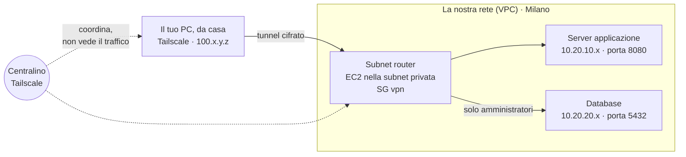
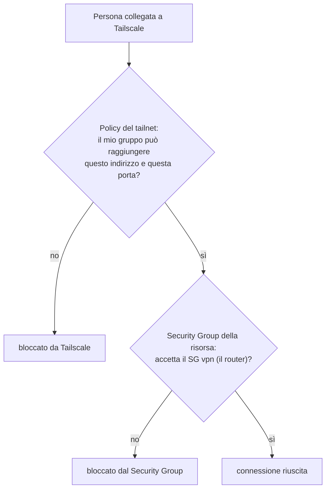

# Dispensa 5 – Accesso remoto: Tailscale

*Corso: Infrastruttura AWS con Terraform*

## Obiettivo

La nostra rete è privata: il server (dispensa 4) e il database (dispensa 6) non sono raggiungibili da internet, e va benissimo così. Ma gli amministratori e gli sviluppatori, da casa o dall'ufficio, devono poterci lavorare.

Alla fine di questa dispensa:

- sai cos'è una **VPN** e come funziona **Tailscale**;
- sai cos'è un **subnet router** e perché ne serve uno per raggiungere la rete AWS;
- sai come Tailscale riconosce chi si collega, con il login di **Google, Microsoft o GitHub** e la sua **MFA**;
- sai dare permessi diversi per **gruppo**: gli amministratori raggiungono anche il database, gli sviluppatori solo l'applicazione;
- dal tuo computer, a casa, apri l'applicazione della dispensa 4 sulla porta 8080, come se fossi dentro la rete.

> **Perché Tailscale e non la VPN di AWS?** AWS ha un suo servizio di VPN (*AWS Client VPN*), ma si paga a ore per ogni subnet collegata anche quando nessuno lo usa, e la configurazione del login con MFA è lunga. Tailscale ha un piano gratuito per piccoli gruppi, ci costa solo un server piccolissimo, e l'MFA arriva dal login che usi già.

---

## Prima di iniziare

- Si lavora nella **stessa cartella** `infra/`: questa dispensa aggiunge il file `tailscale.tf`, alcune variabili e un nuovo provider.
- Servono la rete (dispensa 2), il Security Group `vpn` (dispensa 3) e il server dell'applicazione con il suo instance profile (dispensa 4).
- Ti serve un **account Tailscale**: si crea su tailscale.com facendo il login con un account **Google, Microsoft o GitHub**. Su quell'account deve essere **attiva l'MFA** (la verifica in due passaggi): è lei a proteggere la VPN.
- Installa **Tailscale** sul tuo computer (Windows, macOS, Linux; anche sul telefono) e fai il login con lo stesso account.
- Rinnova il login AWS: `aws sso login --profile corso` ed `export AWS_PROFILE=corso`.
- **Costi:** su AWS si aggiunge un server EC2 piccolissimo (il router), che si paga a ore, più il NAT della dispensa 2. Tailscale, per l'uso del corso, rientra nel piano gratuito (controlla le condizioni attuali sul sito). Alla fine: `terraform destroy`.

---

## 1. Il problema

Riprendiamo la tabella della dispensa 3:

| Chi | Verso | Ammesso? |
|---|---|---|
| Un amministratore, da casa | il database, porta 5432 | **sì** |
| Uno sviluppatore, da casa | l'applicazione, porta 8080 | **sì** |
| Uno sviluppatore, da casa | il database | **no** |
| Chiunque altro, da internet | qualunque cosa | **no** |

Il problema: chi lavora da casa è **su internet**, e la nostra rete da internet non si raggiunge (dispensa 2: indirizzi privati, nessuna strada in ingresso). Aprire il database a internet sarebbe la cosa peggiore da fare. Serve un modo per far **entrare nella rete privata** solo le persone giuste, dopo averle riconosciute con certezza.

---

## 2. Cos'è una VPN

Una **VPN** (*Virtual Private Network*, rete privata virtuale) è un collegamento **cifrato** tra il tuo computer e una rete lontana. Una volta collegato, il tuo computer può raggiungere le risorse di quella rete **con i loro indirizzi privati**, come se fosse dentro.

> **Analogia.** La nostra rete è un edificio senza porte verso la strada (dispensa 2). La VPN è un **tunnel sotterraneo** privato che parte da casa tua e sbuca dentro l'edificio. All'imbocco c'è un **controllo documenti**: chi non è riconosciuto non entra. E dentro, il tuo badge apre solo certi piani.

---

## 3. Come funziona Tailscale

**Tailscale** è un servizio di VPN che si installa come un normale programma, su computer, telefoni e server. I dispositivi su cui è installato, collegati con gli account della tua organizzazione, formano una rete privata tutta tua: il **tailnet**.

Tre idee chiave:

| Idea | Cosa vuol dire |
|---|---|
| **Ogni dispositivo ha un indirizzo Tailscale** | un indirizzo del tipo `100.x.y.z`, valido solo dentro il tailnet. Il blocco `100.64.0.0/10` è riservato a questo uso: non si sovrappone né alla nostra rete `10.20.0.0/16` né alle reti di casa |
| **Il traffico va diretto e cifrato** | i dispositivi si parlano direttamente, cifrando tutto (con un sistema chiamato WireGuard). Il servizio di Tailscale fa solo da "centralino": dice a ognuno come raggiungere gli altri, ma non vede il contenuto |
| **Nessuna porta da aprire** | ogni dispositivo **chiama in uscita** il centralino di Tailscale. Se due dispositivi non riescono a parlarsi direttamente, il traffico passa da un "ripetitore" di Tailscale, sempre cifrato, sulla porta 443. Non serve aprire nessuna porta in ingresso |

L'ultimo punto è importante: è lo stesso principio di SSM nella dispensa 4. Il nostro router potrà stare nella **subnet privata**, senza indirizzo pubblico, e funzionare uscendo dal NAT.

---

## 4. Il subnet router: la porta d'ingresso nella rete AWS

Tailscale collega i dispositivi **su cui è installato**. Ma il database RDS (dispensa 6) non è un computer su cui installare programmi: è un servizio gestito da AWS. E in generale non vogliamo installare Tailscale su ogni server.

La soluzione è un **subnet router**: un piccolo server EC2, dentro la nostra rete, con Tailscale installato, che dice al tailnet "attraverso di me si raggiungono le subnet `10.20.x.x`". Il tuo computer manda i pacchetti per `10.20.10.5` al router, nel tunnel cifrato, e il router li consegna nella rete AWS.



Il router **cambia il mittente** dei pacchetti con il proprio indirizzo prima di consegnarli. Per il server e per il database, quindi, una connessione dalla VPN arriva **dal router**: un indirizzo della subnet privata, con il **Security Group `vpn`** della dispensa 3. Per questo le regole che abbiamo già scritto funzionano senza modifiche:

- il SG `app` accetta la 8080 dal SG `vpn`;
- il SG `db` accetta la 5432 dal SG `vpn`;
- la NACL delle subnet database accetta la 5432 dalle subnet private.

Il router deve annunciare le subnet che vogliamo raggiungere (*advertise routes*): nel nostro caso le subnet **private** e le subnet **database**.

---

## 5. Chi si collega: login e MFA

Tailscale non ha password sue: per entrare nel tailnet si fa il login con un **account esistente**, per esempio Google, Microsoft o GitHub, o con il sistema di login dell'azienda. È quel servizio a verificare chi sei.

Ne segue la regola più importante della dispensa:

> **L'MFA la fa il servizio di login.** Se l'account Google (o Microsoft, o GitHub) con cui entri in Tailscale ha la verifica in due passaggi attiva, per entrare nel tailnet servono password **e** codice dal telefono. Se non ce l'ha, la VPN è protetta solo da una password. Per tutti gli utenti del tailnet, la verifica in due passaggi è **obbligatoria**.

In più, Tailscale aggiunge due protezioni utili:

- **scadenza delle chiavi**: ogni dispositivo deve rifare il login periodicamente;
- **approvazione dei dispositivi** (facoltativa): un amministratore approva ogni nuovo dispositivo prima che entri nel tailnet.

Quando una persona lascia l'azienda, basta disattivare il suo account di login (o rimuoverla da Tailscale) e perde subito l'accesso.

---

## 6. Le regole per gruppo: la policy del tailnet

Una volta dentro, chi può raggiungere cosa? Lo decide la **policy del tailnet** (*tailnet policy file*), un documento con le regole di accesso. All'inizio Tailscale consente tutto a tutti; appena scriviamo delle regole, vale **solo** quello che è consentito, come per IAM (dispensa 1).

La policy ha quattro parti:

| Parte | Cosa dice | Nel corso |
|---|---|---|
| `groups` | chi appartiene a quale gruppo | `group:admin` e `group:dev`, con le email delle persone |
| `tagOwners` | chi può assegnare un'etichetta (*tag*) ai dispositivi | l'etichetta `tag:router-aws` per il nostro router |
| `acls` | le regole: **chi** può raggiungere **cosa**, su quali porte | vedi tabella sotto |
| `autoApprovers` | quali dispositivi possono annunciare subnet senza approvazione manuale | il router, con la sua etichetta |

Le nostre regole:

| Gruppo | Può raggiungere |
|---|---|
| `group:admin` | le subnet private sulla 8080 **e** le subnet database sulla 5432 |
| `group:dev` | le subnet private sulla 8080 |

Ancora una volta, due controlli in fila, come nella dispensa 3:



---

## 7. Cosa serve al router per funzionare

Il router è un server EC2 come quello della dispensa 4, con poche differenze:

| | Server applicazione (dispensa 4) | Subnet router |
|---|---|---|
| Tipo | `t4g.micro` | `t4g.nano`: il più piccolo |
| Security Group | `app` | **`vpn`** |
| `user_data` | avvia l'applicazione | installa Tailscale e lo collega al tailnet |
| Ingresso | 8080 dal SG `vpn` | **niente** |
| Uscita | 443, e 5432 verso il database | tutta la nostra rete, **più** Tailscale verso internet |
| Entrare per manutenzione | SSM | SSM |

Due cose nuove:

**L'inoltro dei pacchetti.** Un server Linux, normalmente, scarta i pacchetti che non sono per lui. Un router deve invece **inoltrarli**. Si attiva con un'impostazione del sistema, `ip_forward`, nel `user_data`.

**Le uscite verso Tailscale.** Nella dispensa 3 il SG `vpn` usciva solo verso la nostra rete. Il router deve anche parlare con il centralino e i ripetitori di Tailscale:

| Uscita | Porta | Perché |
|---|---|---|
| TCP | 443 | il centralino, i ripetitori, l'installazione di Tailscale, SSM |
| UDP | 41641 | il traffico diretto tra dispositivi (il più veloce) |
| UDP | 3478 | per scoprire come raggiungere gli altri dispositivi da dietro il NAT |

Senza le due regole UDP funziona lo stesso, ma tutto passa dai ripetitori ed è più lento.

**La chiave di ingresso.** Al primo avvio, il router deve entrare nel tailnet **da solo**, senza che nessuno faccia il login per lui. Si usa una **auth key**: una chiave che Terraform crea in Tailscale e passa al router nel `user_data`. La facciamo **monouso**, **di breve durata** ed **effimera**: serve solo al primo avvio, poi non vale più niente; e se il router viene distrutto, Tailscale lo toglie da solo dall'elenco dei dispositivi.

---

## 8. Il codice Terraform

### providers.tf (aggiunta)

Nel blocco `required_providers`, accanto ad `aws` e `random`:

```hcl
    tailscale = {
      source  = "tailscale/tailscale"
      version = "~> 0.21"
    }
```

E in fondo al file:

```hcl
provider "tailscale" {}
```

Il provider di Tailscale ha bisogno di una **chiave API** per parlare con il tuo tailnet. Come per AWS, **mai nel codice**: la legge dalla variabile d'ambiente `TAILSCALE_API_KEY` (esercizio, passo 2). Dopo questa modifica va rilanciato `terraform init`.

### variables.tf (aggiunte)

```hcl
variable "tailscale_admins" {
  description = "Email degli amministratori (gruppo admin)"
  type        = list(string)
}

variable "tailscale_devs" {
  description = "Email degli sviluppatori (gruppo dev)"
  type        = list(string)
  default     = []
}
```

### tailscale.tf

```hcl
# ---------------------------------------------------------------
# 1. La policy del tailnet: gruppi e regole
# ---------------------------------------------------------------

resource "tailscale_acl" "main" {
  overwrite_existing_content = true # la policy la gestisce solo Terraform

  acl = jsonencode({
    groups = {
      "group:admin" = var.tailscale_admins
      "group:dev"   = var.tailscale_devs
    }

    tagOwners = {
      "tag:router-aws" = ["group:admin"]
    }

    acls = [
      {
        action = "accept"
        src    = ["group:admin"]
        dst = concat(
          [for cidr in local.private_cidrs : "${cidr}:8080"],
          [for cidr in local.db_cidrs : "${cidr}:5432"]
        )
      },
      {
        action = "accept"
        src    = ["group:dev"]
        dst    = [for cidr in local.private_cidrs : "${cidr}:8080"]
      }
    ]

    autoApprovers = {
      routes = { for cidr in concat(local.private_cidrs, local.db_cidrs) : cidr => ["tag:router-aws"] }
    }
  })
}

# ---------------------------------------------------------------
# 2. La chiave d'ingresso del router: monouso, breve, effimera
# ---------------------------------------------------------------

resource "tailscale_tailnet_key" "router" {
  reusable      = false
  ephemeral     = true
  preauthorized = true
  expiry        = 3600 # un'ora: serve solo al primo avvio
  tags          = ["tag:router-aws"]
  description   = "${var.project} subnet router"

  depends_on = [tailscale_acl.main] # prima deve esistere il tag
}

# ---------------------------------------------------------------
# 3. Le uscite verso Tailscale per il SG vpn
# ---------------------------------------------------------------

resource "aws_vpc_security_group_egress_rule" "vpn_https" {
  security_group_id = aws_security_group.vpn.id
  description       = "Tailscale, installazione e SSM"
  ip_protocol       = "tcp"
  from_port         = 443
  to_port           = 443
  cidr_ipv4         = "0.0.0.0/0"
}

resource "aws_vpc_security_group_egress_rule" "vpn_wireguard" {
  security_group_id = aws_security_group.vpn.id
  description       = "Tailscale, traffico diretto"
  ip_protocol       = "udp"
  from_port         = 41641
  to_port           = 41641
  cidr_ipv4         = "0.0.0.0/0"
}

resource "aws_vpc_security_group_egress_rule" "vpn_stun" {
  security_group_id = aws_security_group.vpn.id
  description       = "Tailscale, scoperta del percorso (STUN)"
  ip_protocol       = "udp"
  from_port         = 3478
  to_port           = 3478
  cidr_ipv4         = "0.0.0.0/0"
}

# ---------------------------------------------------------------
# 4. Il subnet router
# ---------------------------------------------------------------

resource "aws_instance" "tailscale_router" {
  ami                    = data.aws_ssm_parameter.al2023.insecure_value
  instance_type          = "t4g.nano"
  subnet_id              = aws_subnet.private[local.azs[0]].id
  vpc_security_group_ids = [aws_security_group.vpn.id]
  iam_instance_profile   = aws_iam_instance_profile.app.name

  associate_public_ip_address = false

  root_block_device {
    volume_type = "gp3"
    volume_size = 8
    encrypted   = true
  }

  metadata_options {
    http_tokens = "required"
  }

  user_data_replace_on_change = true
  user_data                   = <<-EOF
    #!/bin/bash
    # 1. attiva l'inoltro dei pacchetti: il server diventa un router
    echo 'net.ipv4.ip_forward = 1' > /etc/sysctl.d/99-tailscale.conf
    sysctl -p /etc/sysctl.d/99-tailscale.conf

    # 2. installa Tailscale
    curl -fsSL https://tailscale.com/install.sh | sh

    # 3. entra nel tailnet e annuncia le subnet
    tailscale up \
      --authkey=${tailscale_tailnet_key.router.key} \
      --hostname=${var.project}-router \
      --advertise-tags=tag:router-aws \
      --advertise-routes=${join(",", concat(local.private_cidrs, local.db_cidrs))}
  EOF

  tags = { Name = "${var.project}-tailscale-router" }

  lifecycle {
    ignore_changes = [ami]
  }
}
```

### Cosa fa questo codice, blocco per blocco

**1. La policy.** `tailscale_acl` scrive nel tuo tailnet la policy della sezione 6. Il contenuto è un documento JSON (dispensa 1): invece di scriverlo a mano lo costruiamo con la funzione **`jsonencode()`**, che trasforma una mappa HCL in JSON. Così possiamo usare variabili ed espressioni dentro la policy.

- `groups`: le liste di email arrivano dalle variabili `tailscale_admins` e `tailscale_devs`.
- `acls`: ogni regola ha `src` (chi) e `dst` (cosa). Le destinazioni hanno la forma `indirizzi:porta`. Le costruiamo con espressioni `for` (dispensa 2) sulle liste di CIDR della dispensa 3: `[for cidr in local.private_cidrs : "${cidr}:8080"]` dà `["10.20.10.0/24:8080", "10.20.11.0/24:8080"]`. La funzione **`concat()`** unisce due liste in una.
- `autoApprovers`: un'espressione `for` che costruisce una mappa "subnet → chi può annunciarla": tutte le nostre subnet, solo il router con il suo tag. Senza questa parte, ogni subnet annunciata andrebbe approvata a mano nella console di Tailscale.
- `overwrite_existing_content = true`: la policy del tailnet la gestisce **solo** Terraform. Se qualcuno la modifica a mano, il `plan` successivo lo mostra (il *drift* della dispensa 0).

**2. La chiave d'ingresso.** `tailscale_tailnet_key` crea in Tailscale una chiave con cui il router entra nel tailnet al primo avvio:

| Argomento | Valore | Significato |
|---|---|---|
| `reusable` | `false` | monouso: dopo il primo utilizzo non vale più |
| `ephemeral` | `true` | se il router si spegne per sempre, Tailscale lo toglie da solo dall'elenco |
| `preauthorized` | `true` | il router entra senza approvazione manuale |
| `expiry` | `3600` | la chiave scade dopo un'ora, anche se non usata |
| `tags` | `["tag:router-aws"]` | il router entra già con la sua etichetta |

La chiave finisce nello **state** e nel `user_data` del router: per questo la facciamo monouso e breve, così dopo il primo avvio non serve più a nessuno. Il `depends_on` dice a Terraform di creare la chiave **dopo** la policy, perché il tag `tag:router-aws` deve già esistere (è uno dei rari casi in cui serve, dispensa 0).

**3. Le uscite.** Tre regole in uscita aggiunte al SG `vpn` della dispensa 3: TCP 443, UDP 41641 e UDP 3478 verso internet (sezione 7). Le regole della dispensa 3 restano: il SG `vpn` continua a raggiungere tutta la nostra rete.

**4. Il router.** È lo stesso schema del server della dispensa 4, con il SG `vpn`, il tipo `t4g.nano`, e lo **stesso instance profile** (`aws_iam_instance_profile.app`): al router serve solo SSM, cioè esattamente i permessi di quel role. Il `user_data` fa tre cose:

1. attiva l'**inoltro dei pacchetti** (`ip_forward`), e lo rende permanente scrivendolo in un file di configurazione;
2. **installa Tailscale** con lo script ufficiale;
3. lancia **`tailscale up`**, il comando che entra nel tailnet:

| Opzione | Valore | Significato |
|---|---|---|
| `--authkey` | `${tailscale_tailnet_key.router.key}` | la chiave d'ingresso, inserita da Terraform |
| `--hostname` | `corso-aws-router` | il nome del router nella console di Tailscale |
| `--advertise-tags` | `tag:router-aws` | la sua etichetta |
| `--advertise-routes` | le quattro subnet, separate da virgole | "attraverso di me si raggiungono queste subnet" |

La funzione **`join(",", lista)`** unisce gli elementi di una lista in un testo, separandoli con una virgola: `"10.20.10.0/24,10.20.11.0/24,10.20.20.0/24,10.20.21.0/24"`.

Attenzione a una differenza dentro il `user_data`: `${…}` è **Terraform** che inserisce un valore prima di passare lo script al server; le righe che iniziano con `#` sono commenti dello script.

---

## 9. Tailscale o SSM: quando usare cosa

| Devo… | Strumento |
|---|---|
| aprire un terminale sul server, lanciare comandi | **SSM Session Manager** (dispensa 4) |
| aprire l'applicazione nel browser (porta 8080) | **Tailscale** |
| collegarmi al database con un programma (psql, DBeaver…) | **Tailscale** (dispensa 6) |

In breve: **SSM per i comandi sul server, Tailscale per i collegamenti di rete**.

---

## 10. Esercizio

Obiettivo: costruire il subnet router, collegarti con Tailscale e aprire dal tuo computer l'applicazione della dispensa 4.

### Passi

1. **Account e MFA.** Verifica che l'account (Google, Microsoft o GitHub) con cui entri in Tailscale abbia la **verifica in due passaggi** attiva. Installa Tailscale sul tuo computer e fai il login: nella console web di Tailscale (**Machines**) compare il tuo computer, con un indirizzo `100.x.y.z`.
2. **La chiave API.** Nella console di Tailscale: **Settings → Keys → Generate API access token**. Copiala e, nel terminale:

   ```bash
   export TAILSCALE_API_KEY="tskey-api-…"
   ```

   Come le credenziali AWS, la chiave resta nel terminale: **mai** nei file del progetto. (Su Windows PowerShell: `$env:TAILSCALE_API_KEY="…"`.)
3. **I valori.** In `terraform.tfvars`, con l'email con cui hai fatto il login in Tailscale:

   ```hcl
   tailscale_admins = ["tu@example.com"]
   tailscale_devs   = []
   ```

4. **`terraform init`** (c'è il provider nuovo), poi **`terraform plan`** e **`terraform apply`**. Il router impiega un paio di minuti a installare Tailscale ed entrare nel tailnet.
5. **Il router nella console.** Console di Tailscale → **Machines**: compare `corso-aws-router`, con l'etichetta `tag:router-aws` e la scritta **Subnets**. Le quattro subnet sono già approvate grazie agli `autoApprovers`.
6. **La prova.** Dal **tuo computer**, a casa, con Tailscale acceso:

   ```bash
   curl http://$(terraform output -raw app_private_ip):8080
   ```

   (Atteso: `<h1>Ciao dal server di corso-aws</h1>`.) Prova anche ad aprire lo stesso indirizzo nel browser. Stai raggiungendo un server in una subnet privata, senza indirizzo pubblico, da casa tua.
7. **Spegni Tailscale** sul tuo computer e ripeti il passo 6. (Atteso: non risponde. Senza il tunnel, la rete privata non si raggiunge.) Riaccendilo.
8. **Il gruppo.** In `terraform.tfvars` sposta la tua email da `tailscale_admins` a `tailscale_devs`, lancia `apply` e ripeti il passo 6. (Atteso: funziona ancora, gli sviluppatori raggiungono la 8080.) La prova sul database la faremo nella dispensa 6. Poi rimettiti tra gli amministratori.

   Attenzione: `tailscale_admins` deve contenere almeno un'email, perché il tag del router lo assegnano gli amministratori.
9. **Dentro il router.** Entra nel router con SSM, come nella dispensa 4, e lancia `tailscale status`: vedi l'elenco dei dispositivi del tailnet, compreso il tuo computer.
10. **Pulizia.** `terraform destroy`. Il router scompare anche dalla console di Tailscale, perché era *effimero*. Nella console di Tailscale puoi revocare la chiave API (**Settings → Keys**).

### Domande di verifica

1. Perché il router può stare in una subnet privata, senza indirizzo pubblico e senza porte aperte in ingresso?
2. A cosa serve il subnet router? Perché non installiamo Tailscale direttamente sul database?
3. Chi fa l'MFA quando ti colleghi a Tailscale? Cosa succede se l'account Google di un collega non ha la verifica in due passaggi?
4. Uno sviluppatore prova a collegarsi al database. Chi lo blocca: Tailscale o il Security Group? E un amministratore, passa?
5. Per il database, da quale indirizzo arriva una connessione fatta da casa tramite Tailscale? Perché è importante per le regole della dispensa 3?
6. Perché la chiave d'ingresso del router è monouso e scade dopo un'ora?

---

## Riepilogo

- La **VPN** è un tunnel cifrato dal tuo computer alla rete privata. **Tailscale** collega i dispositivi in un **tailnet**, con traffico diretto e cifrato e **nessuna porta da aprire**.
- Il **subnet router** è un piccolo server EC2 nella subnet privata che annuncia le nostre subnet al tailnet. Indossa il **SG `vpn`**, quindi le regole della dispensa 3 valgono senza modifiche.
- Il **login** è quello di Google, Microsoft o GitHub, e **l'MFA la fa lui**: va resa obbligatoria per tutti.
- La **policy del tailnet** dice chi raggiunge cosa: `group:admin` anche il database sulla 5432, `group:dev` solo l'applicazione sulla 8080. Poi decidono i **Security Group**.
- Terraform gestisce **tutto**: la policy, la chiave d'ingresso (monouso, breve, effimera) e il router.
- **SSM** per i comandi sul server, **Tailscale** per i collegamenti di rete.
