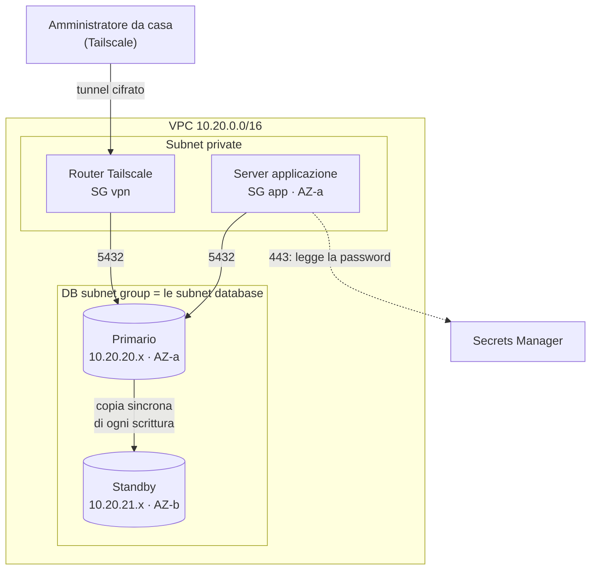
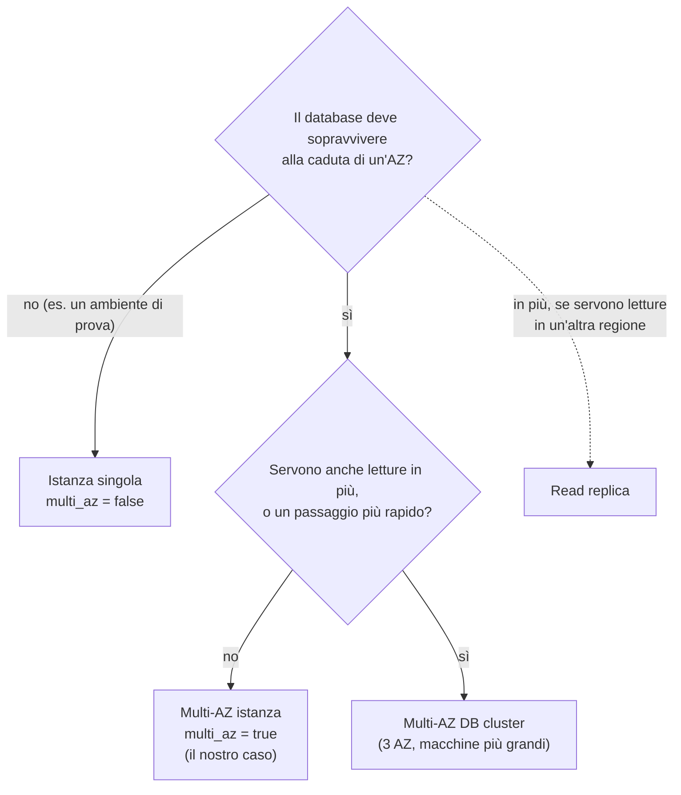
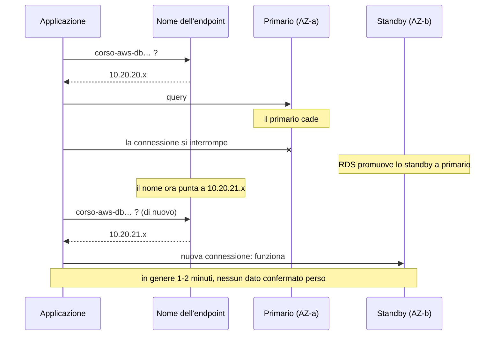
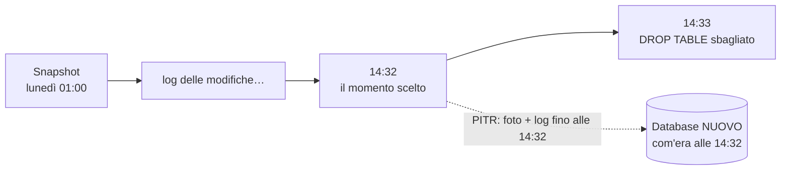

# Dispensa 6 – RDS PostgreSQL in alta affidabilità

*Corso: Infrastruttura AWS con Terraform*

## Obiettivo

Abbiamo la rete (dispensa 2), i firewall (dispensa 3), il server (dispensa 4) e l'accesso da casa con Tailscale (dispensa 5). Manca il posto dove l'applicazione **conserva i dati**: il database.

Alla fine di questa dispensa:

- sai cos'è **RDS** e cosa ti risparmia rispetto a un PostgreSQL installato a mano su un server;
- sai dire ad AWS **in quali subnet** può mettere il database (il *DB subnet group*);
- sai la differenza tra **Multi-AZ istanza**, **Multi-AZ DB cluster** e **read replica**, e quando usare quale;
- sai cosa succede durante un **failover** e cosa deve fare l'applicazione per sopravvivere;
- sai come funzionano **backup** e **ripristino a un momento preciso** (PITR), e cosa vuol dire che il database è **cifrato con KMS**;
- sai **obbligare** l'applicazione a parlare con il database in modo cifrato (**TLS**) e a **verificare** di parlare con il database vero;
- sai far generare e custodire la **password** del database ad AWS, in **Secrets Manager**, senza che nessuno la scriva mai;
- sai proteggere il database da una **cancellazione per sbaglio**;
- hai provocato un failover vero e hai visto l'applicazione riconnettersi.

---

## Prima di iniziare

- Si lavora nella **stessa cartella** `infra/`: questa dispensa aggiunge i file `rds.tf` e `secrets.tf` e qualche variabile.
- Servono: le subnet database `aws_subnet.db` (dispensa 2), il Security Group `db` (dispensa 3), il role `aws_iam_role.app` del server (dispensa 4). Per le prove da casa serve anche il router Tailscale della dispensa 5.
- Rinnova il login: `aws sso login --profile corso` ed `export AWS_PROFILE=corso`. Per le prove con Tailscale serve anche `TAILSCALE_API_KEY` (dispensa 5).
- **Tempi:** creare un database Multi-AZ richiede **15-20 minuti**, cancellarlo altri 10. Mettilo in conto.
- **Costi:** un database RDS si paga **a ore** finché esiste, e il Multi-AZ costa **il doppio** (ci sono due macchine). A questo si aggiungono il disco, i backup oltre la dimensione del database e il segreto in Secrets Manager. A fine esercizio si cancella tutto.

---

## 1. Il problema

L'applicazione ha bisogno di un database **PostgreSQL**. Vogliamo che:

| Requisito | Perché |
|---|---|
| stia nelle **subnet database**, senza indirizzo pubblico | da internet non deve essere raggiungibile in nessun modo (dispensa 2) |
| **sopravviva alla caduta di un data center** | se un'AZ si ferma, l'applicazione deve ripartire in un paio di minuti, senza perdere dati |
| abbia **backup automatici**, e si possa tornare indietro a un minuto preciso | un errore umano ("ho cancellato la tabella sbagliata") deve essere rimediabile |
| sia **cifrato** | una copia del disco o di un backup, da sola, non deve essere leggibile |
| accetti solo connessioni **cifrate e verificate** | password e dati non devono viaggiare in chiaro, nemmeno dentro il VPC |
| abbia una **password che nessuno scrive** | niente password nel codice, nel tfvars o nello state (dispensa 0) |
| non si possa **cancellare per sbaglio** | un `terraform destroy` lanciato nella cartella sbagliata non deve distruggere i dati |
| accetti connessioni **solo** dall'applicazione e dagli amministratori in VPN | le regole le abbiamo già scritte nelle dispense 3 e 5 |

Vediamo un pezzo alla volta.

---

## 2. Cos'è RDS

PostgreSQL è un programma: lo potresti installare tu su un server EC2 (dispensa 4). Ma poi toccherebbe a te tutto il resto: aggiornarlo, fare i backup e verificarli, tenere una seconda copia pronta in un'altra AZ, accorgerti che il server è caduto e passare alla copia, sostituire i dischi pieni.

**RDS** (*Relational Database Service*) è il servizio AWS dei **database gestiti**: tu scegli il motore (PostgreSQL), la taglia e le opzioni; AWS si occupa del server, del sistema operativo, degli aggiornamenti, dei backup e del passaggio alla copia di riserva.

> **Analogia.** Installare PostgreSQL su EC2 è come **comprare casa**: è tua, ma la caldaia rotta la ripari tu. RDS è come **affittare con portineria e manutenzione incluse**: scegli l'appartamento e lo arredi (tabelle e dati), al resto pensa qualcun altro. In cambio, nel locale tecnico non puoi entrare: su RDS **non c'è un terminale** del server, né SSM, né SSH.

| | PostgreSQL su EC2 | RDS PostgreSQL |
|---|---|---|
| Installazione e aggiornamenti | tu | AWS, nella **finestra di manutenzione** che scegli |
| Backup | li organizzi tu | **automatici**, ogni giorno, più i log continui (sezione 6) |
| Copia di riserva in un'altra AZ | la costruisci tu | un'opzione: `multi_az = true` (sezione 4) |
| Accesso al sistema operativo | sì | **no** |
| Come ti colleghi | indirizzo del server | un **endpoint**: un nome DNS fisso (sezione 5) |

Si usa RDS quasi sempre. PostgreSQL su EC2 ha senso solo se serve qualcosa che RDS non permette (un'estensione particolare, una configurazione del sistema operativo).

---

## 3. Dove vive il database: il DB subnet group

Con un server EC2 diciamo **una** subnet (`subnet_id`). Con RDS no: il database può spostarsi tra le AZ (proprio per sopravvivere alla caduta di una), quindi gli diciamo **l'elenco delle subnet** in cui AWS può metterlo. Questo elenco si chiama **DB subnet group**.

Il nostro contiene le **subnet database** della dispensa 2, una per AZ: `10.20.20.0/24` (AZ-a) e `10.20.21.0/24` (AZ-b). Ricordi la regola della dispensa 2? Queste subnet **non hanno nessuna strada verso internet**, né in ingresso né in uscita. Al database non serve: parla solo con l'applicazione e con gli amministratori, dentro il VPC.

Un DB subnet group deve contenere subnet in **almeno due AZ**, anche se il database non è Multi-AZ. È il motivo per cui la dispensa 2 crea le subnet database in tutte le AZ.



---

## 4. L'alta affidabilità: tre modi per avere una copia

"Alta affidabilità" vuol dire: **il database resta disponibile anche se si rompe qualcosa**, fino a un intero data center. Il trucco è sempre lo stesso, avere **una copia** pronta altrove. RDS offre tre modi, che si somigliano nel nome ma servono a cose diverse.

### Multi-AZ istanza (quello che usiamo)

AWS crea **due** database: il **primario**, che lavora, e lo **standby**, in un'altra AZ, che aspetta. Ogni scrittura viene copiata sullo standby **prima** di dire all'applicazione "fatto": si chiama **replica sincrona**. Se il primario cade, lo standby ha già tutti i dati, fino all'ultima transazione confermata.

> **Analogia.** Un notaio che detta a **due** segretari in due stanze diverse, e firma solo quando **entrambi** hanno scritto. Se una stanza va a fuoco, l'altra ha la copia identica.

Lo standby **non si può usare**, nemmeno per leggere: è solo una riserva. In cambio è il modo più semplice: un'opzione, `multi_az = true`, e un solo indirizzo a cui collegarsi.

### Multi-AZ DB cluster

Un primario e **due** standby, in **tre** AZ. Gli standby si possono usare **in lettura**, e il passaggio alla riserva è più veloce. Costa di più, richiede tre AZ (nel nostro progetto: `az_count = 3`) e tipi di macchina più grandi: non esiste per i tipi piccoli `t4g` che usiamo nel corso.

### Read replica

Una **copia in sola lettura**, aggiornata **in modo asincrono**: il primario dice "fatto" senza aspettarla, quindi la copia può essere indietro di qualche istante. Serve a **distribuire le letture** (report, statistiche) o ad avere una copia in **un'altra regione**. **Non** è alta affidabilità: se il primario cade, la replica non prende il suo posto da sola; va **promossa** a mano, ed è un database nuovo, con un altro indirizzo.

| | Multi-AZ istanza | Multi-AZ DB cluster | Read replica |
|---|---|---|---|
| A cosa serve | sopravvivere a un guasto | guasto + letture in più | letture in più, altra regione |
| Copie | 1 standby | 2 standby | da 1 a 15 |
| Replica | sincrona | sincrona (semi-sincrona) | asincrona |
| La copia si può leggere? | no | sì | sì |
| Se il primario cade | **passaggio automatico** | **passaggio automatico**, più rapido | promozione **manuale** |
| Nel corso | **sì** | no (servono 3 AZ e macchine più grandi) | no |



Per gli ambienti di prova si può spegnere il Multi-AZ e risparmiare metà: per questo lo mettiamo in una **variabile**, `db_multi_az`.

---

## 5. Il failover: quando il primario cade

**Failover** vuol dire "passaggio alla riserva". RDS lo fa da solo quando il primario non risponde: si guasta la macchina, si ferma l'AZ, si rompe il disco. Lo fa anche durante alcuni aggiornamenti, per ridurre il tempo di fermo. E si può provocare apposta, per provarlo (lo faremo nell'esercizio).

### L'endpoint: un nome che non cambia

L'applicazione non si collega a un indirizzo IP, ma all'**endpoint** del database: un **nome DNS** (dispensa 2) del tipo

```
corso-aws-db.abc123xyz.eu-south-1.rds.amazonaws.com
```

Il nome resta sempre lo stesso; è **l'indirizzo a cui punta** che cambia. Durante il failover RDS fa diventare primario lo standby e sposta il nome sul suo indirizzo: da `10.20.20.x` (AZ-a) a `10.20.21.x` (AZ-b).



### Cosa deve fare l'applicazione

Il failover lo fa AWS, ma **la riconnessione la deve fare l'applicazione**. Le connessioni aperte si interrompono: chi le stava usando riceve un errore. Un'applicazione ben fatta:

1. **riprova** quando una connessione fallisce, aspettando qualche secondo tra un tentativo e l'altro;
2. si collega **sempre al nome** dell'endpoint, mai all'indirizzo IP;
3. **non ricorda per sempre** l'indirizzo letto dal DNS: lo richiede a ogni nuova connessione (il nome dell'endpoint "vale" solo pochi secondi);
4. se usa un **pool di connessioni** (un gruppo di connessioni tenute aperte e riusate), controlla che una connessione sia ancora viva prima di riusarla.

Le transazioni in corso al momento del guasto **non** vanno a buon fine: l'applicazione riceve un errore e deve ripeterle. Quelle già confermate, invece, ci sono tutte: lo standby le aveva già (replica sincrona).

---

## 6. Backup e ritorno a un momento preciso (PITR)

Il Multi-AZ protegge dai **guasti**. Non protegge dagli **errori**: se qualcuno cancella una tabella, la cancellazione viene copiata subito anche sullo standby. Per gli errori servono i **backup**.

RDS ne fa due tipi, automaticamente:

| | Cosa | Quando |
|---|---|---|
| **Snapshot automatico** | una "foto" completa del disco | una volta al giorno, nella **finestra di backup** che scegli |
| **Log delle transazioni** | ogni modifica fatta al database | di continuo, salvati ogni pochi minuti |

Insieme permettono il **PITR** (*Point-In-Time Recovery*, ripristino a un momento preciso): "ridammi il database **com'era alle 14:32 di ieri**", cioè un minuto prima dell'errore. RDS prende la foto del giorno prima e ci riapplica le modifiche fino alle 14:32.



Due cose da sapere:

- quanti giorni indietro si può tornare lo decide `backup_retention_period`: noi teniamo **7 giorni** (fino a 35);
- il ripristino crea **sempre un database nuovo**, con un altro endpoint. Quello vecchio resta com'è: si recuperano i dati dal nuovo e poi si decide cosa tenere. Non è una "macchina del tempo" sul database esistente.

Oltre agli snapshot automatici esistono gli **snapshot manuali**, che fai tu quando vuoi e restano finché non li cancelli. Il più importante è lo **snapshot finale**, fatto un attimo prima di cancellare il database (sezione 9).

---

## 7. La cifratura: KMS per i dati fermi, TLS per quelli in viaggio

### I dati fermi: il disco e KMS

Chiediamo che il database sia **cifrato** (`storage_encrypted = true`): il disco, i backup, gli snapshot e lo standby. Chi ottenesse una copia del disco, senza la chiave, vedrebbe solo dati senza senso.

Le chiavi di cifratura in AWS le custodisce **KMS** (*Key Management Service*): un "caveau" di chiavi che **non escono mai** da lì. I servizi come RDS chiedono a KMS di cifrare e decifrare per loro, e KMS controlla chi ha il permesso di usare ogni chiave (con una *key policy*, una resource-based policy come quelle della dispensa 1).

| | Chiave gestita da AWS (`aws/rds`) | Chiave tua (*customer managed*) |
|---|---|---|
| Chi la crea | AWS, da sola | tu, con Terraform |
| Chi decide chi la usa | AWS | tu, con la key policy |
| Si può condividere uno snapshot con un altro account? | **no** | sì |
| Costo | incluso | un piccolo costo al mese |
| Nel corso | **sì** | no: la vediamo nell'appendice |

Una regola da ricordare: la cifratura si sceglie **alla creazione**. Un database creato non cifrato non si può cifrare dopo: bisogna fare uno snapshot, copiarlo cifrato e ripristinarlo in un database nuovo. Per questo si cifra sempre, da subito.

### I dati in viaggio: TLS

`storage_encrypted` protegge i dati **fermi**, quelli scritti sul disco. Ma i dati viaggiano anche sulla rete: la query dell'applicazione, i risultati, **la password** al momento del login. Per proteggerli serve **TLS**, la stessa cifratura dei siti `https://`.

Con TLS ci sono due cose diverse da ottenere, e vanno chieste tutte e due:

| | Cosa garantisce | Come si chiede a `psql` (e alle librerie dei programmi) |
|---|---|---|
| **Cifrare** | chi sta sulla strada non può leggere | `sslmode=require` |
| **Verificare il server** | stai parlando con il database **vero**, non con un impostore che si finge lui | `sslmode=verify-full`, più il **certificato** di AWS |

> **Analogia.** Cifrare è mettere la lettera in una **busta chiusa**. Verificare è **controllare il documento** di chi la riceve. Una busta chiusa consegnata all'impostore la apre l'impostore: servono tutte e due.

**Dal lato del database** c'è un'impostazione di PostgreSQL su RDS, `rds.force_ssl`: con il valore `1`, il database **rifiuta** ogni connessione non cifrata. Dalla versione 15 è già attiva di default, ma la scriviamo lo stesso nel nostro codice: un'impostazione di sicurezza che dipende da un valore di default che non vedi è un'impostazione che può sparire senza che nessuno se ne accorga.

Su un PostgreSQL normale le impostazioni stanno in un file di configurazione. Su RDS a quel file non si accede: le impostazioni si scrivono in un **parameter group**, un elenco di impostazioni che si collega al database. Ogni parameter group appartiene a una **famiglia**, legata alla versione principale: per PostgreSQL 18 è `postgres18`.

**Dal lato dell'applicazione** serve `sslmode=verify-full` con il **certificato della CA di AWS** (*Certificate Authority*, l'ente che firma i certificati dei database RDS). AWS lo pubblica in un file, `global-bundle.pem`, che si scarica da `https://truststore.pki.rds.amazonaws.com/global/global-bundle.pem`. Con `verify-full` il client controlla due cose: che il certificato del database sia firmato da AWS, e che contenga **il nome a cui ti stai collegando**. Per questo ci si collega al **nome dell'endpoint**, non all'indirizzo IP: un motivo in più, dopo quello della sezione 5.

E il tunnel di Tailscale? Cifra il tratto **da casa al router**. Dal router al database, e dal server dell'applicazione al database, il traffico viaggia nel VPC. TLS cifra **tutto il percorso**, da un capo all'altro, chiunque sia il mittente.

---

## 8. La password: la genera AWS, la custodisce Secrets Manager

Un database PostgreSQL ha un **utente amministratore** con una password. Dove la mettiamo?

| Dove | Problema |
|---|---|
| scritta nel file `.tf` | finisce in Git: chiunque legga il codice la conosce |
| in una variabile, nel tfvars | il tfvars non va in Git, ma la password finisce comunque **nello state** (dispensa 0) |
| generata da Terraform con `random_password` | stesso problema: finisce nello state |
| **generata da RDS e messa in Secrets Manager** | **nessuno la scrive, e non è nello state** |

**Secrets Manager** è il servizio AWS per **custodire segreti**: password, chiavi API. Ogni segreto si legge solo con il **permesso IAM** giusto, ogni lettura è registrata, e il segreto può essere **cambiato da solo** a intervalli regolari (*rotazione*).

Con `manage_master_user_password = true` diciamo a RDS: **genera tu la password**, mettila in un segreto di Secrets Manager e **cambiala ogni 7 giorni**. Terraform non la vede mai: conosce solo l'**ARN del segreto**, cioè il suo indirizzo (dispensa 0).

> **Analogia.** Invece di scrivere la combinazione della cassaforte su un post-it (il codice) o in un quaderno (lo state), la combinazione la sceglie il fabbro e la chiude in una **cassetta di sicurezza**; Terraform ha solo il numero della cassetta. Per aprirla serve il badge giusto (il permesso IAM).

Chi deve leggere la password?

- **Il server dell'applicazione.** Gli diamo il permesso `secretsmanager:GetSecretValue` **su quel segreto e basta**, aggiungendo una policy al suo role (dispensa 4). È il file `secrets.tf`. Come l'applicazione la usa davvero lo vediamo nella dispensa 8.
- **Gli amministratori**, dal loro computer, con il login AWS.

Siccome la password **cambia ogni 7 giorni**, nessuno deve copiarla in un file: va letta dal segreto **ogni volta** che serve.

> **Attenzione alla rotazione, e un'alternativa.** La rotazione automatica funziona solo se qualcuno **rilegge il segreto** dopo che è cambiato. Molte applicazioni invece leggono la password **una volta, all'avvio**, e la tengono in memoria o in un file di configurazione: dopo 7 giorni RDS la cambia, le connessioni già aperte continuano a funzionare, ma alla prima riconnessione l'applicazione resta fuori.
>
> Le strade sono due. **Uno:** sul server, un piccolo programma rilegge il segreto ogni pochi minuti e, se è cambiato, riavvia l'applicazione con la password nuova. È la soluzione che usiamo nella dispensa 8. **Due:** niente rotazione automatica. La password la genera Terraform con `random_password`, la mette in un segreto di Secrets Manager e la imposta sul database nello stesso `apply`; per cambiarla la si rigenera e si riavvia l'applicazione. Il prezzo: la password finisce nello **state**, che va quindi trattato come un segreto (bucket privato, cifrato, letto da pochissimi). La scelgono i progetti che preferiscono una rotazione **decisa da loro** a una automatica.

---

## 9. Le protezioni contro la cancellazione

Un database contiene dati che non si possono ricreare. Due protezioni, entrambe attive:

**`deletion_protection = true`.** AWS **rifiuta** di cancellare il database, a chiunque lo chieda: Terraform, la console, la CLI. Per cancellarlo bisogna prima **togliere la protezione** con una modifica a parte, cioè una scelta esplicita, non un incidente. Un `terraform destroy` lanciato nella cartella sbagliata si ferma con un errore invece di distruggere i dati.

**Lo snapshot finale.** Anche quando la cancellazione è voluta, prima RDS fa **un'ultima foto** del database (`final_snapshot_identifier`), che resta dopo la cancellazione. Se ci si accorge di aver cancellato troppo presto, si ripristina da lì.

Nota: gli snapshot **automatici** vengono cancellati insieme al database; quello **finale** no, e resta finché non lo cancelli tu (e lo paghi finché esiste).

Il nome dello snapshot finale deve essere **unico** nell'account: se ne esiste già uno con quel nome, la cancellazione si ferma con un errore. Per questo gli aggiungiamo un suffisso casuale con `random_id`, come per il bucket della dispensa 0.

---

## 10. Chi può collegarsi: lo abbiamo già deciso

Le regole di rete per il database le abbiamo scritte prima di averlo, e ora le usiamo senza toccarle:

| Livello | Regola | Dispensa |
|---|---|---|
| Rete | le subnet database non hanno strade verso internet | 2 |
| NACL delle subnet database | 5432 in ingresso dalle subnet private, risposte verso le porte effimere | 3 |
| SG `db` | 5432 solo da chi ha il SG `app` o il SG `vpn` | 3 |
| Policy del tailnet | solo `group:admin` raggiunge la 5432; `group:dev` no | 5 |

In più, il database ha `publicly_accessible = false`: AWS non gli dà nessun indirizzo pubblico. E accetta solo connessioni **cifrate** (`rds.force_ssl = 1`, sezione 7); i client verificano che sia il database vero (`sslmode=verify-full`).

---

## 11. Il codice Terraform

### variables.tf (aggiunte)

```hcl
variable "db_instance_class" {
  description = "Tipo di macchina del database"
  type        = string
  default     = "db.t4g.micro"
}

variable "db_engine_version" {
  description = "Versione principale di PostgreSQL"
  type        = string
  default     = "18"
}

variable "db_multi_az" {
  description = "Standby in un'altra AZ (alta affidabilità)"
  type        = bool
  default     = true
}

variable "db_deletion_protection" {
  description = "Impedisce la cancellazione del database"
  type        = bool
  default     = true
}
```

### rds.tf

```hcl
# ---------------------------------------------------------------
# Dove può stare il database: le subnet database, una per AZ
# ---------------------------------------------------------------

resource "aws_db_subnet_group" "main" {
  name       = "${var.project}-db"
  subnet_ids = [for s in aws_subnet.db : s.id]
}

# ---------------------------------------------------------------
# Le impostazioni di PostgreSQL: solo connessioni cifrate
# ---------------------------------------------------------------

resource "aws_db_parameter_group" "main" {
  name   = "${var.project}-postgres${var.db_engine_version}"
  family = "postgres${var.db_engine_version}"

  parameter {
    name  = "rds.force_ssl"
    value = "1"
  }

  lifecycle {
    create_before_destroy = true
  }
}

# Suffisso casuale per il nome dello snapshot finale
resource "random_id" "db_final_snapshot" {
  byte_length = 4
}

# ---------------------------------------------------------------
# Il database PostgreSQL
# ---------------------------------------------------------------

resource "aws_db_instance" "main" {
  identifier     = "${var.project}-db"
  engine         = "postgres"
  engine_version = var.db_engine_version
  instance_class = var.db_instance_class

  # Le impostazioni: connessioni solo cifrate
  parameter_group_name = aws_db_parameter_group.main.name

  # Il disco: SSD gp3, cifrato, cresce da solo fino a 100 GB
  allocated_storage     = 20
  max_allocated_storage = 100
  storage_type          = "gp3"
  storage_encrypted     = true

  # Il primo database e l'utente amministratore
  db_name                     = "app"
  username                    = "dbadmin"
  manage_master_user_password = true

  # Dove sta e chi lo raggiunge
  db_subnet_group_name   = aws_db_subnet_group.main.name
  vpc_security_group_ids = [aws_security_group.db.id]
  publicly_accessible    = false

  # Alta affidabilità
  multi_az = var.db_multi_az

  # Backup e manutenzione (orari in UTC)
  backup_retention_period    = 7
  backup_window              = "01:00-02:00"
  maintenance_window         = "sun:03:00-sun:04:00"
  auto_minor_version_upgrade = true
  copy_tags_to_snapshot      = true

  # Protezioni
  deletion_protection       = var.db_deletion_protection
  skip_final_snapshot       = false
  final_snapshot_identifier = "${var.project}-db-final-${random_id.db_final_snapshot.hex}"

  # In laboratorio le modifiche si applicano subito
  apply_immediately = true

  tags = { Name = "${var.project}-db" }
}
```

### secrets.tf

```hcl
# ---------------------------------------------------------------
# Il server dell'applicazione può leggere la password del database
# (e nessun altro segreto)
# ---------------------------------------------------------------

data "aws_iam_policy_document" "app_read_db_secret" {
  statement {
    actions   = ["secretsmanager:GetSecretValue"]
    resources = [aws_db_instance.main.master_user_secret[0].secret_arn]
  }
}

resource "aws_iam_policy" "app_read_db_secret" {
  name   = "${var.project}-app-read-db-secret"
  policy = data.aws_iam_policy_document.app_read_db_secret.json
}

resource "aws_iam_role_policy_attachment" "app_read_db_secret" {
  role       = aws_iam_role.app.name
  policy_arn = aws_iam_policy.app_read_db_secret.arn
}
```

### outputs.tf (aggiunte)

```hcl
output "db_address" {
  value = aws_db_instance.main.address
}

output "db_secret_arn" {
  value = aws_db_instance.main.master_user_secret[0].secret_arn
}
```

### Cosa fa questo codice, blocco per blocco

**`aws_db_subnet_group.main`** è l'elenco delle subnet in cui il database può stare (sezione 3). `subnet_ids` usa un'espressione `for` sulla mappa delle subnet database della dispensa 2: la lista dei loro ID, una per AZ.

**`aws_db_parameter_group.main`** è l'elenco delle impostazioni di PostgreSQL (sezione 7). `family` è la famiglia, costruita dalla versione principale: con `"18"` diventa `"postgres18"`. Ogni blocco `parameter` è un'impostazione, con il suo nome e il suo valore; qui ce n'è una sola, `rds.force_ssl = "1"`. Il valore va scritto tra virgolette, come testo, anche se è un numero.

Il blocco `lifecycle { create_before_destroy = true }` serve il giorno in cui si cambia versione principale. Il nome e la famiglia cambiano, quindi il parameter group va ricreato (`-/+`, dispensa 0). Normalmente Terraform **prima cancella** la risorsa vecchia e **poi crea** la nuova; ma un parameter group collegato a un database non si può cancellare, e l'`apply` si fermerebbe. Con `create_before_destroy` l'ordine si inverte: prima crea il gruppo nuovo, lo collega al database, poi cancella il vecchio. (L'aggiornamento della versione principale, in sé, è un'operazione delicata che non vediamo nel corso.)

**`random_id.db_final_snapshot`** genera un suffisso casuale, per esempio `a1b2c3d4`, che finisce nel nome dello snapshot finale (sezione 9). Si genera una volta e resta lo stesso finché esiste il progetto.

**`aws_db_instance.main`** è il database. Leggiamo gli argomenti a gruppi.

| Argomento | Valore | Significato |
|---|---|---|
| `identifier` | `corso-aws-db` | il nome del database in AWS (e l'inizio dell'endpoint) |
| `engine` | `"postgres"` | il motore: PostgreSQL |
| `engine_version` | `"18"` | solo la versione principale: la versione minore la sceglie AWS e la aggiorna da sola (`auto_minor_version_upgrade`) |
| `instance_class` | `db.t4g.micro` | il tipo di macchina; come per EC2, `t4g` = piccola e con processore Graviton |
| `parameter_group_name` | `aws_db_parameter_group.main.name` | le impostazioni: connessioni solo cifrate |

**Il disco.** `allocated_storage = 20` sono i GB iniziali; `max_allocated_storage = 100` permette a RDS di **ingrandirlo da solo** quando si riempie, fino a 100 GB, senza fermare niente. `storage_encrypted = true` lo cifra con la chiave `aws/rds` (sezione 7): non scrivendo `kms_key_id`, si usa quella.

**L'utente.** `db_name = "app"` crea un primo database vuoto chiamato `app`. `username = "dbadmin"` è il nome dell'utente amministratore. **Non c'è nessuna password**: `manage_master_user_password = true` la fa generare a RDS e la mette in Secrets Manager (sezione 8).

**La rete.** `db_subnet_group_name` dice dove può stare; `vpc_security_group_ids` è la lista dei Security Group, qui solo `db` della dispensa 3; `publicly_accessible = false`, nessun indirizzo pubblico.

**`multi_az = var.db_multi_az`**: con `true` AWS crea anche lo standby in un'altra AZ (sezione 4).

**Backup e manutenzione.** `backup_retention_period = 7`: i backup automatici restano 7 giorni, e si può fare PITR fino a 7 giorni indietro. `backup_window` è l'ora dello snapshot quotidiano; `maintenance_window` è quando AWS può fare gli aggiornamenti che richiedono un riavvio (con il Multi-AZ, li fa prima sullo standby e poi passa a quello: il fermo è breve). Gli orari sono in **UTC**, cioè un'ora o due indietro rispetto all'Italia, e le due finestre **non devono sovrapporsi**. `copy_tags_to_snapshot` copia le etichette del database sugli snapshot, così si ritrovano.

**Le protezioni.** `deletion_protection` (sezione 9) viene da una variabile, così per la pulizia di fine esercizio si toglie dal tfvars. `skip_final_snapshot = false` vuol dire "lo snapshot finale **fallo**"; `final_snapshot_identifier` gli dà il nome, con il suffisso casuale.

**`apply_immediately = true`.** Alcune modifiche (per esempio cambiare `instance_class`) richiedono un riavvio. Senza questa riga, RDS le **rimanda alla finestra di manutenzione**: il `plan` e l'`apply` dicono "fatto", ma la modifica arriva domenica alle 3. In laboratorio vogliamo vederle subito; in produzione si toglie, e le modifiche pesanti si fanno quando il fermo dà meno fastidio.

**`master_user_secret[0].secret_arn`** è un **attributo** calcolato da AWS (dispensa 0): l'ARN del segreto che RDS ha creato. `master_user_secret` è una lista con un solo elemento, per questo c'è `[0]`.

**In `secrets.tf`** c'è una permission policy (dispensa 1) con **una sola azione**, `GetSecretValue`, su **una sola risorsa**, il segreto del database: privilegio minimo. Si crea come policy (`aws_iam_policy`) e si attacca al role del server con `aws_iam_role_policy_attachment`, come nella dispensa 1. Il server ora ha due policy: quella di SSM (dispensa 4) e questa.

**Gli output.** `db_address` è il nome dell'endpoint (sezione 5), senza la porta; `db_secret_arn` è l'indirizzo del segreto. Né l'uno né l'altro sono segreti: la password non compare da nessuna parte.

---

## 12. Esercizio: prova il database, poi fallo cadere

Obiettivo: creare il database, collegarsi dal server e da casa, vedere chi viene bloccato e perché, provocare un failover e guardare l'applicazione riconnettersi.

### Passi

1. **`terraform plan`**. Le risorse nuove sono: il subnet group, il parameter group, il suffisso casuale, il database, la policy con il suo attachment. C'è una password da qualche parte nel plan? (Atteso: no.)
2. **`terraform apply`**, poi aspetta: 15-20 minuti. In console: **RDS → Databases → corso-aws-db**. Nella scheda **Configuration** controlla *Multi-AZ: Yes*; nella scheda **Connectivity & security** trovi l'endpoint e la porta 5432.
3. **La password.** In console: **Secrets Manager → Secrets**. C'è un segreto il cui nome inizia con `rds!db-`: è quello creato da RDS. Apri **Rotation**: è attiva ogni 7 giorni. Poi apri lo state: `terraform state show aws_db_instance.main`. La password c'è? (Atteso: no, solo l'ARN del segreto.)
4. **Dal server dell'applicazione.** Leggi i due valori dal tuo computer:

   ```bash
   terraform output -raw db_address
   terraform output -raw db_secret_arn
   ```

   Entra nel server con SSM (dispensa 4), diventa root e installa il client di PostgreSQL:

   ```bash
   sudo su -
   dnf install -y postgresql18     # se non lo trova: dnf search postgresql
   ```

   Poi, sostituendo i due valori letti prima:

   ```bash
   export DB_HOST="corso-aws-db.….rds.amazonaws.com"
   export SECRET_ARN="arn:aws:secretsmanager:…"

   # il certificato della CA di AWS, per verificare il database
   curl -sSo /root/global-bundle.pem https://truststore.pki.rds.amazonaws.com/global/global-bundle.pem

   # la password, letta dal segreto con il role del server
   export PGPASSWORD=$(aws secretsmanager get-secret-value --secret-id "$SECRET_ARN" \
     --query SecretString --output text \
     | python3 -c 'import json,sys; print(json.load(sys.stdin)["password"])')

   export DB="host=$DB_HOST dbname=app user=dbadmin sslmode=verify-full sslrootcert=/root/global-bundle.pem"
   psql "$DB" -c "select version();"
   psql "$DB" -c "select ssl, version from pg_stat_ssl where pid = pg_backend_pid();"
   ```

   (Atteso: `PostgreSQL 18.…`; la seconda query risponde `t` e una versione di TLS, per esempio `TLSv1.3`: questa connessione è cifrata. Il server ha letto la password grazie a `secrets.tf` ed è passato dal SG `db` grazie alla regola `db_from_app`.) Domanda: se togliessi `secrets.tf`, quale comando fallirebbe, e con quale errore?

   Ora prova le due cose che **non** devono funzionare:

   ```bash
   # senza cifratura
   psql "host=$DB_HOST dbname=app user=dbadmin sslmode=disable" -c "select 1;"

   # con l'indirizzo IP al posto del nome
   DB_IP=$(getent hosts "$DB_HOST" | cut -d' ' -f1)
   psql "host=$DB_IP dbname=app user=dbadmin sslmode=verify-full sslrootcert=/root/global-bundle.pem" -c "select 1;"
   ```

   (Atteso: la prima viene **rifiutata dal database**, con un errore che finisce con `no encryption`: è `rds.force_ssl`. La seconda viene **rifiutata dal client**: il certificato del database contiene il nome, non l'indirizzo, e `verify-full` non si fida.)

5. **Da casa, come amministratore.** Con Tailscale acceso e il tuo nome in `tailscale_admins` (dispensa 5), installa `psql` sul tuo computer (su Mac: `brew install libpq`; oppure un programma grafico come DBeaver). Scarica il certificato e leggi la password con il tuo login AWS:

   ```bash
   curl -sSo global-bundle.pem https://truststore.pki.rds.amazonaws.com/global/global-bundle.pem
   aws secretsmanager get-secret-value --secret-id "$(terraform output -raw db_secret_arn)" \
     --query SecretString --output text
   ```

   e collegati con `psql "host=$(terraform output -raw db_address) dbname=app user=dbadmin sslmode=verify-full sslrootcert=global-bundle.pem"`, incollando la password quando la chiede. (Atteso: funziona. Il nome dell'endpoint, anche da casa, porta all'indirizzo privato `10.20.20.x`, che raggiungi attraverso il router.) Non lasciare la password in giro: chiudi il terminale quando hai finito.
6. **Da casa, come sviluppatore.** Sposta il tuo nome in `tailscale_devs`, lancia `apply` e riprova il passo 5. (Atteso: la connessione **resta in attesa e scade**. Chi ti blocca? Tailscale: la policy del tailnet non dà a `group:dev` la porta 5432. Il SG `db` non c'entra: ti avrebbe fatto passare, perché arrivi dal router.) Rimettiti in `tailscale_admins` e fai `apply`.
7. **Rompi la NACL (dispensa 3).** In `security.tf` commenta il blocco `db_out_ephemeral`, e questa volta **applica**. Dal server, ripeti `psql "$DB" -c "select 1;"`. (Atteso: resta in attesa. La richiesta arriva al database sulla 5432, ma la risposta non può uscire dalla subnet database verso le porte effimere.) Togli i `#`, applica di nuovo, riprova: funziona.
8. **Il failover.** Nel server, lancia un ciclo che si collega ogni 2 secondi e stampa l'indirizzo del database che ha risposto:

   ```bash
   export PGCONNECT_TIMEOUT=3
   while true; do
     echo "$(date +%T)  $(psql "$DB" -tAc 'select inet_server_addr();' 2>&1 | head -1)"
     sleep 2
   done
   ```

   Lascialo girare. **Dal tuo computer**, in un altro terminale, provoca il failover:

   ```bash
   aws rds reboot-db-instance --db-instance-identifier corso-aws-db --force-failover
   ```

   Guarda il ciclo. (Atteso: per un po' risponde `10.20.20.x`; poi compaiono degli errori di connessione per uno o due minuti; poi risponde `10.20.21.x`. Il primario ora è nell'AZ-b, e il ciclo si è riconnesso da solo perché ogni volta apre una **nuova** connessione e rilegge il nome.) Ferma il ciclo con **Ctrl+C**. Quanto è durata l'interruzione?
9. **Cosa ha registrato AWS.** In console: **RDS → Databases → corso-aws-db → Logs & events**, sezione **Recent events**. Trovi l'inizio e la fine del failover? Nella scheda **Configuration**, in quale AZ è ora il primario?
10. **La protezione.** Dal tuo computer prova a cancellare il database a mano:

    ```bash
    aws rds delete-db-instance --db-instance-identifier corso-aws-db --skip-final-snapshot
    ```

    (Atteso: errore, *Cannot delete protected DB Instance*. Nemmeno con la console andrebbe.)
11. **Pulizia, in due tempi.** Prima togli la protezione: in `terraform.tfvars` scrivi `db_deletion_protection = false` e lancia `apply`. Poi `terraform destroy`. Il database impiega una decina di minuti, durante i quali RDS fa lo **snapshot finale**. Alla fine, in console **RDS → Snapshots → Manual**: lo snapshot `corso-aws-db-final-…` c'è ancora. Cancellalo (si paga finché esiste):

    ```bash
    aws rds delete-db-snapshot --db-snapshot-identifier corso-aws-db-final-…
    ```

    Infine rimetti `db_deletion_protection = true` nel tfvars, o togli la riga: la prossima volta il database nasce di nuovo protetto.

### Domande di verifica

1. Perché un database RDS ha bisogno di un **elenco** di subnet, mentre a un server EC2 se ne dà una sola?
2. Multi-AZ istanza e read replica fanno entrambe una copia del database. Qual è la differenza che conta se il primario cade?
3. Durante il failover, cosa cambia: il nome dell'endpoint o l'indirizzo a cui punta? Cosa deve fare l'applicazione per accorgersene?
4. Un collega cancella per errore una tabella alle 14:33. Il Multi-AZ lo salva? Cosa usi invece, e cosa ottieni esattamente?
5. Perché non generiamo la password con `random_password` di Terraform, che pure è comodo?
6. Nell'esercizio, lo sviluppatore non raggiunge il database. Se un giorno Tailscale gli desse la 5432 per errore, il SG `db` lo fermerebbe? Perché?
7. Cosa succede, passo per passo, se lanci `terraform destroy` con `deletion_protection = true`?
8. Con `sslmode=require` la connessione è cifrata. Perché non basta? Cosa aggiunge `verify-full`, e perché con `verify-full` bisogna usare il nome dell'endpoint?

---

## Riepilogo

- **RDS** è PostgreSQL gestito da AWS: aggiornamenti, backup e passaggio alla riserva li fa lui. In cambio, niente accesso al sistema operativo.
- Il **DB subnet group** è l'elenco delle subnet in cui il database può stare: le subnet database, una per AZ, senza strade verso internet.
- **Multi-AZ istanza**: un primario e uno standby in un'altra AZ, con replica **sincrona**; se il primario cade, **failover automatico** in un paio di minuti. Il **DB cluster** ha due standby leggibili; la **read replica** è asincrona e non sostituisce il primario da sola.
- Ci si collega all'**endpoint**, un nome DNS: nel failover cambia l'indirizzo, non il nome. L'applicazione deve **riprovare** e rileggere il nome.
- **Backup** automatici per 7 giorni e **PITR**: si ripristina a un minuto preciso, sempre in un **database nuovo**. Il Multi-AZ protegge dai guasti, i backup dagli errori.
- Disco, backup e standby **cifrati** con una chiave di **KMS**; la cifratura si decide alla creazione.
- In viaggio, **TLS**: il database rifiuta le connessioni in chiaro (`rds.force_ssl = 1`, nel nostro **parameter group**) e i client verificano di parlare con il database vero (`sslmode=verify-full` con il certificato di AWS).
- La password la genera RDS e la custodisce **Secrets Manager** (`manage_master_user_password`), con rotazione ogni 7 giorni: non è nel codice né nello state. Il server la legge con una policy che dà **solo** quel segreto.
- **`deletion_protection`** impedisce la cancellazione; lo **snapshot finale** resta anche dopo una cancellazione voluta.
