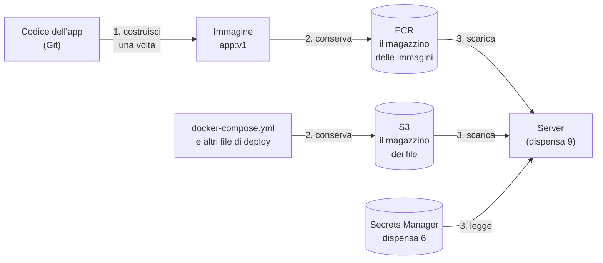
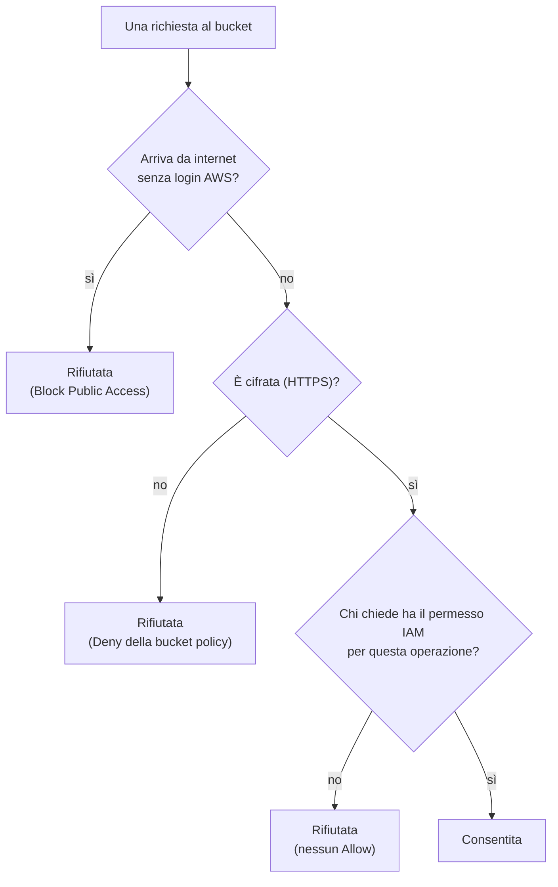
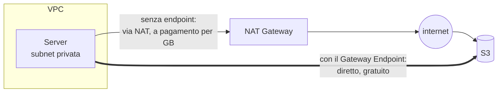

# Dispensa 7 – Immagini e artefatti: ECR e S3

*Corso: Infrastruttura AWS con Terraform*

## Obiettivo

Il server c'è (dispensa 4), il database pure (dispensa 6). Ma oggi sul server gira una pagina finta, scritta nel `user_data`. Un'applicazione vera va **costruita** da qualche parte, **conservata** in un posto sicuro e **scaricata** dal server. Questa dispensa prepara i due "magazzini" da cui il server prenderà l'applicazione; le dispense 8 e 9 li useranno per il deploy.

Alla fine di questa dispensa:

- sai cos'è un **container**, un'**immagine** e un **registry**, quanto basta per capire il deploy;
- sai creare un repository **ECR** con tag **immutabili**, **scansione** delle vulnerabilità e **pulizia** automatica delle immagini vecchie;
- sai creare un bucket **S3** per i file di deploy chiuso a chiave: **niente accesso pubblico**, **versioning**, **cifratura**, e una **bucket policy** che rifiuta le richieste non cifrate;
- sai far arrivare il traffico verso S3 **senza passare dal NAT**, con un **VPC Gateway Endpoint**;
- sai dare al server **solo** i permessi per scaricare, e niente di più.

---

## Prima di iniziare

- Si lavora nella **stessa cartella** `infra/`: questa dispensa aggiunge i file `ecr.tf` e `s3.tf`.
- Servono: le route table private `aws_route_table.private` (dispensa 2), il role del server `aws_iam_role.app` (dispensa 4), `data.aws_caller_identity.current` (dispensa 1).
- Rinnova il login: `aws sso login --profile corso` ed `export AWS_PROFILE=corso`.
- Per l'esercizio serve **Docker** sul tuo computer (Docker Desktop su Mac e Windows, il pacchetto `docker` su Linux). Se non puoi installarlo, salta i passi 3-5: il resto funziona lo stesso.
- **Costi:** ECR e S3 si pagano per lo spazio occupato, quindi poco con poche immagini e pochi file. Il Gateway Endpoint per S3 è **gratuito**, e anzi fa risparmiare sul NAT. A fine esercizio si cancella tutto.

---

## 1. Il problema

Oggi il codice dell'applicazione sta **dentro il `user_data`** (dispensa 4). Funziona per una pagina di prova, ma per un'applicazione vera no:

| Problema | Perché |
|---|---|
| il server dovrebbe **installarsi da solo** tutto ciò che serve all'app | lento, e ogni server rischia di finire leggermente diverso dall'altro |
| non c'è una **versione** precisa da installare, né da cui tornare indietro | "cosa gira in produzione?" non ha una risposta sicura |
| il `user_data` ha un limite di dimensione e non è fatto per contenere programmi | è un foglio di istruzioni, non un magazzino |

La soluzione usata ovunque: l'applicazione si **costruisce una volta**, in un pacchetto completo e con un nome di versione; il pacchetto si **conserva** in un magazzino; il server lo **scarica** e lo avvia. Il server non compila e non installa niente: prende il pacchetto pronto.



Oggi costruiamo i due magazzini, ECR e S3. Nella dispensa 8 il passo 1 lo farà da solo GitHub Actions; nella dispensa 9 il passo 3 lo farà il server all'avvio.

---

## 2. Container e immagini, in breve

Un **container** è un modo di impacchettare un'applicazione **insieme a tutto ciò che le serve** per girare: il linguaggio (per esempio Python), le librerie, i file di configurazione. Il pacchetto gira uguale sul tuo computer, sul server di prova e in produzione, perché si porta dietro il suo ambiente.

> **Analogia.** Un container è come un **piatto pronto surgelato**: dentro c'è già tutto, cotto e porzionato. Chi lo riceve non deve avere gli ingredienti né sapere la ricetta: lo scalda e lo serve. L'**immagine** è il piatto confezionato in magazzino; il **container** è il piatto scaldato e servito. Dalla stessa confezione puoi servirne quanti ne vuoi.

Le parole che ci servono:

| Parola | Cos'è | Analogia |
|---|---|---|
| **Dockerfile** | la ricetta: un file di testo che dice come costruire l'immagine | la ricetta |
| **Immagine** | il pacchetto costruito, che non cambia più | la confezione surgelata |
| **Container** | un'immagine **in esecuzione** | il piatto servito |
| **Tag** | il nome di versione di un'immagine, per esempio `v1` o il codice di un commit | l'etichetta con il lotto |
| **Registry** | il magazzino da cui le immagini si caricano (*push*) e si scaricano (*pull*) | il magazzino del surgelato |
| **Docker** | il programma più usato per costruire e far girare i container | la cucina |

Un'immagine si indica così: **indirizzo del registry / nome : tag**. Per esempio

```
123456789012.dkr.ecr.eu-south-1.amazonaws.com/corso-aws/app:v1
└──────────── il registry ECR del tuo account ──────┘ └─ nome ─┘ └tag┘
```

Come si mettono insieme più container sullo stesso server (l'app, una cache…) lo vediamo nella dispensa 9, con **docker compose**.

---

## 3. ECR: il magazzino delle immagini

**ECR** (*Elastic Container Registry*) è il registry di AWS. Ogni applicazione ha il suo **repository**, uno scaffale con tutte le versioni di quell'immagine. Rispetto a un registry pubblico (come Docker Hub) ha due vantaggi: è **privato** (per scaricare serve un permesso IAM, dispensa 1) e sta **nella stessa regione** del server, quindi lo scaricamento è veloce.

Quattro scelte per il nostro repository.

### Tag immutabili

Di default un tag si può **sovrascrivere**: carichi una nuova immagine con il tag `v1`, e la vecchia `v1` sparisce. Sembra comodo, ma vuol dire che `v1` oggi e `v1` domani possono essere **due programmi diversi**, e un server ricreato stanotte potrebbe scaricare una versione che nessuno ha mai provato.

Con i tag **immutabili** (`IMMUTABLE`) un tag, una volta usato, non si può più riusare. Ogni versione ha il suo nome per sempre: "in produzione gira `v1`" ha un solo significato. Per una versione nuova si usa un tag nuovo (nella dispensa 8, il codice del commit).

> **Analogia.** Il numero di lotto sulla confezione: se due confezioni hanno lo stesso numero, devono essere identiche. Un'etichetta riattaccata su un prodotto diverso è una frode, non una comodità.

### Scansione al caricamento

Con `scan_on_push` ECR **controlla ogni immagine** appena caricata e cerca le **vulnerabilità note** nei pacchetti che contiene (il sistema operativo di base, le librerie). Il risultato si legge in console: un elenco di problemi con la loro gravità. Non blocca niente da sola: è un'informazione, da guardare prima di mandare una versione in produzione. (Esiste anche una scansione più completa, continua e a pagamento, con il servizio Amazon Inspector: non la usiamo.)

### Pulizia automatica

Le immagini si accumulano: una per ogni versione. Una **lifecycle policy** (regole di pulizia) dice a ECR quali cancellare da solo. Le nostre due regole:

1. le immagini **senza tag** (scarti di costruzioni intermedie) si cancellano dopo **1 giorno**;
2. delle immagini con tag si tengono le **ultime 20**: abbastanza per tornare indietro di parecchie versioni.

### Cifratura

Le immagini in ECR sono sempre cifrate. Scegliamo la cifratura con **KMS** e la chiave gestita da AWS `aws/ecr`, come per il database (dispensa 6). Un'immagine di solito non contiene segreti (le password stanno in Secrets Manager), quindi una chiave nostra non serve.

---

## 4. S3: il magazzino dei file di deploy

Oltre all'immagine, il server ha bisogno di qualche **file**: soprattutto il `docker-compose.yml` che dice quali container avviare e come (dispensa 9). Questi file li teniamo in un **bucket S3** (dispensa 0) dedicato.

Cosa va dove:

| Cosa | Dove | Perché |
|---|---|---|
| il programma, con tutto ciò che gli serve | **ECR** (un'immagine) | è fatto per le immagini: versioni, scansione, pull veloce |
| i file di deploy **non segreti** (`docker-compose.yml`, configurazioni) | **S3** | semplici file, con il versioning |
| password, chiavi, token | **Secrets Manager** (dispensa 6) | permessi per singolo segreto, rotazione, ogni lettura registrata |

Un bucket con i file di deploy è un bersaglio: chi potesse **scriverci** deciderebbe cosa gira sul server. Lo chiudiamo con quattro protezioni.

### 1. Block Public Access: niente accesso pubblico, mai

Un bucket S3 può diventare pubblico in due modi: con una **bucket policy** che dà accesso a tutti (`"Principal": "*"`), o con le **ACL**, un vecchio sistema di permessi per singolo file. Il **Block Public Access** è un interruttore generale con quattro levette, che **vince su tutto**: se sono tutte e quattro accese, nessuna policy e nessuna ACL può rendere pubblico il bucket, nemmeno per errore.

Non serve ricordarle una per una: **quattro levette, tutte accese = mai pubblico**. Le vediamo nella spiegazione del codice.

In più spegniamo del tutto le ACL (*Object Ownership* = `BucketOwnerEnforced`): i permessi si decidono solo con le policy IAM e la bucket policy, in un posto solo. Sui bucket nuovi AWS fa già entrambe le cose da sola; le scriviamo lo stesso, per lo stesso motivo di `rds.force_ssl` nella dispensa 6: una protezione che dipende da un default invisibile può sparire.

### 2. Versioning: ogni file ha la sua storia

Il **versioning** l'abbiamo visto nella dispensa 0: un file sovrascritto o cancellato non sparisce, resta come **versione precedente**. Qui è prezioso: se qualcuno carica un `docker-compose.yml` sbagliato, la versione buona è ancora lì. Per non accumulare versioni per sempre, una regola di pulizia cancella le versioni vecchie dopo **30 giorni**.

### 3. Cifratura

Ogni file viene cifrato quando viene scritto. Usiamo la cifratura **SSE-S3** (*Server-Side Encryption*, con chiavi gestite interamente da S3): gratuita e trasparente. L'alternativa è **SSE-KMS**, con una chiave KMS: serve quando si vuole decidere con una key policy chi può decifrare; per file non segreti non serve.

### 4. Una bucket policy che rifiuta le richieste in chiaro

La **bucket policy** è una *resource-based policy* (dispensa 1): sta sul bucket e dice chi può fare cosa su di esso. La nostra contiene una sola regola, un **Deny**:

> "Chiunque, per qualunque operazione, se la richiesta **non** arriva cifrata (non è HTTPS): **rifiuta**."

La condizione si chiama `aws:SecureTransport`: vale `true` se la richiesta viaggia in TLS. È lo stesso principio della dispensa 6 (`rds.force_ssl`): i dati in viaggio si cifrano sempre, e lo si **impone** invece di sperarlo. Ricorda dalla dispensa 1: un **Deny esplicito vince sempre** su qualunque Allow.



---

## 5. Raggiungere S3 senza il NAT: il Gateway Endpoint

Il server sta in una subnet privata: per arrivare a S3, oggi, passa dal **NAT Gateway** (dispensa 2), come per andare su internet. Funziona, ma il NAT si paga **per ogni GB** che lo attraversa, e il traffico esce dalla nostra rete per poi tornare in AWS.

Un **VPC Gateway Endpoint** per S3 è una **scorciatoia privata**: una rotta in più nelle route table, che dice "il traffico per S3 va direttamente a S3, dentro la rete di AWS". Non passa dal NAT, non va su internet, ed è **gratuito**.



Come funziona dentro: l'endpoint aggiunge alle route table una rotta che ha come destinazione non un CIDR, ma una **prefix list**, cioè l'elenco (mantenuto da AWS) degli indirizzi di S3 nella regione, con un nome tipo `pl-…`. Il server non cambia niente: usa lo stesso indirizzo di S3 di prima, è la strada a essere diversa.

Due cose da sapere:

- lo mettiamo sulle route table **private**, quelle del server. Le subnet database non ne hanno bisogno: il database non scarica niente;
- c'è un vantaggio nascosto: ECR conserva i "pezzi" delle immagini (*layer*) **in S3**. Quando il server scarica un'immagine, la parte pesante passa quindi dall'endpoint, gratis. Solo le poche chiamate all'API di ECR passano ancora dal NAT.

Per i servizi diversi da S3 (e DynamoDB) esistono gli *Interface Endpoint*: fanno la stessa cosa, ma si pagano a ore per ogni AZ. Nel corso non li usiamo.

---

## 6. I permessi del server: solo scaricare

Il server deve poter **scaricare** l'immagine da ECR e **leggere** i file di deploy da S3. Non deve poter caricare immagini, scrivere nel bucket, o leggere altri repository. È il **privilegio minimo** della dispensa 1.

Esiste una policy pronta di AWS, `AmazonEC2ContainerRegistryReadOnly`, ma permette di leggere **tutti** i repository dell'account. Ne scriviamo una nostra, con quattro azioni:

| Azione | Su cosa | Perché |
|---|---|---|
| `ecr:GetAuthorizationToken` | `*` (tutto) | il "biglietto" per fare login al registry. Non riguarda un repository preciso, quindi AWS accetta solo `*` |
| `ecr:BatchGetImage`, `ecr:GetDownloadUrlForLayer`, `ecr:BatchCheckLayerAvailability` | **il nostro** repository | scaricare l'immagine e i suoi pezzi |
| `s3:GetObject` | i file sotto `deploy/` nel **nostro** bucket | leggere i file di deploy |

Nota cosa **manca**: `s3:ListBucket` (il server non ha bisogno di elencare i file, sa già il nome di quello che cerca), `s3:PutObject` (non scrive), `ecr:PutImage` (non carica). Chi caricherà le immagini sarà GitHub Actions, con un **altro** role, nella dispensa 8.

---

## 7. Il codice Terraform

### ecr.tf

```hcl
# ---------------------------------------------------------------
# Il repository delle immagini dell'applicazione
# ---------------------------------------------------------------

resource "aws_ecr_repository" "app" {
  name                 = "${var.project}/app"
  image_tag_mutability = "IMMUTABLE"

  image_scanning_configuration {
    scan_on_push = true
  }

  encryption_configuration {
    encryption_type = "KMS" # chiave gestita da AWS: aws/ecr
  }

  force_delete = true # solo per il laboratorio: il destroy cancella anche le immagini
}

# ---------------------------------------------------------------
# Pulizia automatica delle immagini vecchie
# ---------------------------------------------------------------

resource "aws_ecr_lifecycle_policy" "app" {
  repository = aws_ecr_repository.app.name

  policy = jsonencode({
    rules = [
      {
        rulePriority = 1
        description  = "Immagini senza tag: via dopo 1 giorno"
        selection = {
          tagStatus   = "untagged"
          countType   = "sinceImagePushed"
          countUnit   = "days"
          countNumber = 1
        }
        action = { type = "expire" }
      },
      {
        rulePriority = 2
        description  = "Tieni solo le ultime 20 immagini"
        selection = {
          tagStatus   = "any"
          countType   = "imageCountMoreThan"
          countNumber = 20
        }
        action = { type = "expire" }
      }
    ]
  })
}
```

### s3.tf

```hcl
# ---------------------------------------------------------------
# Il bucket dei file di deploy
# ---------------------------------------------------------------

resource "aws_s3_bucket" "artifacts" {
  bucket        = "${var.project}-artifacts-${data.aws_caller_identity.current.account_id}"
  force_destroy = true # solo per il laboratorio
}

resource "aws_s3_bucket_public_access_block" "artifacts" {
  bucket                  = aws_s3_bucket.artifacts.id
  block_public_acls       = true
  ignore_public_acls      = true
  block_public_policy     = true
  restrict_public_buckets = true
}

resource "aws_s3_bucket_ownership_controls" "artifacts" {
  bucket = aws_s3_bucket.artifacts.id
  rule {
    object_ownership = "BucketOwnerEnforced" # niente ACL
  }
}

resource "aws_s3_bucket_versioning" "artifacts" {
  bucket = aws_s3_bucket.artifacts.id
  versioning_configuration {
    status = "Enabled"
  }
}

resource "aws_s3_bucket_server_side_encryption_configuration" "artifacts" {
  bucket = aws_s3_bucket.artifacts.id
  rule {
    apply_server_side_encryption_by_default {
      sse_algorithm = "AES256" # SSE-S3
    }
  }
}

resource "aws_s3_bucket_lifecycle_configuration" "artifacts" {
  bucket = aws_s3_bucket.artifacts.id
  rule {
    id     = "versioni-vecchie"
    status = "Enabled"
    filter {} # vale per tutti i file del bucket
    noncurrent_version_expiration {
      noncurrent_days = 30
    }
  }
}

# ---------------------------------------------------------------
# La bucket policy: rifiuta tutto ciò che non arriva in HTTPS
# ---------------------------------------------------------------

data "aws_iam_policy_document" "artifacts_tls_only" {
  statement {
    sid     = "SoloHTTPS"
    effect  = "Deny"
    actions = ["s3:*"]
    resources = [
      aws_s3_bucket.artifacts.arn,
      "${aws_s3_bucket.artifacts.arn}/*",
    ]
    principals {
      type        = "*"
      identifiers = ["*"]
    }
    condition {
      test     = "Bool"
      variable = "aws:SecureTransport"
      values   = ["false"]
    }
  }
}

resource "aws_s3_bucket_policy" "artifacts" {
  bucket = aws_s3_bucket.artifacts.id
  policy = data.aws_iam_policy_document.artifacts_tls_only.json

  # prima le levette del Block Public Access, poi la policy
  depends_on = [aws_s3_bucket_public_access_block.artifacts]
}

# ---------------------------------------------------------------
# La scorciatoia privata verso S3, per le subnet private
# ---------------------------------------------------------------

resource "aws_vpc_endpoint" "s3" {
  vpc_id            = aws_vpc.main.id
  service_name      = "com.amazonaws.${var.region}.s3"
  vpc_endpoint_type = "Gateway"
  route_table_ids   = [for rt in aws_route_table.private : rt.id]
  tags              = { Name = "${var.project}-s3-endpoint" }
}

# ---------------------------------------------------------------
# Il server può scaricare l'immagine e leggere i file di deploy
# (e nient'altro)
# ---------------------------------------------------------------

data "aws_iam_policy_document" "app_read_artifacts" {
  statement {
    sid       = "LoginRegistry"
    actions   = ["ecr:GetAuthorizationToken"]
    resources = ["*"]
  }

  statement {
    sid = "ScaricaImmagine"
    actions = [
      "ecr:BatchGetImage",
      "ecr:GetDownloadUrlForLayer",
      "ecr:BatchCheckLayerAvailability",
    ]
    resources = [aws_ecr_repository.app.arn]
  }

  statement {
    sid       = "LeggiFileDiDeploy"
    actions   = ["s3:GetObject"]
    resources = ["${aws_s3_bucket.artifacts.arn}/deploy/*"]
  }
}

resource "aws_iam_policy" "app_read_artifacts" {
  name   = "${var.project}-app-read-artifacts"
  policy = data.aws_iam_policy_document.app_read_artifacts.json
}

resource "aws_iam_role_policy_attachment" "app_read_artifacts" {
  role       = aws_iam_role.app.name
  policy_arn = aws_iam_policy.app_read_artifacts.arn
}
```

### outputs.tf (aggiunte)

```hcl
output "ecr_repository_url" {
  value = aws_ecr_repository.app.repository_url
}

output "artifacts_bucket" {
  value = aws_s3_bucket.artifacts.id
}
```

### Cosa fa questo codice, blocco per blocco

**`aws_ecr_repository.app`** crea il repository. `name` è `corso-aws/app`: la barra non crea una cartella, è solo parte del nome, e serve a raggruppare i repository di un progetto. `image_tag_mutability = "IMMUTABLE"` rende i tag immutabili (sezione 3). Il blocco `image_scanning_configuration` accende la scansione al caricamento. Il blocco `encryption_configuration` sceglie la cifratura KMS: senza indicare una chiave, si usa quella gestita da AWS. Attenzione: la cifratura di un repository si sceglie alla creazione, come per il database; cambiarla vuol dire ricrearlo. `force_delete = true` permette al `destroy` di cancellare il repository anche se contiene immagini: in laboratorio è comodo, in produzione si toglie, perché è l'equivalente di un `deletion_protection` spento.

**`aws_ecr_lifecycle_policy.app`** sono le regole di pulizia. Il contenuto è un documento JSON, costruito con `jsonencode()` (dispensa 1). Ogni regola ha una priorità (`rulePriority`: si applica prima il numero più basso), una selezione (quali immagini) e un'azione (`expire`, cancella). La regola con `tagStatus = "any"` deve avere la priorità più bassa di tutte, cioè il numero più alto: AWS lo pretende.

**`aws_s3_bucket.artifacts`** crea il bucket. Il nome contiene il numero dell'account (`data.aws_caller_identity.current`, dispensa 1): i nomi dei bucket sono unici al mondo, e così ognuno ha il suo senza conflitti. `force_destroy = true`, come per ECR, serve solo al laboratorio: permette di cancellare il bucket anche se contiene file.

**Le altre risorse `aws_s3_bucket_*`** configurano il bucket: nel provider AWS ogni aspetto di un bucket è una risorsa separata, che lo indica con `bucket = aws_s3_bucket.artifacts.id` (le hai già viste nelle dispense 0 e 2).

| Risorsa | Cosa fa |
|---|---|
| `aws_s3_bucket_public_access_block` | le quattro levette del Block Public Access, tutte accese |
| `aws_s3_bucket_ownership_controls` | `BucketOwnerEnforced`: le ACL sono spente, i file appartengono al proprietario del bucket |
| `aws_s3_bucket_versioning` | il versioning, `Enabled` |
| `aws_s3_bucket_server_side_encryption_configuration` | la cifratura di default: `AES256` è il nome tecnico di SSE-S3 |
| `aws_s3_bucket_lifecycle_configuration` | la pulizia: le versioni non più correnti (`noncurrent`) si cancellano dopo 30 giorni. `filter {}` vuoto vuol dire "per tutti i file" |

Le quattro levette del Block Public Access, una per una:

| Levetta | Cosa blocca |
|---|---|
| `block_public_acls` | rifiuta le **nuove** ACL pubbliche |
| `ignore_public_acls` | ignora le ACL pubbliche **già esistenti** |
| `block_public_policy` | rifiuta una bucket policy che renderebbe pubblico il bucket |
| `restrict_public_buckets` | se una policy pubblica esiste già, solo AWS e il proprio account possono usarla |

**`data.aws_iam_policy_document.artifacts_tls_only`** è la bucket policy, scritta con lo stesso strumento delle policy della dispensa 1. È una resource-based policy, quindi ha i `principals`: `type = "*"` e `identifiers = ["*"]` vuol dire "chiunque". `effect = "Deny"`, `actions = ["s3:*"]` (tutte le operazioni di S3), su due `resources`: il bucket stesso (`.arn`) e tutti i file dentro (`.arn/*`). Il blocco `condition` si legge: "se la variabile `aws:SecureTransport` (la richiesta è cifrata?) vale `false`". In una frase: **chiunque, qualunque cosa, se non è HTTPS: no**.

**`aws_s3_bucket_policy.artifacts`** attacca la policy al bucket. **`depends_on`** è un argomento che si può scrivere in qualunque risorsa: dice a Terraform "crea prima queste altre risorse", per i casi in cui l'ordine conta ma non c'è un riferimento da cui Terraform possa capirlo da solo (di solito l'ordine lo ricava dai riferimenti, dispensa 0). Qui evita che AWS veda la policy prima che le levette del Block Public Access siano a posto.

**`aws_vpc_endpoint.s3`** crea il Gateway Endpoint. `service_name` è il nome del servizio S3 nella nostra regione, costruito per interpolazione: `com.amazonaws.eu-south-1.s3`. `route_table_ids` è la lista delle route table in cui aggiungere la rotta: un'espressione `for` (dispensa 2) sulla mappa delle route table private, una per AZ. AWS aggiunge da solo, in ognuna, la rotta verso la prefix list di S3.

**`data.aws_iam_policy_document.app_read_artifacts`** è la permission policy del server, con tre `statement` (sezione 6). `sid` è un'etichetta facoltativa per ogni statement, utile solo a chi legge. `aws_ecr_repository.app.arn` è l'ARN del **solo** nostro repository; `"${aws_s3_bucket.artifacts.arn}/deploy/*"` sono i soli file che iniziano con `deploy/`. La policy si crea e si attacca al role del server come nella dispensa 6: ora il role ha tre policy (SSM, password del database, artefatti).

**Gli output.** `ecr_repository_url` è l'indirizzo completo del repository, quello da usare nei comandi `docker` (sezione 2); `artifacts_bucket` è il nome del bucket.

---

## 8. Esercizio

Obiettivo: creare i due magazzini, caricare un'immagine e un file, e verificare che **ogni protezione** respinga quello che deve respingere.

### Passi

1. **`terraform plan`** e **`terraform apply`**. Conta le risorse nuove: il repository e la sua pulizia, il bucket con le sue cinque configurazioni e la policy, l'endpoint, la policy del server con il suo attachment.
2. **In console.** **ECR → Repositories → corso-aws/app**: nelle impostazioni controlla *Tag immutability: Immutable* e *Scan on push: Enabled*. **S3 → il bucket `corso-aws-artifacts-…` → Permissions**: Block Public Access tutto *On*, la bucket policy con il Deny.
3. **Costruisci un'immagine** (serve Docker). Nella cartella `infra/` leggi l'indirizzo del repository, poi spostati in una cartella nuova, fuori da `infra/`:

   ```bash
   REPO=$(terraform output -raw ecr_repository_url)
   mkdir ../app-prova && cd ../app-prova
   ```

   Lì crea un file `Dockerfile`:

   ```dockerfile
   FROM public.ecr.aws/docker/library/python:3.13-slim
   WORKDIR /app
   RUN echo "<h1>Ciao dal container</h1>" > index.html
   CMD ["python", "-m", "http.server", "8080"]
   ```

   È la stessa pagina della dispensa 4, ma dentro un'immagine. L'immagine di partenza la prendiamo dalla copia di Docker Hub tenuta da AWS (`public.ecr.aws`), che non ha i limiti di scaricamento di Docker Hub. Poi, nella stessa cartella:

   ```bash
   aws ecr get-login-password | docker login --username AWS --password-stdin "${REPO%%/*}"
   docker buildx build --platform linux/arm64 --provenance=false -t "$REPO:v1" --push .
   ```

   Il primo comando fa il login al registry con il tuo login AWS: `${REPO%%/*}` è l'indirizzo fino alla prima barra, cioè il registry. Il secondo costruisce l'immagine **per processori ARM** (`linux/arm64`, come i Graviton dei nostri server, dispensa 4) e la carica con il tag `v1`. `--provenance=false` evita che Docker aggiunga all'immagine dei metadati extra, che in ECR comparirebbero come immagini senza tag.
4. **Il tag immutabile.** Cambia il testo nel `Dockerfile` e ripeti l'ultimo comando, sempre con `v1`. (Atteso: errore, il tag `v1` esiste già e il repository è immutabile.) Ripeti con `v2`: funziona.
5. **La scansione.** In console, apri l'immagine `v1` → **Vulnerabilities**, oppure:

   ```bash
   aws ecr describe-image-scan-findings --repository-name corso-aws/app --image-id imageTag=v1 \
     --query 'imageScanFindings.findingSeverityCounts'
   ```

   Quante vulnerabilità ha l'immagine, e di che gravità? Vengono quasi tutte dall'immagine di partenza, non dal tuo `index.html`.
6. **Un file nel bucket.**

   ```bash
   cd ../infra
   BUCKET=$(terraform output -raw artifacts_bucket)
   echo "versione 1" > prova.txt
   aws s3 cp prova.txt "s3://$BUCKET/deploy/prova.txt"
   ```

   Poi prova ad aprire nel browser `https://<il-tuo-bucket>.s3.eu-south-1.amazonaws.com/deploy/prova.txt`. (Atteso: *AccessDenied*. Il bucket non è pubblico.)
7. **La richiesta in chiaro.** Ripeti il caricamento forzando HTTP invece di HTTPS:

   ```bash
   aws s3 cp prova.txt "s3://$BUCKET/deploy/prova.txt" --endpoint-url http://s3.eu-south-1.amazonaws.com
   ```

   (Atteso: *AccessDenied*, anche se il tuo login ha tutti i permessi. Chi ti ferma? Il Deny della bucket policy: la richiesta non è HTTPS, e un Deny esplicito vince su ogni Allow.)
8. **Il versioning.** Scrivi `versione 2` in `prova.txt`, ricaricalo (normalmente, in HTTPS) e guarda le versioni:

   ```bash
   aws s3api list-object-versions --bucket "$BUCKET" --prefix deploy/prova.txt \
     --query 'Versions[].{versione:VersionId,ultima:IsLatest,quando:LastModified}'
   ```

   (Atteso: due versioni, una sola con `ultima: true`.)
9. **Dal server: cosa può e cosa non può.** Entra nel server con SSM (dispensa 4) e prova, sostituendo il nome del bucket:

   ```bash
   aws s3 cp s3://corso-aws-artifacts-…/deploy/prova.txt -     # leggi il file
   aws s3 ls s3://corso-aws-artifacts-…/                        # elenca i file
   echo ciao | aws s3 cp - s3://corso-aws-artifacts-…/deploy/x.txt   # scrivi un file
   aws ecr get-login-password > /dev/null && echo "login al registry: ok"
   ```

   (Atteso: la lettura funziona e stampa `versione 2`; elencare e scrivere danno *AccessDenied*; il login al registry funziona. È il privilegio minimo della sezione 6: il server legge, e basta.)
10. **La scorciatoia.** In console: **VPC → Route tables**, apri una route table **privata**. Oltre alla rotta verso il NAT, ce n'è una con destinazione `pl-…` e target `vpce-…`: è il Gateway Endpoint. Apri la route table delle subnet database: c'è? (Atteso: no.)
11. **Pulizia.** `terraform destroy`, oppure lascia tutto se prosegui subito con le dispense 8 e 9, che usano repository e bucket. Grazie a `force_delete` e `force_destroy`, il `destroy` cancella anche le immagini e i file.

### Domande di verifica

1. Che differenza c'è tra un'immagine e un container? E tra un'immagine e un `Dockerfile`?
2. Perché i tag immutabili? Cosa potrebbe succedere, con tag sovrascrivibili, a un server ricreato di notte?
3. Cosa va in ECR, cosa in S3 e cosa in Secrets Manager? Dove metteresti la password di un servizio esterno usato dall'app?
4. Il Block Public Access è acceso. Un collega scrive una bucket policy con `"Principal": "*"` e `Allow s3:GetObject`. Cosa succede?
5. Nel passo 7 il tuo utente ha tutti i permessi, eppure la richiesta viene rifiutata. Perché?
6. Cosa cambia per il server con il Gateway Endpoint? Deve usare un indirizzo diverso per S3?
7. Perché il server non ha il permesso `s3:ListBucket`? Gli serve?

---

## Riepilogo

- Un'applicazione si **costruisce una volta** in un'**immagine** (dal `Dockerfile`), si **conserva** in un **registry**, e il server la **scarica** e la avvia come **container**.
- **ECR** è il registry di AWS: privato, nella stessa regione. Tag **immutabili** (una versione, un nome, per sempre), **scansione** delle vulnerabilità al caricamento, **pulizia** automatica delle immagini vecchie, cifratura con `aws/ecr`.
- **S3** per i file di deploy non segreti, chiuso a chiave: **Block Public Access** con le quattro levette, ACL spente, **versioning** con pulizia a 30 giorni, cifratura **SSE-S3**, e una **bucket policy** che rifiuta ogni richiesta non HTTPS (`aws:SecureTransport`).
- Il **Gateway Endpoint** porta il traffico verso S3 (compresi i pezzi delle immagini di ECR) senza passare dal NAT: privato e gratuito.
- Il server ha **solo** i permessi per scaricare: login al registry, pull dal nostro repository, lettura dei file sotto `deploy/`. Caricare immagini sarà compito di GitHub Actions, nella dispensa 8.
