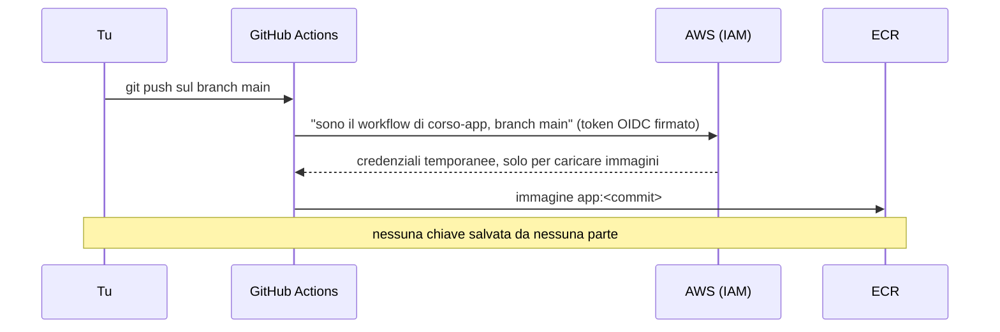
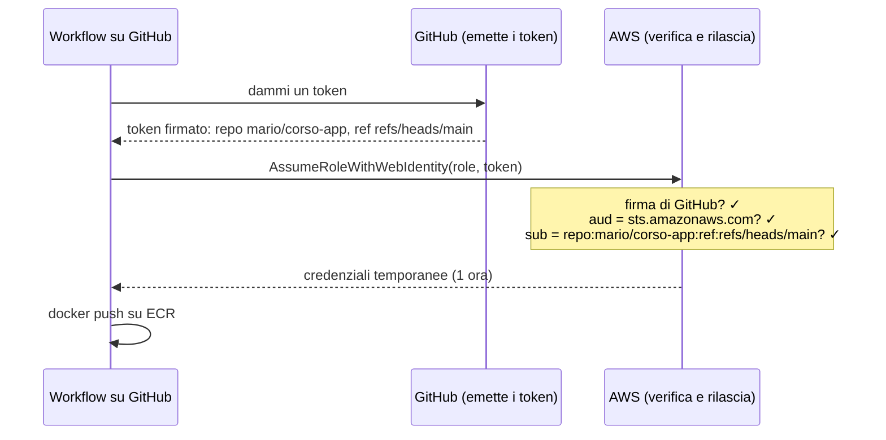

# Dispensa 8 – GitHub costruisce l'immagine, senza chiavi

*Corso: Infrastruttura AWS con Terraform*

## Obiettivo

Nella dispensa 7 abbiamo costruito un'immagine a mano, dal nostro computer, e l'abbiamo caricata in ECR. In questa dispensa lo facciamo fare a **GitHub**, da solo, a ogni modifica del codice: **`git push`** → GitHub costruisce l'immagine → la carica in ECR. Senza nessuna chiave AWS salvata da nessuna parte.

Alla fine di questa dispensa:

- sai cos'è **GitHub Actions** e cosa fa un **workflow**;
- sai far entrare GitHub in AWS **senza chiavi**, con **OIDC**, e perché la **condizione sul `sub`** è la protezione più importante;
- hai un repository `corso-app` con una piccola applicazione, il suo `Dockerfile` e un workflow che, a ogni `git push`, costruisce l'immagine e la carica in ECR con il **codice del commit** come tag.

Nella dispensa 9 metteremo in produzione l'immagine che GitHub costruisce qui.

---

## Prima di iniziare

- Servono le dispense precedenti, in particolare il repository ECR della dispensa 7 (`aws_ecr_repository.app`).
- Serve un **account GitHub**: se hai scelto il "modo 2" della dispensa 5 ce l'hai già, altrimenti crealo su github.com (**Sign up**).
- Serve un **secondo repository**, su GitHub, per il codice dell'applicazione: lo chiamiamo `corso-app`. La cartella `infra/` resta quella di sempre.
- Docker sul tuo computer **non** serve: l'immagine la costruisce GitHub.
- Rinnova il login: `aws sso login --profile corso` ed `export AWS_PROFILE=corso`.
- **Costi:** questa dispensa non crea niente che si paghi a ore. GitHub Actions è gratuito entro i minuti mensili inclusi.

> **Git in cinque comandi.** **Git** è il programma che tiene la storia di un codice; **GitHub** è il sito che conserva i repository Git online. Ti bastano: `git clone <indirizzo>` (copia il repository sul tuo computer), `git add .` (prepara le modifiche), `git commit -m "messaggio"` (le registra, con un codice unico: il *commit*), `git push` (le manda su GitHub), `git switch -c prova` (crea un ramo, *branch*, chiamato `prova`). Se preferisci non usarlo, i file si possono caricare anche dal sito di GitHub: **Add file → Upload files**.

---

## 1. Il percorso



GitHub può **solo caricare** immagini: non può toccare server, database o rete. Decidere **quale** versione va in produzione resta una scelta tua, e lo vediamo nella dispensa 9.

---

## 2. GitHub Actions senza chiavi: OIDC

**GitHub Actions** è il servizio di GitHub che esegue dei comandi (un **workflow**) quando succede qualcosa nel repository, per esempio un `git push`. Il nostro workflow costruisce l'immagine e la carica su ECR. Per caricarla, però, deve **entrare in AWS**.

Il modo sbagliato, e ancora molto diffuso: creare in AWS una chiave d'accesso fissa e salvarla nei "segreti" di GitHub. È una chiave che **non scade**, che vale da qualunque posto, e che chiunque la trovi (in un log, in un fork, in un repository violato) può usare per sempre. È esattamente ciò che il corso evita dalla dispensa 0.

Il modo giusto si chiama **OIDC** (*OpenID Connect*): GitHub e AWS si fidano l'uno dell'altro, e **nessuna chiave viene salvata**.

> **Analogia.** Alla reception di un'azienda non tieni una copia delle chiavi di tutti i fornitori. Il fornitore arriva con un **documento d'identità rilasciato da un ente di cui ti fidi**; la reception controlla il documento e **cosa c'è scritto sopra** ("ditta X, tecnico della manutenzione"), e gli dà un **badge visitatore** che vale un'ora e apre solo la sala macchine. Domani il badge non vale più.

Come funziona:

1. Quando il workflow parte, GitHub gli dà un **token** firmato da GitHub: un documento che dice "sono il workflow del repository `mario/corso-app`, sul branch `main`".
2. Il workflow presenta il token ad AWS e chiede di **assumere un role** (dispensa 1).
3. AWS controlla la **firma** (il token viene davvero da GitHub?) e le **condizioni** scritte nella trust policy del role (è proprio quel repository? quel branch?).
4. Se tutto torna, AWS dà al workflow **credenziali temporanee** (un'ora), con i soli permessi del role: caricare immagini nel nostro repository ECR.



Servono due cose in AWS:

| Cosa | Cos'è |
|---|---|
| **OIDC provider** | dice ad AWS: "i token firmati da GitHub (`token.actions.githubusercontent.com`) sono documenti validi". Uno per account |
| **Role** `github-release` | la **trust policy** accetta solo i token di **quel repository** e di **quel branch**; la **permission policy** permette solo di caricare immagini nel nostro repository ECR |

La parte più importante è la **condizione sul `sub`** (*subject*, "di chi parla il token"): `repo:mario/corso-app:ref:refs/heads/main`. Se fosse più larga, per esempio `repo:mario/*`, **qualunque** repository dell'utente potrebbe caricare immagini in produzione; se mancasse del tutto, **qualunque repository di GitHub al mondo**. È l'errore più grave che si possa fare con OIDC: va sempre ristretta al repository e al branch.

---

## 3. Il workflow: costruire e caricare

Il workflow è un file YAML nel repository dell'applicazione, in `.github/workflows/release.yml`. Fa sei passi:

| Passo | Cosa fa |
|---|---|
| `actions/checkout` | scarica il codice del repository |
| `aws-actions/configure-aws-credentials` | presenta il token OIDC e assume il role (sezione 2) |
| `aws-actions/amazon-ecr-login` | fa il login al registry ECR, con le credenziali appena ottenute |
| `docker/setup-qemu-action` | permette di costruire immagini **ARM** su un computer di GitHub che è **x86** |
| `docker/setup-buildx-action` | prepara lo strumento di costruzione di Docker |
| `docker/build-push-action` | costruisce l'immagine `linux/arm64` e la carica con il tag **uguale al codice del commit** |

Il tag è il **codice del commit** (`github.sha`, per esempio `3f9a2c1…`): ogni versione dell'immagine corrisponde esattamente a un punto della storia del codice. Con i tag immutabili della dispensa 7, "in produzione gira `3f9a2c1`" vuol dire una cosa sola, e si può risalire al codice con `git show 3f9a2c1`.

Due variabili del repository GitHub (non segreti: non c'è niente di segreto) dicono al workflow **quale** role assumere e **dove** caricare: `AWS_RELEASE_ROLE_ARN` e `ECR_REPOSITORY_URL`. Si impostano nelle impostazioni del repository (esercizio, passo 4).

---

## 4. L'applicazione di esempio

Per avere qualcosa da costruire, ci serve un'applicazione. La nostra è piccolissima: una pagina web che, a ogni visita, scrive una riga nel database (dispensa 6) e mostra quante visite ci sono state. Il codice sta nel repository `corso-app`, in tre file:

| File | Cos'è |
|---|---|
| `app.py` | l'applicazione, in Python |
| `Dockerfile` | la ricetta dell'immagine (dispensa 7) |
| `.github/workflows/release.yml` | il workflow della sezione 3 |

L'applicazione legge l'indirizzo e la password del database da **variabili d'ambiente**, cioè valori che le passa chi la avvia: in questa dispensa la costruiamo soltanto; a darle quei valori, sul server, ci pensa la dispensa 9.

---

## 5. Il codice

Questa dispensa tocca due posti: l'infrastruttura (`infra/`) e il repository dell'applicazione (`corso-app/`).

### variables.tf (aggiunta)

```hcl
variable "github_repo" {
  description = "Il repository dell'applicazione, nella forma utente/nome"
  type        = string
}
```

### github-oidc.tf

```hcl
# ---------------------------------------------------------------
# AWS si fida dei token firmati da GitHub Actions
# ---------------------------------------------------------------

resource "aws_iam_openid_connect_provider" "github" {
  url            = "https://token.actions.githubusercontent.com"
  client_id_list = ["sts.amazonaws.com"]
}

# ---------------------------------------------------------------
# Il role che GitHub assume: solo il nostro repository, solo main
# ---------------------------------------------------------------

data "aws_iam_policy_document" "github_trust" {
  statement {
    actions = ["sts:AssumeRoleWithWebIdentity"]

    principals {
      type        = "Federated"
      identifiers = [aws_iam_openid_connect_provider.github.arn]
    }

    condition {
      test     = "StringEquals"
      variable = "token.actions.githubusercontent.com:aud"
      values   = ["sts.amazonaws.com"]
    }

    condition {
      test     = "StringEquals"
      variable = "token.actions.githubusercontent.com:sub"
      values   = ["repo:${var.github_repo}:ref:refs/heads/main"]
    }
  }
}

resource "aws_iam_role" "github_release" {
  name               = "${var.project}-github-release"
  assume_role_policy = data.aws_iam_policy_document.github_trust.json
}

# ---------------------------------------------------------------
# Cosa può fare: caricare immagini nel nostro repository, e basta
# ---------------------------------------------------------------

data "aws_iam_policy_document" "github_push" {
  statement {
    actions   = ["ecr:GetAuthorizationToken"]
    resources = ["*"]
  }

  statement {
    actions = [
      "ecr:BatchCheckLayerAvailability",
      "ecr:InitiateLayerUpload",
      "ecr:UploadLayerPart",
      "ecr:CompleteLayerUpload",
      "ecr:PutImage",
      "ecr:BatchGetImage",
    ]
    resources = [aws_ecr_repository.app.arn]
  }
}

resource "aws_iam_policy" "github_push" {
  name   = "${var.project}-github-push"
  policy = data.aws_iam_policy_document.github_push.json
}

resource "aws_iam_role_policy_attachment" "github_push" {
  role       = aws_iam_role.github_release.name
  policy_arn = aws_iam_policy.github_push.arn
}
```

### outputs.tf (aggiunta)

```hcl
output "github_release_role_arn" {
  value = aws_iam_role.github_release.arn
}
```

### Il repository dell'applicazione: `corso-app`

Tre file. L'applicazione, `app.py`: una pagina che conta le visite nel database.

```python
"""Applicazione del corso: conta le visite in PostgreSQL."""

import http.server
import os

import psycopg

DSN = (
    f"host={os.environ['DB_HOST']} dbname={os.environ['DB_NAME']} "
    f"user={os.environ['DB_USER']} password={os.environ['DB_PASSWORD']} "
    "sslmode=verify-full sslrootcert=/certs/rds-ca.pem connect_timeout=5"
)
VERSION = os.environ.get("APP_VERSION", "sconosciuta")


def migra() -> None:
    """La migrazione: crea la tabella se non c'è."""
    with psycopg.connect(DSN) as conn:
        conn.execute(
            "CREATE TABLE IF NOT EXISTS visite ("
            "id serial PRIMARY KEY, quando timestamptz NOT NULL DEFAULT now())"
        )


class Pagina(http.server.BaseHTTPRequestHandler):
    def do_GET(self) -> None:
        try:
            # una connessione nuova a ogni richiesta: dopo un failover
            # si rilegge il nome dell'endpoint (dispensa 6)
            with psycopg.connect(DSN) as conn:
                conn.execute("INSERT INTO visite DEFAULT VALUES")
                visite = conn.execute("SELECT count(*) FROM visite").fetchone()[0]
            codice, testo = 200, f"<h1>Versione {VERSION}</h1><p>Visite: {visite}</p>"
        except psycopg.Error:
            codice, testo = 503, "<h1>Database non raggiungibile</h1>"
        self.send_response(codice)
        self.send_header("Content-Type", "text/html; charset=utf-8")
        self.end_headers()
        self.wfile.write(testo.encode())


if __name__ == "__main__":
    migra()
    http.server.ThreadingHTTPServer(("", 8080), Pagina).serve_forever()
```

La ricetta, `Dockerfile`:

```dockerfile
FROM public.ecr.aws/docker/library/python:3.13-slim
RUN pip install --no-cache-dir "psycopg[binary]==3.2.*"
WORKDIR /app
COPY app.py .
CMD ["python", "app.py"]
```

Il workflow, `.github/workflows/release.yml`:

```yaml
name: release

on:
  push:
    branches: [main]
  workflow_dispatch: # si può lanciare anche a mano, dalla pagina Actions

permissions:
  id-token: write # serve per ottenere il token OIDC
  contents: read

jobs:
  immagine:
    runs-on: ubuntu-latest
    steps:
      - uses: actions/checkout@v7

      - uses: aws-actions/configure-aws-credentials@v6
        with:
          role-to-assume: ${{ vars.AWS_RELEASE_ROLE_ARN }}
          aws-region: eu-south-1

      - uses: aws-actions/amazon-ecr-login@v2

      - uses: docker/setup-qemu-action@v4

      - uses: docker/setup-buildx-action@v4

      - uses: docker/build-push-action@v7
        with:
          platforms: linux/arm64
          provenance: false
          push: true
          tags: ${{ vars.ECR_REPOSITORY_URL }}:${{ github.sha }}
```

### Cosa fa questo codice, blocco per blocco

**`aws_iam_openid_connect_provider.github`** registra GitHub come "ente che rilascia documenti validi" (sezione 2). `url` è l'indirizzo da cui GitHub pubblica le chiavi con cui firma i token; `client_id_list` è il destinatario che i token devono dichiarare (`aud`, *audience*): `sts.amazonaws.com`, cioè "questo token è per AWS". Ne esiste **uno per account** con quell'indirizzo: se l'account ne ha già uno (creato da un altro progetto), l'`apply` dà errore e bisogna usare quello esistente.

**`data.aws_iam_policy_document.github_trust`** è la trust policy del role (dispensa 1), con tre differenze rispetto a quelle viste finora:

| Parte | Valore | Significato |
|---|---|---|
| `actions` | `sts:AssumeRoleWithWebIdentity` | assumere il role presentando un token esterno, invece di essere un utente o un servizio AWS |
| `principals` | `type = "Federated"`, l'ARN del provider | "chi presenta un token di GitHub" |
| `condition` su `aud` | `sts.amazonaws.com` | il token è stato emesso per AWS |
| `condition` su `sub` | `repo:mario/corso-app:ref:refs/heads/main` | **solo** quel repository, **solo** il branch `main` |

Le due condizioni sono in due blocchi separati: devono essere vere **tutte e due**. `StringEquals` vuol dire "uguale, lettera per lettera", senza asterischi.

**`aws_iam_role.github_release`** e la sua permission policy `github_push`: il login al registry su `*` (come per il server, dispensa 7), e le sei azioni che servono a **caricare** un'immagine (controllare quali pezzi ci sono già, caricare i pezzi nuovi, registrare l'immagine, rileggerla per verifica) solo sul nostro repository. GitHub non può fare nient'altro: né leggere segreti, né toccare server o database, né caricare in altri repository.

**`app.py`** è un piccolo server web scritto con la libreria standard di Python, più **psycopg**, la libreria per parlare con PostgreSQL. `DSN` (*Data Source Name*) è la stringa di connessione, costruita dalle variabili d'ambiente (sul server le scriverà lo script della dispensa 9), con `sslmode=verify-full` e il certificato montato dal compose (dispensa 6). `migra()` è la migrazione: crea la tabella `visite` se non c'è. A ogni richiesta la pagina apre una connessione **nuova**, inserisce una visita e la conta: aprire una connessione nuova ogni volta è lento per un'applicazione vera (che usa un *pool*, dispensa 6), ma qui ha un pregio didattico, perché ogni richiesta rilegge il nome dell'endpoint. Se il database non risponde, la pagina restituisce il codice **503** ("servizio non disponibile") invece di un errore incomprensibile.

**`Dockerfile`**: parte dall'immagine di Python (dalla copia di AWS, come nella dispensa 7), installa psycopg, copia `app.py`, e dice quale comando lanciare all'avvio del container.

**`release.yml`**: `on` dice quando parte il workflow (a ogni push su `main`, oppure a mano). `permissions` dà al workflow il permesso di chiedere il token OIDC (`id-token: write`) e di leggere il codice. Il resto sono i passi della sezione 3. `${{ vars.NOME }}` è una **variabile del repository**, che imposti su GitHub; `${{ github.sha }}` è il codice del commit. Le versioni delle azioni (`@v7`, `@v6`…) cambiano nel tempo: se ce n'è una più recente, si aggiorna il numero. In produzione conviene "inchiodarle" al codice di un commit (`@3d3c42e…`) invece che al numero di versione: un numero si può spostare, un commit no.

---

## 6. Esercizio

Obiettivo: far costruire a GitHub la prima immagine, e verificare che **solo** il branch `main` del tuo repository possa caricare immagini.

### Passi

1. **Il repository dell'applicazione.** Su GitHub crea un repository **privato** `corso-app` (**New repository**). Clonalo sul tuo computer (`git clone …`) e aggiungi i tre file: `app.py`, `Dockerfile`, `.github/workflows/release.yml`. Non fare ancora `git push`: il role su AWS non esiste ancora.
2. **I file dell'infrastruttura.** Nella cartella `infra/` aggiungi `github-oidc.tf` e le aggiunte a `variables.tf` e `outputs.tf`. In `terraform.tfvars`:

   ```hcl
   github_repo = "il-tuo-utente/corso-app"
   ```

3. **`terraform apply`.** Nel `plan`: l'OIDC provider, il role `github-release`, la sua policy e l'attachment. Nient'altro.
4. **Le variabili su GitHub.** Leggi i valori:

   ```bash
   terraform output -raw github_release_role_arn
   terraform output -raw ecr_repository_url
   ```

   Su GitHub, nel repository `corso-app`: **Settings → Secrets and variables → Actions → scheda Variables → New repository variable**. Crea `AWS_RELEASE_ROLE_ARN` e `ECR_REPOSITORY_URL` con quei due valori.
5. **Il primo `git push`.** Fai commit dei tre file e `git push`. Su GitHub, scheda **Actions**: il workflow `release` parte. Aprilo e segui i passi; la costruzione per ARM impiega qualche minuto. (Atteso: tutto verde. In console, **ECR → corso-aws/app**, c'è un'immagine con il tag uguale al codice del commit, che sul tuo computer leggi con `git rev-parse HEAD`. Annotalo: serve nella dispensa 9.)
6. **Chi può caricare immagini.** Crea un branch `prova` (`git switch -c prova`, poi `git push -u origin prova`) e, dalla scheda **Actions → release → Run workflow**, lancia il workflow scegliendo il **branch `prova`**. (Atteso: il passo `configure-aws-credentials` fallisce, *Not authorized to perform sts:AssumeRoleWithWebIdentity*. Il role accetta solo `main`: è la condizione sul `sub`.)
7. **Pulizia.** Se prosegui con la dispensa 9, lascia tutto com'è. Altrimenti `terraform destroy` (come nelle dispense precedenti).

### Domande di verifica

1. Perché con OIDC non serve salvare nessuna chiave su GitHub? Cosa succede se qualcuno copia un token del workflow e lo usa il giorno dopo?
2. Cosa potrebbe succedere se nella trust policy la condizione sul `sub` fosse `repo:il-tuo-utente/*`? E se mancasse?
3. Perché il tag dell'immagine è il codice del commit, e non per esempio `latest`?
4. GitHub può mettere in produzione una nuova versione? Perché lo abbiamo voluto così?

---

## Riepilogo

- **GitHub Actions** esegue un **workflow** a ogni `git push`: il nostro costruisce l'immagine **ARM** e la carica in ECR.
- Con **OIDC** GitHub presenta un token firmato; AWS controlla firma, repository e branch e dà credenziali **temporanee**. Nessuna chiave salvata.
- La **condizione sul `sub`** è la protezione più importante: solo quel repository, solo quel branch.
- Il **tag** dell'immagine è il **codice del commit**: con i tag immutabili, ogni versione ha un nome solo, e si risale al codice.
- GitHub può solo **caricare** immagini: quale versione va in produzione lo decidi tu, nella dispensa 9.
