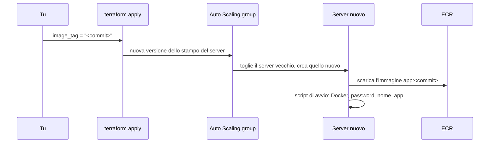
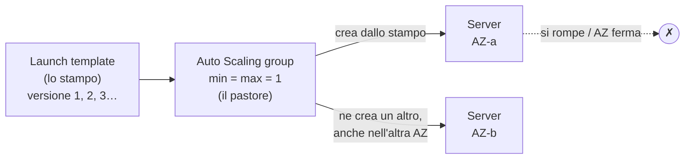
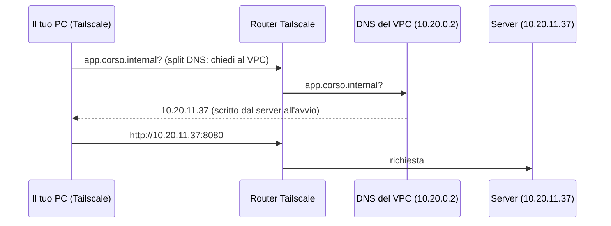
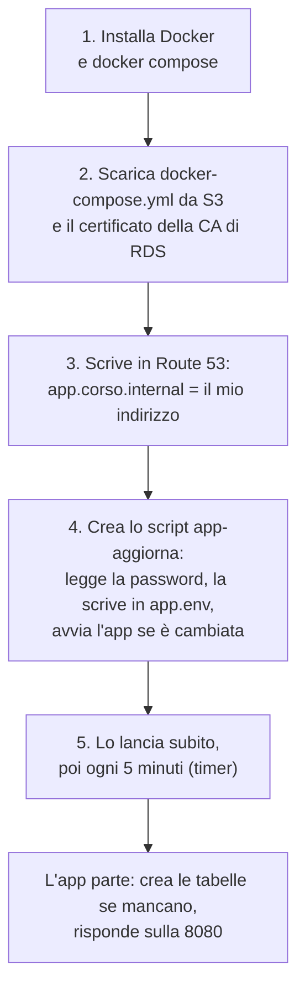
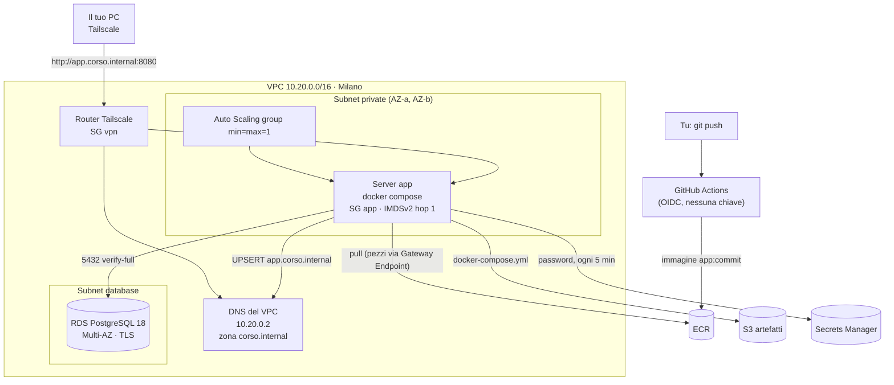

# Dispensa 9 – Il server che si ricrea da solo

*Corso: Infrastruttura AWS con Terraform*

## Obiettivo

Nella dispensa 8 GitHub ha messo in ECR l'immagine della nostra applicazione. Ora la mettiamo **in produzione**, con un server che **non ha niente di insostituibile**: se si rompe, ne nasce un altro identico, da solo. Una nuova versione arriva così: cambi `image_tag` nel tfvars → **`terraform apply`** → il server viene **sostituito** da uno nuovo che parte già con la versione giusta.

Alla fine di questa dispensa:

- sai trasformare il server in **"bestiame"**: un **launch template** e un **Auto Scaling group** che lo ricreano da soli;
- sai dare al server un **nome stabile** (`app.corso.internal`) che resta lo stesso anche quando il server cambia;
- sai scrivere uno **script di avvio** che installa Docker, scarica l'immagine e i file, legge la password e avvia l'applicazione;
- sai gestire la **rotazione della password** senza intervenire a mano;
- sai rilasciare una **nuova versione**, **tornare indietro**, e far sopravvivere i dati a una **ricostruzione** dell'infrastruttura.

---

## Prima di iniziare

- Servono tutte le dispense precedenti: rete, Security Group, role del server, router Tailscale, database, ECR, bucket degli artefatti, e il workflow della dispensa 8 con **almeno un'immagine in ECR** (ti serve il codice del suo commit).
- Si lavora nella cartella `infra/` di sempre.
- Rinnova il login: `aws sso login --profile corso`, `export AWS_PROFILE=corso`, e `export TAILSCALE_API_KEY=…` (dispensa 5).
- **Costi:** gli stessi delle dispense precedenti (server, router, NAT, database); in più la zona DNS privata, che si paga al mese. A fine esercizio si cancella tutto.

---

## 1. Il percorso



Il server nuovo non lo configura nessuno a mano: tutto quello che gli serve è scritto nello **stampo** e nello **script di avvio**, e tutto quello che deve ricordare sta fuori da lui.

---

## 2. Il server diventa "bestiame"

Nella dispensa 4 il server era una risorsa `aws_instance`: uno, con il suo nome, creato a mano da Terraform. Se si rompe, qualcuno se ne deve accorgere e ricrearlo.

> **Analogia.** Nel mondo dei server si dice: **animali domestici** contro **bestiame**. L'animale domestico ha un nome, lo curi quando sta male, se muore è un dramma. Il bestiame è numerato: se un capo si ammala, lo sostituisci con un altro identico. I server moderni sono bestiame: **nessun server è insostituibile**.

Perché un server sia sostituibile, sul server **non deve esserci niente di unico**:

| Cosa | Dove sta | Se il server sparisce |
|---|---|---|
| i dati | **RDS** (dispensa 6) | restano |
| il programma | **ECR** (dispensa 7) | si riscarica |
| i file di deploy | **S3** (dispensa 7) | si riscaricano |
| la password | **Secrets Manager** (dispensa 6) | si rilegge |
| la configurazione del server | lo **script di avvio** (sezione 4), scritto nel codice Terraform | si riesegue |

Due risorse nuove prendono il posto di `aws_instance.app`:

**Il launch template** è lo **stampo** del server: AMI, tipo, Security Group, instance profile, disco, script di avvio. Tutto quello che prima stava dentro `aws_instance`, ma senza creare niente: descrive **come** fare un server. Ogni modifica crea una **nuova versione** dello stampo.

**L'Auto Scaling group** (ASG) è il **pastore**: tiene d'occhio quanti server ci sono e quanti ce ne dovrebbero essere. Con `min_size = max_size = desired_capacity = 1` il suo compito è semplice: **ci deve essere sempre esattamente un server**. Se il server si ferma o sparisce, l'ASG ne crea un altro dallo stampo. E lo può creare in **qualunque subnet privata**: se un'AZ intera si ferma, il nuovo server nasce nell'altra.



Come fa l'ASG a capire che il server "si è rotto"? Con `health_check_type = "EC2"` controlla solo che la macchina sia **accesa**. Se la macchina è accesa ma l'applicazione è bloccata, l'ASG non se ne accorge: per quel caso serve un controllo più fine, che vediamo nella dispensa 10.

---

## 3. Un nome che non cambia: `app.corso.internal`

Ogni server nuovo ha un **indirizzo IP nuovo**. Dalla dispensa 5 ci colleghiamo all'applicazione da casa con l'indirizzo del server, `10.20.10.x`: dopo una sostituzione, quell'indirizzo non vale più. Ci serve un **nome** che segua il server, come l'endpoint del database (dispensa 6).

**Route 53** è il servizio DNS di AWS (DNS: dispensa 2). Una **zona privata** è un elenco di nomi che esiste **solo dentro il nostro VPC**: da internet non si vede. Creiamo la zona `corso.internal` (il suffisso `.internal` è riservato proprio alle reti private) con un solo nome:

```
app.corso.internal  →  l'indirizzo del server di adesso
```

Chi aggiorna il nome? **Il server stesso**, all'avvio: legge il proprio indirizzo e scrive in Route 53 "`app.corso.internal` sono io". Si chiama *UPSERT*: crea il nome se non c'è, lo aggiorna se c'è. Il server ha il permesso di cambiare **solo quel nome** in **solo quella zona**.

Resta un problema: la zona è privata, e il tuo computer a casa non è nel VPC. Come fa a sapere cosa vuol dire `app.corso.internal`? Con lo **split DNS** di Tailscale: diciamo al tailnet "per i nomi che finiscono in `corso.internal`, chiedi al DNS del VPC". Il DNS del VPC sta sempre al secondo indirizzo della rete, `10.20.0.2`. Ma quell'indirizzo sta nella subnet **pubblica**, che il router non annuncia (dispensa 5 annuncia solo le private e le database): per questo il router annuncia in più una rotta per quel **solo indirizzo** (`10.20.0.2/32`), e la policy del tailnet permette a tutti e due i gruppi di interrogarlo sulla porta 53, la porta del DNS.



---

## 4. L'avvio del server: lo script

Ogni server nuovo esegue lo **stesso script di avvio** (`user_data`, dispensa 4), che lo porta da "macchina vuota" ad "applicazione in funzione" senza che nessuno ci metta le mani. Questa volta lo script è lungo, quindi non lo scriviamo dentro il blocco Terraform: sta in un file a parte, `user_data.sh.tpl`, e Terraform lo riempie con i valori giusti (sezione 9).



**docker compose** è lo strumento che avvia uno o più container descritti in un file, `docker-compose.yml`: quale immagine, quali porte, quali variabili, quali file da montare. Il nostro ha un solo container, l'applicazione; un'applicazione vera ne ha spesso di più (l'app, un worker, una cache), e il file resta lo stesso strumento.

Il file `docker-compose.yml` sta nel bucket della dispensa 7, sotto `deploy/`: lo carica **Terraform**, con una risorsa `aws_s3_object`. Se lo modifichi, al prossimo `apply` cambia anche lo stampo del server (sezione 6), e il server viene sostituito.

---

## 5. La password che cambia: il timer `app-aggiorna`

L'applicazione ha bisogno della password del database. Ma il **container non può leggere Secrets Manager** da solo (vedi la sezione 8.1), e la password **cambia ogni 7 giorni** (dispensa 6).

La soluzione è un piccolo script sul server, `app-aggiorna`, che fa da intermediario:

1. legge la password dal segreto, con il role del server;
2. scrive un file `/etc/app/app.env` con l'indirizzo del database, il nome utente e la password (leggibile solo da root);
3. **se il file è cambiato** rispetto a prima, (ri)avvia l'applicazione, che così riparte con la password nuova.

Lo script gira all'avvio e poi **ogni 5 minuti**, grazie a un **timer di systemd** (systemd è il programma che avvia e controlla i servizi su Linux, dispensa 4; un timer è la sua "sveglia" che lancia un servizio a intervalli regolari). Quando RDS cambia la password, entro 5 minuti l'applicazione riparte con quella nuova: qualche secondo di fermo una volta a settimana. Nei minuti tra la rotazione e il controllo, la nostra app, che apre una connessione nuova a ogni richiesta, risponde 503: al massimo 5 minuti. Se non è accettabile, c'è l'alternativa della dispensa 6 (rotazione decisa da te).

---

## 6. Una nuova versione: instance refresh

Come si passa da una versione all'altra? Cambiando la variabile **`image_tag`** nel tfvars e lanciando `terraform apply`.

1. Il tag finisce nello script di avvio, quindi lo **stampo cambia**: Terraform crea una **nuova versione** del launch template.
2. L'ASG ha un blocco **`instance_refresh`**: quando lo stampo cambia, **sostituisce** il server con uno nuovo, fatto dal nuovo stampo.
3. Il server nuovo esegue lo script di avvio, scarica la nuova immagine, scrive il suo indirizzo in Route 53, e parte.

Con le impostazioni `min_healthy_percentage = 0` e `max_healthy_percentage = 100`, l'ASG **prima toglie** il server vecchio e **poi crea** quello nuovo: per qualche minuto l'applicazione non risponde. Per evitarlo bisognerebbe creare prima il nuovo e togliere il vecchio solo quando il nuovo è **davvero pronto**, e per sapere quando è "davvero pronto" serve un controllo dell'applicazione, non solo della macchina: è il tema della dispensa 10.

Lo stesso meccanismo scatta per **qualunque** modifica dello stampo: lo script di avvio, il `docker-compose.yml`, il tipo di server. E anche per una **nuova AMI**: lo stampo legge l'ultima Amazon Linux dal parametro di AWS (dispensa 4), quindi un `apply` fatto dopo un aggiornamento di Amazon Linux sostituisce il server con uno aggiornato. Qui, a differenza della dispensa 4, non usiamo `ignore_changes`: con un server sostituibile, un aggiornamento di sicurezza non è più un rischio, è un vantaggio.

**Tornare indietro** (*rollback*) è la stessa operazione al contrario: rimetti in `image_tag` il commit precedente, `terraform apply`. Grazie ai tag immutabili, l'immagine di allora è ancora lì, identica.

---

## 7. Il quadro completo



---

## 8. Per saperne di più

### 8.1 IMDS con hop limit 1: i container restano fuori

Il server legge le credenziali del suo role dal **servizio dei metadati**, IMDS (dispensa 4). Ma su quel server ora girano dei **container**: se un'applicazione avesse una falla che le fa fare richieste a indirizzi scelti da un attaccante (un attacco molto comune, si chiama *SSRF*), l'attaccante potrebbe chiederle di leggere le credenziali del server da IMDS.

L'**hop limit** (limite di salti) è il numero di passaggi di rete che una risposta di IMDS può fare. Il server stesso è a 1 salto; un container è a **2 salti**, perché tra lui e la scheda di rete c'è la rete interna di Docker. Con `http_put_response_hop_limit = 1`:

- lo **script di avvio** e `app-aggiorna`, che girano sul server, leggono le credenziali normalmente;
- l'**applicazione nel container** non le raggiunge: la risposta muore dopo un salto.

L'immagine Amazon Linux 2023 parte con il limite a 2, proprio per permettere ai container di usare il role del server. Noi lo riportiamo a 1: la nostra applicazione non ha bisogno di credenziali AWS (la password gliela passa `app-aggiorna`), quindi chiudiamo la porta.


### 8.2 Le migrazioni del database

Una nuova versione dell'applicazione spesso ha bisogno di una **modifica al database**: una tabella nuova, una colonna in più. Queste modifiche si chiamano **migrazioni**. Nel nostro esempio è la cosa più semplice possibile: all'avvio l'applicazione esegue `CREATE TABLE IF NOT EXISTS`, "crea la tabella se non c'è". Le applicazioni vere usano strumenti dedicati (per esempio Alembic per Python, Flyway per Java) che tengono il conto di quali migrazioni sono già state fatte; il principio è lo stesso: **le migrazioni partono all'avvio, prima che l'applicazione inizi a rispondere**.

Una regola da non dimenticare, per via del rollback: **una migrazione deve funzionare anche con la versione precedente dell'applicazione**. Se la versione 2 cancella una colonna che la versione 1 usa, tornare alla versione 1 è impossibile: il codice vecchio cerca una colonna che non c'è più. Il modo sicuro si fa in due rilasci: prima si **aggiunge** il nuovo (la versione 2 usa la colonna nuova, ma la vecchia c'è ancora); solo quando non si torna più indietro, si **toglie** il vecchio (versione 3). In inglese si chiama *expand and contract*.

---

---

## 9. Il codice Terraform

### ec2.tf: cosa togliere

Il server non è più una `aws_instance`: in `ec2.tf` **cancella** il blocco `resource "aws_instance" "app"` e, in `outputs.tf`, gli output `app_instance_id` e `app_private_ip`. Tutto il resto di `ec2.tf` **resta**: il parametro dell'AMI, la trust policy `ec2_trust`, il role `app` con le sue policy e l'instance profile, che ora usa lo stampo.

Al prossimo `apply` Terraform cancellerà il vecchio server; l'ASG ne creerà uno nuovo.

### variables.tf (aggiunta)

```hcl
variable "image_tag" {
  description = "La versione dell'applicazione da mettere in produzione (il commit)"
  type        = string
}
```

`image_tag` **non ha un default**, di proposito: la versione in produzione deve essere sempre una scelta scritta, mai un valore implicito.

### deploy/docker-compose.yml

Un file nuovo, nella cartella `infra/deploy/`:

```yaml
services:
  app:
    image: ${IMAGE}
    restart: always
    ports:
      - "8080:8080"
    env_file: /etc/app/app.env
    environment:
      APP_VERSION: ${IMAGE}
    volumes:
      - /etc/app/rds-ca.pem:/certs/rds-ca.pem:ro
```

### user_data.sh.tpl

Un file nuovo, nella cartella `infra/`. Le parti `${…}` le riempie Terraform (sezione "Cosa fa questo codice"); le variabili scritte `$NOME`, senza graffe, sono dello script e prendono valore sul server.

```bash
#!/bin/bash
# Avvio del server dell'applicazione.
# Versione del docker-compose: ${compose_etag}
set -euo pipefail
export AWS_DEFAULT_REGION=${region}

# 1. Docker e docker compose
dnf install -y docker
systemctl enable --now docker
mkdir -p /usr/local/lib/docker/cli-plugins
curl -fsSLo /usr/local/lib/docker/cli-plugins/docker-compose \
  https://github.com/docker/compose/releases/latest/download/docker-compose-linux-aarch64
chmod +x /usr/local/lib/docker/cli-plugins/docker-compose

# 2. I file: docker-compose dal bucket, certificato della CA di RDS, immagine da usare
mkdir -p /etc/app
aws s3 cp s3://${bucket}/deploy/docker-compose.yml /etc/app/docker-compose.yml
curl -fsSo /etc/app/rds-ca.pem https://truststore.pki.rds.amazonaws.com/global/global-bundle.pem
echo "IMAGE=${image}" > /etc/app/.env

# 3. Il nome stabile: app.corso.internal punta a questo server
TOKEN=$(curl -fsX PUT http://169.254.169.254/latest/api/token \
  -H "X-aws-ec2-metadata-token-ttl-seconds: 60")
MY_IP=$(curl -fs -H "X-aws-ec2-metadata-token: $TOKEN" \
  http://169.254.169.254/latest/meta-data/local-ipv4)
cat > /tmp/dns.json <<DNS
{"Changes": [{"Action": "UPSERT", "ResourceRecordSet": {
  "Name": "${app_name}", "Type": "A", "TTL": 30,
  "ResourceRecords": [{"Value": "$MY_IP"}]}}]}
DNS
aws route53 change-resource-record-sets --hosted-zone-id ${zone_id} \
  --change-batch file:///tmp/dns.json

# 4. app-aggiorna: legge la password e (ri)avvia l'app se qualcosa è cambiato
cat > /usr/local/bin/app-aggiorna <<'SCRIPT'
#!/bin/bash
set -euo pipefail
export AWS_DEFAULT_REGION=${region}
PASSWORD=$(aws secretsmanager get-secret-value --secret-id ${secret_arn} \
  --query SecretString --output text \
  | python3 -c 'import json,sys; print(json.load(sys.stdin)["password"])')
NUOVO=$(mktemp)
trap 'rm -f "$NUOVO"' EXIT
cat > "$NUOVO" <<ENV
DB_HOST=${db_host}
DB_NAME=app
DB_USER=dbadmin
DB_PASSWORD='$PASSWORD'
ENV
if ! cmp -s "$NUOVO" /etc/app/app.env; then
  install -m 600 "$NUOVO" /etc/app/app.env
  if ! { aws ecr get-login-password | docker login --username AWS --password-stdin ${registry} \
         && docker compose --project-directory /etc/app up -d --force-recreate; }; then
    rm -f /etc/app/app.env # non è partita: al prossimo giro riprova
    exit 1
  fi
fi
SCRIPT
chmod 700 /usr/local/bin/app-aggiorna

# 5. Lo lancia adesso, e poi ogni 5 minuti
cat > /etc/systemd/system/app-aggiorna.service <<'UNIT'
[Unit]
Description=Legge la password del database e aggiorna l'applicazione
After=docker.service

[Service]
Type=oneshot
ExecStart=/usr/local/bin/app-aggiorna
UNIT

cat > /etc/systemd/system/app-aggiorna.timer <<'UNIT'
[Unit]
Description=Ogni 5 minuti: app-aggiorna

[Timer]
OnBootSec=5min
OnUnitActiveSec=5min

[Install]
WantedBy=timers.target
UNIT

systemctl daemon-reload
systemctl enable --now app-aggiorna.timer
systemctl start app-aggiorna.service || true # se fallisce, riprova il timer
```

### deploy.tf

```hcl
# ---------------------------------------------------------------
# Il nome stabile: la zona DNS privata corso.internal
# ---------------------------------------------------------------

resource "aws_route53_zone" "internal" {
  name          = "corso.internal"
  force_destroy = true # il nome app.* lo scrive il server, non Terraform

  vpc {
    vpc_id = aws_vpc.main.id
  }
}

# ---------------------------------------------------------------
# Il docker-compose.yml, caricato nel bucket degli artefatti
# ---------------------------------------------------------------

resource "aws_s3_object" "compose" {
  bucket = aws_s3_bucket.artifacts.id
  key    = "deploy/docker-compose.yml"
  source = "${path.module}/deploy/docker-compose.yml"
  etag   = filemd5("${path.module}/deploy/docker-compose.yml")
}

# ---------------------------------------------------------------
# Il server può aggiornare SOLO il suo nome, in SOLO questa zona
# ---------------------------------------------------------------

data "aws_iam_policy_document" "app_dns" {
  statement {
    actions   = ["route53:ChangeResourceRecordSets"]
    resources = [aws_route53_zone.internal.arn]

    condition {
      test     = "ForAllValues:StringEquals"
      variable = "route53:ChangeResourceRecordSetsNormalizedRecordNames"
      values   = ["app.corso.internal"]
    }
  }
}

resource "aws_iam_policy" "app_dns" {
  name   = "${var.project}-app-dns"
  policy = data.aws_iam_policy_document.app_dns.json
}

resource "aws_iam_role_policy_attachment" "app_dns" {
  role       = aws_iam_role.app.name
  policy_arn = aws_iam_policy.app_dns.arn
}

# ---------------------------------------------------------------
# Lo stampo del server
# ---------------------------------------------------------------

resource "aws_launch_template" "app" {
  name_prefix            = "${var.project}-app-"
  image_id               = data.aws_ssm_parameter.al2023.insecure_value
  instance_type          = var.instance_type
  vpc_security_group_ids = [aws_security_group.app.id]
  update_default_version = true

  iam_instance_profile {
    name = aws_iam_instance_profile.app.name
  }

  metadata_options {
    http_tokens                 = "required" # IMDSv2
    http_put_response_hop_limit = 1          # i container non arrivano a IMDS
  }

  block_device_mappings {
    device_name = "/dev/xvda"
    ebs {
      volume_type = "gp3"
      volume_size = 20 # spazio per le immagini Docker
      encrypted   = true
    }
  }

  user_data = base64encode(templatefile("${path.module}/user_data.sh.tpl", {
    region       = var.region
    bucket       = aws_s3_bucket.artifacts.id
    compose_etag = aws_s3_object.compose.etag
    image        = "${aws_ecr_repository.app.repository_url}:${var.image_tag}"
    registry     = split("/", aws_ecr_repository.app.repository_url)[0]
    zone_id      = aws_route53_zone.internal.zone_id
    app_name     = "app.${aws_route53_zone.internal.name}"
    db_host      = aws_db_instance.main.address
    secret_arn   = aws_db_instance.main.master_user_secret[0].secret_arn
  }))

  tag_specifications {
    resource_type = "instance"
    tags          = { Name = "${var.project}-app" }
  }
}

# ---------------------------------------------------------------
# Il pastore: sempre esattamente un server, in una delle subnet private
# ---------------------------------------------------------------

resource "aws_autoscaling_group" "app" {
  name                      = "${var.project}-app"
  min_size                  = 1
  max_size                  = 1
  desired_capacity          = 1
  vpc_zone_identifier       = [for s in aws_subnet.private : s.id]
  health_check_type         = "EC2"
  health_check_grace_period = 300

  launch_template {
    id      = aws_launch_template.app.id
    version = aws_launch_template.app.latest_version
  }

  instance_refresh {
    strategy = "Rolling"
    preferences {
      min_healthy_percentage = 0   # prima toglie il vecchio…
      max_healthy_percentage = 100 # …poi crea il nuovo
    }
  }
}
```

### tailscale.tf (modifiche)

Tre modifiche al file della dispensa 5, per lo split DNS (sezione 5). In cima al file, un nuovo `locals`:

```hcl
locals {
  vpc_dns = cidrhost(var.vpc_cidr, 2) # il DNS del VPC: 10.20.0.2
}
```

Nella policy `tailscale_acl.main`, una regola in più in `acls` e la rotta in più in `autoApprovers`:

```hcl
      {
        action = "accept"
        src    = ["group:admin", "group:dev"]
        dst    = ["${local.vpc_dns}:53"]
      }
```

```hcl
    autoApprovers = {
      routes = { for cidr in concat(local.private_cidrs, local.db_cidrs, ["${local.vpc_dns}/32"]) : cidr => ["tag:router-aws"] }
    }
```

Nel `user_data` del router, la rotta in più tra quelle annunciate:

```hcl
      --advertise-routes=${join(",", concat(local.private_cidrs, local.db_cidrs, ["${local.vpc_dns}/32"]))}
```

E in fondo al file, una risorsa nuova:

```hcl
# Per i nomi *.corso.internal, chiedi al DNS del VPC
resource "tailscale_dns_split_nameservers" "internal" {
  domain      = "corso.internal"
  nameservers = [local.vpc_dns]
}
```

### outputs.tf (aggiunte)

```hcl
output "app_asg_name" {
  value = aws_autoscaling_group.app.name
}

output "app_url" {
  value = "http://app.${aws_route53_zone.internal.name}:8080"
}
```

### Cosa fa questo codice, blocco per blocco

**`deploy/docker-compose.yml`** descrive l'unico container. `image: ${IMAGE}` prende l'immagine dal file `/etc/app/.env`, che docker compose legge da solo (lo scrive lo script, passo 2). `restart: always` riavvia il container se si ferma, e anche dopo un riavvio del server. `ports` pubblica la porta 8080 del container sulla 8080 del server, quella che il SG `app` apre al router (dispensa 3). `env_file` passa al container le variabili del file scritto da `app-aggiorna`. `volumes` rende visibile dentro il container, in sola lettura (`ro`), il certificato della CA di RDS scaricato dallo script: serve per `verify-full` (dispensa 6). Attenzione: questo file **non** passa da `templatefile`, quindi `${IMAGE}` arriva così com'è sul server, ed è docker compose a sostituirlo.

**`user_data.sh.tpl`** è lo script della sezione 4. Lo leggiamo un passo alla volta.

*In cima.* `set -euo pipefail`: se un comando fallisce, lo script si ferma subito invece di andare avanti a metà (il suo racconto si legge sul server in `/var/log/cloud-init-output.log`). `export AWS_DEFAULT_REGION=${region}`: la regione per i comandi `aws`.

*Passo 1, Docker.* Docker arriva dai pacchetti di Amazon Linux. **docker compose** invece non c'è, quindi si scarica dalla pagina dei rilasci del progetto (`latest` = l'ultima versione; in produzione si scrive una versione precisa).

*Passo 2, i file.* Il `docker-compose.yml` dal bucket, il certificato della CA di RDS (dispensa 6), e il file `.env` con l'immagine da usare.

*Passo 3, il nome.* Il server legge da IMDS (dispensa 4) il token e il proprio indirizzo, scrive un piccolo file JSON con l'UPSERT e lo manda a Route 53. `TTL 30`: chi legge il nome lo ricorda al massimo 30 secondi, così dopo una sostituzione il nome nuovo si vede subito.

*Passo 4, `app-aggiorna`.* Lo script viene **scritto** su disco con un heredoc (dispensa 4). Tre cose da notare:

- il delimitatore `'SCRIPT'` tra apici dice a bash di non toccare niente mentre lo scrive: `$PASSWORD` e `$NUOVO` prendono valore solo quando lo script gira. Le parti `${…}` invece le ha già riempite Terraform;
- `DB_PASSWORD='$PASSWORD'` è tra apici singoli perché docker compose prenda la password lettera per lettera, anche se contiene simboli;
- `cmp -s` confronta il file nuovo con quello vecchio. Se sono uguali, non fa niente. Se sono diversi (primo avvio, o password cambiata), installa il file con permessi `600` (leggibile solo da root), fa il login a ECR e (ri)crea il container. Se qualcosa fallisce, cancella il file, così al giro dopo lo vede "cambiato" e riprova. `trap … EXIT` cancella il file temporaneo comunque vada.

*Passo 5, il timer.* Un servizio systemd che esegue `app-aggiorna` una volta (`Type=oneshot`), e un **timer** che lo rilancia 5 minuti dopo l'avvio e poi ogni 5 minuti. Prima si attiva il timer, poi `systemctl start` lo esegue subito; `|| true` vuol dire "anche se fallisce, lo script di avvio va avanti": ci riproverà il timer.

**`aws_route53_zone.internal`** crea la zona `corso.internal`. Il blocco `vpc` la rende **privata** e la collega al nostro VPC: solo lì dentro esiste. `force_destroy = true` serve al `destroy`: una zona che contiene nomi non si può cancellare, e il nome `app.corso.internal` non lo conosce Terraform (lo scrive il server), quindi Terraform non saprebbe toglierlo da solo.

**`aws_s3_object.compose`** carica il file `deploy/docker-compose.yml` nel bucket, sotto `deploy/`, dove il server ha il permesso di leggere (dispensa 7). `path.module` è la cartella del progetto. `etag = filemd5(…)` è l'**impronta** del file (`filemd5` calcola un codice che cambia se cambia anche un solo carattere): se modifichi il file, l'impronta cambia, e Terraform sa che va ricaricato.

**`data.aws_iam_policy_document.app_dns`**: il server può fare `ChangeResourceRecordSets` (cambiare i nomi) **solo** sulla nostra zona, e la condizione `route53:ChangeResourceRecordSetsNormalizedRecordNames` restringe ulteriormente a **un solo nome**, `app.corso.internal`. `ForAllValues:StringEquals` vuol dire "**tutti** i nomi della modifica devono essere in questo elenco". Così anche un server compromesso non potrebbe dirottare altri nomi. Il role del server ora ha quattro policy: SSM, password del database, artefatti e DNS.

**`aws_launch_template.app`** è lo stampo (sezione 2):

| Argomento | Significato |
|---|---|
| `name_prefix` | il nome inizia così, AWS aggiunge un suffisso unico |
| `image_id`, `instance_type`, `vpc_security_group_ids`, `iam_instance_profile` | gli stessi valori del server della dispensa 4 |
| `update_default_version = true` | ogni modifica crea una versione nuova e la rende quella "di default" |
| `metadata_options` | IMDSv2 obbligatorio, e **hop limit 1** (sezione 8.1) |
| `block_device_mappings` | il disco: `/dev/xvda` è il nome del disco principale in Amazon Linux; 20 GB, perché le immagini Docker occupano spazio |
| `user_data` | lo script, riempito da `templatefile` e codificato con `base64encode` |
| `tag_specifications` | le etichette da mettere sui server creati dallo stampo |

La funzione **`templatefile(file, valori)`** legge un file e ci sostituisce le parti `${…}` con i valori della mappa: `${region}` diventa `eu-south-1`, `${image}` diventa l'indirizzo completo dell'immagine, e così via. È lo stesso meccanismo dell'interpolazione (dispensa 0), ma su un file intero. **`base64encode`** trasforma il testo in un formato che il launch template pretende (a differenza di `aws_instance`, che lo fa da solo). `split("/", url)[0]` divide l'indirizzo del repository alle barre e prende il primo pezzo: il registry (dispensa 7). `compose_etag` serve solo come commento nello script: quando il `docker-compose.yml` cambia, cambia lo script, quindi lo stampo, quindi il server viene sostituito e scarica il file nuovo.

**`aws_autoscaling_group.app`** è il pastore:

| Argomento | Significato |
|---|---|
| `min_size`, `max_size`, `desired_capacity` | tutti a 1: sempre esattamente un server |
| `vpc_zone_identifier` | le subnet in cui può crearlo: tutte le private, una per AZ (espressione `for`, dispensa 2) |
| `health_check_type = "EC2"` | controlla che la macchina sia accesa (sezione 2) |
| `health_check_grace_period = 300` | per i primi 5 minuti dopo la creazione non giudica il server: gli lascia il tempo di avviarsi |
| `launch_template` | lo stampo, nella sua **ultima versione** (`latest_version`) |
| `instance_refresh` | quando lo stampo cambia, sostituisci il server (sezione 6). `Rolling` è la strategia standard; le due percentuali dicono "prima togli, poi crea" |

**Le modifiche a `tailscale.tf`.** La funzione **`cidrhost(rete, n)`** dà l'**n-esimo indirizzo** di una rete (la sorella di `cidrsubnet`, dispensa 2): `cidrhost("10.20.0.0/16", 2)` è `10.20.0.2`, il DNS del VPC. La regola in più nella policy permette a tutti e due i gruppi di interrogarlo sulla porta 53. La rotta `10.20.0.2/32` (un indirizzo solo) va annunciata dal router e approvata in `autoApprovers`. **`tailscale_dns_split_nameservers`** è lo split DNS: per il dominio `corso.internal`, il tailnet manda le domande a `10.20.0.2`. Perché funzioni, nella console di Tailscale deve essere attivo **MagicDNS** (sezione DNS; sui tailnet nuovi è attivo di default).

---

## 10. Esercizio

Obiettivo: mettere in produzione l'immagine della dispensa 8, rilasciare una nuova versione e tornare indietro, e vedere il server ricrearsi da solo. I passi 7-9 sono **facoltativi**.

### Passi

1. **I file.** Nella cartella `infra/`: togli `aws_instance.app` da `ec2.tf` e i suoi due output; aggiungi `deploy.tf`, `user_data.sh.tpl`, `deploy/docker-compose.yml`; applica le modifiche a `tailscale.tf`, `variables.tf` e `outputs.tf`. In `terraform.tfvars`, il codice del commit dell'immagine costruita nella dispensa 8:

   ```hcl
   image_tag = "il-codice-del-commit"
   ```

2. **`terraform apply -replace=tailscale_tailnet_key.router`.** Il `-replace` serve perché il router va ricreato (annuncia una rotta nuova) e gli serve una chiave nuova (dispensa 5). Nel `plan` controlla: il vecchio `aws_instance.app` viene **cancellato**; nascono lo stampo, l'ASG e la zona DNS; il router viene ricreato.
3. **Il server nasce.** In console: **EC2 → Auto Scaling groups → corso-aws-app**: c'è un server. Dopo qualche minuto entra con SSM (**EC2 → Instances**, quello chiamato `corso-aws-app`) e guarda come è andato lo script: `sudo tail -20 /var/log/cloud-init-output.log`, poi `sudo journalctl -u app-aggiorna -n 20`. (Atteso: Docker installato, nome scritto in Route 53, container avviato.)
4. **Da casa.** Con Tailscale acceso:

   ```bash
   curl "$(terraform output -raw app_url)"
   ```

   (Atteso: `Versione …:<commit>` e `Visite: 1`; riprova, le visite salgono.) Apri lo stesso indirizzo nel browser. Stai raggiungendo per nome un server privato, scelto da un Auto Scaling group, che legge un database Multi-AZ in TLS verificato.
5. **Il nome segue il server.** Leggi l'indirizzo a cui punta il nome: `dig +short @10.20.0.2 app.corso.internal` (su Mac `dig` senza `@` può ignorare lo split DNS; in alternativa guarda il browser). Ora **termina il server** a mano: in console, **Instances** → il server `corso-aws-app` → **Instance state → Terminate**. Entro qualche minuto l'ASG ne crea un altro, forse nell'altra AZ. Ripeti `dig` e `curl`. (Atteso: indirizzo diverso, stessa pagina, e le **visite non sono ripartite da zero**: i dati sono nel database, non sul server.)
6. **Una nuova versione, e ritorno.** Nel repository `corso-app` cambia il titolo in `app.py`, per esempio `Versione {VERSION} – nuova!`. Commit e push: GitHub costruisce un'immagine con un nuovo tag (dispensa 8). Scrivilo in `image_tag` e lancia `terraform apply`. Nel `plan` cambia lo stampo; segui la sostituzione:

   ```bash
   aws autoscaling describe-instance-refreshes --auto-scaling-group-name "$(terraform output -raw app_asg_name)" \
     --query 'InstanceRefreshes[0].{stato:Status,percentuale:PercentageComplete}'
   ```

   Controlla con `curl`. Poi **torna indietro**: rimetti in `image_tag` il commit di prima e `terraform apply`. (Atteso: torna la pagina di prima. L'immagine vecchia era ancora in ECR, identica: tag immutabili.)
7. **La password cambia** (facoltativo). Dal tuo computer forza una rotazione:

   ```bash
   aws secretsmanager rotate-secret --secret-id "$(terraform output -raw db_secret_arn)"
   ```

   Entro 5 minuti, sul server: `sudo journalctl -u app-aggiorna -n 20`. (Atteso: in una delle esecuzioni il file è cambiato e il container è stato ricreato.) Da casa, `curl` funziona di nuovo, con le visite al loro posto.
8. **Il container e IMDS** (facoltativo). Entra nel server con SSM e prova a raggiungere IMDS dal server e dal container:

   ```bash
   curl -s -m 3 -X PUT http://169.254.169.254/latest/api/token \
     -H "X-aws-ec2-metadata-token-ttl-seconds: 60" > /dev/null && echo "server: ok"
   sudo docker compose --project-directory /etc/app exec app python -c \
     "import urllib.request as u; u.urlopen(u.Request('http://169.254.169.254/latest/api/token', method='PUT', headers={'X-aws-ec2-metadata-token-ttl-seconds': '60'}), timeout=3)"
   ```

   (Atteso: il server ottiene il token; dal container la richiesta **scade**: è l'hop limit 1.)
9. **Ricostruire tutto, tranne i dati** (facoltativo, lungo). **Attenzione, prima di cominciare:** il `destroy` di questo passo si fermerà con un **errore rosso, ed è voluto**. Lancia `terraform destroy`. (Atteso: Terraform cancella quasi tutto, ma si ferma sul database: `deletion_protection`, dispensa 6. Restano il database e ciò da cui dipende: VPC, subnet, Security Group.) Ora lancia `terraform apply -replace=tailscale_tailnet_key.router`: tutto il resto rinasce intorno al database. Il repository ECR però è nuovo e vuoto: su GitHub, **Actions → release → Run workflow** dal branch `main`, per ricostruire l'immagine con lo stesso tag (entro 5 minuti `app-aggiorna` la trova da solo). Da casa, `curl`: le visite sono ancora lì.
10. **Pulizia.** In `terraform.tfvars` scrivi `db_deletion_protection = false`, `terraform apply`, poi `terraform destroy`. Cancella lo snapshot finale del database (dispensa 6). Su GitHub puoi cancellare le due variabili o l'intero repository `corso-app`.

### Domande di verifica

1. Cosa vuol dire che il server è "bestiame"? Quali cose, sul server, renderebbero impossibile sostituirlo senza perdere niente?
2. Nel passo 5 il server cambia indirizzo: chi aggiorna `app.corso.internal`, e con quale permesso? Cosa gli impedisce di cambiare altri nomi?
3. Perché il container non può leggere la password da Secrets Manager da solo? Chi lo fa al suo posto, e quando?
4. Cosa succede, passo per passo, quando cambi `image_tag` e lanci `terraform apply`? Perché per qualche minuto l'applicazione non risponde?
5. La versione 2 cancella una colonna della tabella. Perché il rollback alla versione 1 sarebbe un problema, e come si fa la stessa modifica in modo sicuro?
6. Nel passo 9, perché il `destroy` si ferma? Cosa sopravvive, e perché basta un `apply` per tornare a funzionare?

---

## Riepilogo

- Il server è **bestiame**: un **launch template** (lo stampo) e un **Auto Scaling group** con min = max = 1 (il pastore) che lo ricrea da solo, anche in un'altra AZ. Sul server non c'è niente di unico: dati in RDS, programma in ECR, file in S3, password in Secrets Manager.
- Il **nome stabile** `app.corso.internal`, in una zona **Route 53 privata**, lo aggiorna il server all'avvio; da casa lo risolve lo **split DNS** di Tailscale.
- Lo **script di avvio** installa Docker, scarica il compose e il certificato, scrive il nome, e crea **`app-aggiorna`**, che ogni 5 minuti rilegge la password e riavvia l'app se è cambiata.
- Nuova versione = nuovo `image_tag` + `apply` → **instance refresh**. **Rollback** = il tag di prima.
- Per saperne di più: **IMDS con hop limit 1** tiene i container lontani dalle credenziali del server; le **migrazioni** devono restare compatibili con la versione precedente (*expand and contract*).
- Con il database protetto, l'infrastruttura si può **distruggere e ricostruire**: i dati sopravvivono.
